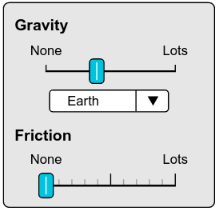
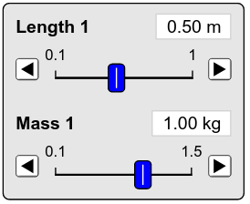

# Absent Assignment Lab 1

# Document Purpose
This is an assignment provided to students who had an excused abscence for Lab 1. This document will guide you through some of the activities done in section.

If you have any questions while doing this assignment you should reach out to your TA and schedule a time to meet with them on Zoom, preferably during their office hours. If you can't make your TA's office hours, you can try to reach out to another Physics 3L TA whose office hours you can make.

## PhET
In class your TA would have been demonstarting the pendulum apparatus to the class for Activities 1 & 2. For Activity 3 you would have use the pendulum apparatus yourself to make some measurements. 

Since you won't have access to a pendulum apparatus at home, you will instead be using a pendulum apparatus simulation by the PhET group at the University of Colorado. Below is a link to the Pendulum PhET.

:::Card (|Simulation||bg-UCSB-clay text-white)
[Pendulum Apparatus Simulation](https://phet.colorado.edu/sims/html/pendulum-lab/latest/pendulum-lab_en.html?screens=1)
:::

:::Intro (Objective)
The objective of this lab is to gain an understanding of what uncertainty is and how it can influence the choices we make in our experiments. Additionally we will want to qualitatively determine what parameters affect the period of the pendulum.
:::

The objective of this lab is to determine which physical quantities influence the period of a pendulum. The relevant features are the mass of the bob, the length of the pendulum, and the initial angular displacement. By making many measurements of each feature while keeping the other two constant you will construct an argument as to which feature or features influence the period.

# Introduction

## Simple Pendulum Basics
:::Figure (pendulumDiagram|l)
")
:::

The simple pendulum is called such because the most simplified model of pendulum that we have. It assumes that we are using a point mass, $m$, at the end of a string of length, $L$, that has negligible mass itself. Notice the simple pendulum does not attempt to exactly replicate what is happening in the real world. Instead it makes some assumptions and ignores some real life features.

This is a typical thing in physics. Often times the real world gets extremely complicated and it becomes easier to make assumptions and ignore things. However, we must be thoughtful about what we choose to assume and ignore. We want to choose things that will have little affect what we are trying to measure. Sometimes we do this well, and sometimes we are too loose with our assumptions. In the latter case we must then reevaluate our simplified model and add back things we may have thought we could ignore, or relax some of our assumptions.

The thing that we will be focusing on is the period, $T$. For the simple pendulum we have three parameters available to us. The mass of the bob, $m$, the length of the pendulum, $L$, and the initial angle, $\theta_0$. Each of these is depicted in  We will be adjusting these three parameters to see what affects they have on the period.  

## Pre-Lab

Include the following two exercises in your report even though you  have already done them in your pre-lab. Feel free to make changes to your procedure or your responses to the exercises for your report.

:::Exercise (logistics)
Answer the following:
1. Which color group is your section?
2. Which classroom number is your group meeting in during the second **full week** of the quarter?
3.  Which classroom number is your group meeting in during the third **full week** of the quarter?
4.  Which classroom number is your group meeting in during the fourth **full week** of the quarter?
5. What is your TA's name?
:::

:::Exercise (alignment)
1. When reading the initial angle using the protractor, you must look straight on or you might have an error from parallax. Briefly explain what parallax is.
2. How will this effect your measurement of the initial angle? 
:::

:::Exercise (procedure)
Write a step by step procedure outlining how you will collect data that will determine which of the three parameters, mass, length, and initial angle, affect the period of the pendulum.

You will not be graded on whether you have "the right" procedure. We are simply looking for effort that you have thought about this and that you will be ready to start taking measurements when you get to class.
:::

## Using the PhET
For the activities you will want to have the PhET set in a particular way and use some specfifc tools. This section will show you how to set up the simulation. 

1. Start by selecting the stopwatch checkbox in the lower left corner of the screen. You will be using the stopwatch to make measurements of the period. You can see the selector and the stopwatch in  below.

:::::::::Figure (stopwatch|s|Row)
::::::row
::: col
 Stopwatch Selection Menu")
:::

::: col
 Stopwatch")
 
:::
::::::
:::::::::

:::Figure (settings|s|R)

:::

2. Ensure that gravity and friction are set to Earth and None respectively. This is the default setting and you shouldn't need to switch it for the lab. See the proper settings in 

# Activity 1

In Acitivity one you will be performing an experiment where you measure the period of the pendulum using two different techniques. 

:::Card (|Techniques||bg-UCSB-navy text-white)
1. Measure the time it takes for 1 period directly.
2. Measure the time it takes for 10 periods and then divide that value by ten to get the time of one period.
:::

::::::Activity manyPeriods

:::Figure (lengthSetting|s|R)

:::

1. Start ensuring that your gravity and friction settings are set to their defaults as seen in .
2. Pick any mass that you want and select a length between $30$ cm and $50$ cm. You can do that in length and mass sliders seen inn 
3. Use the following spreadsheet to collect your data. You will have to make a copy of this spreadsheet into a spreadsheet of your own. It is best to use the upper left most header selector (to the left of A,B,C columns) to select everything in teh spreadsheet.

:::Card (|Spreasheet||bg-UCSB-clay text-white)
**Note:** Make sure to copy both tabs of the spreadsheet at the bottom.
[Acitivty 1 and 2 Spreadsheet](https://docs.google.com/spreadsheets/d/1hWZrC69nrdll0rQ0XBW6QpgbC2ml9CRypx7hhsWN0xQ/edit?usp=sharing)
:::

4. Pull the pendulum back to somewhere less than $25^{\circ}$ and release. The pendulum will continue to swing forever since there is no friction.
5. Use the stopwatch to measure a single period of the pendulum. Record the value in the "1 Swing Period (s)" column. Repeat this 16 times. As you fill out the spreadsheet you should see the histogram plot update.
6. Now use the stopwatch to measure 10 periods of the pendulum. Record the value in the "10 Swing Period (s)". As you fill out the spreadsheet you should see the histogram plot and the adjacent "1 Swing in 10 Period (s)" column update.
7. Respond to the following exercises.

:::Exercise
Copy and paste the tables and histograms you made into your report.
:::

:::Exercise
1. What statistic are you using to characterize the classes measurement of the period?
2. What statistic represents the precision of the measurement process?
3. What statistic are you using to characterize the uncertainty in the classes measurement of the period? 
:::

:::Exercise
From looking at the data, make a argument for which method is more precise for measuring the period. Why do you think one method is more precise than the other?
:::

::::::

# Activity 2

::::::Activity

In Acitivity one you will be performing an experiment where you measure the period of the pendulum using two different techniques. 

:::Card (|Techniques||bg-UCSB-navy text-white)
1. Measure the time it takes for 1 period as measured from the bob starting and stopping at the **top** of its swing.
2. Measure the time it takes for 1 period as measured from the bob starting and stopping at the **bottom** of its swing.
:::

1. Start ensuring that your gravity and friction settings are set to their defaults as seen in .
2. Pick **the same mass and length** that you used in . You can do that in length and mass sliders seen inn 
3. Use the same spreadsheet from  but make sure to use the tab titled "Activity 2".
4. Pull the pendulum back to somewhere less than $25^{\circ}$ and release. The pendulum will continue to swing forever since there is no friction.
5. Use the stopwatch to measure a single period of the pendulum as measured from the highest point of the pendulum's swing. Record the value in the "Top Period (s)" column. Repeat this 16 times. As you fill out the spreadsheet you should see the histogram plot update.
6. Use the stopwatch to measure a single period of the pendulum as measured from the lowest point of the pendulum's swing. Record the value in the "Bottom Period (s)" column. Repeat this 16 times. As you fill out the spreadsheet you should see the histogram plot update.
7. Respond to the following exercises.

:::Exercise
Copy and paste the tables and histograms you made into your report.
:::

:::Exercise
From looking at the data, make a argument for which method is more precise for measuring the period. Why do you think one method is more precise than the other?
:::

::::::

# Acitivty 3: Looking for signal

In this activity you will investigate if the period depends on any different parameters above, $L$, $m$, and $\theta_0$.

::::::Activity
1. Pick one of the three parameters listed above. Keep the other two constant.

:::Exercise
1. Which parameter are you measuring?
2. What are the values of the other two parameters you in your experiment?
3. What is the data you collected?
:::

:::Exercise
1. Do you think the period depends on the parameter you measured? Why or why not?
2. Investigate changing the other parameters. Do you think the period depends any other parameters? Why or why not?
:::
::::::
