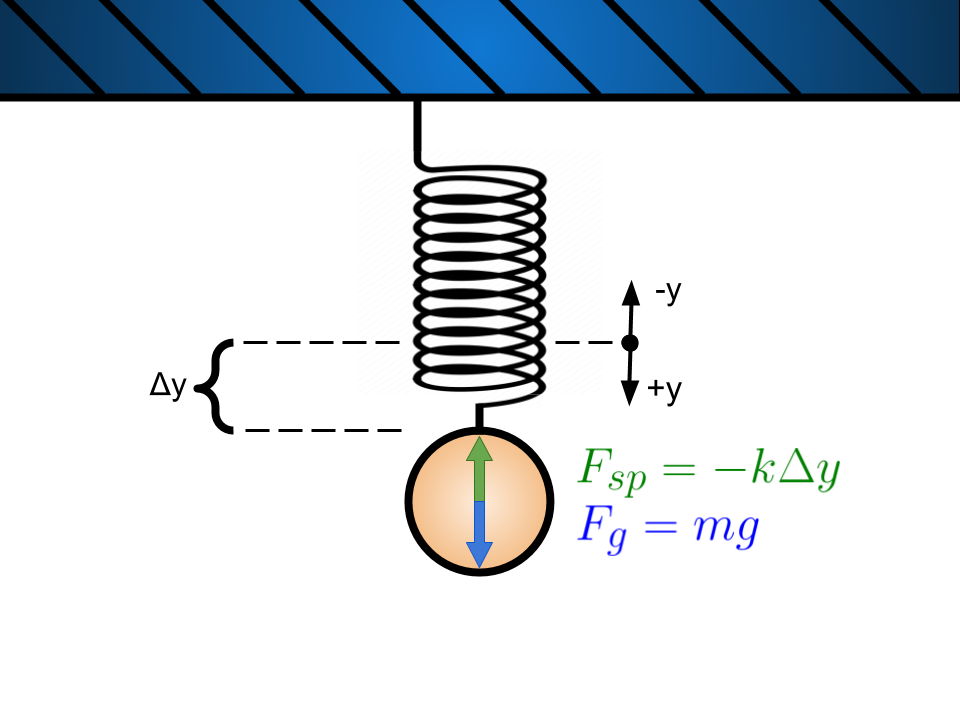
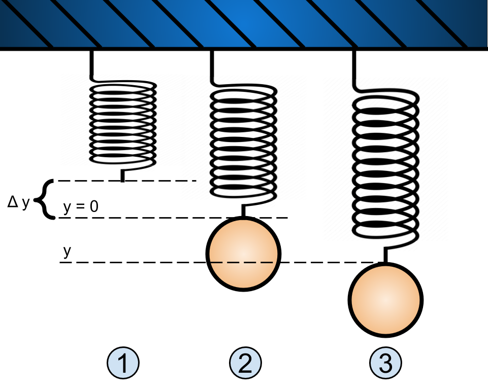
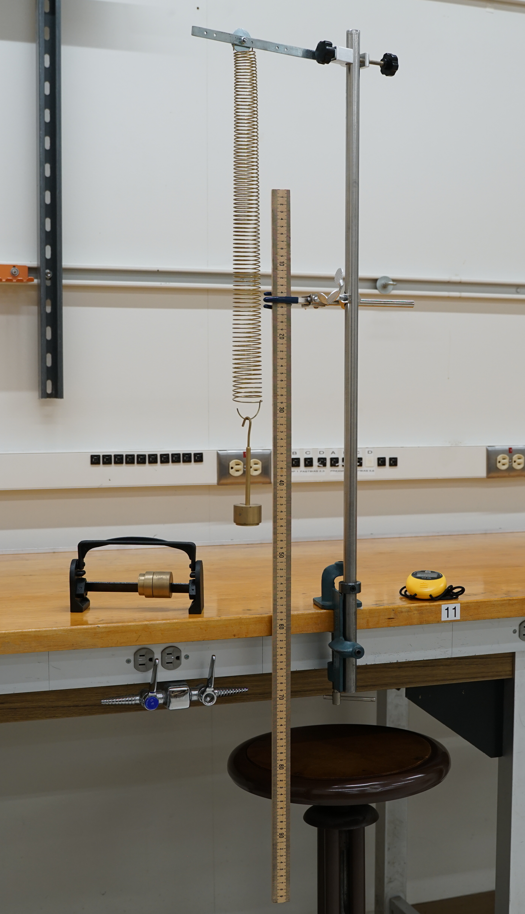
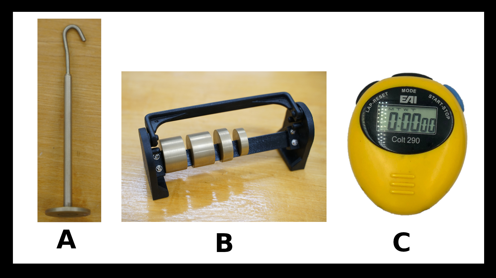

# Mass on a Spring

:::Intro (Objective)
The objective of this lab is to measure the spring constant of a spring using two different methods. From a comparison of the spring constant we will evaluate the simple harmonic oscillator motion model for the mass at the end of a spring. 
:::

# Introduction

In this lab we will be comparing two models for springs. The first is Hooke's Law and the second is the Simple Harmonic Oscillator for the mass spring system.

Both of these models are dependent on the stiffness of the spring. We typically note this parameter as $k$ and call it the spring constant.

We will use both models to measure the spring constant. We will then compare the values for $k$ and evaluate the models.

## Hooke's Law Model
:::Figure (hookeslaw|l)

:::

Most springs obey Hooke's Law: the magnitude of the force  that the spring exerts is proportional to the amount it is stretched. This is mathematically expressed as: 

:::Equation
$$
F_{sp} = -k\Delta y
$$
:::

This model makes the following assumptions:

:::Card (|Assumptions||bg-UCSB-seagreen text-white)
- $k$ is a constant value over the range in which we will stretch it.
- The only forces acting are the force of the spring and gravity.
:::

:::Figure (freebodyDiagram|m|R)

:::

Where $F_{sp}$ is the force exerted by the spring, $\Delta y$ is the displacement from the spring&rsquo;s unstretched position, and $k$ is the spring constant.

Since we are dealing with a vertical spring, we will define the origin, the zero point, as spot at the end of the spring when it is hanging in its relaxed state. See .

If we were to hang a mass, $m$, from the spring, and wait for the system to come to equilibrium (stop moving), we could determine the spring force by using Newton&rsquo;s second law and the force of gravity.

:::Exercise (HL1| 1 Point) 
Use  and knowledge of statics to answer the following: 
1. What happens to $\Delta y$ as $m$ increases?
:::

## Simple Harmonic Motion Model

:::Figure (shm|m|L)

:::

You have learned in lecture that spring systems experience periodic motion as well. This is done with the following steps:

1. Place a mass on the end of the spring.
2. Wait for the mass to come to rest at its equilibrium position.
3. Displace the mass from its equilibrium position.
4. Release.

Doing this will cause the mass to oscillate back and forth with a constant period. In fact, the underlying physics, the simple harmonic oscillator, is the same for the mass spring system and the pendulum. 

Thus we get a period that has a similar equation to the pendulum lab:

::: Equation (period)
$$
T = 2\pi \sqrt{\frac{m}{k}}
$$
:::

This model has the following assumptions:

:::Card (|Assumptions||bg-UCSB-seagreen text-white)
- $k$ is a constant value over the range in which we will stretch it.
- The only forces acting are the force of the spring and gravity.
- The spring is massless.
:::

:::Exercise (SHM1|1 Point)
Using :
1. What happens to $T$ as $m$ increases?
:::

### Pre-lab
:::Prelab
**Before coming to lab** you will need to complete , ,  and the exercise inside of it, , and . This will be checked off by your TA when you get to class. 

Additionally you if you want help with plotting and using the "LINEST" function in google sheets you should read [this part](?linkfile=references#part9) of the reference materials.
:::

## Plotting, Linear Fits, and Uncertainty

In the last two labs you collected data and determine the mean, the standard deviation, and the standard uncertainty of the mean in your data. 

This is one way perform an experiment. That is to say, repeat the measurement many times and determine some statistics. 

This way of doing things can be lacking in some ways. For instance, you are unable to  see a relationship with this method. 

In the previous lab, it may have been useful to see, or even determine, the relationship between initial angle and period. Having a plot may have provided us some insight that statistics did not. 

For this reason, we will use this lab to practice making a plot, finding a relationship, and pulling useful information from the plot.

We will take the data we collect, possibly perform some calculations with it, plot it, and perform a linear fit. From the line of best fit we can determine something about our system.

### Line of best fit

A linear plot is one where we expect the data to follow the equation $y=mx+b$. When we plot our data, we can then draw a line through our data that best represent our data. This line is called the line of best fit.

We determine the line of best fit by using the Least-Squares fitting algorithm. A summary of this algorithm is explained below [fn] You can read more details about the least squares algorithm and another way to think about it [here.](https://www.jmp.com/en_us/statistics-knowledge-portal/what-is-regression/the-method-of-least-squares.html)  [/fn].

You have a data set that is a list of $N$ ordered pairs $(x_1, y_1),\ (x_2,y_2),...(x_N, y_N)$ that represents your data. You want to draw the best fit line through them.

1. Start with a line that has the equation $Y=mx+b$. We want to see how good this line matches the data. 
2. We start by looking at how bad this line is from our data set. We do that by with the following equation:

:::Equation (residuals)
$$
\begin{aligned}
    \text{Sum of Residuals} &= \sum_{i=1}^{N} (y_i-Y(x_i)) \\\\
    &= \sum_{i=1}^{N} y_i - (mx_i+b)
\end{aligned}
$$
:::

That is to say, we look at the difference each of our data values $y_i$ and the $Y$ value determined from our line of best fit. These differences are called the **residuals**.

3. On average, the sum of  will be zero since we should have data equally above and below. So, like we do with standard deviations, we will look at the sum of the squares of the residuals so that we get a positive answer.

:::Equation (sumSquares)
$$
\begin{aligned}
    \text{Sum of Residuals Squared} &= \sum_{i=1}^{N} (y_i-Y(x_i))^2 \\\\ 
    &= \sum_{i=1}^{N} (y_i - (mx_i+b))^2
\end{aligned}
$$
:::

4. We weight the data by the inverse of its uncertainty squared. For this course we will assume the uncertainty is constant for each data point.

:::Equation (chi-squared)
$$
\chi^2 = \sum_{i=1}^{N} \frac{(y_i-Y(x_i))^2}{\sigma_y^2} = \sum_{i=1}^{N} \frac{(y_i - (mx_i+b))^2}{\sigma_y^2}
$$
:::

This value is called chi-squared.

5. Finally we minimize chi-squared by adjusting the $m$ and $b$ parameters of our line until the sum of the residuals squared is at a minimum. This is why it is called the least-squares algorithm. Typically this part is handled by a computer. 

:::Card (|Least-Squares ALgorithm Summary||bg-UCSB-seagreen text-white)
1. Plot a line with equation $Y=mx+b$
2. Calculate the residuals
3. Square and sum the residuals
4. Divide by the uncertainty to get chi-squared.
5. Adjust $m$ and $b$ to minimize chi-squared.
:::

<!-- This algorithm is a bit complicated and if you would like to learn more please see the Least-Squares algorithm description in the [reference material](?linkfile=references#part7). -->

It is very important to note that, unless every data point falls exactly on a line, **there is uncertainty** in slope and intercept values that are determined using the least-squares algorithm These slope and intercept values **are not exact**.

In this class we will use Google Sheets to determine the slope and line of best of fit. In order to that we will use the "LINEST" function. This will go through the process of determining the slope and intercept for the line of best as well as the uncertainties in each.

To get some intuition about the least-squares algorithm do .

::::::Activity (leastSquares)
1. Start by going to this [PhET simulation](https://phet.colorado.edu/sims/html/least-squares-regression/latest/least-squares-regression_en.html) of the of the least squares algorithm.

2. Next, click the grid checkbox in the bottom right hand corner in the bottom right.

3. Drag some of the orange points from the blue bucket in the bottom left onto the following locations.

:::Table

| x |  y  |
|---|-----|
| 2.1 |  3.1 |
| 3.7 |  0.7 |
| 6.1 |  2.4 |
| 8.2 |  7.6 |
| 11.3 |  7.3 |
| 13.1 |  10.9 |
| 17.1 |  12.0 |

:::

4. CCheck the "My Line" box on the right. Note that the $a$ value represents the slope (we use $m$ in the lab manual), and the $b$ is the intercept.

5. Adjust the slope and intercept values until you think you have drawn the line of best fit.

:::Exercise (bf1|1 Point)
What is the equation for your best fit line?
:::

6. Now click the "Residuals" checkbox. Notice the blue lines that appear. This is a graphical representation of the residuals.

7. Now click the "Squared Residuals" checkbox. These blue squares represent the size of the squared residuals graphically. Also notice the "Sum" scale that has appeared. This is the sum of all the squared residuals.

8. Now slide the slope and intercept buttons until you minimize the sum slider.

:::Exercise (bf2|1 Point)
What is the new equation for your best fit line?
:::

9. Now click the green plus by "Best-Fit Line" followed "Best-Fit Line" checkbox. The computer will now perform the Least-Squares algorithm and determine line of best fit.

:::Exercise (bf3| 2 Points)
1. What is the equation of the best fit line?
2. Did using the sum of squares sliders make an improvement from your first attempt to the second attempt?
:::

10. Click the "My Line" checkbox to uncheck and remove your line.

11. Move the last point from $(17.1,12.0)$ to $(17.1, 10)$.

:::Exercise (|1 Point)
How did this affect the best line?
:::

12. Now move the middle point from $(8.2,7.6)$ to $(8.2, 12.0)$

:::Exercise (|1 Point)
1. How did this affect the best fit line?
2. Why did this change affect your line differently from your previous change?
:::

::::::

## Propagating Uncertainty

Sometimes you make a measurement of some value and you want to use that value to calculate some new value. How do you determine the uncertainty in your new calculated value?

The uncertainty is propagated through the equation for the calculated value! That is, the uncertainty is carried through using an equation to determine the new uncertainty of your calculated value.

If you are determining an uncertainty from the calculated value $q$ using the measured values $x_1, x_2, ...x_n$, the uncertainty is propagated with 

:::Equation (uncertaintyPropagation)
$$
\delta q = \sqrt{ \sum_{i=1}^{N} \left ( \frac{\partial q}{\partial x_i} \delta x_i \right )^2 }
$$
:::

:::Card (|Example||bg-UCSB-navy text-white)
Let's say you measure the acceleration due to gravity $g$ using a pendulum. You have measured the period, $T$, with uncertainty, $\delta T$, and the length, $L$, with uncertainty $\delta L$. You assume you have a simple pendulum and you know that: 

$$g = 4\pi^2 \frac{L}{T^2}$$

To get the error in $g$ you apply . You note that:

$$
\begin{aligned}
    \frac{\partial g}{\partial T} &= -8\pi^2 \frac{L}{T^3} \\\\
    \frac{\partial g}{\partial L} &= 4\pi^2 \frac{1}{T^2}
\end{aligned}
$$

Thus  becomes:

$$
\begin{aligned}
    \delta g &= \sqrt{ \left ( \frac{\partial g}{\partial T} \delta T \right )^2 + \left (  \frac{\partial g}{\partial L} \delta L \right )^2} \\\\
    &= \sqrt{ \left (-8\pi^2 \frac{L}{T^3} \delta T \right )^2 + \left ( 4\pi^2 \frac{1}{T^2} \delta L \right )^2}
\end{aligned}
$$

:::

## Apparatus

:::Figure (fullApparatus|m|)

:::

:::Figure (equipment|m|R)

:::

In  you see a picture of the apparatus you will be using. When you come in it will be setup as shown. On the table, as seen in  will be a mass hanger, a set of masses, and stopwatch.

You can hang the mass hanger on the spring and add masses to it by sliding them down the hanger. Notice in  there is a meter stick held vertically by a clamp. You can use this to make displacement measurements.

Additionally, you can use the stopwatch to measure the period when you are performing the simple harmonic motion portion of the lab. 

Watch the video below for instructions on how to use the apparatus.

:::Video (apparatus)
<iframe width="100%" height="100%" src="https://www.youtube.com/embed/CwQ9rWv2olk" title="YouTube video player" frameborder="0" allow="accelerometer; autoplay; clipboard-write; encrypted-media; gyroscope; picture-in-picture" allowfullscreen></iframe>
:::

## Procedure

:::Exercise (linearize| 8 Points)
1. For the Hooke's law part of the lab, you will have to plot two parameters and perform a fit. Which parameter will you put on your $x$-axis and which parameter on your $y$-axis?
2. For the resulting line you would plot, what is the equation for the slope in terms of the physical variables in the experiment?
3. For the simple harmonic motion part of the lab, you will have to plot two parameters and perform a fit. Which parameter will you put on your $x$-axis and which parameter on your $y$-axis?;;;Note that T is not linear with any parameters, but T^2 is.;;;
4. For the resulting line you would plot, what is the equation for the slope in terms of the physical variables in the experiment?
:::

:::Exercise (procedure| 10 Points)
1. Write a procedure for performing the Hooke's Law experiment.
2. Write a procedure for performing the simple harmonic motion experiment.
:::

# The Experiment

::::::Activity (|Hooke's Law)

In this part of the lab you will measure the spring constant by using the Hooke's Law model. 

1. Follow your procedure and perform your experiment.
2. Do the following exercises.

:::Exercise (|7 Points)
Record notes on what you did, observed, or wondered during the Hooke's law portion of the lab in this exercise.
:::

:::Exercise (|4 Points)
Include all of the data tables you made here. Make sure each table is easily identifiable and labeled.
:::

:::Exercise (|8 Points)
Make a plot of your data and add a best fit line. 
:::

:::Exercise (|5 Points)
From your best fit line determine the value of the spring constant. Show your work.
:::

:::Exercise (|5 Points)
Using , determine the uncertainty in the spring constant. Show your work.
:::

::::::

::::::Activity (|Simple Harmonic Motion)

:::Exercise (|7 Points)
Record notes on what you did, observed, or wondered during the simple harmonic motion portion of the lab in this exercise.
:::

:::Exercise (|4 Points)
Include all of the data tables you made here. Make sure each table is easily identifiable and labeled.
:::

:::Exercise (|8 Points)
Make a plot of your data and add a best fit line. 
:::

:::Exercise (|5 Points)
From your best fit line determine the value of the spring constant. Show your work.
:::

:::Exercise (|5 Points)
Using , determine the uncertainty in the spring constant. Show your work.
:::

::::::

# Conclusion

::::::Exercise (|11 Points)
Based on your results, do the two methods of measuring the spring constant agree with each other? If you think they disagree is there something in model assumptions that could explain the difference? Justify your answer with your data.
::::::

:::Summary
Please note: There will be an additional 5 points for neatness. Make sure that your report is well organized and easy to follow.
:::

