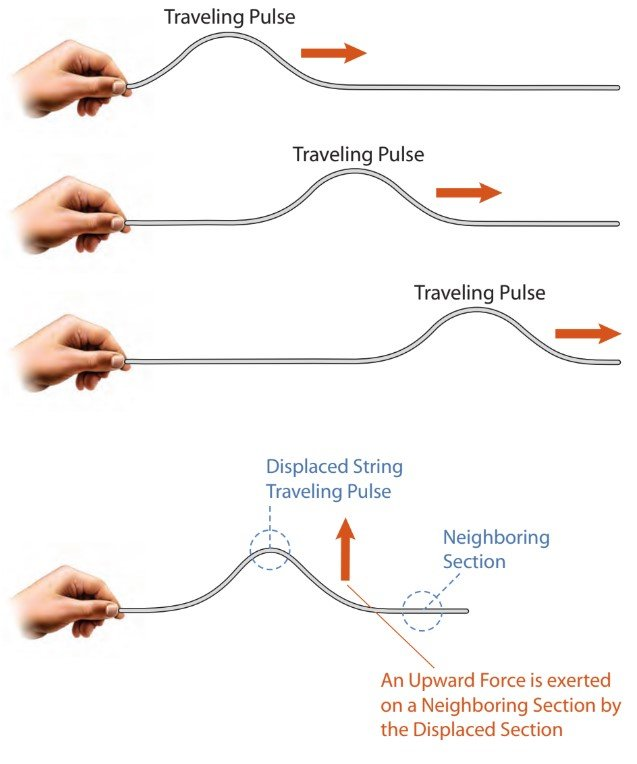
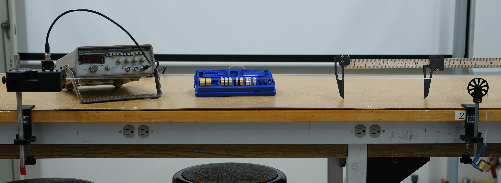

# Measuring $g$ 

:::Intro (Objective)
Design your own experiment to measure the acceleration due to gravity using standing waves. Compare your measurement with the accepted value for $g$.
:::

# Introduction

In this lab you will create a standing waves on a string. You will measure something about the waves and from this you will determine the acceleration due to gravity. You will be deciding which parameters to measure, plot, calculate, etc.

## Waves on a String Model

::: Equation (pulseVelocity)
$$
v = \sqrt{\frac{T}{\mu}}
$$
:::

:::Figure (travelingPulse|l|R)

:::

As a reminder, when you send a pulse down a string, the speed at which the pulse travels depends on the tension in the string, $T$, and the linear density of the string, $\mu$. Specifically the speed at which a wave travels on a string is given by . 

We also know that when we form a standing wave on a string that the speed of the wave can also be determined by the wavelength of the wave, $\lambda$, and the frequency of oscillation, $f$. This equivalent equation is given in .

:::Equation (waveVelocity)
$$
v = f \lambda
$$
:::

Finally, in order to produce a standing wave, we must meet the boundary conditions that will form a wave. As you will see our apparatus is one that has a closed boundary at each end. That is to say that the string is fixed on both ends.

Recall that the boundary conditions are that there must an integer multiple of half wavelengths along the length, $L$, of the string.  expresses this mathematically.

:::Equation (boundaryConditions)
$$
L = n\frac{\lambda}{2}
$$
:::

With these things in mind, let's discuss the apparatus. 

## Apparatus

You will need a good understanding of the apparatus in order to design your experiment. We will go through the tools your have to make your measurements and adjust the parameters.

:::Figure (fullApparatus)

:::

:::Figure (equipment|m|R)
 String Vibrator. B) Function Generator. C) Mass Kit. D) Calipers. E) Pulley. F) Hanging Mass")
:::

 shows a picture of the full setup and  shows each of the components of the set up. The string is connected on one end to the string vibrator that will oscillate the string up and down at a frequency set by the function generator. The function generator sends an electrical signal that drives string vibrator at the frequency, $f$, you set.

The other end of the string goes over a pulley where we hang a known mass, $m$. This mass allows us to set the tension in the string, $T$. The masses that can be added vary from about $5\text{ g}$ to around $400\text{ g}$. Changing the spacing between between the end of the string vibrator to the pulley allows you to adjust the length, $L$.

Finally, there is a set of calipers that can be used to measure the length of the string, $L$, or the wavelength of the standing wave, $\lambda$.

The string that we will be using has a linear density about $2.66\times 10^{-4}\text{ kg}\cdot\text{m}^{-1}$.

Watch the video below for more details about how you can control the experiment.

The summary of the parameters in the setup is in 

::::::::::::Figure (parameterSummary)
:::::::::row

:::::: col
:::Table (|Independent Parameters)
| Name | Symbol |
|------|--------|
|Frequency | $f$ |
|Mass | $m$ |
|Length | $L$|
:::
::::::

:::::: col
:::Table (|Dependent Parameters)

| Name | Symbol |
|------|--------|
|Segments | $n$ |
|Wavelength | $\lambda$ |
:::
::::::
:::::::::

:::::::::row
:::::: col
:::Table (|Constants)

| Name | Symbol |
|------|--------|
|Linear Density | $\mu$ |
:::
::::::
:::::::::
::::::::::::

The independent parameters are the ones that you have direct control over. You can set $f$ with the function generator, you can set $m$ by changing the mass hanging off the end, and you can set $L$ by changing the spacing between the string vibrator and the pulley.

The dependent parameters are the ones that depend on the other parameters. You can't push a button or turn a knob to directly set $\lambda$ or $n$. When you set the independent parameters, the dependent parameters, $\lambda$ and $n$, will be determined by $f$, $L$, and $m$.

### Pre-lab
:::Prelab
**Before coming to lab** you will need to complete  (and Exercises 1, 2, 3, & 4
 inside of it), as well as , ,  , and . This will be checked off by your TA when you get to class. 

:::

## Designing the Experiment

The point of this lab is to use the waves on a string apparatus to measure $g$, the acceleration due to gravity. In this section you will design an experiment that you will perform in lab.

We will be using the plotting technique again. We will plot one parameter against another, add a best fit line, and get $g$ from the slope or intercept parameter. 

::::::Activity (experimentEquations)
In this activity we will create some equations that you can use to set up your experiment. You will want to write an equation that will have one of the *dependent* parameters equal to an expression of constants and *independent* parameters. We will do this both $\lambda$ and $n$.

First, let's determine the tension in the string. Note that a mass is in static equilibrium.

:::Exercise (replaceTension| 2 Points)
Use the fact that the mass is in static equilibrium.

1. What is the equation for the tension in the string?

2. Rewrite  replacing the tension with the equation you determined in part a.
:::

:::Exercise (experimentEq1| 2 Points)
Use your results from  and  and solve for the *dependent* parameter, ($\lambda$). Show your work.
:::

Now imagine that you are performing an experiment. You would want to pick **one** of the *independent* parameters to vary while keeping the other independent parameters constant. Then, you would vary the independent parameter and measure the dependent parameter.

:::Exercise (| 4 Points)
What two experiments could perform using the equation you came up with in ? i.e., What would you keep constant, what would you vary, and what would you measure?
:::

Now let's use the other dependent parameter, $n$.

:::Exercise (| 6 Points)
1. Replace the dependent parameter, $\lambda$, from  using  and solve for the dependent parameter, $n$. Show your work.

2. What three experiments could perform using the equation you came up with in part a? i.e. What would you keep constant, what would you vary, and what would you measure? 
:::
::::::

## Procedure

For writing the procedure you will have to pick one the experiments you have designed in .

:::Exercise (experimentChoice| 3 Points)
Pick one of the experiments designed above.
1. Why did you pick this experiment?
2. What is the independent parameter?
3. What is the dependent parameter?
:::

You will be performing a line of best fit during your experiment. This may require you plotting something other than just your independent parameter on your x-axis and your dependent parameter on your y-axis. You may need to perform a calculation with your parameter in order to generate a linear equation.

:::Exercise (linearize| 8 Points)
1. What value will you plot on your x-axis?
2. What value will you plot on your y-axis?
3. If you perform a line of best fit, what will be your slope?
4. How will get $g$ from your line of best fit? What's the equation for $g$?
:::

:::Exercise (uncertainty| 3 Points)
What is the equation for the uncertainty in $g$?
:::

:::Exercise (procedure| 10 Points)
Using the experiment you've outlined, write a procedure for measuring $g$
:::

## Uncertainty from Scales
This far into the course we have only discussed how to determine the uncertainty in by using statistics. While this is typically one of the best options, sometimes we are able to make a single measurement using a graduated or digital scale and estimate the uncertainty from the resolution.

For instance, when using graduated scale, like that of a ruler, we say the uncertainty is half of the smallest division on the scale. So if we were to use a standard meter stick that has $1 \text{ mm}$ divisions, we would say that our uncertainty is $\pm 0.5 \text{ mm}$. 

For a digital display, we say the uncertainty is half of the last digit displayed. That is, if we were using an electronic balance to measure the mass of a stone and read $52 \text{ g}$, then we would say our uncertainty is $\pm 0.5 \text{ g}$. Thus, we would report the stone's mass as $52.0 \pm 0.5 \text{ g}$

# The Experiment
::::::Activity (|Experiment)
1. Follow your procedure and perform your experiment.
2. Do the following exercises.

:::Exercise (|12 Points)
Record notes on what you did, observed, or wondered while performing your experiment in this exercise.
:::

:::Exercise (|4 Points)
Include all of the data tables you made here. Make sure each table is easily identifiable and labeled.
:::

:::Exercise (|8 Points)
Make a plot of your data and add a best fit line. 
:::

:::Exercise (|4 Points)
What is the value and uncertainty of each of the independent parameters you kept constant?
:::

:::Exercise (|10 Points)
From your best fit line determine the value of $g$. Show your work.
:::

:::Exercise (|8 Points)
What is the uncertainty in $g$?
:::
::::::

# Conclusion

::::::Exercise (|15 Points)
1. Based on your results, do you think your experiment is accurately measuring $g$? Why or why not?
2. How would you change the experiment to improve your results?
::::::

:::Summary
Please note: There will be an additional 5 points for neatness. Make sure that your report is well organized and easy to follow.
:::

