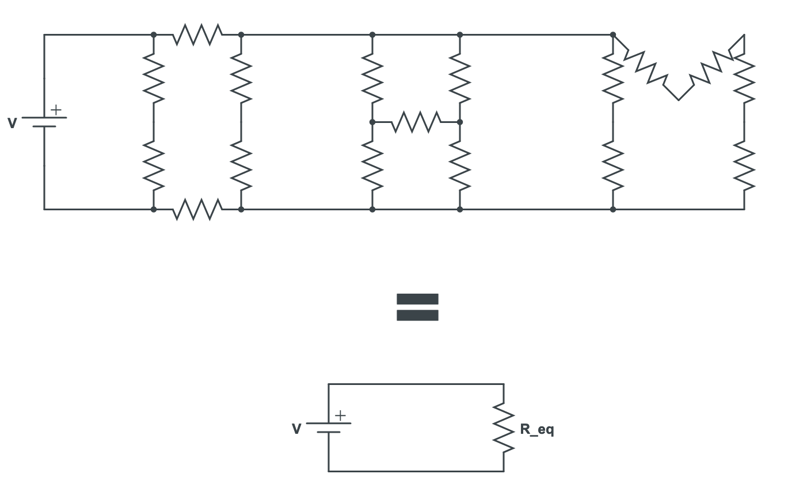
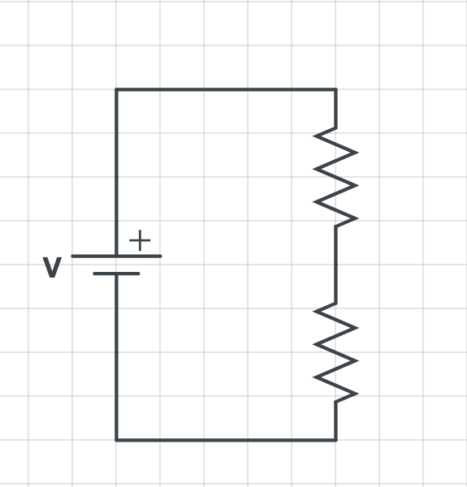
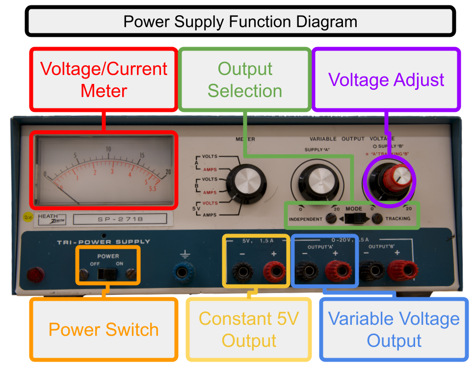
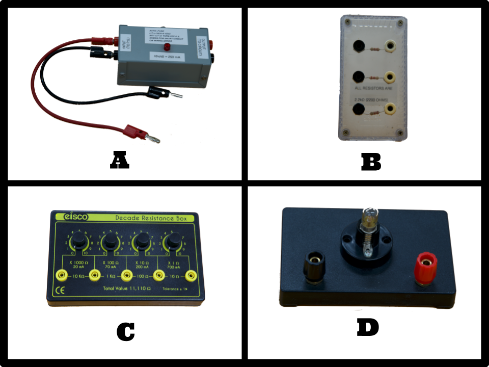
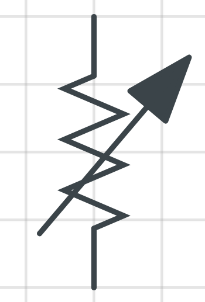
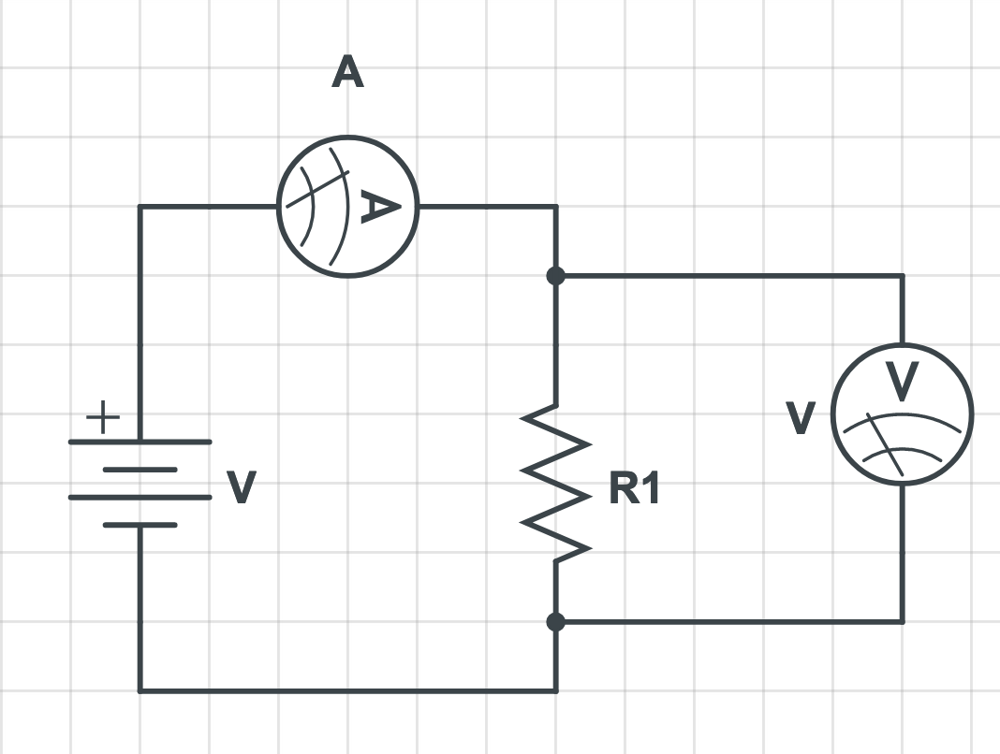

# Ohm's Law

:::Intro (Objective)
- Develop a method to determine if a circuit element obeys Ohm's Law.
- If it does, determine the resistance of the element.
- Demonstrate the principle of equivalent resistance.
:::

# Introduction

## Ohm's Law
As you've seen in lecture Ohm's law states the voltage drop, $V$, across a resistor with resistance, $R$, is the product of the current through the resistor, $I$, and the resistance. The equation is typically written:

:::Equation (ohmsLaw)
$$
V = IR
$$
:::

Often times in a physics or electronic lab we don't use a power source that supplies a constant voltage that we, the user, get to set. This means that we set the voltage and that the current is determined by the resistance. This is what we will be doing this lab. Notice that Ohm's Law as written in  indicates a situation where the voltage is set by the current. Let's rewrite Ohm's Law to match our situation.

:::Exercise (ohmsLawCurrent| 2 Points)
Given the explanation above, rewrite Ohm's law to match what we will be doing in the lab.
:::

## Equivalent Resistance

:::Figure (eqResistance||R)

:::

You have likely seen the concept of equivalent resistance. Equivalent resistance states that we take a complex network of resistors, like the top circuit of , and replace it with a *single* resistor with resistance $R_{eq}$, like the bottom circuit . 

From the perspective of the voltage source, these two circuits behave identically. These two models are equivalent, but dealing a single resistor can be much more simple than a complex network.

The trouble here is determining the value of $R_{eq}$. Depending on the network, this might be a non trivial task. For now, we will only consider two basic topologies you are likely familiar with. Series circuits, parallel circuits, or some combination of them. 

Outside of mathematical determining the equivalent resistance, you can also determine it empirically. For instance if we measured the voltage drop across the complex network of resistors in  and the current flowing into the network we could use design an experiment using the equation you derived in  to measure the equivalent resistance. We would make a plot of $I$ vs. $V$, also know as an $I-V$ plot, and get the equivalent resistance.

:::Exercise (measEqResistance| 8 Points)
Assuming you were measuring the current into the network and voltage across it, and applying equivalent resistance, describe the experiment you would perform to measure the equivalent resistance. Additionally describe how you would get the equivalent resistance from your data. ;;;Assume that network (and the equivalent resistance model) obey Ohm's Law;;;
:::

### Series Circuits

::: Figure (seriesCircuit |m|L)

:::

A series connection is one where two components only share one point of contact, typically called a node. You can think of it by noticing what happens to the current flowing through the circuit. The current must flow through each component in order.  is the simplest series circuit possible.

The equivalent resistance for a set $N$ resistors in series is given by .

:::Equation (seriesResistance)
$$
R_{eq} = \sum_{i=1}^{N} R_i
$$
:::

You simply just add the resistance of all the resistors connected in series to get the equivalent resistance. 

### Parallel Circuits

:::Figure (parallelCircuit|m|R)

:::

A parallel connection is one where two or more components share two points of contact, or two nodes. If you pay attention to what happens to the current this time you may notice that it can branch and flow through multiple resistors at the same time.  is the simplest parallel circuit possible.

The equivalent resistance for a of $N$ resistors in parallel is given by 

:::Equation (parallelResistance)
$$
R_{eq} = \left ( \sum_{i=1}^{N} \frac{1}{R_i} \right )^{-1}
$$
:::

# Pre-Lab

:::Prelab
**Before coming to lab** you will need to complete  and . This will be checked off by your TA when you get to class. 
:::

# Apparatus

At your station you should find the following items ;;;Your items might not be the ones pictured below but should function similarly;;;:
- A constant voltage power supply 
- An autofuse
- A resistor box
- A decade resistance box
- A lightbulb
- 2 Voltmeters and 1 Ammeter.
- A set of banana cables

Below is a description of how each of these items function.

## Power Supply

:::Figure (powerSupplyApparatus|L)

:::

 is a constant voltage power supply. This means that at the outputs it will adjust the current going through an resistors attached so that the voltage stays what you set it.

:::Note
The power supply will only do this up to a point! If you are connected to the variable output it can at most supply $0.5 \text{ A}$. That means if you connect a $10 \text{ }\Omega$ resistor to the output, at most it can supply $5 \text{ V}$. 
:::

### Important Features

:::Warning
When using the power supply **only connect the autofuse directly to the power supply**.
:::

- Because the autofuse will cause a small drop in voltage you should **ignore the voltage/current meter** on the power supply. It will not display accurate or useful information. Instead you will use the Voltmeter and Ammeter to determine the voltage and current.
- Make sure that you have the output selection switch set to "tracking".
- In this lab you will be using one of the two outputs. When you are connected to the constant $5 \text{ V}$ output, turning the voltage adjust knob will do nothing. The voltage will remain at $5 \text{ V}$. Only if you you connected to the variable output will the voltage adjust knob have an effect.

## Circuit Elements

:::Figure (circuitItems)

:::

 shows the four main elements you will use to build your circuit. 

### Autofuse

As stated before, you should only connect the autofuse directly to your circuit. All other elements should be connected to the autofuse. The function of the autofuse is to prevent short circuits. 

If you accidentally short your circuit (connect the positive output directly to the negative output) the autofuse light will go out and it will open the connection to the power supply circuit so no current can flow into your circuit.

:::Note
For any circuit diagram you draw in the lab you can leave the autofuse out of the drawing.
:::

### Resistor Box
This is just a box with three $2.2 \text{ k}\Omega$ resistors inside of it. You can use this to build simple series and parallel resistor circuits.

### Decade Resistance Box
This box is an adjustable resistor. By connecting to the right most and left jacks on the device you can dial in a resistance anywhere between $0 \ \Omega$ and $11,110 \ \Omega$.

::::::Note
:::Figure (variableSymbol|xs|L)

:::
This is the symbol for a variable resistor.
::::::

### Lightbulb
This is a small incandescent lightbulb. It works but putting a voltage across a very small wire called the filament. When current flows through filament it gets so hot that it gives off visible light. 

You can connect to it by using the two banana jacks on either side of the stand.

### Wires
:::Figure (bananaCables)

:::

 shows banana cables also known as test leads. They are called this because the connector at the end look like little bananas. 

These wires are how you connect your circuit elements together. Simply plug each end into any jack to connect the elements.

## Measurement Tools

:::Figure (meters)

:::

These are the meters that you will have available to you. You will have two voltmeters in total. One of them can be used to measure the voltage drop across a circuit element or between any two nodes in the circuit. You will also have one ammeter. You can use this to measure the current through one leg of your circuit.

When using the meters to make a measurement it is important to to note the scale that you are on. You can adjust the scale using the switch on the upper left corner of the meters. The writing at the location of the switch indicates the maximum value that the meter will read. If the voltage or current exceeds the max value the meter will only display a "1". Additionally, the unit that the meter is using is set by the max value switch. For instance, if the ammeter is set to $5 \text{ A}$ then the value displayed is in $\text{A}$. If the ammeter is set to $200 \text{ mA}$ the value displayed is in $\text{ mA}$.

The final tip is that you should always use black jack of the ammeter. Your choice of the red or green jack depends on which maximum current setting you use. The green is only useful if you are on the $5 \text{ A}$ setting, but the red should be used for all other settings.

:::Figure (meterDiagram|m|R)

:::

:::Note
- Voltmeters should be connected in **parallel**
- Ammeter should be connected in **series**
:::

If you want to include the voltmeters or the ammeter in any circuit diagram you draw you can draw it as a circle with a "V" or "A" in it respectively. An example of the symbol and how to connect your meters is shown in .

# The Experiment

In this lab you will demonstrate the concept of equivalent resistance. Use the mathematical models above and compare that to $I-V$ curves. 

## Single Resistor

::::::Activity (single)

1. Using a single resistor from the resistor box, connect a circuit so that you can make an $I-V$ curve.

:::Exercise ( | 3 Points)
Draw a circuit diagram and include it here.
:::

2. Create an $I-V$ plot for this circuit.

:::Exercise ( | 1 Point)
Include your data table here.
:::

:::Exercise ( | 6 Points)
Include your plot here.
:::

:::Exercise ( | 6 Points)
1. Based on the plot, does this resistor follow Ohm's Law?
2. What is the resistance you measured? Include uncertainty.
:::

::::::

## Series Equivalence

::::::Activity (series)

Here we will demonstrate the principle of equivalent resistance.

1. Create two more circuits using the resistor box. One with 2 resistors in series and one with 3.

:::Exercise ( | 6 Points)
1. Draw a circuit diagram for the two resistors in series circuit.
2. Draw a circuit diagram for the three resistors in series circuit.
:::

2. Create an $I-V$ plot for both circuits. 

:::Exercise ( | 2 Points)
1. Include your data table here for the two resistors in series circuit.
2. Include your data table here for the three resistors in series circuit.
:::

:::Exercise ( | 12 Points)
1. Include your plot here for the two resistors in series circuit.
2. Include your plot here for the three resistors in series circuit.
:::

:::Exercise ( | 12 Points)
1. What is the equivalent resistance you measured for the two resistors in series? Include uncertainty.
2. How does this equivalent resistance compare to the theoretical model?
3. What is the equivalent resistance you measured for the three resistors in series. Include uncertainty.
4. How does this equivalent resistance compare to the theoretical model?
::: 
::::::

## Parallel Equivalence

::::::Activity (parallel)

Here we will demonstrate the principle of equivalent resistance.

1. Create two more circuits using the resistor box. One with 2 resistors in parallel and one with 3.

:::Exercise ( | 6 points)
1. Draw a circuit diagram for the two resistors in parallel circuit.
2. Draw a circuit diagram for the three resistors in parallel circuit.
:::

2. Create an $I-V$ plot for both circuits. 

:::Exercise ( | 2 Points)
1. Include your data table here for the two resistors in parallel circuit.
2. Include your data table here for the three resistors in parallel circuit.
:::

:::Exercise ( | 12 Points)
1. Include your plot here for the two resistors in parallel circuit.
2. Include your plot here for the three resistors in parallel circuit.
:::

:::Exercise ( | 12 Points)
1. What is the equivalent resistance you measured for the two resistors in parallel? Include uncertainty.
2. How does this equivalent resistance compare to the theoretical model?
3. What is the equivalent resistance you measured for the three resistors in parallel. Include uncertainty.
4. How does this equivalent resistance compare to the theoretical model?
::: 
::::::

## Lightbulb

::::::Activity (lightbulb)

1. Create a circuit with the lamp to make an $I-V$ plot.

:::Exercise ( | 4 Points)
Draw a circuit diagram and include it here.
:::

2. Make an $I-V$ plot for the lamp.

:::Exercise ( | 2 Points)
Include you data table here.
:::

:::Exercise (|8 Points)
Include your plot here.
:::

:::Exercise (| 9 Points)
1. Do you think a lightbulb obeys Ohm's Law?
2. Why or why not?
3. What can you say about the resistance of the lightbulb?
:::

::::::

# Conclusion

:::Summary
Please note: There will be an additional 5 points for neatness. Make sure that your report is well organized and easy to follow.
:::

