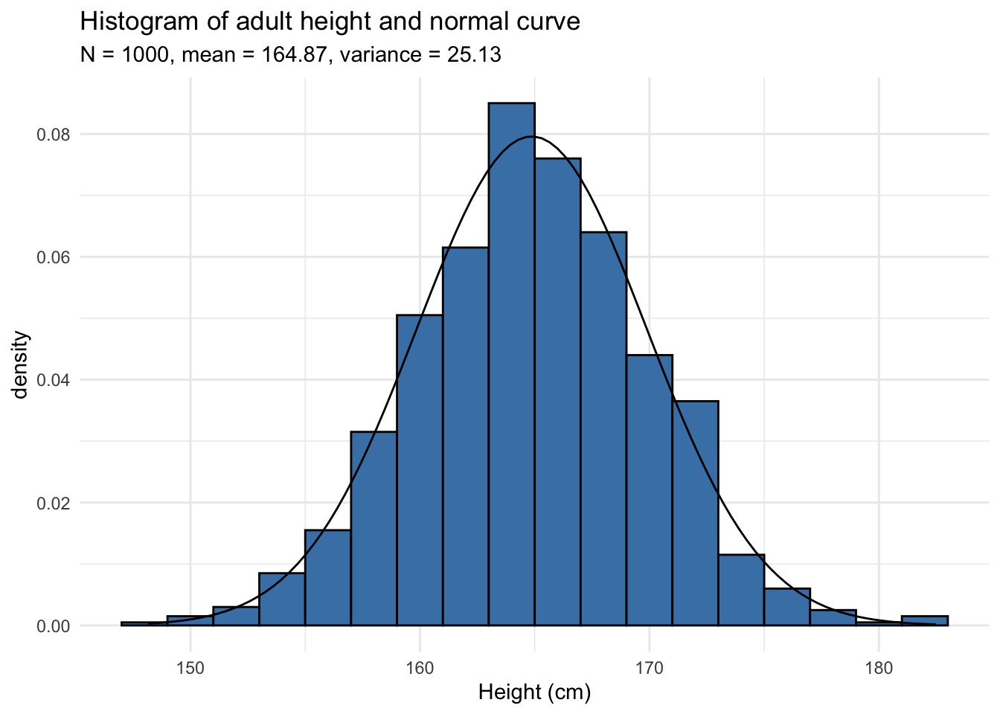

# Reference Material

# Uncertainty

Physics is the study of the laws of nature through observation and experiment. In an experiment, we perform measurements and collect data, then we interpret the data and derive trends and relationships between our variables.

When we measure a quantity, say the length of a pendulum, we will never be able to measure the **true value** of the length. Instead, if we are careful and thoughtful in our measurement, we will get a length close to the true length, our **best estimate**. 

The most honest way to report our measurement to others is to provide our best estimate and a window of values in which the true length might fall. This window is called our **uncertainty**. We would typically write down the length of the pendulum in the following format.

$$
60.23 \pm 0.05 \text{ cm}
$$

The 60.23 cm is our best estimate, and the 0.05 cm is our estimate of the uncertainty.  We are saying that our best guess at the true length of the rod is 60.23 cm but the true length is most likely between 60.18 cm and 60.28 cm.

:::Note
**Uncertainty is unavoidable in every measurement**
:::

Typically, the uncertainty comes from two sources, systematic and random uncertainty. 

## Systematic Uncertainty

**Systematic uncertainty** causes the measurement to consistently be high or low. Systematic uncertainty usually arises from measurement technique or other physical influences, for example improperly calibrating an instrument or assuming a variable is negligible. The job of the experimenter is to minimize the systematic uncertainty and eliminate it if possible. 

One example of systematic uncertainty we might see while measuring the length of the pendulum is the following. Imagine we were using a metal meter stick that was calibrated at 25 °C but we were making our measurements at 15 °C. The metal would contract making the markers spaced shorter than 1 mm apart. Thus all of our measurements of the pendulum length would be larger what the true length of the pendulum is.

Knowing this, the next questions an experimenter would ask his/her self are, "how does this systematic uncertainty compare in magnitude to the rest of my uncertainty? Can I ignore this effect?" and if not, "how can I account for contraction of the meter stick or prevent it from contracting in the first place?"

## Random Uncertainty

**Random uncertainty** are random variations in *every measurement* that do not consistently cause the measurement to shift in a high or low direction but instead randomly high and low. That is to say if we repeat a measurement, the values of the measured quantity will vary from each other measurement to measurement. The values will be randomly distributed around a mean value.

Random uncertainties are caused by limitations in our instruments or fluctuations in the physical system. We can't eliminate random uncertainties, but we can minimize them by using precise instruments and by collecting a large data set for calculating the average of our measurements. Thus, we need to perform multiple trials by repeating the experiment several times to help reduce the random uncertainty. 

:::Note
- All measurements have uncertainty in them. They may have both random and systematic uncertainty.
- An experimenter should do their best to minimize systematic uncertainty in their measurement.
- Random uncertainties is unavoidable but should also be reduced as much as possible.
:::

## Accuracy and Precision

:::Figure (accuracyTargets|m|R)
![A picture of four bullseye targets in a 2 by 2 grid. Top left is labels High Precision and Low Accuracy. It has a small cluster of holes not located on the central bullseye. The top right is label High Precision and High Accuracy. It has a small cluster of holes this time on the central bullseye. The lower left is labelled as lLow Precision and Low Accuracy. It has a large spread of holes not near the central bullseye. The lower right is labelled as Low Precision and High Accuracy. It has a large spread of holes that average around the central bullseye. ](imgs/Reference/targets.png)
:::

Measurements are often classified by their precision and accuracy. **Accuracy** indicates how close one is to the true value of measurement. This is often times a predicted or standard value. **Precision** indicates how tightly the measurements are grouped together. 

Accuracy and precision are independent of one another. The definitions and independence are depicted visually in .

Precision can be measured by looking at the uncertainty in our measurement. Accuracy is not so simple to determine. In order to make a useful statement about accuracy we must first understand the precision of our measurement. It's not useful to makes claims about accuracy is the uncertainty is too high. For instance, perhaps someone missed evenly all around the target but never hit the target itself. All of the holes would average to a bullseye but we would not consider the thrower to be accurate. 

# Statistics

:::Figure (histogram|l|L)

:::

For the majority of this class when making some claim we will begin our justification with some amount of statistics. Thus when we make a measurement we will want to repeat it so that we can get some quantitative values to support our claims.

For this class, we will assume that all of our measurements will follow a Gaussian distribution. Thus when you make many measurement you will be able to produce a histogram similar to .

## Mean
The mean of your data can be calculated in the typical way:

:::Equation
$$
\bar{x} = \frac{1}{N}\sum_{i=1}^{N} x_i
$$
:::

This will represent our best estimate of the true value of what we measure.

## Standard Deviation
The width of the histogram is characterized by the standard deviation. The standard deviation tells use that if were to make another measurement there is a 68% chance that our new measurement would be within one standard deviation of the mean. 

The standard deviation is calculate with following equation:

:::Equation
$$
\sigma = \sqrt{\frac{1}{N-1} \sum_{i=1}^{N} (x_i - \bar{x})^2}
$$
:::

:::Note
Increasing the number of measurements you make should not change the value of the standard deviation.
:::

## Standard Uncertainty of the Mean

When we make many measurements and want to estimate the mean, we get a reward for all of the our hard work. The uncertainty in the mean *does decrease* as we take more measurements.

The uncertainty in the mean is given by the following equation:

:::Equation
$$
\delta \bar{x} = \frac{\sigma}{\sqrt{N}}
$$
:::

# Making Comparisons

Often times we want to compare two values and make a quantitative judgement about the relationship of the two values. We will do this using a statistic that we will call $t'$. It is found with the following equation:

:::Equation
$$
t' = \frac{A-B}{\sqrt{\delta A^2 + \delta B^2}}
$$
:::

Once $t'$ is calculated we can evaluate the similarity or distinguishability of our two measurements using the following criteria:

$|t'| \leq 1$: This implies that the two measurements are not distinguishable at the resolution of your uncertainty. This may be because be you are measuring the same thing in both measurements ($A$ and $B$ are likely the same) or that your uncertainty is so large you can't tell the difference. If you find yourself in this situation you may want to do the following:
- Reduce your uncertainty to see if you the two results are still the same.
- Improve your measurements.
- Check that you have appropriately accounted for uncertainty and verify that you haven't overestimated the uncertainty.

$ 1 < |t'| \leq 3$: When $|t'|$ is in this regime it is possible that $A$ and $B$ are the same but at this level of uncertainty it is hard to be sure.

$|t'| > 3$: At this point is very likely that these two measurements are indeed distinguishable. If this is the case $A$ and $B$ are probably not measuring the same thing. If you find yourself in this situation you may want to do the following:
- Improve your measurements.
- Evaluate your model and considering revising it. 
- Make sure that you have appropriately accounted the uncertainty and that you haven't underestimated your uncertainty. 