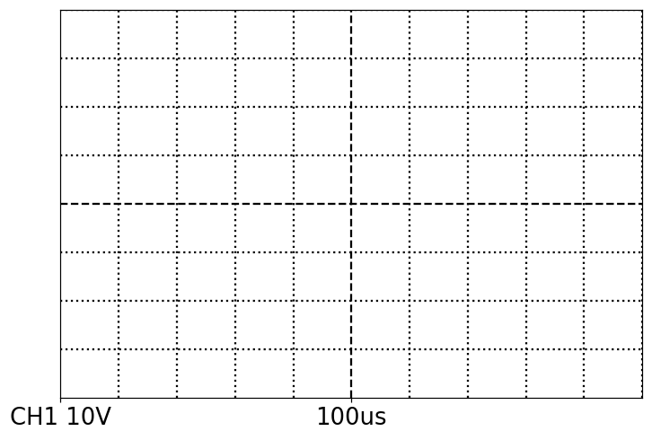
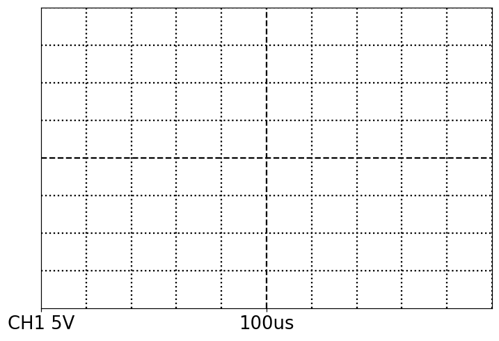
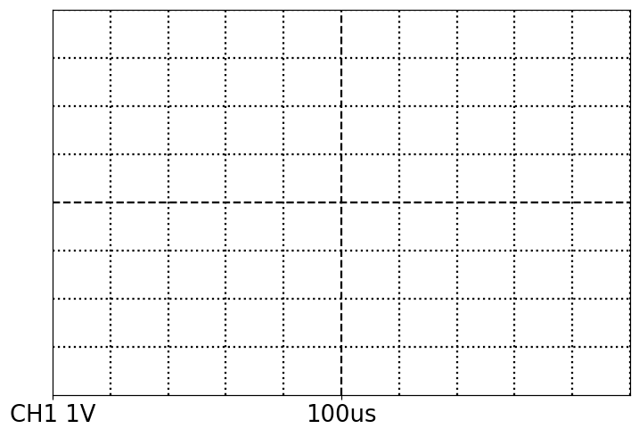
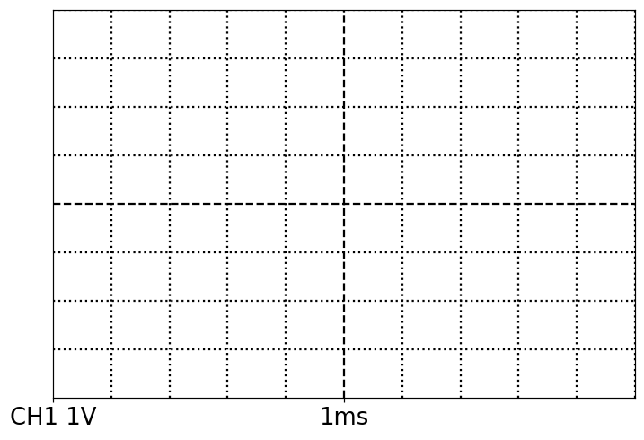
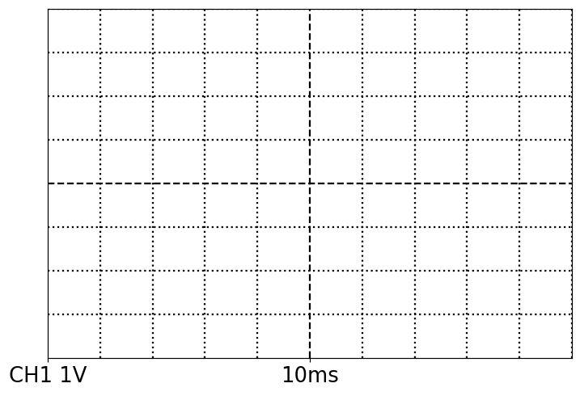
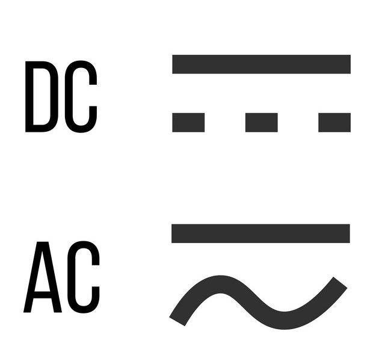

# Oscilloscope Training

:::Intro (Objective)
The goal of this lab is to become familiar with a ubiquitous electronic measurement tool, the oscilloscope. We will use this tool in the upcoming 3L labs and in many of the 4L labs.
:::

# Introduction to the Oscilloscope
An oscilloscope takes an electronic signal, typically a time varying voltage, and visually displays the signal on a screen. It does this by periodically sampling the signal measuring what the voltage is at a particular moment in time, creating a coordinate pair $(v_i, t_i)$. Then it plots this point on the screen and the cycle repeats.

To understand the utility of an oscilloscope consider a simple battery. It provides a constant voltage, or direct current (DC), across its terminals which could easily be measured with a voltmeter. If we were to look at the voltage signal from the battery on the oscilloscope we would see a flat line. 

Your headphones, on the other hand, are driven by a time-varying voltage signal. If we used a voltmeter to measure this signal we would only be able to see the time-average voltage. This would provide very limited information about the signal. If instead we used the oscilloscope to look at the signal we could get more information about the signal. We could see what frequencies are being played, the peak to peak voltage, the amount of noise in the signal, etc.

:::Exercise (dcVac)
1. You'd like to know the voltage of a DC source. Do you use a voltmeter or oscilloscope?

2. You'd like to measure the frequency of a standard wall socket. Do you use a voltmeter or oscilloscope?
:::

## Oscilloscope Controls

At first glance an oscilloscope can look a bit overwhelming. There are many buttons to touch and many knobs to turn. We can break down the controls into multiple bite size chunks so that it is a bit easier to understand. On thing to notice is that the oscilloscope you will be using is capable of looking at two signals at the same time. These signals are labeled CH1 and CH2.

:::Figure (oscilloscopeDiagram)

:::

### Screen
First we will point out some things about the screen. Notice there is a 10x8 grid on the screen. This grid is always present and is important for making measurements. One spacing on this grid is called a division or div for short. 

At the bottom of the screen you can see some information being displayed about scale on the screen. In this photo CH1 has a vertical scale of $5 \text{ V/div}$ and CH2 has a scale of $2 \text{ V/div}$. Another way to say that is there is a difference of $5 \text{ V/div}\times 8 \text{ div}=40 \text{ V}$ from the top of the screen to the bottom for CH1 and $16 \text{ V}$ for CH2. In the center of the screen you see information about the scale of the horizontal axis. In this picture it is set to $50 \text{ }\mu\text{s/div}$. Another way to say that there is a difference of $50 \text{ }\mu\text{s/div}\times 10 \text{ div}= 500\text{ }\mu\text{s}$ from the left side of the screen to the right side. It is important to note that CH1 and CH2 can have different vertical scales but always share the same horizontal scaling. 

Finally, on the right side of the screen are five sections that change depending on context. These regions tells you what happens when you press the soft buttons.

### Soft Buttons & Variable Knob
Here you can see some buttons known as "soft buttons". These buttons' functionality change depending on context. To know what each of these buttons will do we need to look at the right hand side of the screen.

The variable knob typically allows you to set a value of some parameter you have selected in the right screen menu by rotating it.

### Signal Inputs

Let's start by looking at the CH1 and CH2 inputs. This is where you will connect a [coaxial cable](https://en.wikipedia.org/wiki/Coaxial_cable) with a [BNC connector](https://en.wikipedia.org/wiki/BNC_connector) end. When you connect a cable to one of these ports you and turn on that channel, you will see the signal displayed on the screen.

### Vertical Controls

Next we will discuss the CH1 and CH1 Vertical Controls. Pressing the Yellow or Blue button in the center of the column will turn on and off that channel from being displayed on the screen. 

Turning the small knob at the top of the column will shift the zero position of that channel. This effectively moves the signal up and down on the screen. 

Lastly, turning the large knob on the bottom changes the vertical scaling for each channel independently. For instance, if you wanted to change the vertical scaling of CH1 from $5 \text{ V/div}$ to $2 \text{ V/div}$ you would rotate the large CH1 knob.

### Time Controls

The time control area allows you to adjust the horizontal scaling and positioning. We won't be using the middle button for our labs so we won't worry about it now.

Turning the small knob at the top of the column will shift the zero position of the horizontal axis. This effectively moves the signal left and right on the screen.

Turning the large button on the bottom changes the horizontal scaling for both CH1 and CH2. For instance, if you wanted to change the scaling from $50 \text{ }\mu\text{s/div}$ to $100 \text{ }\mu\text{s/div}$, you would rotate this knob.

### Trigger Controls
The trigger is an important feature for using an oscilloscope. The trigger sets a voltage level and a scenario for when to begin drawing the signal on the screen. For instance, you could set the voltage level of the trigger to $1 \text{ V}$ and then scenario for a positive slope. If the input signal then ever goes from less than $1 \text{ V}$ to greater than $1 \text{ V}$ the scope would begin drawing the signal. However, if the signal were to go from greater than $1 \text{ V}$ to less than $1 \text{ V}$ it would not draw the signal. This is because we did not meet the scenario of a positive slope. 

One bit of jargon to know is that when the scope begins to draw the signal we say that the scope was "triggered".

Additionally there are three main triggering modes: automatic, normal, and single. 

**Automatic** mode will trigger under two conditions. First, if the triggering condition is met, it will trigger. Second, if the scope hasn't been triggered within a set amount of time, it will automatically draw whatever signal it sees on the inputs. This means that the screen is continuously updating no matter what.

**Normal** mode will only ever trigger if the trigger condition is met. It will wait indefinitely to trigger. This means if your triggering condition is never met, the screen will never update. Once it has been triggered the screen will only update the next time the trigger condition is met.

**Single** mode behaves the same as normal mode expect that it will only update once and then it will freeze. So it will only draw the signal once until you reset the trigger.

Turning the small knob at the top of the column allows you to adjust the voltage threshold of the trigger. Turning it will move a small arrow on the right side of teh screen up and down indicating the level of the trigger visually.

The menu button opens a small menu on the right side of the screen that will let you set the triggering scenario as well as adjust some or advanced features. This menu can be interacted with by using the soft buttons and the variable knob.

The single button will switch to single mode triggering.

Finally the force button will force the oscilloscope to trigger when you press it. This means that the screen will update to display whatever is on the channel inputs when you press it.

### Advanced Controls
These buttons bring up new menus on the right side of the screen that can be interacted with using the soft buttons and the variable knob. Most of these buttons we won't be using or will be introduced to you at a later time. In this lab though we will be using "Cursor" button.

**Cursor** button. Pressing this button will display two cursors on the screen and bring up the cursor menu. The cursors are just two lines that run the length of the screen. By pressing on of the soft buttons you can switch between vertical or horizontal cursors. You can select one or the other cursor individually using the soft buttons and then adjust its position using the variable knob. The rest of the cursor menu displays information to you about location and separation of the cursors.

This is useful for when you are trying to measure a peak-to-peak voltage, amplitude, period, or frequency of a signal.

## Pre-Lab
:::Prelab
**Before coming to lab** you will need to complete , and  and Exercises 2-6 inside of it. This will be checked off by your TA when you get to class. 

:::

::::::::::::Activity (plots)

:::::::::Figure (blankPlots)
::::::row
:::col

A
:::
:::col

B
:::
:::col

C
:::
::::::
---
::::::row
:::col

D
:::
:::col

E
:::
:::col

F
:::
::::::
:::::::::

In this activity you will practice drawing the same sine wave that would be displayed on different time per division and volts per division settings on the oscilloscope. **Note:** the time per division is displayed at the center bottom of the screen and the volts per division is displayed on the bottom left of the screen.

:::Note
You can click on any of the images A-F above and right click to save the image.
:::

The wave you will be drawing will be a sine wave with frequency of $1000 \text{ Hz}$ or $1 \text{ kHz}$ and an *amplitude* of $3 \text{ V}$.

Recall that the basic equation for a sine wave takes the following form:

:::Equation (sineWave)
$$
A\sin(2\pi f t + \phi) + D
$$
:::

Where $A$ is the amplitude, $f$ is the frequency, $\phi$ is the phase shift, and $D$ is the offset.

If you want a reminder of what each of these parameters do you can use  to get reacquainted.

:::Simulation (sineWave)
<iframe src="https://www.desmos.com/calculator/hewgxa02fd?embed" width="100%" height="800" style="border: 1px solid #ccc" frameborder=0></iframe>
:::

The wave you will be drawing will have the equation:

:::Equation
$$
3\sin(2\pi\cdot 1000t)
$$
:::

Note that the relationship between frequency and period is given in  below.

:::Equation (period)
$$
T = \frac{1}{f}
$$
:::

:::Exercise (10V100us)
Download the image in A and **sketch** a plot of the sine wave described above.
:::

:::Exercise (5V100us)
Download the image in B and **sketch** a plot of the sine wave described above.
:::

:::Exercise (1V100us)
Download the image in C and **sketch** a plot of the sine wave described above.
:::

:::Exercise (1V500us)
Download the image in D and **sketch** a plot of the sine wave described above.
:::

:::Exercise (1V1ms)
Download the image in E and **sketch** a plot of the sine wave described above.
:::

:::Exercise (1V10ms)
Download the image in F and **sketch** a plot of the sine wave described above.
:::

::::::::::::

# Oscilloscope Fundamentals

## Measurement Basics

:::::::::Activity

In this activity you will practice characterizing a sine wave and learn the basics of how to use the oscilloscope. 

Recall that a sine wave is defined by the four parameters $A$, $f$, $\phi$, and $D$. In order to characterize the sine wave we must specific these four parameters.

1. Start by turning on the function generator, setting it to a $\sim 1 \text{ kHz}$ sine wave.
2. Turn on the oscilloscope and connect the function generator to CH1 of the oscilloscope if it isn't already connected.
3. Calculate the period of the a $1 \text{ kHz}$ sine wave. Set the horizontal scaling to be something reasonable to see the wave.
4. Adjust the vertical scaling of CH1 to be $1 \text{ V/div}$.
5. Zero out both the vertical and horizontal positions using the CH1 vertical positioning knob and the horizontal positioning knob.
6. Adjust the trigger level to $0 \text{ V}$.
7. Now use the amplitude knob of the function generator to set the **amplitude** to $\sim 3 \text{ V}$ as seen on the oscilloscope.

:::Exercise
Take a picture of the waveform on your screen and include it here.
:::

:::Exercise
1. Using the on-screen grid, what is the period of the signal? Show your work. i.e., Number of divisions multiplied by scaling.
2. Using the on-screen grid, what is the peak-to-peak voltage of the signal? Show your work. i.e., Number of divisions multiplied by scaling.
3. What do you think is the uncertainty in your measurements?
:::

8. Turn on the cursors.

:::Exercise 
1. Using the variable knob, adjust the cursors to measure the period of the wave.
2. Using the variable knob, adjust the cursors so that they are touching the peak and the trough of the wave. What is the peak-to-peak voltage?
3. What do you think the uncertainty is in your measurements?
:::

:::Exercise
1. Which method do you think is better for making a measurement? Why?
:::

:::Exercise
1. Using the cursors, what is the peak voltage and what is the trough voltage of your signal?
2. What is the offset voltage of your signal? **Hint:** You can use the average of you peak and trough voltages.
3. Which parameter does this measure?
:::

:::Note
For a sine wave, the **amplitude** is **half** the **peak-to-peak** voltage.
:::

::Note
In order to measure the phase of a signal we must make a measurement with respect to something. Typically in math we use the y-axis. For us, we only have one signal, and no well defined axis so for now we can say that the phase is zero ($\phi=0$).
:::

:::Exercise
What is the equation for the input signal?
:::

9. Adjust the vertical scaling and the horizontal scaling by one click.

:::Exercise
1. What is the period? Include uncertainty.
2. What is the offset voltage? Include uncertainty.
3. What is the peak-to-peak voltage? Include uncertainty.
4. Does changing the scaling change your input signal (did the parameters change)?
:::

10. Use the CH1 vertical position knob to adjust the signal up or down by a division. Adjust the scaling to whatever you need to see the wave.

:::Exercise
1. What is the period? Include uncertainty.
2. What is the offset voltage? Include uncertainty.
3. What is the peak-to-peak voltage? Include uncertainty.
4. Does changing the vertical position change your input signal (did the parameters change)?
:::

11. Use the horizontal position knob to adjust the signal up or down by a division. Adjust the scaling to whatever you need to see the wave.

:::Exercise
1. What is the period? Include uncertainty.
2. What is the offset voltage? Include uncertainty.
3. What is the peak-to-peak voltage? Include uncertainty.
4. Does changing the horizontal position change your input wave (did the parameters change)?
:::

12. Zero both the vertical and horizontal knobs.

:::::::::

## Coupling

::::::Activity

:::Figure (acdc|s|R)

:::

1. Press the yellow CH1 knob on the oscilloscope.
2. Use the soft buttons to adjust the coupling to DC. See  for symbology.
3. Rotate the offset knob on the function generator so that it is positioned to point at 12 o'clock.
4. Pull the knob out.
5. Now rotate the knob so that the signal moves by one division.

:::Exercise
2. What is the offset voltage of your signal?
3. Does adjusting the DC offset affect your wave (did the parameters change)?
:::

6. Now switch the coupling to AC.

:::Exercise
1. What happened to your signal?
:::

AC coupling does **not change** the input signal. It only changes how the signal is displayed to you. This next exercise should help you understand why AC coupling is useful.

7. Adjust your coupling back to DC.
8. Adjust your DC offset to the maximum setting (fully clockwise or counter-clockwise).
9. Adjust your vertical scaling knob until you can see your signal.

In this scenario, we want to measure the peak-to-peak voltage of the signal.

:::Exercise
1. What is the peak-to-peak voltage? Include uncertainty.
Now switch to AC coupling and adjust the CH1 vertical scaling so that the signal fills as much of the screen as possible.
2. What is the peak-to-peak voltage? Include uncertainty.
3. Why is better to use the AC coupling?
:::

:::Note
You could have achieved the same result by staying on DC coupling, and using the CH1 vertical position knob to move the signal back to zero, then adjust the CH1 vertical scaling knob. 

Feel free to try this!

This can be a lot of work instead of using the AC coupling. **However** there are times where AC coupling will distort our input signal and this is the best method.
:::

::::::

## Triggering

::::::Activity
1. Push in the DC offset knob on the function generator to set it to zero.
2. Adjust the horizontal and vertical scaling to have your signal appear nicely on the screen.
3. Press the trigger menu button and make sure the mode is set to auto.
4. Adjust the trigger level up so that it is greater than the input signal voltage at any point.

:::Exercise
1. What happens to the signal when the trigger level exceeds the input signal?
2. Why does this happen? Read the section on auto mode to help. 
:::

5. Adjust the trigger lever back to $0 \text{ V}$.
6. Switch out the function generator for a microphone.
7. Make sure the microphone is on and continuous speak into it.
8. Adjust the vertical scaling so that you can see the signal from the microphone. ;;;The signal from the microphone is only a few millivolts.;;;

9. Now sing or hum a constant note into the microphone and adjust the trigger level to be slightly under the maximum of the input signal.

:::Exercise
What happens when you stop singing or humming?
:::

10. Now adjust the trigger mode to normal.
11. Sing or hum at or above the same volume as before and stop.

:::Exercise
What happens when you stop singing or humming?
:::

:::Exercise
Try singing or humming at different volumes. Try snapping or clapping. 

1. Under what condition does the screen update when in normal trigger mode?
2. What is the difference between normal and auto mode?
:::

12. Switch back to the function generator and set the trigger level to $0 \text{ V}$. 
13. Put vertical cursors on the screen at put on of them right at the 0 point on the horizontal axis. 

:::Exercise
Slowly move the trigger level up and carefully watch the waveform.

1. What happens when you do this?
2. Why does this happen? ;;;Read the trigger portion of the intro for help.;;;
:::

14. Trying changing to a square wave.

:::Exercise
Slowly move the trigger level up and carefully watch the waveform.

1. What happens when you do this?
2. Why does this behave differently from the sine wave?
:::

1. Describe the wave they have set up. ;;;Include its type, period, amplitude, and frequency;;;
:::

4. Once you have properly identified the the wave turn off the oscilloscope.
5. Switch places with your partner and have them find the wave you set up.

:::Exercise
Partner 2 answers this question:
1. Describe the wave they have set up. ;;;Include its type, period, amplitude, and frequency;;;
:::

::::::

## Tuning Forks
::::::Activity

At your table should be an tuning fork with an unknown frequency. 

:::Note
There is only one per table so if you can't find it, it might be that the group at your table is using it.
:::

:::Exercise
Using the microphone, determine frequency of the tuning fork. 
1. What is the identifying number written on the tuning fork?
2. What's the frequency? Include uncertainty.
:::

::::::

## Flashing Lights
::::::Activity
At your table should be a device that when hooked up to a $9 \text{ V}$ battery should have two flashing LED's.

:::Note
There is only one per table so if you can't find it, it might be that the group at your table is using it.
:::

1. Connect a $9 \text{ V}$ battery to the circuit.

:::Exercise
1. Just by observing the rate of **one** of the LED's flashing, what do you estimate the frequency to be?
2. Connect your oscilloscope to the LED with the mini-grabber ends. Characterize the signal. ;;;Include its shape, period, amplitude, and frequency;;;
::::::

# Conclusion

:::Summary
Please note: There will be an additional 5 points for neatness. Make sure that your report is well organized and easy to follow.
:::

