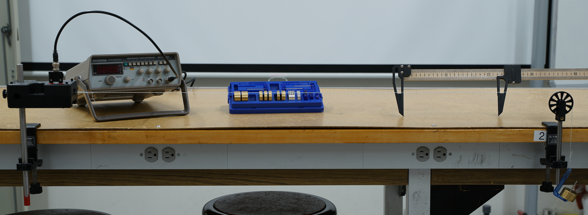

# Oscilloscope Training

:::Intro (Objective)
The goal of this lab is to become familiar with a ubiquitous electronic measurement tool, the oscilloscope. We will use this tool in the upcoming 3L labs and in many of the 4L labs.
:::

# Introduction to the Oscilloscope
An oscilloscope takes an electronic signal, typically a time varying voltage, and visually displays the signal on a screen. It does this by periodically sampling the signal measuring what the voltage is at a particular moment in time, creating a coordinate pair $(v_i, t_i)$. Then it plots this point on screen and the cycle repeats.

To understand the utility of an oscilloscope consider a simple battery. It provides a constant voltage, or direct current (DC), across its terminals which could easily be measured with a voltmeter. If we were to look at the voltage signal from the battery on the oscilloscope we would see a flat line. 

Your headphones, on the other hand, are driven by a time-varying voltage signal. If we used a voltmeter to measure this signal we would only be able to see the time-average voltage. This would provide very limited information about the signal. If instead we used the oscilloscope to look at the signal we could get more information about the signal. We could see what frequencies are being played, the peak to peak voltage, the amount of noise in the signal, etc.

:::Exercise
1. You'd like to know the voltage of a DC source. Do you use a voltmeter or oscilloscope?

2. You'd like to measure the frequency of a standard wall socket. Do you use a voltmeter or oscilloscope?
:::

## Oscilloscope Controls

At first glance an oscilloscope can look a bit overwhelming. There are many buttons to touch and many knobs to turn. We can break down the controls into multiple bite size chunks so that it is a bit easier to understand. On thing to notice is that the oscilloscope you will be using is capable of looking at two signals at the same time. These signals are labeled CH1 and CH2.

:::Figure (oscilloscopeDiagram)

:::

### Screen
First we will point out some things about the screen. Notice there is a 10x8 grid on the screen. This grid is always present and is important for making measurements. One spacing on this grid is called a division or div for short. 

At the bottom of the screen you can see some information being displayed about scale on the screen. In this photo CH1 has a vertical scale of $5 \text{ V/div}$ and CH2 has a scale of $2 \text{ V/div}$. Another way to say that is there is a difference of $5 \text{ V/div}\times 8 \text{ div}=40 \text{ V}$ from the top of the screen to the bottom for CH1 and $16 \text{ V}$ for CH2. In the center of the screen you see information about the scale of the horizontal axis. In this picture it is set to $50 \text{ }\mu\text{s/div}$. Another way to say that there is a difference of $50 \text{ }\mu\text{s/div}\times 10 \text{ div}= 500\text{ }\mu\text{s}$ from the left side of the screen to the right side. It is important to note that CH1 and CH2 can have different vertical scales but always share the same horizontal scaling. 

Finally, on the right side of the screen are five sections that change depending on context. These regions tells you what happens when you press the soft buttons.

### Soft Buttons & Variable Knob
Here you can see some buttons known as "soft buttons". These buttons' functionality change depending on context. To know what each of these buttons will do we need to look at the right hand side of the screen.

The variable knob typically allows you to set a value of some parameter you have selected in the right screen menu by rotating it.

### Signal Inputs

Let's start by looking at the CH1 and CH2 inputs. This is where you will connect a [coaxial cable](https://en.wikipedia.org/wiki/Coaxial_cable) with a [BNC connector](https://en.wikipedia.org/wiki/BNC_connector) end. When you connect a cable to one of these ports you and turn on that channel, you will see the signal displayed on the screen.

### Vertical Controls

Next we will discuss the CH1 and CH1 Vertical Controls. Pressing the Yellow or Blue button in the center of the column will turn on and off that channel from being displayed on the screen. 

Turning the small knob at the top of the column will shift the zero position of that channel. This effectively moves the signal up and down on the screen. 

Lastly, turning the large knob on the bottom changes the vertical scaling for each channel independently. For instance, if you wanted to change the vertical scaling of CH1 from $5 \text{ V/div}$ to $2 \text{ V/div}$ you would rotate the large CH1 knob.

### Time Controls

The time control area allows you to adjust the horizontal scaling and positioning. We won't be using the middle button for our labs so we won't worry about it now.

Turning the small knob at the top of the column will shift the zero position of the horizontal axis. This effectively moves the signal left and right on the screen.

Turning the large button on the bottom changes the horizontal scaling for both CH1 and CH2. For instance, if you wanted to change the scaling from $50 \text{ }\mu\text{s/div}$ to $100 \text{ }\mu\text{s/div}$, you would rotate this knob.

### Trigger Controls
The trigger is an important feature for using an oscilloscope. The trigger sets a voltage level and a scenario for when to begin drawing the signal on the screen. For instance, you could set the voltage level of the trigger to $1 \text{ V}$ and then scenario for a positive slope. If the input signal then ever goes from less than $1 \text{ V}$ to greater than $1 \text{ V}$ the scope would begin drawing the signal. However, if the signal were to go from greater than $1 \text{ V}$ to less than $1 \text{ V}$ it would not draw the signal. This is because we did not meet the scenario of a positive slope. 

One bit of jargon to know is that when the scope begins to draw the signal we say that the scope was "triggered".

Additionally there are three main triggering modes: automatic, normal, and single. 

**Automatic** mode will trigger under two conditions. First, if the triggering condition is met, it will trigger. Second, if the scope hasn't been triggered within a set amount of time, it will automatically draw whatever signal it sees on the inputs. This means that the screen is continuously updating no matter what.

**Normal** mode will only ever trigger if the trigger condition is met. It will wait indefinitely to trigger. This means if your triggering condition is never met, the screen will never update. Once it has been triggered the screen will only update the next time the trigger condition is met.

**Single** mode behaves the same as normal mode expect that it will only update once and then it will freeze. So it will only draw the signal once until you reset the trigger.

Turning the small knob at the top of the column allows you to adjust the voltage threshold of the trigger. Turning it will move a small arrow on the right side of teh screen up and down indicating the level of the trigger visually.

The menu button opens a small menu on the right side of the screen that will let you set the triggering scenario as well as adjust some or advanced features. This menu can be interacted with by using the soft buttons and the variable knob.

The single button will switch to single mode triggering.

Finally the force button will force the oscilloscope to trigger when you press it. This means that the screen will update to display whatever is on the channel inputs when you press it.

### Advanced Controls
These buttons bring up new menus on the right side of the screen that can be interacted with using the soft buttons and the variable knob. Most of these buttons we won't be using or will be introduced to you at a later time. In this lab though we will be using "Cursor" button.

**Cursor** button. Pressing this button will display two cursors on the screen and bring up the cursor menu. The cursors are just two lines that run the length of the screen. By pressing on of the soft buttons you can switch between vertical or horizontal cursors. You can select one or the other cursor individually using the soft buttons and then adjust its position using the variable knob. The rest of the cursor menu displays information to you about location and separation of the cursors.

This is useful for when you are trying to measure a peak-to-peak voltage, amplitude, period, or frequency of a signal.

## Waves on a String Model

::: Equation (pulseVelocity)
$$
v = \sqrt{\frac{T}{\mu}}
$$
:::

:::Figure (travelingPulse|l|R)

:::

As a reminder, when you send a pulse down a string, the speed at which the pulse travels depends on the tension in the string, $T$, and the linear density of the string, $\mu$. Specifically the speed at which a wave travels on a string is given by . 

We also know that when we form a standing wave on a string that the speed of the wave can also be determined by the wavelength of the wave, $\lambda$, and the frequency of oscillation, $f$. This equivalent equation is given in .

:::Equation (waveVelocity)
$$
v = f \lambda
$$
:::

Finally, in order to produce a standing wave we must meet the boundary conditions that will form a wave. As you will see our apparatus is one that has a closed boundary at each end. That is to say that the string is fixed on both ends.

Recall that the boundary conditions are that there must an integer multiple of half wavelengths along the length, $L$, of the string.  expresses this mathematically.

:::Equation (boundaryConditions)
$$
L = n\frac{\lambda}{2}
$$
:::

With these things in mind let's discuss the apparatus. 

## Apparatus

You will need a good understanding of the apparatus in order to design your experiment. We will go through the tools your have to make your measurements and adjust the parameters.

:::Figure (fullApparatus)

:::

:::Figure (equipment|m|R)
 String Vibrator. B) Function Generator. C) Mass Kit. D) Calipers. E) Pulley. F) Hanging Mass")
:::

 shows a picture of the full setup and  shows each of the components of the set up. The string is connected on one end to the string vibrator that will oscillate the string up and down at a frequency set by the function generator. The function generator sends an electrical signal that drives string vibrator at the frequency, $f$, you set.

The other end of the string goes over a pulley where we hang a known mass, $m$. This mass allows us to set the tension in the string, $T$. The masses that can be added vary from about $5\text{ g}$ to around $400\text{ g}$. Changing the spacing between between the end of the string vibrator to the pulley allows you to adjust the length, $L$.

Finally there is a set of calipers that can be used to measure the length of the string, $L$, or the wavelength of the standing wave, $\lambda$.

The string that we will be using has a linear density about $2.66\times 10^{-4}\text{ kg}\cdot\text{m}^{-1}$.

Watch the video below for more details about how you can control the experiment.

The summary of the parameters in the setup is in 

::::::::::::Figure (parameterSummary)
:::::::::row

:::::: col
:::Table (|Independent Parameters)
| Name | Symbol |
|------|--------|
|Frequency | $f$ |
|Mass | $m$ |
|Length | $L$|
:::
::::::

:::::: col
:::Table (|Dependent Parameters)

| Name | Symbol |
|------|--------|
|Segments | $n$ |
|Wavelength | $\lambda$ |
:::
::::::
:::::::::

:::::::::row
:::::: col
:::Table (|Constants)

| Name | Symbol |
|------|--------|
|Linear Density | $\mu$ |
:::
::::::
:::::::::
::::::::::::

The independent parameters are the ones that you have direct control over. You can set $f$ with the function generator, you can set $m$ by changing the mass hanging off the end, and you can set $L$ by changing the spacing between the string vibrator and the pulley.

The dependent parameters are the ones that depend on the other parameters. You can't push a button or turn a knob to directly set $\lambda$ or $n$. When you set the independent parameters, $\lambda$ and $n$ will also be set.

### Pre-lab
:::Prelab
**Before coming to lab** you will need to complete  and the exercise inside of it, as well as , ,  , and . This will be checked off by your TA when you get to class. 

:::

## Designing the Experiment

The point of this lab is use the waves on a string apparatus to measure the acceleration due to gravity $g$. In this section you will design an experiment that you will perform in lab.

We will be using the plotting technique again. That is to say, we will plot plot one parameter against another, add a best fit line, and from the slope or intercept parameter get $g$. 

::::::Activity (experimentEquations)
In this activity we will create some equations that you can use to set up your experiment. You will want to write an equation that will have one of the *dependent* parameters equal to an expression of constants and *independent* parameters. We will do this both $\lambda$ and $n$.

First let's determine the tension in the string. Note that a mass is in static equilibrium.

:::Exercise (replaceTension)
Use the fact that the mass is in static equilibrium.

1. What is the equation for the tension in the string?

2. Rewrite  replacing the tension with the equation you determined in part a.
:::

:::Exercise (experimentEq1)
Use your results from  and  and solve for the *dependent* parameter, ($\lambda$). Show your work.
:::

Now imagine that you are performing an experiment. You would want to pick **one** of the *independent* parameters to vary while keeping the other independent parameters constant. Then you would vary the independent parameter and measure the dependent parameter.

:::Exercise 
What two experiments could perform using the equation you came up with in ? i.e. What would you keep constant, what would you vary, and what would you measure?
:::

Now let's use the other dependent parameter, $n$.

:::Exercise
1. Replace the dependent parameter, $\lambda$, from  using  and solve for the dependent parameter, $n$. Show your work.

2. What three experiments could perform using the equation you came up with in part a? i.e. What would you keep constant, what would you vary, and what would you measure? 
:::
::::::

## Procedure

For writing the procedure you will have to pick one the experiments you have designed in .

:::Exercise (experimentChoice)
Pick one of the experiments designed above.
1. What is the independent parameter?
2. What is the dependent parameter?
:::

You will be performing a line of best fit during your experiment. This may require you plot something other than just your independent parameter on your x-axis and your dependent parameter on your y-axis. You may need to perform calculation with your parameter in order to generate a linear equation.

:::Exercise (linearize)
1. What value will you plot on your x-axis?
2. What value will you plot on your y-axis?
3. If you perform a line of best fit, what will be your slope?
4. How will get $g$ from your line of best fit? What's the equation for $g$?
:::

:::Exercise (uncertainty)
What is the equation for the uncertainty in $g$?
:::

:::Exercise (procedure| 10 Points)
Using the experiment you've outlined write procedure for measuring $g$
:::

## Uncertainty from Scales
This far into the course we have only discussed how to determine the uncertainty in by using statistics. While this is typically one of the best options, sometimes we are able to make a single measurement using a graduated or digital scale and estimate the uncertainty from the resolution.

For instance, when using graduated scale, like that of ruler, we say the uncertainty is half of the smallest division on the scale. So if we were to use a standard meter stick that has $1 \text{ mm}$ divisions, we would say that our uncertainty is $\pm 0.5 \text{ mm}$. 

For a digital display, we say the uncertainty is half of the last digit displayed. That is, if we were using an electronic balance to measure the mass of a stone and read $52 \text{ g}$, then we would say our uncertainty is $\pm 0.5 \text{ g}$. Thus we would report the stones mass as $52.0 \pm 0.5 \text{ g}$

# The Experiment
::::::Activity (|Experiment)
1. Follow your procedure and perform your experiment.
2. Do the following exercises.

:::Exercise (|7 Points)
Record notes on what you did, observed, or wondered while performing your experiment in this exercise.
:::

:::Exercise (|4 Points)
Include all of the data tables you made here. Make sure each table is easily identifiable and labeled.
:::

:::Exercise (|8 Points)
Make a plot of your data and add a best fit line. 
:::

:::Exercise
What is the value and uncertainty of each of the independent parameters you kept constant?
:::

:::Exercise (|5 Points)
From your best fit line determine the value of the $g$. Show your work.
:::

:::Exercise (|5 Points)
What is the uncertainty in $g$?
:::
::::::

# Conclusion

::::::Exercise (|11 Points)
1. Based on your results, do you think your experiment is accurately measuring $g$? Why or why not?
2. How would you change the experiment to improve your results?
::::::

:::Summary
Please note: There will be an additional 5 points for neatness. Make sure that your report is well organized and easy to follow.
:::

