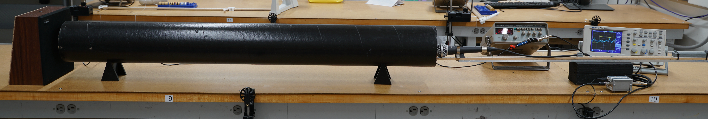
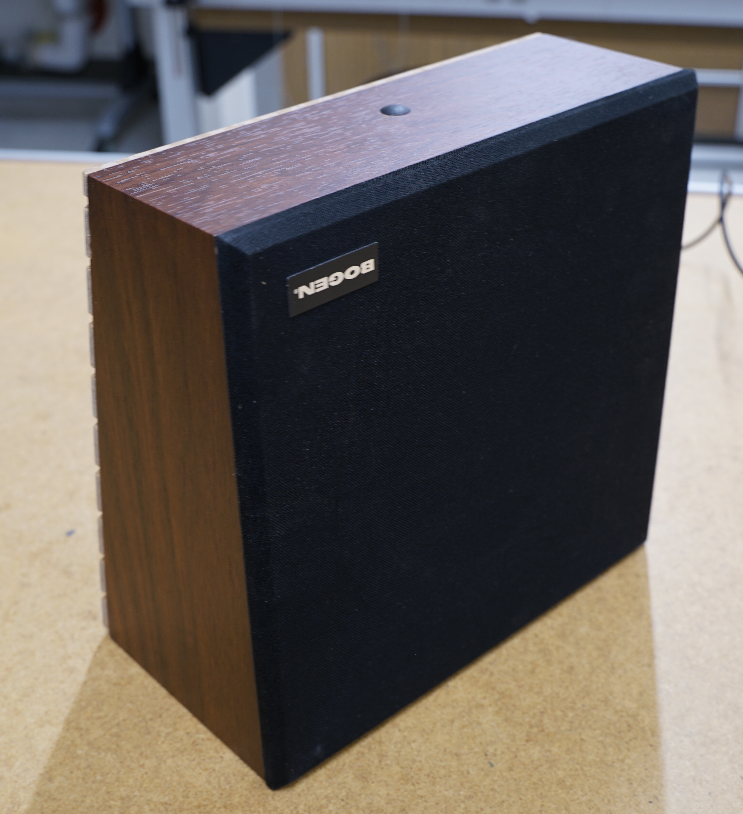
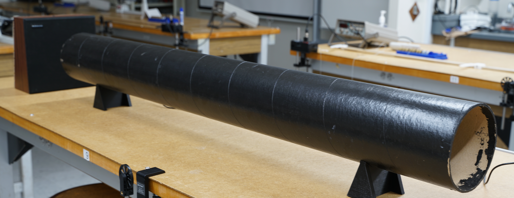
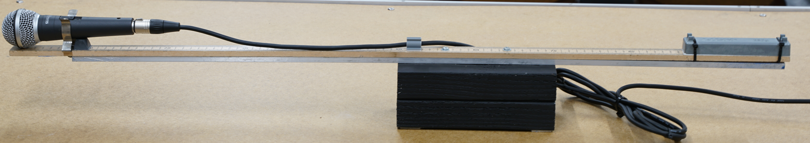
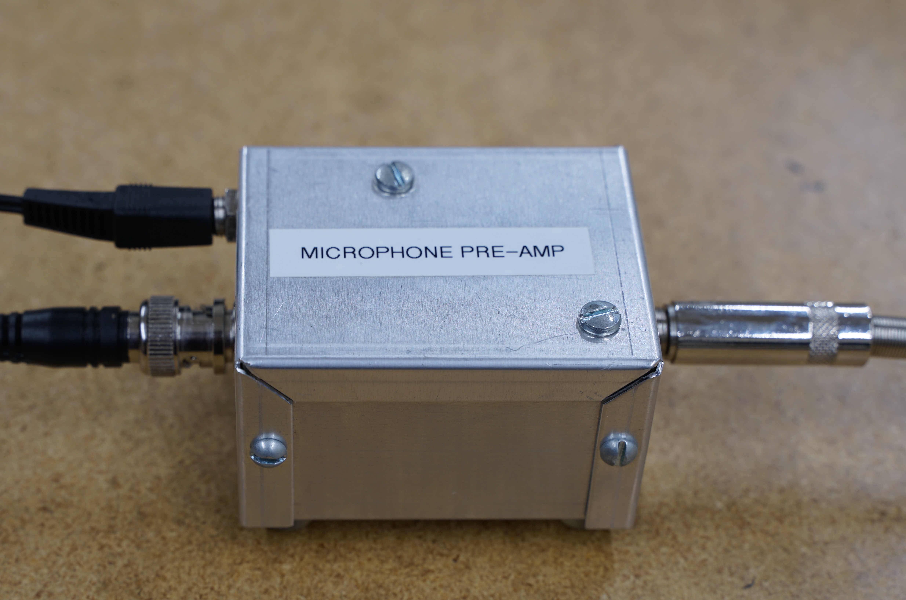
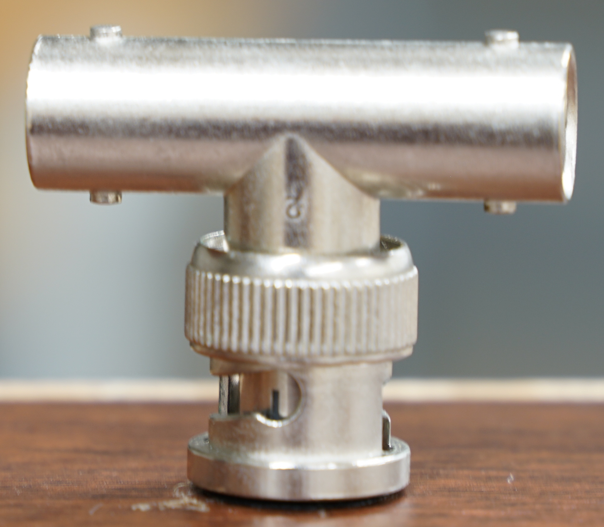
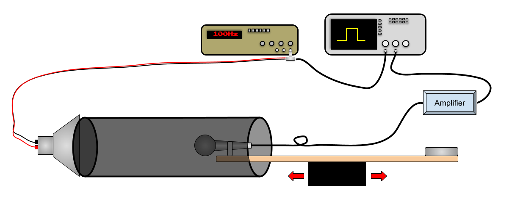

# Speed of Sound

:::Intro (Objective)
- Practice using the oscilloscope to measure the speed of sound in air.
- Develop a model for the speed of sound in air and test it.
:::

# Introduction

## Speed of Sound Model
The speed of sound through a fluid is determined by the Newton-Laplace equation equation below.

:::Equation (speedOfSound)
$$
v=\sqrt{\frac{K}{\rho}}
$$
:::

Where $K$ is the elastic bulk modulus of the fluid and $\rho$ is the density of the gas.

For an ideal gas (**we are assuming air is ideal**), the bulk modulus can calculated with the following equation:

:::Equation (bulkModulus)
$$
K = \gamma p
$$
:::

Where $\gamma$ is the *adiabatic index* (a.k.a the specific heat ratio) of the gas, and $p$ (not to be confused with $\rho$) is the pressure.

Since we are assuming an ideal gas, we can use the ideal gas law determine the pressure.

:::Equation (idealGasLaw)
$$
pV=N k_B T
$$
:::
Where $V$ is the volume of the gas, $N$ is the number of gas molecules, $k_B$ is the Boltzmann constant, and $T$ is the temperature in Kelvin.

Additionally we can determine the density with the following equation:

:::Equation (density)
$$
\rho = \frac{Nm}{V}
$$
:::

Where $V$ and $N$ are the same as before, $m$ is the mass of a single gas molecule.

::::::Activity (model|Building the Model)

:::Exercise (speedSolve)
Using equations , , , and , solve for the speed of sound, $v$, as a function of $\gamma$, $k_B$, $T$, and $m$. Show your work.
:::

Notice now that, as long as the air you are using is not being mixed with other gasses, $\gamma$, $k_B$, and $m$ are all constants. This means that the speed of sound in a gas is only dependent on the temperature, $T$.

That being said, what are the values of those constants? The Boltzmann constant is **exactly** of $k_B=1.380649 \times 10^{-23} \text{J} \cdot \text{K}^{-1}$. In 2019 the definitions of the SI units were redefined [fn] [2019 SI Redefinition](https://en.wikipedia.org/wiki/2019_redefinition_of_the_SI_base_units)[/fn]. This meant that some constants became *exact* with **no uncertainty** in them. The Boltzmann constant was one of them. 

For the other two constants, $\gamma$ and $m$, determining their values might not be exactly straight forward since air is *mixture* of different gasses, mostly $\text{N}_2$ and $\text{O}_2$, with some trace other gasses.

The adiabatic index, $\gamma$ is dependent on the structure of the molecule. Since both $\text{N}_2$ and $\text{O}_2$ are diatomic, they have the same $\gamma$ value of $1.4$. Then for now we can assume that $\gamma=1.4$. 

:::Exercise
What factors might contribute to $\gamma$ not being $1.4$?
:::

For $m$ there needs to be a decision. Do we assume just one gas? Do we perform some sort of calculation to determine $m$? This will be up to you to decide how you want to approach this.

:::Exercise (determineM)
1. What is value of $m$ that you will use in $\text{kg}$?
2. What is your reasoning for using this value of $m$? Use a combination of words and/or math to make your argument.
3. Plug in your three constants into the equation you derived in . What is the new equation? ;;;Make sure you are in the correct units;;;
:::

:::Exercise (assumptions)
What are the assumptions in your model?
:::
::::::

# Apparatus

:::Figure (fullApparatus)

:::

:::::::::Figure (speakerTube|m|R)
::::::row
:::col

:::
::::::

:::::row
:::col

:::
::::::

:::::row
:::col

:::
::::::
:::::::::

We will measure the speed of sound by using the time of flight method. This method basically makes a short burst of sound (like a snap, clap, or pulse) and then times how long it takes for that burst of sound to reach a detector (a microphone) a known distance away.

The apparatus will be comprised of a speaker (.B) connected to a function generator (.A), placed at one end of a large tube (.C). The function generator will play be set to play a square wave to create a sudden pulse that we can easily identify on the oscilloscope. The tube will focus the sound so it does not radiate around the classroom and affect other students' apparatuses. 

Notice in .A on the left side you have a driver (a speaker) that pulses and sends sound waves propagating down the the tube. This is what we will be trying to create. Now we need a detector at the right hand side to receive the pulses.

:::::::::Figure (measurementTools|L)
::::::row
:::col

:::
:::col

:::
::::::
:::::::::

:::::::::Figure (microphone|m|L)
::::::row
:::col

:::
::::::

::::::row
:::col

:::
::::::
:::::::::

Thus, at the other end of the tube we will place a microphone mounted on a counter balancing system (.A). The microphone is connected to an amplifier (.B) that is then connected to the oscilloscope. 

:::Figure (BNCTee|s|R)

:::

You can slide the microphone into the tube to different depths. This allows you to vary the distance between the speaker and the microphone to measure different times of flight.

To know when the pulse was sent we will connect the function generator to the oscilloscope as well. To split the signal coming from the function generator so that it can simultaneously go to the speaker and to the oscilloscope we use a BNC Tee (). 

A diagram of the apparatus and the connections are depicted in .

:::Figure (apparatusDiagram)

:::

## Pre-Lab
:::Prelab
**Before coming to lab** you will need to complete , Exercises 1-4 inside of it, , . This will be checked off by your TA when you get to class. 
:::

:::Exercise (experimentDescription)
For this lab you will need to design you own experiment. It should involve making at least one plot and performing at least one linear fit.

1. Briefly describe the experiment you will perform.
2. What will you be plotting?
3. What is the meaning of the slope of your fit?
4. What is the meaning of the intercept?
:::

:::Exercise (procedure)
Write a procedure for performing the experiment you described above. Some questions in the lab that your procedure should be prepared to answer are the following  and 
:::

# The Experiment

## Frequency

Determine what frequency you will set your function generator to. 

:::Note
Try to keep it on the lower of the frequency range so as not to annoy your classmates.
:::

:::Exercise (frequency)
1. What frequency will you use for your experiment?
2. Describe what you did to determine this.
3. Are there any issues you can identify with setting the frequency too high or too low? (Besides annoying your classmates.)
:::

## Time Delay
The function generator must send the signal to the speaker and to the oscilloscope down a wire. Then the speaker must react and send a pulse of sound down the tube. Then the microphone must react to the sound reaching it and send that signal to an amplifier. Then the amplifier must process the signal and send it to the oscilloscope.

Additionally, is the position of the speaker or the microphone pick up exactly where you think they are? If they are not where you expect, then your distance between them will be different than what you expect.

All of these things might add some delay to your time measurement.

:::Exercise (timeDelay)
How will you handle this time delay?
:::

## Data Collection

:::Exercise
Take notes about what you are doing in this exercise. Describe what you did, any problems you ran into and how you handled it, or anything interesting you noticed while performing your experiment.
:::

:::Exercise
1. Take a picture of your oscilloscope screen while the microphone is picking up a signal and include it here.
2. Describe what you are measuring.
:::

:::Exercise
Include any data tables you made during the course of the lab here.
:::

## Data Analysis

:::Exercise
Include your plot(s) in this exercise.
:::

:::Exercise
1. What is the slope of your line of best fit?
2. What is the intercept?
:::

:::Note
In the lab is a $\text{CO}_2$, temperature, and relative humidity sensor. You can use this to help determine the theoretical speed of sound in the lab.
- The uncertainty in the $\text{CO}_2$ meter is $\pm 75 \text{ppm}$ or $\pm 8\\%$, whichever is higher.
- The uncertainty of the temperature sensor is $\pm 1^{\circ} \text{ F}$.
- The uncertainty of the humidity sensor is $\pm 5\\%$ of the reading.
:::

:::Exercise
1. What is your measured speed of sound in air?
2. How does this compare to the speed of sound predicted by your model?
:::

:::Exercise
If your measurement is in agreement with theory, how would you improve this experiment to increase your precision to be sure? If you have time, try out your ideas.

If your theory does not agree with your model, how might you modify your model to explain the discrepancy? Are there any assumptions you need to drop or modify? If you make these changes to your model how does it affect the discrepancy?
:::

# Conclusion

:::Summary
Please note: There will be an additional 5 points for neatness. Make sure that your report is well organized and easy to follow.
:::

