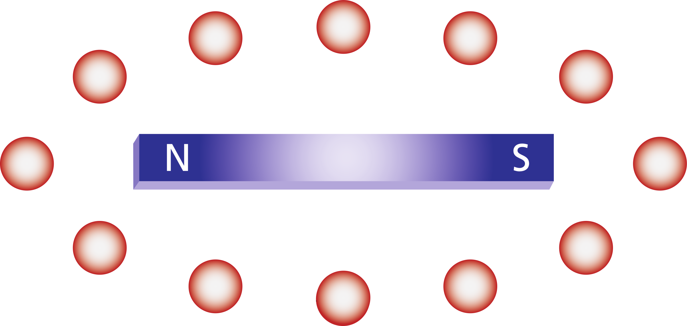
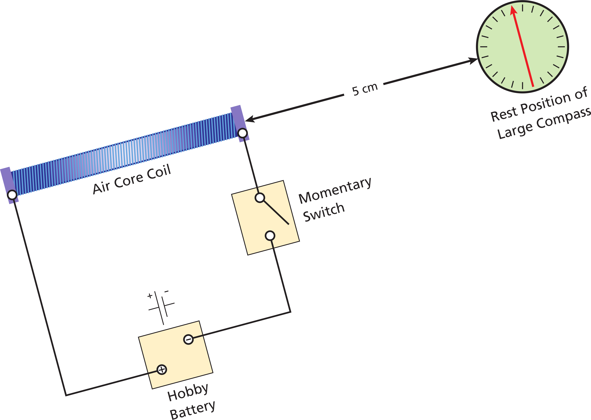
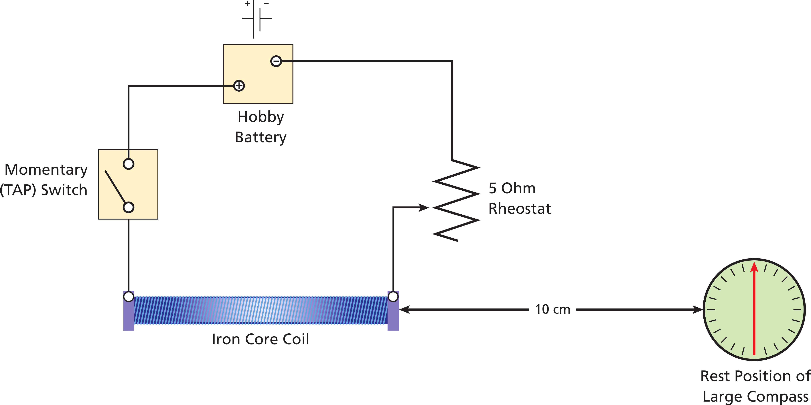
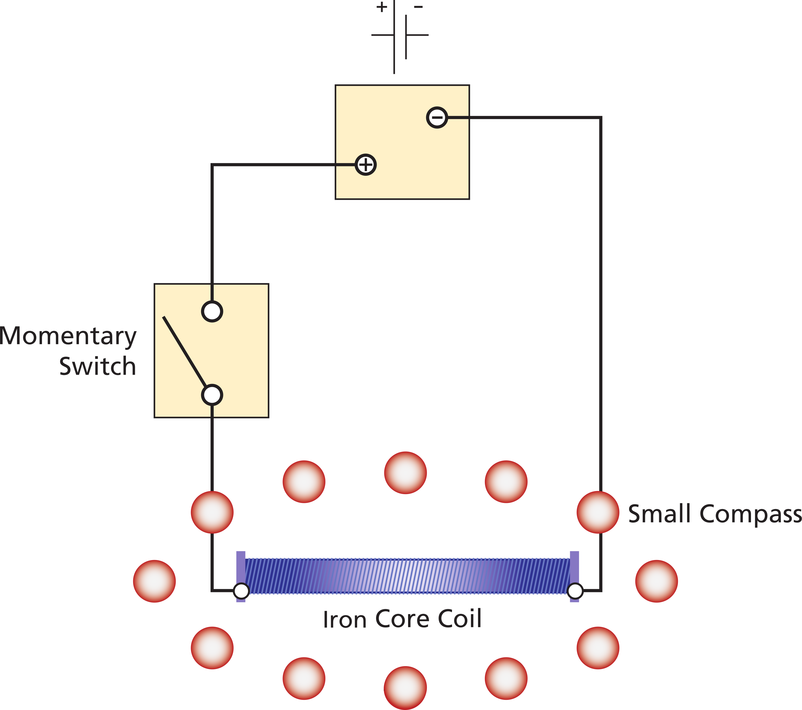
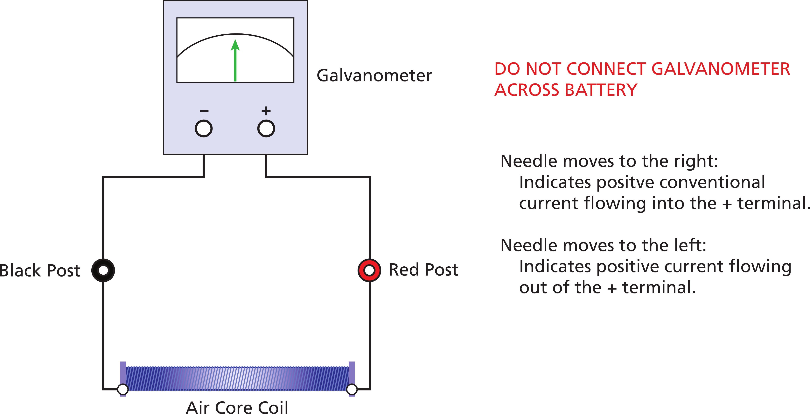
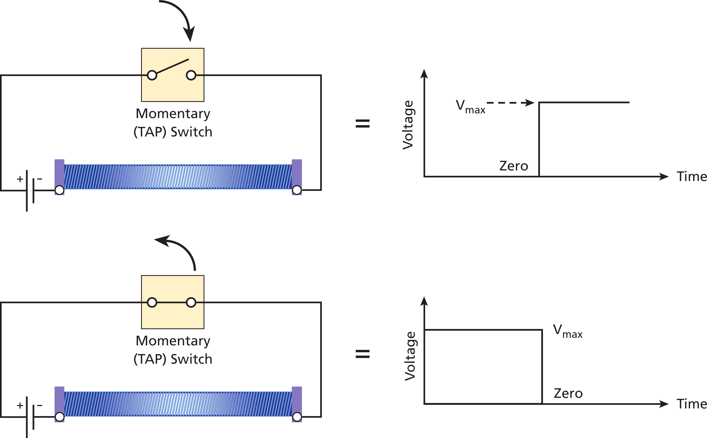
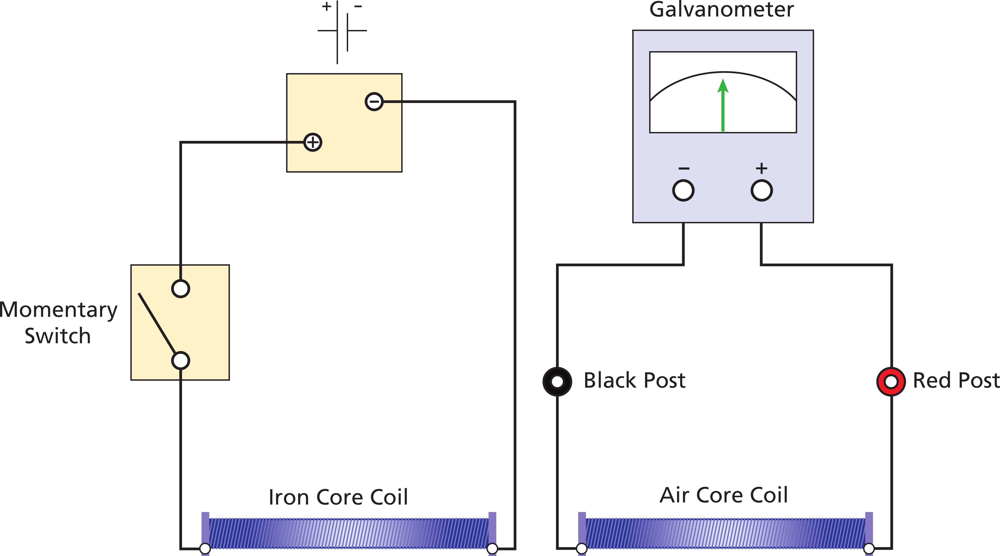

# Magnets and Inductors 

# Gaining Intuition

:::::::::Activity (prem|Permanent Magnet)
1. Lay a blank piece of paper on the table.
2. Distribute the small compasses equally around the paper and note the direction each one points. The north pole of the compass is painted red. Most of them will align themselves with the earth's magnetic field.

::: Note (mag_hints|10)
- The compasses sometimes stick in one orientation because of static friction between the needle and the center pin. Lightly tapping the face of the compass fixes this.
- The compasses may orient themselves in a seemingly random fashion, there are metal fixtures below the table which cause this. Move your paper to a location where you do not observe any strong effects.
:::

3. Place the provided permanent magnet in the middle of the paper. Trace the outline of the magnet. For each compass, draw a small arrow in the direction of its north pole.

:::Figure (bar-mag)

:::

4. To double the number of data points, redistribute the compasses about the paper. They should be equally distributed and should not be at any of the original locations. Again draw an arrow in the direction of the compass.

:::::::::

:::::::::Activity (air_core|Air Core Electromagnet)
1. Get a new sheet of paper. Place coil A in the center and again distribute the compasses about the page. Wire the coil to the switch and battery as shown in Figure 
:::Figure (bar-mag)

:::
2. Watch the compasses as you depress the switch. The effect is dramatic. The compasses will align themselves with the new field generated by the coil.
3. With the switch still depressed, draw an arrow for each compass. It is <b>not</b> necessary to move them to different locations now.
4. DO NOT change the paper. Reverse the leads running to the coil. This will reverse the direction that the current flows.
5. Depress the current switch. With the compasses in the same position, this time draw dashed arrows indicating the direction of the field.

:::Exercise (reverse_current|1 Point)
What happens when you reverse the current?
:::

::: Note (mag_hints|10)
Magnetic fields are vectors, meaning that every point in space has a direction associated with it. This direction is defined exactly as we've demonstrated above, it is the direction the north pole of a compass needle will point under the influence of the field.
:::

:::::::::

# Magnetic Field Strength

:::::::::Activity (comp_em|Compass on Axis of Electromagnet)
1. Wire the coil as shown in . Use the air core; that is, do not use the iron rod. Put the larger compass on the axis of the coil, about 5$\text{cm}$ away.
::: Note (align_earth|10)
The earth's magnetic field will orient the compass needle. *Align the entire apparatus, both the coil and the compass, such that the compass needle is nearly perpendicular to the axis of the coil.*
:::

:::Figure (ac-comp)

:::

2. Press the current switch.

:::Exercise (deflect_5|1 Point)
How many degrees does the compass needle deflect?
:::

3. Move the coil to a distance of 10$\text{cm}$.

:::Exercise (deflect_10|1 Point)
How many degrees does the compass needle deflect? How does this compare to the measurement made at a distance of 5$\text{cm}$?
:::

4. Continue to move the coil away from the compass. Stop when the needle barely deflects.

:::Exercise (deflect_stop|1 Point)
At what distance is the needle's deflection just barely noticeable?
:::

5. Leave the compass at the same distance. Put the iron core into the space between the windings. Again press the current switch

:::Exercise (iron_core|1 Point)
What do you observe?
:::

::: Note (ferromagnets|10)
Ferromagnetic materials greatly increase the strength of a magnetic field. This is due to the atomic and molecular structures of the material lining up with the externally applied field.
:::

6. A rheostat is a variable resistance device. By varying the resistance we can vary the amount of current flowing through the coil. Rewire the setup to include the rheostat, this is shown in 
. Set the compass at a distance of 10$\text{cm}$. Keep the iron core in the winding.

:::Figure (rheostat)

:::

7. Set the rheostat to zero resistance. The zero position is when no current is required to flow through the resistive winding, that is current bypasses the resistor. Increasing the distance which current must travel through this material increases the overall resistance. Press the current switch.

:::Exercise (rheostat_no_resist|1 Point)
How many degrees does the compass needle deflect?
:::

8. Move the rheostat head to the 1/4 position. This increases the resistance. Press the current switch again.

:::Exercise (rheostat_14|1 Point)
How many degrees does the compass needle deflect?
:::

9. Repeat step 7 for the 1/2 and 3/4 rheostat positions.

:::Exercise (rheostat_12|1 Point)
How many degrees does the compass needle deflect for $1/2$?
:::

:::Exercise (rheostat_34|1 Point)
How many degrees does the compass needle deflect for $3/4$?
:::

::: Note (resistance|10)
Moving charges give rise to magnetic fields. More current means more moving charges. More moving charges means a stronger magnetic field. By placing a resistance in series we limit the current and thus reduce the magnetic field.
:::

:::::::::

# Magnetization

:::::::::Activity (mag_iron|Magnetization of iron core)
1. Remove the rheostat from the circuit. Leave the iron rod in the coil. Place a few of the smaller compasses around the coil. Note the orientation of the iron rod within the coil.

:::Figure (basic_electromagnet)

:::

2. Depress the current switch for about 3 seconds. Release it. You will notice that the iron core electromagnet continues to affect the direction of the compasses even with no current flowing. Carefully note the rod's direction within the coil (the rods are color coded), then remove it. Move it close to the individual compasses.

:::Exercise (is_iron_mag|2 Points)
Is the iron core a magnet? Justify your reasoning.
:::

3. Pay close attention to the end which is the "north" on the iron rod. Insert the rod back into the coil *in the opposite direction*. Hit the switch again. Remove the iron rod and observe its effect on the compasses.

:::Exercise (pole_flip|2 Points)
Has the north pole of the magnetized rod changed? How do you know?
:::

4. If the above observations are not clear to you, repeat the procedure paying very close attention to the orientation of the iron rod.

::: Note (ferromagnets_atomic|10)
In some ferromagnetic materials the atomic and molecular structures remain aligned after the external field has been removed. As a result the material demonstrates magnetic properties.
:::

:::::::::

# Magnetic Flux and Faraday's Law

::::::::::::Activity (mag_flux1|Intuition for Magnetic Flux)

Galvanometers are sensitive *current* meters. The terminals are hooked to a small coil of wire enclosed within a permanent magnet; the coil is mechanically linked to the readout needle. Current flowing through it causes a magnetic field which in turn creates a torque on the needle. More current causes a greater field and thus more deflection of the needle.

1. Wire the circuit shown in .

:::Figure (lenzs-law)

:::

2. Bring the north pole of the permanent magnet close to the end of the coil and note the motion of the galvanometer needle. Experiment with different approach and recession speeds, note the relationship between the speed and the needle's deflection.

:::Exercise (direction_defelct|2 Points)
What way does the needle deflect when you bring it close to the rod? What way does it deflect when you pull it away?
:::

:::Exercise (speed_deflect|1 Point)
What is the relationship between the magnet's approach speed and the amount of deflection in the needle?
:::

## Flux
- Magnetic flux is a measure of the amount of magnetic field permeating an area.
- For a uniform magnetic field perpendicular to a surface, flux is defined as the product of the magnetic field strength and the area of the surface.
- For a given area, a greater magnetic field strength yields a greater flux. Lesser field strength yields lesser flux.
- For a given magnetic field strength, a greater area yields a greater flux. Lesser area yields lesser flux.

## Faraday's Law
- Consider an area bounded by a loop of wire. If the amount of flux through the area is changing, then a voltage will be induced in the loop. This, in turn, gives rise to a current. Recall Ohm's law, Voltage = Current times Resistance. This is what you've just observed.

## Lenz's Law
- Lenz's Law states that magnetic fields always fight change. If the magnetic flux is increasing, a negative magnetic field will be induced in an attempt to fight the change. An induced current is associated with the induced field &mdash it is in the direction predicted by the right hand rule.

::: Note (right_hand_rule|10)
The right hand rule holds that when your right thumb is aligned with the direction of current flow, your fingers will wrap in the direction of the magnetic flux. See 
:::

:::::::::Figure (rhr|c|Row)
::::::row
:::col
 $\textbf{F}$ = $q$ $\textbf{v} \times B$. Your pointer goes in the direction of $\textbf{v}$, middle finger in the direction of $\textbf{B}$. Your thumb is in the direction of $\textbf{F}$.")
:::
:::col
 For a wire, when your thumb points in the direction of positive current flow, your fingers wrap in the direction of the magnetic field.")
:::
:::col
 For a coil, when your fingers wrap in the direction of positive current flow (look at the windings to determine this), your thumb points in the direction of the magnetic field.")
:::
::::::
:::::::::

:::Exercise (field_flux|2 Points)
Magnetic field strength decreases as you get farther from the poles. Does the flux through the face of the coil change as you move the magnet? Explain your reasoning. Note: the face of the coil is the circular area of one of the two openings of the coil.
:::

:::Exercise (flux_deflect|2 Points)
Why does the needle deflect? Is the deflection in accordance with Lenz's Law? Justify your answer in terms of Lenz's Law and your above answers.
:::

::::::::::::

:::::::::Activity (mag_flux2|Further Exploration of Magnetic Flux)
1. Reverse the leads to the coil and repeat the experiment in .

:::Exercise (flux_rev_obs|1 Point)
Describe what you've observed. Comment on the direction of deflection and the relative amount of deflection.
:::

2. Return the leads to their original position. Repeat step 2 using the south pole of the magnet.

:::Exercise (south_pole|1 Point)
What is different when you use the south pole?
:::

:::Exercise (south_pole_lenzs|1 Point)
How does Lenz's Law explain this phenomenon?
:::

3. Insert the core. Bring the north pole of the magnet towards the coil and again goof around with various approach and recession speeds.

:::Exercise (relative_deflection|1 Point)
What can be said about the amount of deflection? What phenomenon that you've already observed can help explain this?
:::

:::::::::

# Inductive Coupling

:::::::::Activity (inductive_coupling|Circuit for Inductive Coupling)

:::Figure (inductive1)

:::

1. Wire the circuit shown in . Note that the two coils are not touching. Coil 1 is hooked to the battery, coil 2 is hooked the the galvanometer. Position the compass to one side of coil 2. This will serve as a magnetic field indicator for cases where the galvanometer is not sensitive enough.

:::Figure (inductive2)

:::

2. The switch provides a step function of voltage (and thus current) to the first coil. This sets up a magnetic field in the first coil. Depress the switch and note the movement of the galvanometer's needle. Release the switch, again noting the needle's movement.

::: Note (galvometer|10)
Depending on the battery's condition it may be hard to observe this first case. This is okay. Watch the compass as you flip the switch. If it moved, then you've successfully set up a magnetic field. The galvanometer just wasn't sensitive enough to make a reading.
:::

3. Insert the iron rod into the first coil. Again depress the switch, note the deflection. Release the switch and note the deflection.

:::Exercise (galvometer_deflection|2 Points)
What causes the deflection of the galvanometer meter in the second coil? Specifically, how can current in the first coil cause current in the second coil when the two circuits are *not connected*? ;;;Hint: Think about the patterns you saw in the first section and what you've read about Faraday's Law.;;;
:::

:::Exercise (more_deflection|1 Point)
Explain why this case experienced more deflection than the last.
:::

:::Exercise (switch_release|1 Point)
Explain the results that you observe when you release the switch. When the current is turned on, the second coil is reacting to a new magnetic field. What is happening when the current is cut off? Again, think about this in terms of Faraday's Law.
:::

4. Insert an additional iron rod into the second coil. The rods should *not* be touching. Space them approximately 1$\text{cm}$ apart. Again depress the switch, note the deflection. Release the switch and note the deflection.

:::Exercise (more_deflect|1 Point)
Explain why this case experienced more deflection than the last.
:::

5. Now slide the two rods together such that there is a common iron core between the two coils. Again depress the switch, note the deflection. Release the switch and note the deflection.

:::Exercise (more_deflect2|1 Point)
Explain why this case experienced more deflection than the last.
:::

6. Positive current flows from the positive (red) battery terminal. Tracing this with your right hand you should be able to figure out the direction of magnetic flux in the first coil.

:::Exercise (coupled_current|2 Points)
What direction will current flow in the second coil when the first coil generates an increasing flux? Assume the magnetic field points into the second coil. What direction will current flow when this flux is decreasing?
:::

:::Exercise (sketch_laws|3 Points)
Assuming that the galvanometer expects current to flow in through the positive terminal, were your experimental results consistent with the last two questions? Draw pictures to illustrate your thinking.
:::