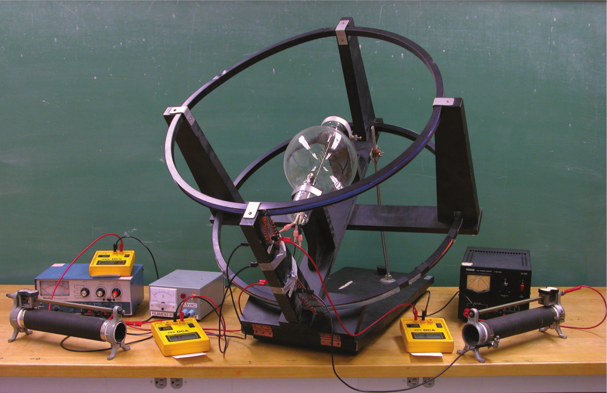
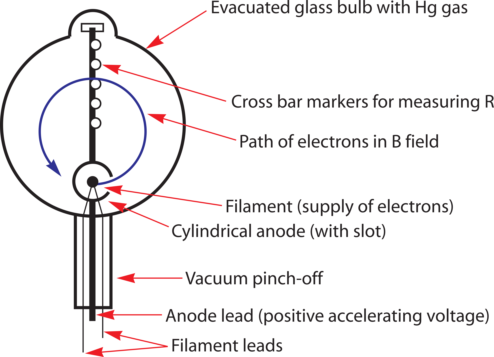
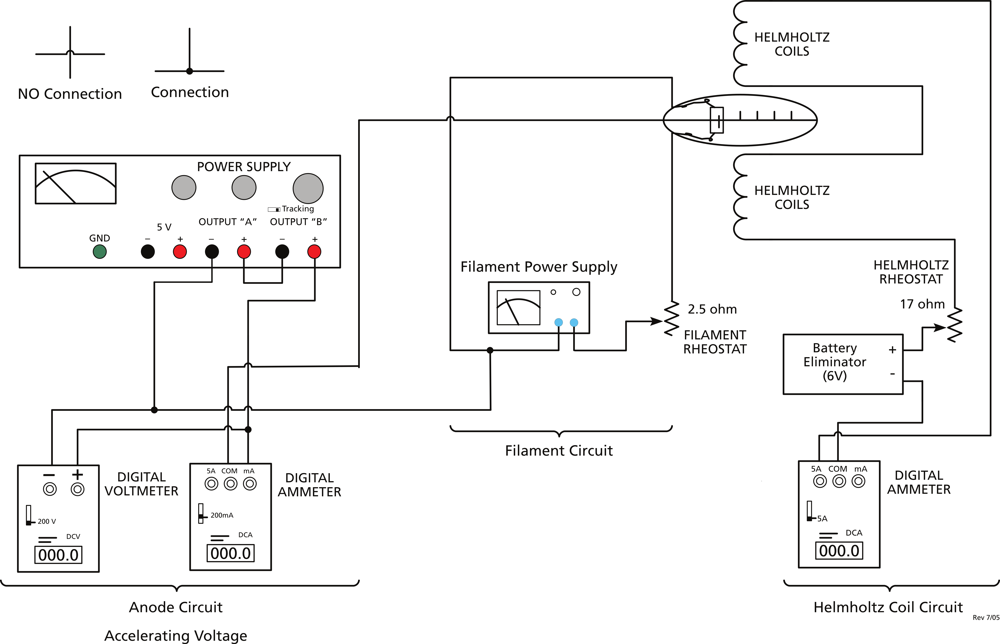

# Charge to Mass Ratio of the Electron

# Gaining Intuition

:::Figure (vac-tube)

:::

Elementary particle physics has as its goal to know the properties of the many atomic and subatomic particles (mesons, quarks, lambda particles, etc) and to understand their place in nature. The first elementary particle discovered was the electron and the first property measured was the charge to mass ratio, e/m, determined by J. J. Thompson in 1897. Many particles once thought to be elementary, such as the proton, are now known to be composed of other particles such as quarks, but the electron has not lost its status as a true elementary particle. In fact, as far as we know it has mass, charge (also spin angular momentum and a magnetic dipole moment), but no size.

The experimental method you will use to measure e/m for the electron is designed after the experiment of Bainbridge. The apparatus consists of a large vacuum tube supported at the center of a pair of Helmholtz coils. An electron gun, composed of a filament parallel to the axis of the coils and surrounded by a coaxial anode containing a single slit produces a narrow beam of electrons whose paths are made visible by a trace amount of mercury vapor in the tube. A diagram of the vacuum tube-electron gun is shown in .

:::Figure (tube-schematic)

:::

The apparatus works as follows. The filament is heated by running an electric current through it (just as the filament in a light bulb is heated). When the filament is “red hot”, electrons will evaporate from the filament material (just as water molecules will evaporate from the surface of a kettle of water when it is heated). The evaporated electrons will form a negatively charged “cloud” around the filament. This process of electron emission from a hot metal surface is called thermionic emission.

To create a beam of electrons, the anode (or metal cap) is maintained at a potential of about +20V to +40V with respect to  the filament (this is the so-called “accelerating potential” written as Vacc). The electrons in cloud around the filament are attracted by the positive potential and are accelerated toward the metal cap. Some electrons escape from the cap into the  field free space of the vacuum tube by passing through the narrow slit in the cap thereby forming a thin ribbon or beam of electrons.  Note that the low pressure (vacuum) is essential here. At atmospheric pressure, an electron escaping from the filament would travel only about 10-4 cm before colliding with an air (or mercury) molecule. Forming a long “beam” of electrons would be impossible under such circumstances. At lower pressures there are fewer air molecules per unit volume and the electrons can travel farther, and at 10-5 atmospheres electrons can travel about 8 to 10 cm before hitting a mercury molecule.

Electrons moving in such a low-pressure mercury environment are made “visible.” When an electron strikes a mercury atom, if it has enough kinetic energy (10.4 electron volts), one of the mercury’s electrons will be knocked off. A nearby electron soon takes its place, and the excess energy is given off as blue (primarily) light during the recombination . If the pressure were too low there would be too few mercury atoms to emit much light and the beam would be difficult to see; at about 10-5 atmospheres, however, there is still enough mercury in the glass bulb to make the beam of electrons clearly visible in a dark room. One sees a bluish glow from the struck mercury molecules.

Once the electron leaves the anode through the slit, all of its energy will be kinetic and this energy can be computed from the expression

:::Equation (energy)
$$
\frac{1}{2}mv^2 = eV
$$
:::

where $m$ is the electron mass, $e$ is the charge of the electron, $V$ is the accelerating voltage, and $v$ is the velocity of the electron.

:::Exercise (equation|1 Point)
What is the relevance of ? What physical device provides $V$ as described in this equation?
:::

With no current flowing in the Helmholtz coils and in the absence of any other sources of electric or magnetic fields, the path of these electrons is a straight line. If a current is caused to flow in the Helmholtz coils, a magnetic field will be created in the region between the coils where the vacuum tube is located. If the electron beam exiting from the slit in the anode is oriented so that the path of the electrons is perpendicular to the magnetic field produced by the Helmholtz coils, then the electrons will feel a force perpendicular to their direction of travel of magnitude

:::Equation (forces)
$$
F = evB
$$
:::

where $e$ is the charge of the electron, $v$ is its velocity, and $B$ is the magnetic field strength.

:::Exercise (mag_field|1 Point)
A charge of $-2.6 \times 10^{-10} \text{C}$ moves at $10,000 \text{m/s}$ in the earth's magnetic field of $32,000 \text{nT}$ (nano Teslas, $\text{n} = 10^{-9}$). What amount of force does it experience?
:::

Since the force is always perpendicular to the direction of travel of the electrons, the path followed by the electrons will be circular. The force on a particle undergoing uniform circular motion can also be expressed as 

:::Equation (circ_motion)
$$
F = \frac{m v^2}{R}
$$
:::

where $m$ and $v$ are defined as in  and  and $R$ is the radius of curvature of the circular path. Substituting this expression for the force into  and solving for $v^2$ yields

:::Equation (v_sq)
$$
v^2 \frac{e^2 B^2 R^2}{m^2}
$$
:::

Substituting this expression for $v^2$ into  and solving for $e/m$ yields

:::Equation (em_exp)
$$
\frac{e}{m} = \frac{2V}{B^2 R^2}
$$
:::

$V$ can be read directly from a multimeter attached to the anode circuitry.

:::Exercise (derivation|1 Point)
Clearly demonstrate the derivation of . The general method is described in the text, you must show it explicitly.
:::

The value of $B$ (in Tesla) for a set of Helmholtz coils can be computed from the expression

:::Equation (B_coil)
$$
B = \frac{8 \mu_0 N I}{\sqrt{125}a}
$$
:::

where $N$ is the number of turns in the coils, $I$ is the current flowing in the coils, $a$ is the radius of the coils, and $\mu_0$ is the permeability of free space, $4 \pi \times 10^{-7} \text{T} \cdot \text{m/A}$.

In the lab apparatus, $N = 72$, $a$ can be measured with meter stick, and $I$ can be measured via an ammeter attached to the Helmholtz coil circuitry. As can be seen from , the strength of the magnetic field can be varied by changing the current in the Helmholtz coils. The distances from the filament to the posts is listed on each of the apparatus. By varying the current in the Helmholtz coils, the path of the electrons can be adjusted to pass directly through one of the posts. In this way, we know the radius of curvature of the path. Since each of the quantities on the right side of  can be readily measured using the apparatus described above,  is the equation you will use to calculate an experimental value for $e/m$ .

In summary, the experimental method for measuring e/m for the electron is as follows. You will create an electron beam by passing a current through the filaments of the electron gun and adjusting the accelerating voltage on the anode to a known value. With the plane in which the electrons are moving perpendicular to the direction of the field of the Helmholtz coils, you will increase the current flowing in the coils until the resultant B field is strong enough to bend the beam of electrons into a circular path which passes through a given post in the vacuum tube. V and I can be measured from multimeters hooked into the circuitry of the apparatus, B can be calculated from I with the use of equation (6) and R can be computed from the distance from the filament to the given post as listed on the apparatus. Equation (5) can then be used to compute a value for e/m.

<i><b> The above portion of this lab was written and reprinted with permission by John Largent, Dartmouth College (Fall 2003). </b></i> 

# Measuring the Charge to Mass ratio of the Electron

:::Figure (diagram)

:::

:::Exercise (filament|1 Point)
What is filament used for in this apparatus? Why is there a rheostat in the circuit, and why must it be at full resistance when you begin?
:::

:::Exercise (acc_volt|1 Point)
What is accelerating voltage used for in this apparatus? What piece of equipment tells you the voltage value? What piece of equipment tells you the anode current?
:::

:::Exercise (elec_leave|1 Point)
What happens to the electrons that leave the filament? Where do they go? How do they get there?
:::

:::Exercise (ve_beam|1 Point)
Explain how you could compute the velocity of the electrons in the beam.
:::

:::Exercise (why_helm|1 Point)
What is the Helmholtz coil for?
:::

:::::::::Activity (fil_an|Filament and Anode Circuits)
1. Locate the components of the filament circuit. It consists of a power supply with an Adjust-A-Volt control connected to the tube apparatus.

::: Note (adjust-a-volt|10)
Set Adjust-A-Volt knob to zero, full counter clockwise.
:::

2. Turn the gray power supply on and look at the built-in meter. Turn the Adjust-A-Volt knob until it reads $1 - 1.5 \text{amps}$. If it is any more than this, immediately turn it off and ask your TA for assistance.
3. Turn your attention to the anode circuit. This equipment provides the accelerating voltage that forms the electron beam. Essentially this is a small particle (electron) accelerator. Turn on the DC Voltmeter (DCV). Set the range to 200 V. This meter measures the accelerating voltage that the electrons in the beam experience.
4. Set the coarse and fine current controls to fully clockwise. Do not readjust the current controls for the rest of the experiment.
5. Check to see that the anode power supply is in tracking mode. Now, using the left voltage control set the voltage to be between $20$ and $25\text{V}$ as read on the yellow voltmeter. Increase the current through the tube to about $3.0$ $\text{amps}$ by turning the Adjust-A-Volt knob clockwise (to the right). Note that the yellow voltmeter measures the sum of the tracking power supply's voltages.

::: Note (adjust-a-volt|10)
You will not see the beam yet! However, if you look into the vertical slot, you will see a glowing red light. This is the filament being heated.
:::

6. To form the beam, you need to increase the filament current. Slowly increase the Adjust-A-Volt knob. You should do this over the course of approximately $40$ $\text{seconds}$. Around $4$ $\text{amps}$ you should begin to see the beam form. You may need to have the room lights off. Use the student desk lamp as needed.

::: Warning (warning|10)
Do not exceed 4.5 amps!!!

Use the <i><b> minimum </b></i> amount of current possible to form the beam. 0.5 amps is a significant amount of current and greatly decreases the life of the tube.

At any point that you're not using the tube to make measurements you should bring the filament current back down.

DO NOT RUN THE TUBE AT THE OPERATING CURRENT WHEN YOU ARE NOT COLLECTING DATA. RETURN THE TUBE TO IDLE CURRENT (APPROXIMATELY 1 - 1.5 AMPS) UNTIL YOU ARE READY TO BEGIN COLLECTING DATA.
:::

:::::::::

:::::::::Activity (helm|Helmholtz Coil)
1. With the Helmholtz coil power supply off, set the coarse and find <i>voltage</i> controls on it to zero, full counter-clockwise.
2. Set the coarse and fine <i>current</i> controls of the Helmholtz coil power supply fully clockwise. Do not re-adjust the current controls for the rest of the experiment.
3. You can now turn on the Helmholtz coil power supply. Slowly increase the voltage of the Helmholtz coil power supply.
4. You should see that the magnetic field causes the electron beam to deflect. With enough deflection, it will move in a circular path. The amount of current passing through the coil is read on the built-in ammeter of the coil power supply.
5. The five posts within the tube have known radii. Using the equations above, the Anode voltage, and the Helmholtz current, we can determine the ratio of an electron's charge to its mass. With the anode voltage still at $25\text{V}$, adjust the Helmholtz current to hit each of the five posts. Record the current for each radius.

   :::Table (droptable| Processed Data)
     | Post | radius ($\text{m}$) | 
   |---------------------|---------------------------|
   | 1                | 0.032               
   | 2                | 0.039      
   | 3                | 0.045      
   | 4                | 0.052      
   | 5                | 0.057              
   ::: 

:::Exercise (tabulate|3 Points)
1. For each data point, tabulate the Helmholtz coil current and accelerating voltage (the accelerating voltage is fixed for these first five measurements).

2. Compute the $B$ field of the coil and the velocity of the electron in each case.

3. Compute the ratio of $e/m$ in each case.
:::

6. Repeat the above five measurements using anode voltages of $30\text{V}$ and $35\text{V}$. You will have 15 measurements in total. <b>Do the analysis above (step a, b, and c in ) for all data points </b>. Again, if at any point you're not using the tube to make measurements you should bring the filament down to the idle current.

:::Exercise (include tables|1 Point)
Make sure to include properly formatted data table(s) that include all the relevant quantities (the Helmholtz coil current, accelerating voltage, $B$ field of the coil, velocity of the electron, and the ratio of $e/m$) for all 15 measurements.
:::

:::Exercise (avg|1 Point)
What is the average value of $e/m$?
:::

:::::::::