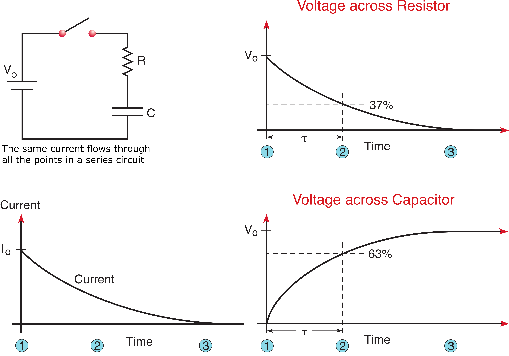
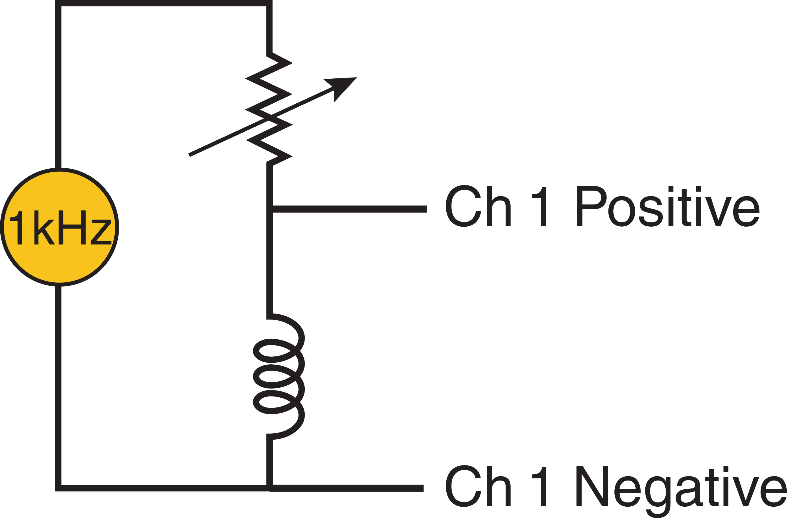
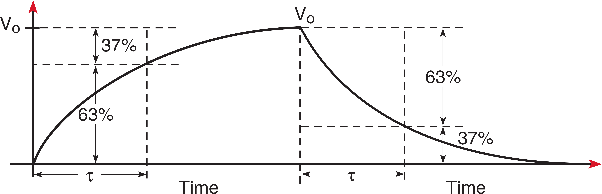
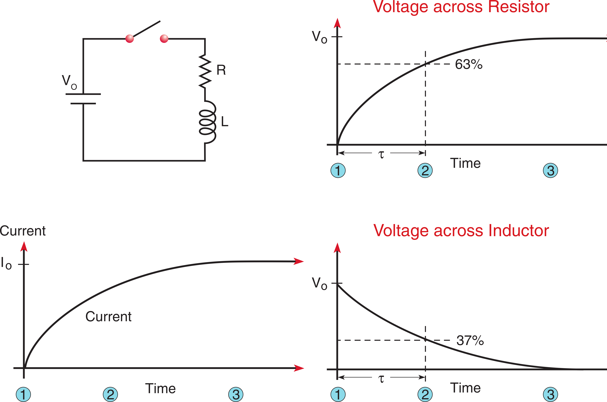

# Time Constants, Inductors, and Capacitors

### Introduction: Time varying currents and voltages

Alternating current and voltage plays a large role in our daily lives. The standard US wall socket provides a sinusoidally varying voltage which oscillates 60 times per second. Electronic communication devices - cellular telephones, radio, modem and broadband - all employ some form of time varying signals to represent information.

Additionally, the analysis used to understand alternating currents and voltages frequently appears in the analysis of other physical systems. Learning this material forms a basis by which you can approach acoustics, vibrations, electro-magnetism, seismology and a number of other disciplines.

# Part 1: Sinusoidal Waves

:::::::::Activity (sinfunc|Sine waves in the function generator)
1. The most basic form of time varying oscillation is the sine or cosine wave. Set your function generator to “Sine” with a frequency multiplier of $1000$. Set the frequency to $1.5$ $\text{kHz}$. Using the provided BNC cable rout the function generator to channel 1 of the oscilloscope and adjust the time and amplitude reading until you can clearly see a few cycles of the wave.

Measure the time needed for one complete cycle of the wave. This is called one period of the wave and is denoted by the upper case $T$.

:::Equation (fp)
$$
\text{Frequency} = \frac{1}{\text{Period}} = \frac{1}{T}
$$
:::

2. The above equation () relates the frequency to the period. Measure the period of this wave on the scope, then compute the frequency.

:::Exercise (pd|1 Point)
What is the percent difference between this frequency value with respect to the value read from the function generator?
:::

3. Varying the frequency makes the alternations happen either more quickly or more slowly. Keep the oscilloscope at the same settings and lower the frequency to $1.2$ $\text{kHz}.

:::Exercise (Tw|1 Point)
What is the period of the wave? What is the corresponding frequency as calculated from the measured period?
:::

4. Varying the amplitude makes the alternations either larger or smaller.

:::Exercise (ppv|1 Point)
What is the peak to peak voltage of the sine wave currently on your scope?
:::

Varying the phase moves the wave forwards or backwards in time while maintaining the frequency and amplitude. It can be thought of as a time offset, however it is usually expressed in degrees or radians. A given time offset represents a different phase offset for sine waves of different frequencies. A positive phase moves the wave to the left, we say that the waveform leads its original position. A negative phase moves it to the right, the waveform now lags its original position.

:::::::::

:::::::::Activity (sinmath|Mathematical Description of Sine Waves)
Frequency, Amplitude, and Phase are succinctly described in the sine wave equation:

:::Equation (sine)
$$
v(t) = V_{max}\sin(2\pi ft+\phi)
$$
:::

where
- $v(t)$ is the time varying voltage,
- $V_{max}$ is the maximum peak voltage,
- $f$ is the frequency in Hertz,
- $t$ is time, and
- $\phi$ is the phase angle in radians.

Increasing the frequency will cause the argument (the expression within the parenthesis) of the sine function to grow more quickly. There will be more oscillations in a set amount of time. Conversely, a lower frequency will cause the argument to grow slowly resulting in fewer alternations in the same time period of time.

The constant multiplier $2 \pi$ is always used to translate between the units of the sine function and real frequency. We express the angular frequency as:

:::Equation (af)
$$
\omega = 2 \pi f,
$$
:::

which has units of radians/sec.

Thus, substituting  into  gives

:::Equation (sine_w)
$$
v(t) = V_{max}\sin(\omega t + \phi).
$$
:::

The phase of a sine wave is almost always a point of confusion. If the phase term is positive, the waveform moves to the left on a graph &mdash; it now "leads." If the phase term is negative, it moves to the right &mdash; it now "lags"

:::Exercise (math_sine|1 Point)
Mathematically describe the observed sine wave using your answers from and . Assume the phase to be zero.
:::

:::Exercise (math_sine_phase|1 Point)
Describe the same sine wave if it were shifted $3/5^{\text{ths}}$ of a cycle to the right. 

Hint: $\phi$ must be in radians and $\omega$ in radians/sec (rad/sec). There are 2$\pi$ radians in a cycle.
:::

### Other common waveforms

In addition to sine and cosine waves there are many other common waveforms. Your function generator can also produce square waves and triangle waves. In your higher level courses you will learn to analyze these waveforms as a superposition (simple summation) of sine and cosine waves. These techniques are called Fourier Analysis and are of central importance to many scientific and engineering disciplines.

:::::::::

# Part 2: Capacitors and Time Constants

## Step and Natural Response

Before analyzing how a capacitor or an inductor will respond to a periodic sinusoidal signal it is fruitful to consider how these circuit elements will respond to large, abrupt changes in the applied current or voltage.

:::::::::Figure (capac|xl|Row)
::::::row
:::col 
 A step function")
:::
:::col 
 A negative step function")
:::
::::::
:::::::::

The <b>Step response</b> of a circuit is the behavior when a step of voltage or current is suddenly applied. This response is not instantaneous; we instead see an exponential growth to a final value.

Capacitors and inductors store energy in electric and magnetic fields, when the driving source is abruptly disconnected this energy is dissipated over some amount of time. This is called the <b>Natural response</b> of a circuit.

We can measure both the Natural and Step response of a circuit by using a square wave with a sufficiently long period. The period correspond directly to the frequencies by .

If the circuit’s response is considerably quicker than either the “high” or “low” portion of the square wave we can consider each alternation to be a positive or negative step.

:::Exercise (sq_wv|1 Point)
What is the period of a one $100\text{Hz}$ square wave? Assuming that the "high" and "low" portions are equal length, how long is the "high" portion of a $60\text{Hz}$ square wave?
:::

## Capacitors
A capacitor is a device which stores energy using two closely spaced plates separated by an insulating material. Positive charges accumulate on one side, negative on the other. Their mutual attraction holds them both in place, the result is energy stored as an electrostatic field.

:::::::::Figure (capac|xl|Row)
::::::row
:::col 
 Cross section of a capacitor")
:::
:::col 
 Basic component symbols")
:::
::::::
:::::::::

The voltage across a capacitor is directly related to the amount of charge on the plates. When there is a large amount of charge on the plates, there is a large potential difference across the capacitor. A smaller amount of charge would result in a smaller voltage.

This is neatly summarized in the equation

:::Equation (capac_Q)
$$
V = Q/C,
$$
:::
where $Q$ is the charge in Coulombs, $C$ is the capacitance in Farads, and $V$ is the voltage in volts.

Charge cannot instantaneously increase - it takes some amount of time to build up. Because charge and voltage are directly proportional, the voltage across a capacitor cannot instantaneously increase.

Another useful mathematical relationship relates the current ($i$) into a capacitor to the rate of change of the voltage ($dv/dt$):

:::Equation (capac_Q)
$$
i(t) = C (dv/dt).
$$
:::

:::Exercise (capac_charge|1 Point)
A $0.1 \mu F$ capacitor has $16$ $\text{volts}$ across is terminals. How much charge does it hold?
:::

:::Exercise (capac_current|1 Point)
What is the current flowing into a $0.01\mu F$ capacitor if the voltage across its leads changes at a constant linear rate of $2\text{mV}$ per second?
:::

Voltage cannot change instantaneously. At best, it can change quickly when a great deal of current flow into or out of the capacitor.

:::Figure (rc_diagram)

:::

To analyze the Step response of a capacitor, we assume the initial charge $Q$ to be zero. We consider three points in time.
1. At the instant the step voltage is applied: There is no charge on the plates of the capacitor and no voltage across the leads. Because there is no charge on the plates it is easy to “push” a great deal of charge - there is no opposing charge to stand in the way. Thus the greatest amount of current (charge per second) flows at this first instant.
::: Note (initial_current|10)
Note: This initial amount of current is only limited by the resistance of the circuit. Initially, all of the external voltage is dropped across this resistance.
:::
2. A short time after the voltage step has been applied: Some charge has now accumulated on the plates and there is a voltage across the leads of the capacitor. Because of this charge accumulation the external voltage cannot push as much current due to mutual repulsion of charges. Less current is flowing into the capacitor.
3. A long time after the voltage step has been applied: the external voltage has pushed as much charge as it can into the capacitor and the voltage across the leads equals the externally applied voltage. Because the external voltage is in balance with the charge on the plates there is nothing to push current into the capacitor.

:::Exercise (capac_flow|1 Point)
When does the greatest amount of current flow initially? Why does it decrease as time passes?
:::

:::Exercise (capac_v_resist|1 Point)
Why does the voltage across the resistor decrease to $0V$?
:::

This is an exponential behavior. We'll skip the derivation. The capacitor voltage, $V_c$, caused by the application of a step voltage, $V_0$, for an initially discharged capacitor is:

:::Equation (capac_V)
$$
V_c=V_0(1-\exp^{-t/\tau}),
$$
:::
where:
- $V_c(t)$ is the time varying voltage across the capacitor,
- $V_0$ is the source voltage,
- $t$ is time, and
- $\tau$ is the fundamental circuit metric called the time constant.

For a series RC circuit, that is, a circuit made up of a resistance and capacitance in series, the time constant is

:::Equation (tau_rc)
$$
\tau = RC,
$$
:::
where $R$ is resistance and $C$ is capacitance.

There are a few things to note here. We see that the voltage gradually rises at a rate determined by the constant $\tau$. A greater time constant increases the amount of time it takes for the capacitor to reach its final voltage value.

$\tau$ is a unit of time. The common rule of thumb states that after one time constant the voltage has risen to approximately 63% of its final value. We will be verifying this in the procedure.

The Natural response is the opposite scenario, the voltage has been applied for a length of time great enough that the capacitor is completely charged. If we remove the voltage source and instantaneously replace it with a short circuit, the energy stored in the capacitor will cause a current to flow which eventually depletes the charge buildup on the plates. The voltage decreases exponentially as current leaves the capacitor, this is mathematically described by:
:::Equation (capac_V)
$$
V_c=V_0(1-\exp^{-t/\tau}),
$$
:::
where $V_c(t)$ is the time varying voltage across the capacitor, $V_0$ is the initial voltage across the capacitor, and $\tau$ is the time constant in . Note: $\tau$ is the same for both the step and natural responses.

:::Exercise (tau_rc_in|1 Point)
What is the time constant of an RC circuit whose voltage step response takes $0.2$ seconds to reach 63% of its final value? Hint: This problem can be solved by inspection.
:::

:::Exercise (rc_decay_more|1 Point)
How long does this circuit's natural response take to decay to 15% of its original voltage? Assume the time constant you found in the previous question.
:::

:::Exercise (tau_v|1 Point)
What happens to the time constant if we double the value of the capacitor?
:::

:::Exercise (tau_res|1 Point)
What happens to the time constant if we reduce the value of the resistance by a factor of five?
:::

:::::::::Activity (rc_meas|Measuring the time constants for an RC circuit)
You will now measure the time constants for an RC circuit with four different resistance values. You will use the same capacitor in all cases.

::: Note (result|10)
Note: The result of this procedure is a table with four calculated time constants, four time constants measured from the step response, four time constants measured from the natural response, and the percent error between each measured value and the theoretical.
:::

:::Figure (rc_circuit|R)

:::

:::Figure (rc_step_nat)

:::

1. Wire the circuit shown in . The positive lead of the channel 1 goes between the capacitor and the resistor. The negative lead goes to ground (the bottom of the circuit.) Adjust the variable resistance box to $2\text{K}\Omega$ and use the breadboard capacitor of value $0.01 \mu F$ (labeled MFD in the plastic block).
2. Adjust the function generator to a $1\text{kHz}$ square wave. Use the $50\Omega$ output on the function generator.
3. Adjust the scope trace until you see something that appears to be a rounded off square wave.
Each rounded edge represents either the step or natural response of a capacitor. The signal you see is the voltage across the capacitor. When the wavelength is longer than five or six $\tau$ the capacitor has time to fully charge and discharge.
4. Use the scope adjustments to zoom in on just one step response.
::: Note (scope|10)
Note: You can invert the slope that the scope triggers on by toggling the SLOPE button in the TRIGGER MENU, under SLOPE/COUPLING. It may be necessary to toggle this to get just one waveform on the screen.
:::
5. Measure the peak to peak voltage. Calculate the value which is 63% of this.
6. Measure the time it takes to reach the 63% value. This is an approximation of the circuit’s time constant.
7. Repeat steps 4, 5 and 6 for the Natural response. Note that it may be easier to consider this to be a decay to 37 percent of the original value. It may be helpful to toggle the SLOPE button to easily view the natural response.
8. Calculate the time constant using the known component values. Start a table that includes the measured step time constant, measured natural time constant, calculated time constant, and percent error for both the step and natural time constants.
9. Repeat this entire procedure for the resistance values 3$\text{k}\Omega$, 6$\text{k}\Omega$ and 9$\text{k}\Omega$, in each case measure the time constants of the step and natural response. Calculate the theoretical value for each case, compute the percent error and neatly tabulate your results.

:::Exercise (rc_table|4 Points)
Include the table with your report. Make sure to follow the guidelines of a Good Table.
:::

:::::::::

# Part 3: Inductors and Time Constants

Inductors are the counterpart to capacitors in circuit theory – they have reciprocal behavior with regards to current and voltage. A capacitor builds voltage gradually while an inductor builds current gradually. A capacitor is capable of nearly instantaneous current flow. An inductor can have a near instantaneous step in voltage.

Inductors store energy in the magnetic field of a winding of wire. A loop of wire carrying a current generates a magnetic flux through the center. A coil is simply a succession of such loops. When a current flows through a coil, it generates magnetic field proportional to the amount of the current and number of windings.

:::Figure (induct)
 and an $N$ loop toroid (right)")
:::

The phenomenon of inductance opposes changes in magnetic fields. It will always attempts to maintain the current magnetic field. If you abruptly stop the current, it will induce a forward voltage in an attempt to maintain the current and magnetic field. If you increase the current, it will induce an opposing voltage to fight the increase in current and magnetic field.

In this way, inductors store energy. You must do some amount of work to get current flowing. When you cut off the driving source, current will continue to flow until the stored energy has dissipated.

The relationship between voltage and current in an inductor is summarized by the differential equation

:::Equation (induct_V)
$$
V_L(t)=L(di/dt),
$$
:::
where
- $V_L$ is the time varying voltage,
- $L$ is the inductance in Henries (usually mili $\text(m)$ or micro $\mu$ Henries), and
- $(di/dt)$ is the time rate of change of the current.

:::Exercise (induc_v|1 Point)
What is the voltage across a $0.01$ $\text{m}H$ (milli-Henry) inductor if it passes a constant current? The voltage if the current instead decreases steadily at 1$\text{mA}$ per second?
:::

Quick changes in current will give rise to large voltages. Said differently, if we want a quick change in current we’ll need to apply a large voltage. A constant current has no rate of change, thus there is no voltage across the inductor.

For a given rate of current change, a larger inductance value will yield a greater voltage drop. For a given voltage a larger inductor will produce a smaller rate of current change.

Note that all real inductors have some amount of resistance which will drop some amount of voltage. Using a practical rule of thumb, we can ignore this if this if it is smaller than $1/10\text{th}$ the other resistance in the circuit.

To analyze the step response of an inductor we assume the initial current to be zero. We consider three points in time:
1. At the instant the step voltage is applied: There is no current though the inductor and the phenomenon of inductance is generating an opposing voltage that balances the externally applied voltage. Since no current is flowing there will be no voltage dropped across the resistive elements in the circuit. The source voltage is dropped entirely across the inductor.
2. A short time after the voltage step has been applied: Some current is now flowing through the inductor and less of the source voltage is dropped across it. Because current is now flowing through both the resistor and inductor, there is a voltage drop across the resistive element according to $V=IR$.
3. A long time after the voltage step has been applied: The maximum amount of current is now flowing, this amount is determined by the resistance of the circuit. The inductor no longer drops any voltage. The entire source voltage is dropped across the resistor.

:::Figure (rl_diagram)

:::

This again is exponential behavior. The inductor voltage $V_L$ caused by the application of a voltage step $V_0$ with zero initial current is
:::Equation (induct_V)
$$
V_L(t) = V_0 \exp^{-t/\tau},
$$
:::
where
:::Equation (tau_RL)
$$
\tau=L/T.
$$
:::

We see that the voltage immediately assumes its maximum positive value and decays to zero from this point. Again this rate is determined by the time constant, in this case $L/R$ instead of $RC$ as it was for the capacitor. After one time constant the voltage has decayed to approximately 37% of its original value, we will again be measuring this in the procedure. Note the negative sign which indicates that the step response produces an opposing voltage.

The Natural response attempts to sustain the current flow and is simply the negative of the above equation

:::Equation (tau_RL)
$$
V_L(t) = -V_0 \exp^{-t/\tau}
$$
:::

:::Exercise (induc_tau|1 Point)
What is the time constant of an $RL$ circuit whose voltage step response takes $0.3$ seconds to reach 37% of its original?
:::

:::Exercise (induc_v|1 Point)
How long does this circuit’s natural response take to decay to 15% of its original voltage?
:::

:::Figure (rl_step_nat)
.")
:::

:::Exercise (induc_l|1 Point)
What happens to the time constant if we triple the value of the inductance?
:::

:::Exercise (induc_r|1 Point)
What happens to the time constant if we reduce the resistance by a factor of two?
:::

:::::::::Activity (rl_meas|Measuring the time constants for an RL circuit)
You will now measure the time constants for an RL circuit with four different resistance values. You will use the same inductor in all cases.

::: Note (result|10)
Note: The result of this procedure is identical to the capacitance section &mdash; a table with four calculated time constants, four time constants measured from the step response, four time constants measured natural response and the percent error between each measured value and the theoretical.
:::

:::Figure (rl_circuit|R)

:::

1. Wire the circuit shown in . Be sure that the positive lead of the scope probe goes between the inductor and the resistor. Adjust the variable resistance box to $200$ $\Omega$ and use the breadboard inductor value of $25$ $\text{m}$ Henries.
2. Adjust the function generator to a $1\text{kHz}$ square wave.
3. Adjust the scope trace until you see the waveform
Each exponential decay represents either the step or natural response of a inductor. Keep in mind that inductors oppose change so they are opposite of what you’d expect. Again, when the driving signal’s wavelength is longer than five or six time constants, the current through the inductor has time to reach its asymptote and we can consider each edge as a natural or step response.
4. Use the scope adjustments to zoom in on just one step response.
::: Note (scope|10)
Note: You can invert the slope that the scope triggers on by toggling the SLOPE button in the TRIGGER MENU, under SLOPE/COUPLING. It may be necessary to toggle this to get just one waveform on the screen.
:::
5. Measure the amplitude of the driving square wave by switching the channel 1 positive lead to the top of the circuit (across both the inductor and resistor.) Calculate the voltage which is 37 percent of this value. Return the positive lead to its original position.
6. You should find that the initial spike of the inductor voltage is very near the voltage of the driving square wave. Measure the time it takes to decay to 37% of this value. This is an approximation of the circuit’s time constant.
7. Repeat steps 4, 5 and 6 for the Natural response.
8. Calculate the time constant using the known component values. Start a table that includes the measured step time constant, measured natural time constant, calculated time constant, and percent error for both the step and natural time constants.
9. Repeat this entire procedure for the resistance values 300$\Omega$, 600$\Omega$ and 900$\Omega$, in each case measure the time constants of the step and natural response. Calculate the theoretical value for each case, compute the percent error and neatly tabulate your results.

:::Exercise (rl_table|4 Points)
Include the table with your report. Make sure to follow the guidelines of a Good Table.
:::

:::::::::

# Part 4: Post Lab Questions

:::Exercise (c_round|1 Point)
What causes the capacitor to round off the edges of the driving square wave
:::

:::Exercise (l_spike|1 Point)
What causes the spike in the inductor's step and natural response?
:::