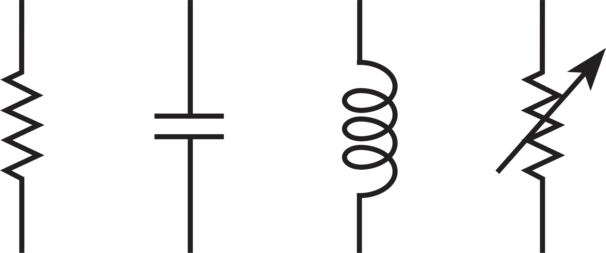
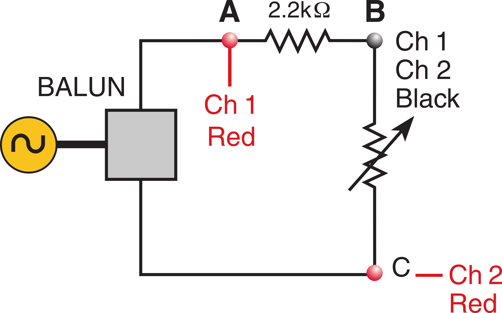
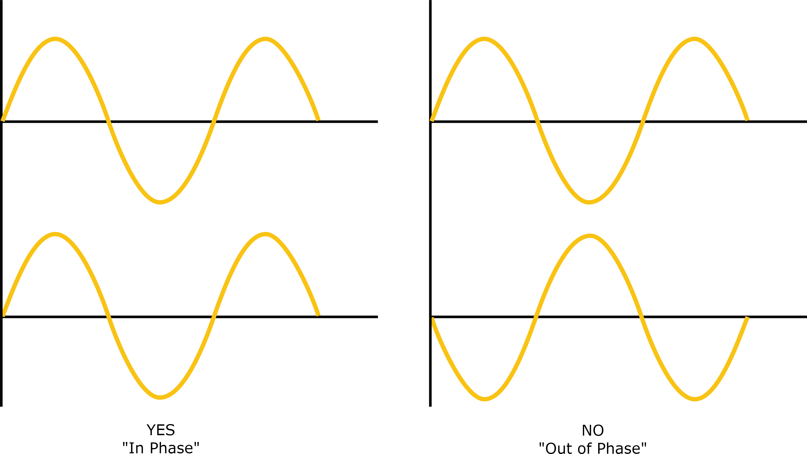
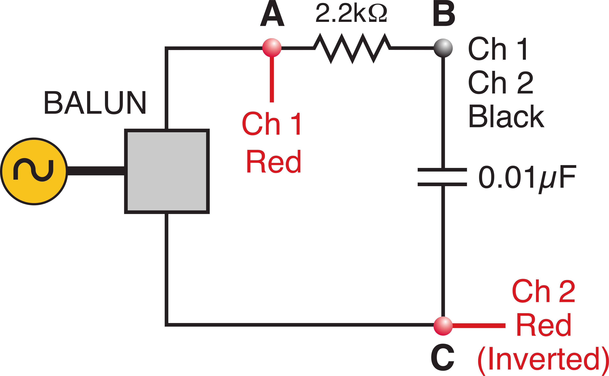
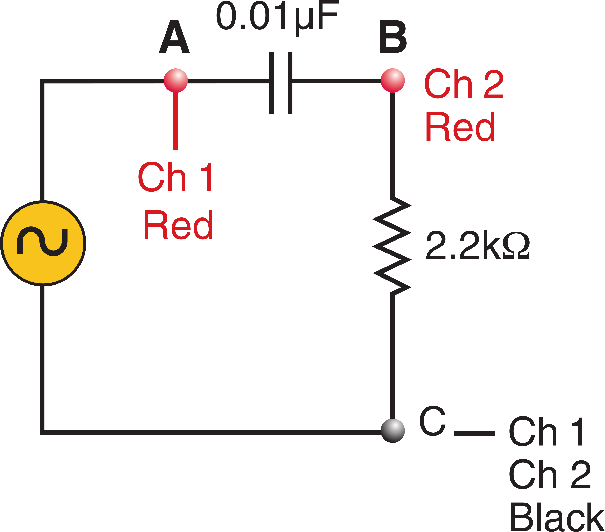
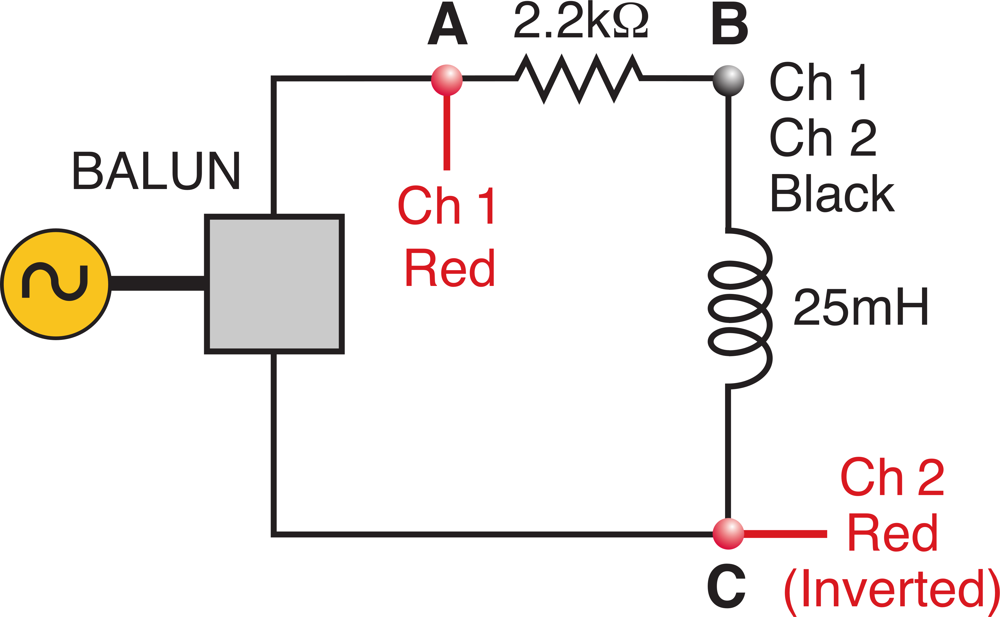
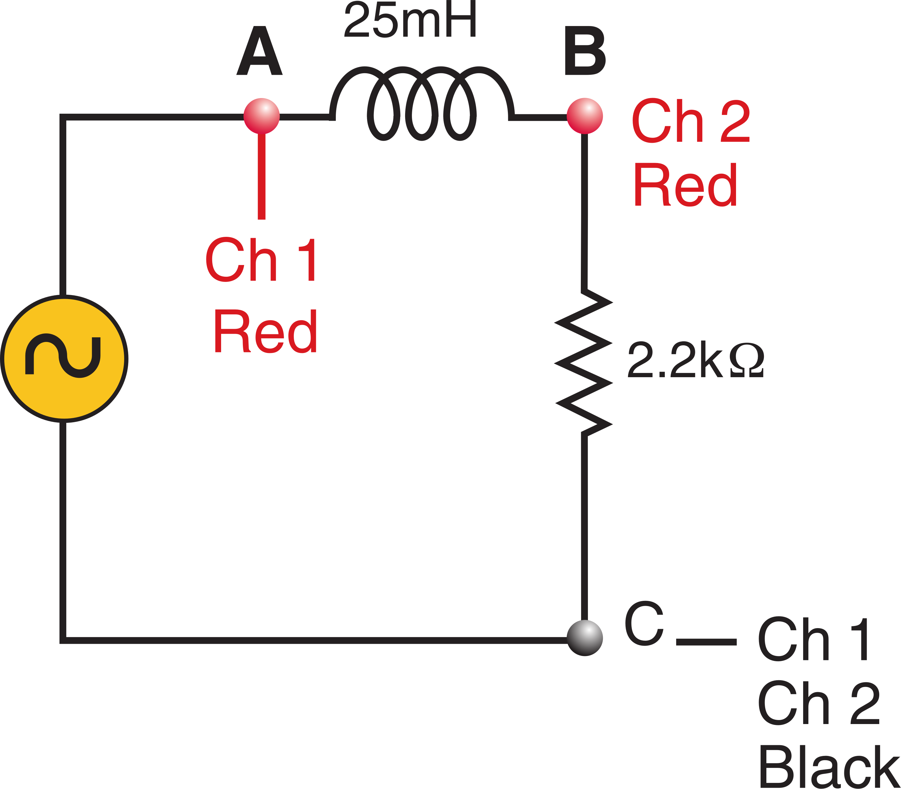

# Reactive Elements in AC Circuits

### Introduction: Schematic Diagrams

Electrical circuits are represented on paper by schematic diagrams.  shows the symbols for four common elements, a resistor, capacitor, inductor and variable resistor. On paper, connections are shown by drawing lines between them. On the lab bench, connections are made by linking elements with wires. 

:::Figure (elemen)

:::

Wires have effectively no resistance. Because of this, we consider points in a circuit connected by a wire to be the same point.

:::Figure (v_div)

:::

 shows the schematic diagram of two resistors connected in series, a circuit topology know as a voltage divider. The gray box is called a BALUN, it isolates the circuit from the function generator. We will not concern ourselves with its exact function in this lab. It is connected to the signal generator by a black BNC cable. Consider it to be an extension of the signal generator.

::: Note (initial_current|10)
On paper, there is a loop which runs from the positive (red) lead of the BALUN to the first resistor, then to the second resistor, and then back to negative (black) lead the BALUN. On the lab bench, a wire runs from the positive (red) lead of the BALUN to the first resistor, a wire from the first resistor to the second resistor, and finally another wire back to negative (black) lead the BALUN. This closed loop is a complete circuit.
:::

The entire source voltage will be dropped across the combination of two resistors. The voltage across each individual resistor is proportional to its individual resistance. The circuit has a simple and useful ratio equivalence:

:::Equation (v_div1)
$$
\frac{\text{individual resistance value}}{\text{total resistance value}} = \frac{\text{individual voltage dropped}}{\text{total voltage dropped}}
$$
:::

Algebraic manipulation shows us:

:::Equation (v_div2)
$$
\text{individual voltage dropped} = \text{source voltage} \times \frac{\text{Individual resistance}}{\text{Total resistance}}
$$
:::

Thus the name “voltage divider” refers to the fact that the voltage will divide according to the ratio of the two resistances.

# Gaining Intuition

:::::::::Activity (intuit_res|Gaining Intuition with Resistors)
1. Wire the circuit shown in . The top resistance is contained in the clear plastic box and has a value of $2.2 \text{k}\Omega$. The bottom resistance is the variable resistor contained in the black box.
2. We want to observe the resistor voltages independently. Place the Red probe of Channel 1 at point A, the Black probe at B. Place the Red Probe of Channel 2 at point C and the Black Probe at B.

Note: The scope is built such that we must have the same common point in the circuit (the black leads need to go to the same place.) Our objective is to measure the two components simultaneously, however to do so we have to wire the opposite polarity on the lower resistor. Push and hold the “Invert” button to invert Channel 2 to compensate for this. By pressing invert, you should see that the two voltage waves are in-phase.

:::Figure (wave_phases)

:::

3. Set the frequency to $1\text{kHz}$ and the variable resistor to $4.4\text{k}\Omega$. Adjust the scope until you see two clearly visible sine waves.

:::Exercise (amp_ratios|2 Points)
What is the ratio of the two waves’ amplitudes? How does this compare to the ratio of resistances?
:::

:::Exercise (rel_phase|1 Point)
What is the relative phase between the waves?
:::

4. Adjust the variable resistor to $2.2\text{k}\Omega$.

:::Exercise (amp_ratios2|2 Points)
What is the ratio of the two waves’ amplitudes? How does this compare to the ratio of resistances?
:::

:::Exercise (rel_phase2|1 Point)
What is the relative phase between the waves?
:::

5. Adjust the variable resistor to $500\Omega$.

:::Exercise (amp_ratios3|2 Points)
What is the ratio of the two waves’ amplitudes? How does this compare to the ratio of resistances?
:::

:::Exercise (rel_phase3|1 Point)
What is the relative phase between the waves?
:::

:::::::::

:::::::::Activity (intuit_cap|Gaining Intuition with Capacitors)

1. Replace the variable resistor with the capacitor labeled C2 ($0.01 \mu \text{F}$) in the clear plastic box. Leave all other connections intact.

:::Exercise (rel_phase_cap|1 Point)
Are the two voltage waves still in-phase? If not, what does their phase difference seem to be?
:::

2. Vary the frequency of the signal generator.

:::Exercise (rel_amp_cap_vary|2 Points)
Do the relative amplitudes of the voltage waves remain constant? What happens to the voltage across the capacitor as frequency is varied?
:::

:::Exercise (rel_phase_cap_vary|1 Point)
Does the phase between the waves change as you vary frequency?
:::

:::::::::

# Reactive Phase Relationships

The relationship between voltage and current in a capacitor is:

:::Equation (I_C)
$$
I(t) = C \frac{dV}{dt}.
$$
:::

If 

:::Equation (ac_V)
$$
V(t)=V_0 \sin(\omega t),
$$
:::

where:

:::Equation (omega_f)
$$
\omega = 2 \pi f,
$$
:::

then by substitution and evaluation of the derivative:

:::Equation (I_c_ac)
$$
I(t) = C V_0 \omega \cos (\omega t).
$$
:::

The current’s cosine wave leads the voltage’s sine wave by $90$ $\text{degrees}$ $(\frac{\pi}{2}$ $\text{radians})$. Therefore, there is a phase shift between the voltage and current in a capacitor. This is always the case in a capacitor, it is due to the need to build up charge before there is a voltage.

The inductor has the relationship:

:::Equation (V_L)
$$
V(t) = L \frac{dI}{dt}.
$$
:::

Using similar reasoning, we drive the inductor with a current:

:::Equation (ac_I)
$$
I(t) = I_0 \sin (\omega t).
$$
:::

By substitution and evaluation of the derivative, the voltage is

:::Equation (ac_L)
$$
V(t) = L I_0 \omega \cos (\omega t).
$$
:::

Here we see that the voltage leads the current. Note that we drove the capacitor with voltage while we drove the inductor with a current.

::: Note (lead_lag_c_l|10)
Current leads Voltage in a capacitor,   

Voltage leads Current in an inductor.   

  

Voltage lags Current in a capacitor,   

Current lags Voltage in an inductor.
:::

:::Exercise (cap_eq|1 Point)
Inspect the equations for a capacitor. What phase relationship do they predict for voltage and current? Justify your reasoning mathematically.
:::

:::Exercise (v_i|1 Point)
For a given voltage, what happens to current as frequency increases?
:::

:::Exercise (v_l_dc|1 Point)
What happens to a voltage across an inductor if it is connector across a DC supply?
:::

:::Exercise (v_l_ac|1 Point)
A more likely scenario is a fixed sinusoidal voltage source driving an inductive circuit. What do you suppose would happen to the current as frequency is increased?
:::

::: Note (phase_r_c_l|10)
The current and voltage are always in phase in a resistor. The current and voltage are 90 degrees out of phase in a capacitor (or inductor.) When a resistor and capacitor (or inductor) are connected in series the same current flows through both elements. However, the voltages across each element can vary independently.
:::

In the Voltage divider section we saw that individual component voltages add in series. We now consider how component voltages add when their voltages are out of phase.

The following figures shows a red and yellow voltage sine waves 90 degrees out of phase with each other. These waves represent the out of phase voltages across individual components. The blue trace is the resultant voltage when the individual signals are added. This represents the voltage across both elements.

The most important thing to note is that the overall circuit voltage is not in phase with either of the individual voltage sine waves. The relative amplitude of the two voltage sine waves (red and yellow) determines the phase of the summed voltage sine wave (blue). Again, the blue wave represents the total circuit voltage.

:::Figure (3_sine_graphs)
 is not in phase with either element (red and yellow), which are $90$ $\text{degrees}$ out of phase.")
:::

:::Exercise (rc_vary_v|2 Points)
A circuit is made up of a capacitor and a resistor in series. The driving frequency is varied. What happens to the component voltages as frequency is increased? Comment on both the resistor and capacitor.
:::

:::Exercise (phase_freq|2 Points)
The circuit’s overall voltage phase is measured with respect to current. Why does the phase vary with frequency? Will it be more or less in phase with the current as frequency is increased?
:::

## Reactive Impedance

Look again at the current equation for a capacitor:

:::Equation (I_c_ac2)
$$
I(t) = C V_0 \omega \cos (\omega t),
$$
:::

and the voltage equation for an inductor:

:::Equation (ac_L2)
$$
V(t) = L I_0 \omega \cos (\omega t).
$$
:::

Inspecting the equations shows that the magnitudes are frequency dependent, because $\omega$ is outside the cosine argument the amplitude of the time varying current (or voltage for the inductor) will be affected by the frequency.

::: Note (why_impedance|10)
In a resistor, the relationship between voltage and current is fixed. The current and voltage are exactly in phase and there is no variation with frequency. The concept of resistance relates the amplitude of the voltage wave to the amplitude of the current wave.

 

Inspection of the capacitor’s and inductor’s equations shows that the voltage varies depending on the driving frequency. Because of this, the concept of resistance is no longer adequate to describe the phenomenon. We use the concept of impedance for circuits containing reactive elements. Like resistance, it is defined as the ratio of the amplitude of the voltage wave to the amplitude of the current wave.
:::

Capacitive Impedance:

:::Equation (c_imp)
$$
X_C = \frac{V_C}{I_C} = \frac{1}{\omega C} = \frac{1}{2 \pi f C}.
$$
:::

Inductive Impedance:

:::Equation (l_imp)
$$
X_L = \frac{V_L}{I_L} = \omega L = 2 \pi f L.
$$
:::

Use impedance just like you’ve used resistance in the past. Substitute it into Ohm’s Law to find the relationship between voltage and current.

:::Equation (r_imp)
$$
V_R = I R = I X_R
$$
:::

:::Equation (v_c_imp)
$$
V_C = I_C X_C = \frac{I_C}{2 \pi f C},
$$
:::

where $V_C$ is the amplitude of the voltage wave across the capacitor.

:::Equation (v_l_imp)
$$
V_L = I_L X_L = I_L 2 \pi f L
$$
:::

where $V_L$ is the amplitude of the voltage wave across the inductor.

::: Note (imp_freq|10)
The most important thing to note about impedance is that it is frequency dependent. 

 

Capacitive reactance decreases with frequency. The voltage across a capacitor will decrease as frequency goes up. 

 

Inductive impedance increases with frequency. The voltage across an inductor will increase as frequency goes up.
:::

## Outline of Procedure

In this procedure you will observe three phenomenon:
1. The phase difference in a series circuit between the voltage across a reactive element (either a capacitor or inductor) and the voltage across a resistor.
2. The phase difference between the voltage across a resistor (which reflects the phase of the current) and the overall circuit voltage.
3. The change in voltage across a reactive element as frequency is varied.

::: Note (osc_set|10)
In this experiment you will have to play with the scope's time and amplitude resolution to get the best data. You will not be given explicit setting to find the waveforms, you need to become comfortable using the scope as a tool for finding data.
:::

:::Figure (scope_diagram)

:::

:::Figure (wiring_rC1)

:::

::: Note (v_I_hint|10)
Hint: Voltage and current are always in phase in a resistor. Use this fact as an indicator of the current’s phase.
:::

:::::::::Activity (cap_act|Phase Phenomenon in Capacitors)
## Gaining Intuition
1. To observe phase phenomenon for a capacitor, wire the circuit shown in  above. Be sure to use the second capacitor in the circuit box, with value $0.01 \mu \text{F}$, labeled C2. The resistor is also in the plastic box and has value $2.2 \text{k} \Omega$.
2. Place the red probe of Channel 1 at point A, the black probe at B. Place the red probe of Channel 2 at point C and the black probe at B.

::: Note (scope_note|10)
The scope is built such that we must have the same common point in the circuit (the black leads need to go to the same place.) Our objective is to measure the two components simultaneously, however to do so we have wire the opposite polarity on the capacitor. Invert Channel 2 to compensate for this.
:::

3. Set the frequency to $1 \text{kHz}$.
4. Make sure the scope is triggering on Channel 1.

:::Exercise (phase_rel_c|1 Point)
By inspection, what is the phase relationship between the two waves?
:::

:::Exercise (amp_rel_c|1 Point)
What are the amplitudes of the two waves? They should not be the same, be sure to note the amplitude settings on both scope channels.
:::

5. Sweep the frequency and observe what happens to both waves.

:::Exercise (phase_rel_c_freq|1 Point)
What is the phase relationship at $8\text{kHz}$? At any other frequency?
:::
:::Exercise (amp_rel_c_freq|1 Point)
What happens to the amplitudes of the waves as you change frequency?
:::
:::Exercise (amp_rel_c_freq_imp|1 Point)
Why have the waves changed in relative size? What can you say about capacitive impedance
at higher frequencies?
:::

:::Figure (wiring_rC2)

:::

## Procedure
::: Note (scope_note2|10)
Channel 2 is <b><u>NOT</b></u> inverted in this experiment
:::
1. Rewire the circuit probes as shown in , set the generator to $10\text{kHz}$, use C2. This wiring measures the voltage across the resistor and the total circuit voltage. Because the current and voltage are in-phase in the resistor we use this as our current reference.
2. To compute the phase you’ll also need to measure the period of the sine wave:
:::Equation (meas_phase1)
$$
\frac{\text{phase}}{360\degree} = \frac{\text{time difference}}{\text{period}}
$$
:::
:::Equation (meas_phase2)
$$
\text{phase} = 360\degree \frac{\text{time difference}}{\text{period}}
$$
:::
3. Pick five points equally spaced in frequency, neatly tabulate the amplitude and phase. Be sure to follow the guidelines for a Good Table.

:::Exercise (table_cap|5 Points)
Include this table in your lab report
:::
:::Exercise (phase_diff_c_comp|2 Points)
What is the phase difference between the current and the voltage? Briefly summarize why the results are not identical to those in the previous wiring ("Gaining Intuition")
:::

4. With both channels visible on the scope sweep the frequency using the function generator's dial.

:::Exercise (amp_phase_freq_c|1 Point)
What do you observe in the amplitudes as frequency is increased? What about phase?
:::

:::::::::

:::::::::Activity (ind_act|Phase Phenomenon in Inductors)
## Gaining Intuition
:::Figure (wiring_rL1)

:::
::: Note (scope_note3|10)
Channel 2 <b><u>IS</b></u> inverted in this experiment.
:::
1. To observe phase phenomenon for an inductor, wire the circuit shown in  above.
2. Place the red probe of Channel 1 at point A, the black probe at B. Place the red probe of Channel 2 at point C and the black probe at B.
::: Note (scope_note4|10)
The scope is built such that we must have the same common point in the circuit (the black leads need to go to the same place.) Our objective is to measure the two components simultaneously, however to do so we have wire the opposite polarity on the inductor. Invert Channel 2 to compensate for this.
:::
3. Set the frequency to $10\text{kHz}.
4. Make sure the scope is triggering on Channel 1.

:::Exercise (rel_phase_l|1 Point)
By inspection, what is the phase relationship between the two waves?
:::
:::Exercise (rel_amp_l|1 Point)
What are the amplitudes of the two waves? They should not be the same, be sure to note the amplitude settings on both scope channels.
:::

5. Sweep the frequency and observe what happens to both waves

:::Exercise (phase_rel_l_freq|1 Point)
What is the phase relationship at $20\text{kHz}$? At any other frequency?
:::
:::Exercise (amp_rel_l_freq|1 Point)
What happens to the amplitudes of the waves as you change frequency?
:::
:::Exercise (amp_rel_l_freq_imp|1 Point)
Why have the waves changed in relative size? What can you say about inductive impedance
at higher frequencies?
:::

## Procedure
:::Figure (wiring_rL2)

:::
1. Rewire the circuit probes as shown in , set the generator to $10\text{kHz}$. This wiring measures the voltage across the resistor and the total circuit voltage. Because the current and voltage are in-phase in the resistor we use this as our current reference.
2. Compute the phase as in  and .
3. Pick five points equally spaced in frequency, neatly tabulate the amplitude and phase. Be sure to follow the guidelines for a Good Table.

:::Exercise (table_cap|5 Points)
Include this table in your lab report
:::
:::Exercise (phase_diff_l_comp|2 Points)
What is the phase difference between the current and the voltage? Briefly summarize why the results are not identical to those in the previous wiring ("Gaining Intuition")
:::

4. With both channels visible on the scope sweep the frequency using the function generator's dial.

:::Exercise (amp_diff_l|1 Point)
What do you observe in the amplitudes as frequency is increased? What about phase?
:::

:::::::::