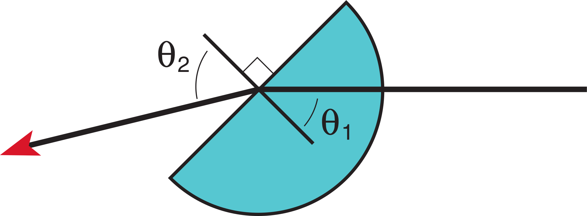
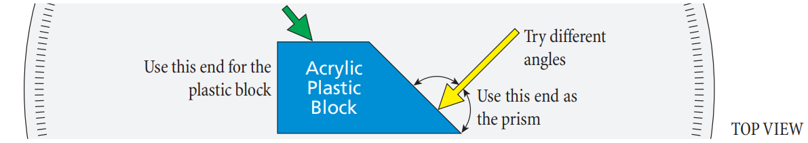
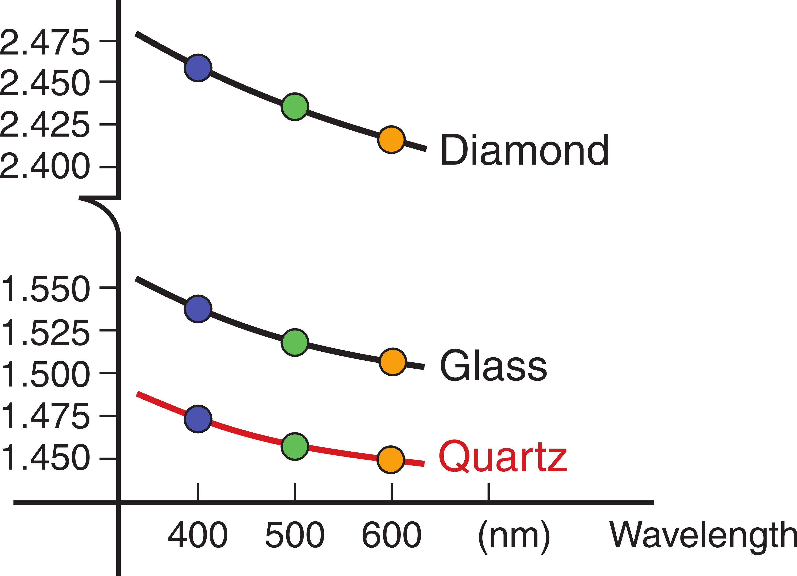
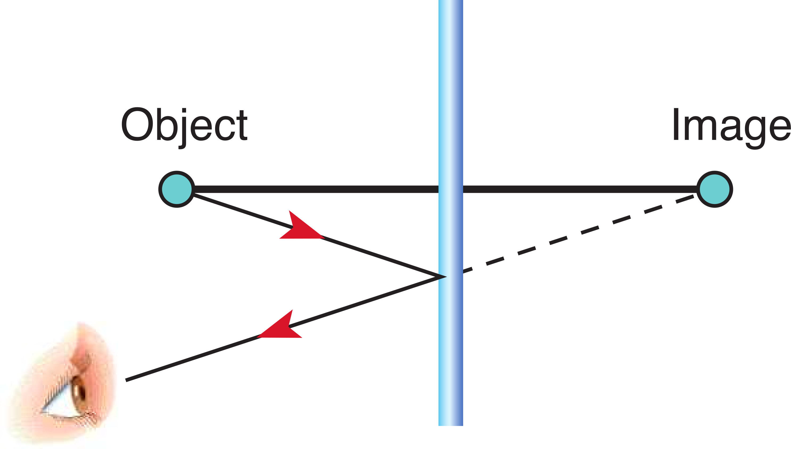
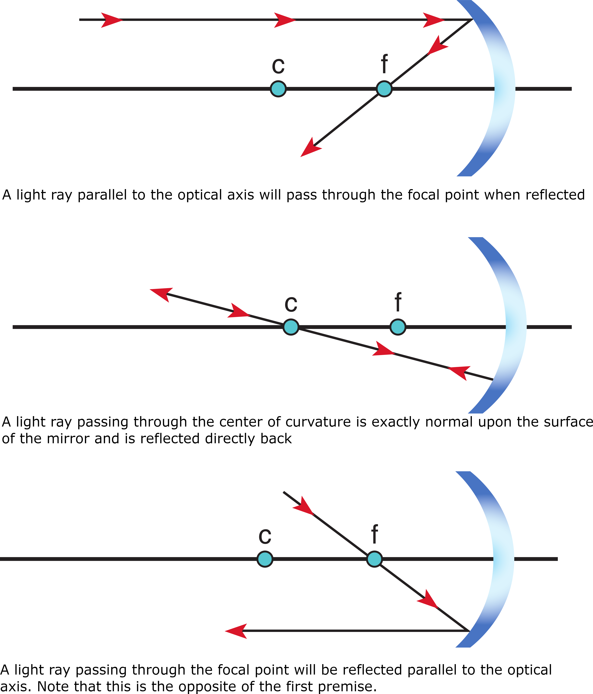
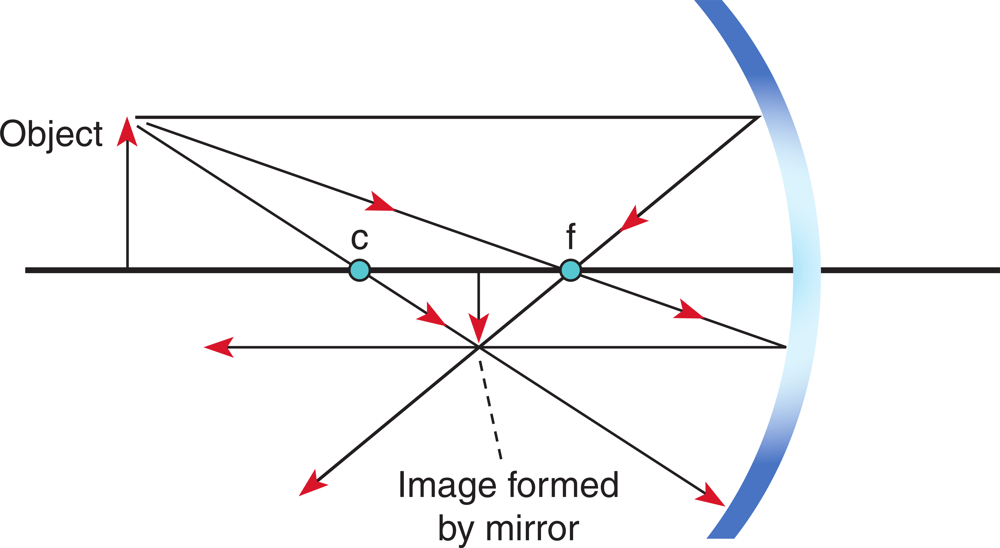

# Reflection and Refraction

# Refraction Water Tank
1. Turn on the lamp attached to the refraction tank, start with the light beam pointing straight up.

The beam in the water is said to be the <i>incident beam</i>. The beam in air is the <i>refracted beam</i>. The beam is said to be <i>normal</i> when it is perpendicular to the air and water boundary. Slowly rotate the beam outward and observe the difference in angles at this boundary.

:::Exercise (refrac1|1 Point)
Is there any change in the light beam when the light beam is normal to the water and air boundary?
:::

:::Exercise (refrac2|1 Point)
What happens as you increase the incident angle? Does the refracted light beam bend more
or less than the incident beam?
:::

:::Exercise (refrac3|1 Point)
Is there a particular angle where something unexpected occurs? What happens?
:::

:::Exercise (refrac4|1 Point)
Is any light transmitted into the air when the angle of incidence is large?
:::

<b>THEORY:</b> When a light ray encounters a boundary between two materials it experiences a change in direction due to the difference in materials’ indexes of refraction, typically denoted as $n_1$ and $n_2$. The particular physics of this are beyond the scope of this lab, however the empirical results are neatly summarized by Snell’s Law:

:::Equation (snell)
$$
n_1 \text{Sin}(\theta_1) = n_2 \text{Sin} (\theta_2)
$$
:::

::: Note (norm_angle|10)
All angles are measured relative to the normal. Thus a small angle is almost perpendicular to the surface and a large angle is nearly tangent. Note that all angles are less than $90 \degree$.
:::

::: Note (norm_angle|10)
$n_1$ typically refers to the material the light beam comes from, $n_2$ refers to the material the light beam goes into.
:::

:::Figure (refrac)

:::

The speed of light depends on the medium in which it is traveling. Light travels at $3.00 \cdot 10^8 \text{m/s}$ in a vacuum and slower within a medium. It is this change in velocity which gives rise to the index of refraction. They are explicitly related by:

:::Equation (snell)
$$
n = c/v
$$
:::

where $n$ is the index of refraction, $c$ is the speed of light in a vacuum, and $v$ is the speed of light in the medium. If you know the medium's index, you know the speed of light in that medium.

:::::::::Activity (semi_circ_block|Measuring the critical angle with an acrylic block)

<b>Experiment:</b> You will use the optical bench in this experiment. Treat the semi-circular acrylic block as an unknown. Our objective is to find its index of refraction. $n_1$ corresponds to the plastic block, $n_2$ corresponds to the air. Measuring both the incident and refracted angles and assuming the index of refraction for air to be $n_2 = 1.00$ we are left with only one unknown, the index of refraction for the plastic, $n_1$. <i>We neglect the first boundary between air and the acrylic block because the incident beam is perpendicular to the cylinder’s surface.</i>

:::Figure (semi_circ)

:::

In each of the following cases record the incident and refracted angles.

1. Adjust the ray box to provide one beam of light. Place the semi-circular glass block in the middle of the ray tracing table. Align it with the table’s axis, this will make it easy to measure the incident and refracted angles. <i> You can then rotate the table, not the block. It’s easy! </i>
2. Make a table of the incident and refracted angles, compute the block’s index of refraction for each angle. Then compute the average index of refraction.

Algebraically rearrange Snell’s law to find $n_1$ for each of these 4 angles. Compute the average value

:::Exercise (block_table|4 Points)
Include a copy of the table with your measured angles and calculated indexes of refraction in your lab report. Be sure to follow the guidelines for a Good Table. Also, include your calculation demonstrating the algebraic rearrangement of Snell's law.
:::

3. The <i>critical angle</i> is the breaking point between refraction and <i>total internal reflection</i> (where no light is refracted, it is all reflected). Find this angle.

At the critical angle the refracted light travels along the surface of the glass block. Thus, $\text{Sin}(\theta_2) = 1.0$, or $\theta_2 = 90 \degree$. Substitute this into Snell’s law and compute $n_1$.

:::Exercise (crit_angle|2 Points)
Include the critical angle you measure and your resulting value for $n_1$ in the report. Does this value for $n_1$ (from the critical angle) agree with your previous calculations (from the average)? By how many percent is it off? Comment on the number of data points in each case and why one experiment might be preferred.
:::

4. Observe the reflected angle when the incident light is past the critical angle.

At angles beyond the Critical Angle no light is transmitted into the air or along the surface of the block. This phenomenon is called total internal reflection.

:::Exercise (speed_light|1 Point)
What was the speed of light in the acrylic block? Show your work.
:::

:::::::::

# Prisms and Frequency Dependent Refraction

:::::::::Activity (prism|Examining Light through a Prism)

:::Figure (prism-top|)

:::

Adjust the light source’s grating to emit just one light beam and attach the ray tracing table to the optical bench. You are provided with an oddly shaped block, use the triangular end of the block as a prism.

Shine the beam of white light through one side of the prism and observe the light output on the opposite side. Begin with the angle of incidence close to normal and then sweep to a steep angle.

:::Exercise (sketch_angle|1 Point)
Sketch the orientation of the block when the rainbow most readily observable? Why do you think this is? Include this sketch in your lab report.
:::

Try to get the light to pass directly through the prism with no change in direction or offset.

:::Exercise (direct_through|1 Point)
Is it possible to get light directly through a prism? Why do you think this is?
:::

Now use the square end of the block. Shine the beam of white light at an angle other than normal and such that the beam is able to leave through the opposite side.

:::Exercise (obs_beam_opp|1 Point)
What do you observe about the beam on the opposite side of the block? Is the beam able to pass straight through or is there an offset? Is it parallel to the original beam? Why?
:::

:::Exercise (prism_norm|1 Point)
When the incident beam is normal to the surface are you able to observe the same phenomenon?
:::

At steep angles you will observe total internal reflection just as you did with the acrylic block. Mess around with the block and prism to see the many possible geometric paths.

:::::::::

<b>THEORY:</b>
The index of refraction for a medium is dependent upon the frequency of the light – blue light has a different index of refraction than red light for a given medium.

1. The angle at which a beam of light is refracted when traveling between two mediums is dependent upon the index of refraction.
2. The indexes of refraction are typically frequency dependent for a given medium. A medium will refract one color more than another color.
3. White light is made of many constituent colors

Piecing these statements together we have a tidy explanation for the phenomenon of a rainbow. At each boundary some colors are refracted more than others which results in white light being spread out into its constituent spectrum. This spreading is called dispersion. The second boundary of the prism – glass to air – is at such an angle as to increase this diffusion. The difference between the Index of Refraction for the lowest frequency and the highest frequency determines how wide of a rainbow you can see. A material with a larger difference in indexes will have a larger maximum width.

:::Figure (index_freq)

:::

:::Table (index_freq| Frequency dependent index of refraction for glass, quartz, and diamond )
| Wavelength | Glass | Quartz | Diamond|
| -----------| ----- | ------ | ----- |
| $400 \text{ nm}$ 
 (purple) 
 | 1.530 | 1.470 | 2.460 |
| $500 \text{ nm}$ 
 (green) 
| 1.520 | 1.462 | 2.440 |
| $600 \text{ nm}$ 
 (orange) 
 | 1.512 | 1.458 | 2.415 |
::: 

:::Exercise (white_light_freq|1 Point)
A beam of white light traveling in air is incident on a glass block at an angle of $17 \degree$. Use Snell’s Law to compute the refractive angle for purple, green and orange light. Show your work.
:::

:::Exercise (jewelry|1 Point)
Diamonds have indexes of refraction in the range of 2.4. Why would this lead to more visible rainbows in jewelry?
:::

# Flat Mirrors

<b>SINGLE PLANAR MIRROR:</b> We regularly encounter flat mirrors as well as glass surfaces which act like mirrors. Intuitively you know that your image is standing directly across from you, when speaking in terms of ray tracing we are the <i>object</i> and our reflection is the <i>image</i>. It is easy to convince yourself that this image is formed straight back – that is, normal to the plane of the mirror – and that it is also an equal distance behind the mirror.

The image of any point object in a planar mirror is simply the point straight across at an equal distance. This is the case for any viewing angle, you will see the image “behind” the mirror at an equal distance. The line between the object and image is always normal to the plane of the mirror.

:::Figure (planar_mirror|m|R)

:::

Now let's consider why ray tracing works. The law of reflection tells us that the angle of incidence is always equal to the angle of reflection. We also know that the image is formed by the light ray that emanates from the object, reflects off the mirror, and finally reaches our eye. The ray which reaches our eye must obey the law of reflection, its path is shown in . It is important to note that this would work equally as well for any set of angles. We see an image behind the mirror because of the law of reflection - if you instead extend the reflected light ray behind the mirror it would arrive precisely at the image point as in . The phenomenon of reflection fools us into thinking the light rays originate from the image point.

### Recipe for Planar mirror ray tracing:
1. Select an object and viewer location.
2. Reflect the object over the plane of the mirror.
3. Draw a line from the viewer to the image.
4. Draw another line from the rays intersection point back to the object.

# Reflections from a Plane Mirror

:::::::::Activity (reflections_planar|Flat Mirrors)

:::Figure (mirror-setup|xl)

:::

1. Set a clean piece of paper on the cork side of the of the corkboard and place the mirror assembly onto the corkboard as
shown in .
:::Note (|10 C)
The mirror is a second surface mirror, the light actually reflects from the surface behind the clear protective plastic.
:::
2. Place a mark on the paper to locate the reflective surface. Do this at both corners of the mirror. Remove the mirror and draw a solid line connecting the two marks.
3. Replace the mirror to its previous position making sure that the line is still located at the reflective surface.
4. Place a non-yellow pin $6-10 \text{ cm}$ from the surface of the mirror, slightly off to one side. This will be the object pin.
**Place the pin as vertically as possible.** Mark this location with an “O.”   shows an example.

:::Figure (mirror-setup-2|m|R)

:::

5. Select two yellow pins. Place one of those pins anywhere, approximately $1–2 \text{ cm}$ in front of the mirror on either side of the object (non-yellow) pin. 
6. Closing one eye, find the position where the head of the one physical yellow pin and the head of the one “virtual” object pin (non-yellow) overlap (coincide). Place the remaining yellow pin in a location such that its head coincides with the other heads as in  (b). The two yellow pins you just inserted now define the reflected light ray. 
7. Precisely mark the location of the ray pins (yellows), each with an “A.” Then remove the yellow pins.
8. Repeat steps 5-7 one more time from a different viewing angle. Mark the location of these pins each with a “B.”
9. Once you have marked the locations of reflected rays, remove the mirror. For each pair of marks draw a solid line
through the two pin holes to the surface of the mirror. Draw another line from the location of the object pin to the
intersection of the mirror surface and the line you just drew. Mark the direction of light—from the object pin, to the
mirror, and finally to your eye—with arrows on these lines.

10.  Extend the line created with the original two pins behind the mirror, making it a dashed line. Repeat this process for the other sets of pins.
11.  Now construct a line from the object to the image. Measure the distance from the mirror surface to the object and
then from the mirror surface to the image location.
12.  Construct a perpendicular line at the point where each of the rays intersects the mirror surface (the line at the back
edge of the mirror). Measure the angle of incidence and angle of reflection. Neatly tabulate your results for each ray.

:::Exercise (|1 Point)
1. Where do the dashed lines meet?
2. How does the perpendicular distance from the object pin to the reflection line compare with the distance from the image to that line?
3. What can you say about the angle of incidence and angle of reflection for each of the rays?
:::

:::::::::

# Spherical Mirrors

Hold the concave spherical mirror approximately $1 \text{cm}$ from your face, then move it out slowly observing the image formed.

:::Exercise (sphere_obs|1 Point)
What do you observe? What orientation is the image? By approximately what factor has the image been magnified? Remember that magnification, as the term is used in optics, can mean bigger or smaller. For bigger, the magnification is greater than $1.0$. For smaller, the magnification is less than $1.0$.
:::

Slowly move the mirror away from you. You will notice that there is a point where it becomes difficult to discern any type of image. You are approximately at the focal point of the mirror when this happens. Continue moving the mirror away from you.

:::Exercise (sphere_obs_focal|1 Point)
What do you observe? What orientation is the image at this distance? How large is the image?
:::
:::Exercise (sphere_farther|1 Point)
What happens as you continue to move the mirror away from you?
:::

<b>THEORY:</b> As the name implies, spherical mirrors are a section of a sphere’s surface. The have a constant radius. Similarly, a cylindrical mirror is a section of a cylinder’s surface. We will explore the ray tracing method for cylindrical mirrors. Keep in mind that these methods can also be used in 3 dimensions for spherical mirrors. We will only cover concave mirrors; however, the same method can be successfully applied to convex mirrors. We use three simple cases to analyze cylindrical mirrors.

::: Note (sphere_f_c|10)
The focal length is halfway to the center of curvature.
:::

:::Figure (sphere_ray_1)

:::

### Recipe for Concave mirror ray tracing:
1. Pick a point on the object.
2. Draw one line from the point and parallel to the optical axis. Once it hits the mirror it bends down through the focal point. Be sure to extend it beyond the focal point.
3. Draw one line from the point to the center of curvature, extend it until it intersects the first line. Note that it doesn’t matter if the object is inside or outside of the center of curvature.
4. Draw one last line from the point through the near-side focal point and then to the lens, when it emerges from the lens it will be parallel to the optical axis. This line will intersect at the same point as the other two.

:::Figure (sphere_ray_2)

:::

# Ray Tracing with Cylindrical Block Mirrors

:::::::::Activity (reflections_cylindrical|Cylindrical Block Mirrors)

In this procedure we will determine the focal length of the concave mirror and then construct a ray trace diagram using the recipe outlined above. Use the <u>concave</u> surface of the <u>semi-triangular</u> mirrored block.

1. Adjust the grating on the optical box to have five parallel light beams and align the center beam with the axis of the ray tracing platform.
2. Place the cylindrical block mirror perpendicular to the light beams, align it so that the center of the mirror is on the optical axis.
3. Dim the class lights and observe the reflected ray trace.

The distance from the surface of the mirror to the image is called the <i>image distance</i>. By definition, the focal length is the image distance that corresponds to an infinite object distance, or said differently, it is the image distance when the incoming rays are all parallel (as they were in this set up.)

:::Exercise (flength_cyl|1 Point)
What is the focal length of the mirror?
:::

::: Note (cyl_f_c|10)
The following steps must be completed by each member of the lab group.
:::

4. You will now draw your own ray trace diagram. So that the drawing fits on your paper, <u>assume the focal length</u> to be $2 \text{cm}$. Get a sheet of paper and draw the optical axis, focal point and trace the outline of the mirror.

:::Exercise (cyl_dia_1|1 Point)
Pick an object (an upright arrow will do) within the focal length. Use the ray tracing methods to determine the image location. You only need the first two rays for this, see the top two diagrams in . Include this diagram in your report.
:::

:::Exercise (cyl_dia_2|1 Point)
Create a second ray trace diagram, this time pick a point farther than two focal lengths away from the mirror. Find the image location for this object. Include this diagram in your report.
:::

:::Exercise (cyl_dia_3|1 Point)
Create a third ray trace diagram for an object between the focal point and the radius of curvature. Include this diagram in your report.
:::

:::Exercise (mag_inv|1 Point)
Specify the magnification (greater or smaller) as well as "inverted" or "not inverted" for each of the scenarios above.
:::

:::Exercise (mag_inv|1 Point)
How do these observations explain what you saw as you played with the spherical mirrors in Part V?
:::

5. Now place the <u>convex</u> mirror on the light bench with its center on the optical axis. Again use five rays to observe the reflection pattern.

:::Exercise (convex_trace|1 Point)
If you were to trace the reflected rays to an intersection point which side of the mirror would it be on? How does this differ from the intersection point for the concave mirror?
:::