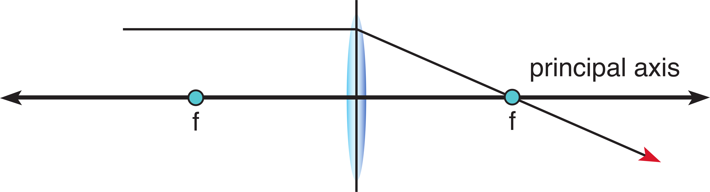
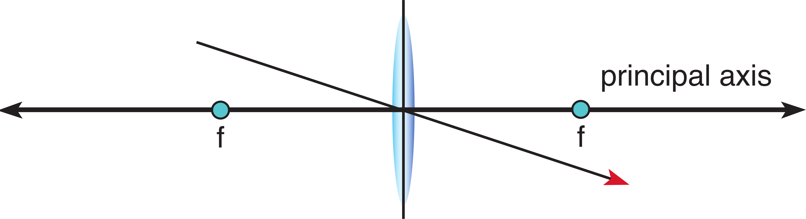
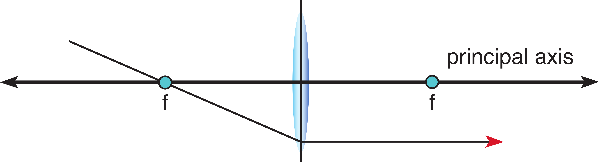
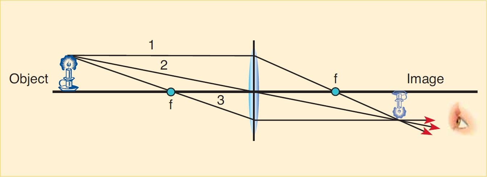
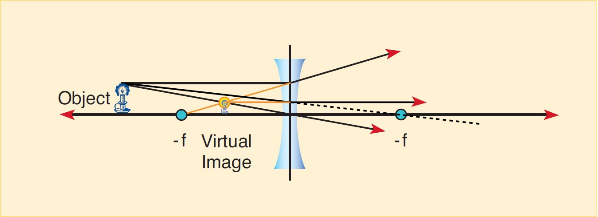
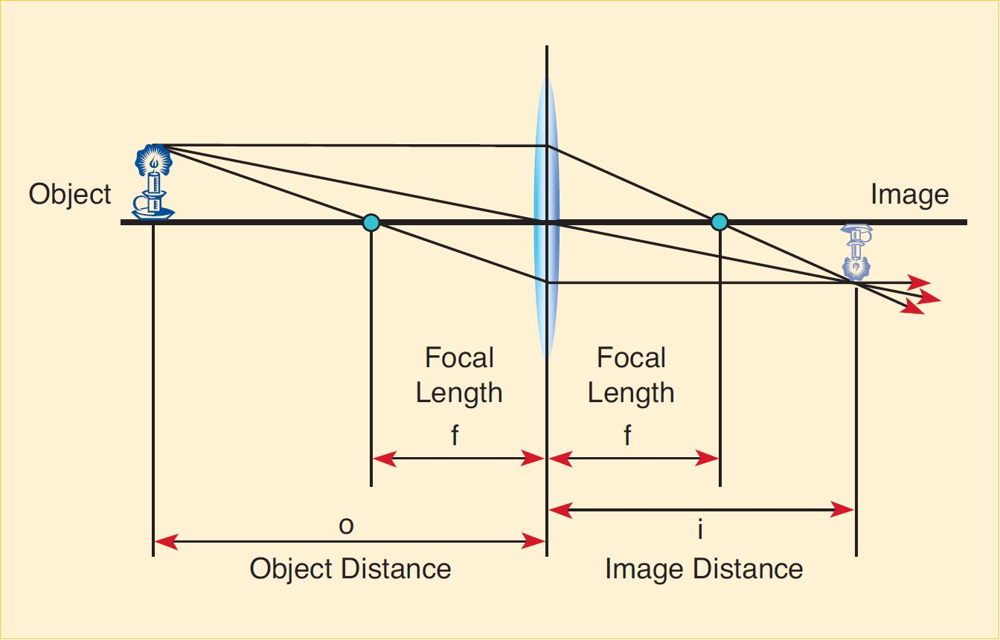

# Lenses, Ray Tracing, and Simple Optical Devices

# Experimenting with Focal Lengths

:::::::::Activity (lenses|Gaining Intuition for Lenses)
Convex lenses are those which bulge outward in the center with the edge being the most narrow part.

Select one of the unlabeled simple lenses. Move it up and down beneath the laboratory’s fluorescent lights.

:::Exercise (convex|1 Point)
What do you observe about the light passing through the lens?
:::

At one height you should see that the lens will focus the light from the fluorescent lights. The lights are long, parallel tubes and as a result you see two sharply focused lines. Note that different lenses focus the light at different heights above the table. This is due to the fact that the lenses have different <i>focal lengths</i>, a property dependent upon the index of refraction and geometry of the lens. Select a lens and measure the height at which this occurs, then do the same for two other unlabeled convex lenses.

:::Exercise (curve_height|1 Point)
Is there a relationship between the curvature of the lens and the height at which it focuses? Include the relevant data in your lab report.
:::

Now take the concave lens &mdash; this one is thickest on the outside and thinnest in the middle. Using the same method find the focus height of this lens.

:::Exercise (concave|1 Point)
Does the concave lens sharply focus the light?
:::

:::::::::

:::::::::Activity (lenses_bench|Measuring Focal Lengths with the Optics Bench)

In this procedure you will use the optical bench. It has a multi-purpose light source and a small circular ray traced platform where you set the lens. You are provided with one thin convex block lens and one thick block half lens. You will use both to demonstrate focal lengths.

1. Adjust the grating on the ray box to provide 5 parallel rays.
2. Place the thin convex lens perpendicular to the rays. The imaginary line perpendicular to the lens and running exactly through the center is called the optical axis. <i>Note that it is necessary to place the lens on the front half of the table to observe the intended phenomenon.</i>
3. Dim the class lights and observe the refracted rays.

:::Exercise (focal_first|1 Point)
What is the focal length of the lens?
:::

4. Use the thick block half lens. Place the curved surface towards the parallel light source. Observe the refracted beams.

:::Exercise (focal_block|1 Point)
Measured from the flat surface, at what distance do the beams converge?
:::

5. Reverse the orientation of the block such that the flat surface is towards the light source.

:::Exercise (block_symmetric|1 Point)
Does the block lens have symmetrical behavior? That is, do the beams converge at the same distance from the flat surface? Why might this be the case? Hint: look at the flat boundary, comment on the refraction which occurs there.
:::

6. Place the concave lens on the platform. Again observe the refracted beams.

:::Exercise (block_symmetric|1 Point)
Can you measure the focal length of the lens? If you were to trace the refracted rays backwards (on the same side as the incident beams) would they converge?
:::

If you were to trace imaginary beams backwards from the refracted beams you will find that they have a well defined intersection point. For this reason concave lenses are said to have <i>negative</i> focal lengths and produce <i>virtual</i> images.

:::::::::

An object is some physical entity which either produces light rays of its own (like a light bulb) or reflects them from some other light source (like this text, or your pencil.) The image is a version of the object as it appears after going through some optical device, in this case a lens. In the remainder of this lab we will explore lenses and their relationship to objects and images.

::: Note (real_images|10)
Real Images:
* Light rays actually pass through the image point.
* The image is on the opposite side as the incident light.
* The image can be projected onto a screen.
* The image is inverted with respect to the object.
:::

::: Note (virtual_images|10)
Virtual Images:
* Light only appears to pass through the image point.
* The image is on the same side as the incident light.
* The image cannot be projected onto a screen.
* The image is in the same orientation as the object, we say that it is erect.
:::

# Ray Tracing with Known Focal Length

Like mirrors, we use ray tracing methods to predict the behavior of a lens. We begin with convex lenses though the same methods apply equally to concave. There are only three essential premises needed to analyze lenses:

1. A light ray entering a lens parallel to the optical axis will pass through the focal point on the other side.

:::Figure (ray_lenses_1)

:::

2. A light ray passing through the center of a lens is unchanged. <i>Note that this is only true for thin lenses.</i>

:::Figure (ray_lenses_2)

:::

3. A light ray passing through the focal point and then through the lens will emerge parallel to the optical axis.
<i>Note that this is the opposite of the first premise.</i>

:::Figure (ray_lenses_3)

:::

Given these three statements we can determine how a lens will form an image for an object at a given distance. You will use this in the next section.

## Ray Tracing Method

1. Pick a point as the object.
2. Draw one line from the point and parallel to the optical axis. Once it hits the lens it bends down through the focal point. Be sure to extend it beyond the focal point.
3. Draw one line from the point to the center of the lens, extend it until it intersects the first line.
4. Draw one last line from the point through the near-side focal point and then to the lens, when it emerges from the
lens it will be parallel to the optical axis. This line will intersect at the same point as the other two.

:::Figure (ray_trace_1)

:::

There are two other important cases to consider. When an object is placed within the focal length of a convex lens the image point become negative. A virtual image is formed at the point that the images <i>appear</i> to come from. The ray tracing method is consistent, however note that you draw the line in reverse:

:::Figure (ray_trace_2)

:::

::: Note (convention|10)
As a convention, we always draw from the top most point on the object. Any other point would work equally as well. The top is generally most useful.
:::

A concave lens has a negative focal length and the line from the object to the focal length actually crosses the lens:

:::Figure (ray_trace_3)

:::

:::::::::Activity (drawing_diagrams|Drawing Ray Tracing Diagrams)

1. In this section you will practice the ray tracing method described above. Assume the focal length to be $2 \text{cm}$. Get a sheet of paper and draw the optical axis, measure out and draw the focal point and trace the outline of the convex lens. Pick an object point outside of the focal length on the top left-hand side of the paper. Draw the three simple case rays &mdash; parallel, through the lens center and through the focal point &mdash; and locate the image formed on the other side of the lens.
::: Note (converging_lens|10)
Note that it is a) inverted, b) at a different distance than the object, and c) it is a different size than the object. Also note that the light rays converge at a given point, convex lenses are frequently referred to as <i>converging lenses</i>.
:::
2. Get another sheet of paper and repeat step 1), however instead draw the object point inside the focal length. Again draw the three simple case rays. Note that this is one of the special cases mentioned above, see .

:::Exercise (converge|1 Point)
What do you observe? In the current state of your diagram, do the lines converge at a given point?
:::

3. Instead trace the rays backwards as shown in  You will find that they all intersect at a point on the same side as the object.

When an object is inside of the focal length of a convex lens it no longer converges the light rays to a single point. The image is bigger, such a set up is called a <i>magnifier</i>. Since light does not actually pass through the point where the image is formed we call it a <i>virtual image</i>.

4. Get a third sheet of paper and repeat the ray tracing procedure for the concave lens. Place the object outside of the focal length. Note that this is the second special case mentioned above, see .

:::Exercise (converge_2|1 Point)
Do the rays converge at a given point?
:::

5. Trace the rays backwards as shown in .

:::Exercise (mag|1 Point)
For object distances outside the focal length, do concave lenses make things bigger or smaller?
:::

Concave lenses do not cause light to converge upon a single point but instead cause it to spread out. Because of this they are referred to as <i>diverging lenses</i>. The focal length of a concave lens is <i>negative</i>. If we incorporate this into our ray tracing they can be analyzed using the same method that was used for convex lenses.

:::Figure (ray_trace_final)

:::

:::::::::

# Telescopes and Microscopes

:::::::::Activity (telescope|Constructing a Telescope)
1. Hold the $200\text{mm}$ lens in your left hand. Lock your elbow to give a full extension (). Aim your arm with the $200\text{mm}$ lens at something across the room. Now take the $100\text{mm}$ lens and hold it with your right hand. Place the $100\text{mm}$ lens, the eyepiece, right at the back of the $200\text{mm}$ lens, the objective lens (). Using your right eye, slowly bring the eyepiece, in your right hand, toward your eye (). Keep your eye, the eyepiece and the objective lens along the same axis pointed at your target. You should be able to capture a clear image of your target. You may find this easier if you shut your left eye.

:::Exercise (tele_1|1 Point)
Does the object appear closer or farther from you?
:::

:::Exercise (tele_2|1 Point)
How much closer do you appear to be?
:::

:::Exercise (tele_3|1 Point)
How much larger does the image appear to be? Explain in terms of the focal lengths of the objective and eyepiece.
:::

:::Figure (telescope_1)

:::

:::Figure (telescope_2)

:::

:::Figure (telescope_3)
 in your right hand, toward your eye.")
:::

:::::::::

:::::::::Activity (microscope|Constructing a Microscope)

1. Duplicate the setup shown in . Place the light box at the end of the optical bench at the $100 \text{cm}$ position. Be sure the crossed arrows are facing toward the $0 \text{cm}$ end. Place the $200 \text{mm}$ focal length lens at the $60 \text{cm}$ position and the $100 \text{cm}$ focal length lens at the $10 \text{cm}$ position. Plug in the light box and view from approximately the $0 \text{cm}$ mark. See .

:::Figure (microscope)

:::

:::Exercise (micro|1 Point)
What do you observe?
:::

:::::::::