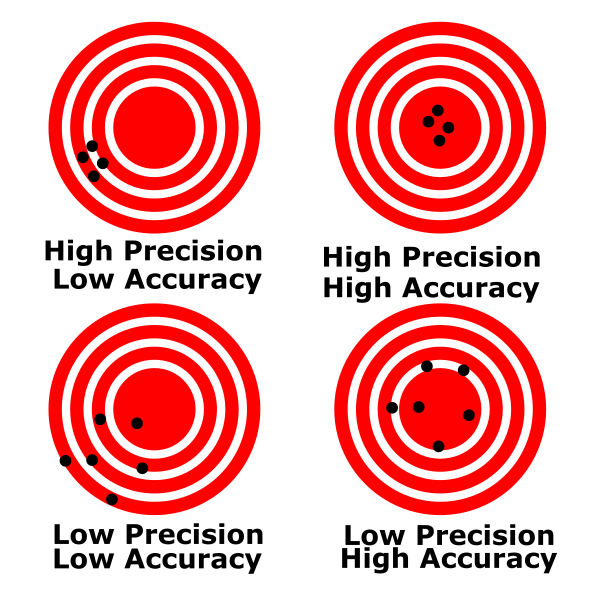
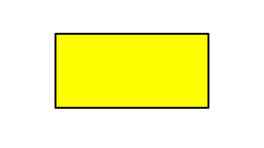

# Experimental Physics Primer

:::Intro (Welcome to PHYS6AL)
The goal of this assignment is to prepare you for the rest of the quarter, and even the next two quarters of the Physics 6 Lab series. This week we will discuss some of the mosst important concepts in experimental Physics, including: 

- **Uncertainty** and **Error**, including their quantification 
- Basic **Statistics**, including the meaning of mean and standard devation
- **Signifigant Figures** and their propogation

:::
---

# Collecting Data & Sources of Error
In physics, we the study of the laws of nature through observation and experiment. We compare the results with our theories and look for meaningful discrepancies that can either confirm them, or suggest that there is something beyond.  When our theories fail, we guess why and test our hypothesis with another well-thought-out experiment.

Clearly, experiments are a central component of Physics. We need them to both confirm our assumptions, as well as inspire new insights into the physical world. In an experiment, we perform measurements and collect data, then we interpret the data and derive trends and relationships between our variables.

## Uncertainty in measurement

When we measure a quantity, say the length of a pencil, we will never be able to measure the **true value** of the length. Instead, if we are careful and thoughtful in our measurement, we will get a length close to the true length, our **best estimate**. The most honest way to report our measurement to others is to provide our best estimate and a window of values in which the true length might fall. This window is called our **uncertainty**. We would typically write down the length of the pencil in the following format.

$$
15.33 \pm 0.05 \text{ cm}
$$

The 15.33 cm is our best estimate, and the 0.05 cm is our estimate of the uncertainty.  We are saying that our best guess at the true length of the pencil is 15.33 cm but the true length is most likely between 15.28 cm and 15.38 cm.

:::Note (uncert|2)
Uncertainty is unavoidable in every measurement!
:::
Error in a measurement is any deviation from the true value that is being measured. Error does not mean that you made a mistake.

There are two main types of errors: **Systematic** and **Random**.

## Systematic Error
:::Definition (Systematic Error)
**Systematic errors** are errors that arise due to the actions and choices of the *experimenter*. There are two especially important kinds of systematic error that we will frequently see in undergraduate courses:

- **Systematic error due to poor apparatus or measurement technique.** This would be the error you would expect if your ruler lines were inaccurate or your spectroscope was not properly calibrated.
- **Systematic error due to an incorrect mathematical model.** This common kind of error arises from applying the wrong *model* to your *data*, e.g., applying the equations of free fall to a feather to calculate the gravitational acceleration constant $g$, not considering the effects of air resistance.

:::

**Systematic errors** can arise from improper use of the measurement equipment, improper experimental techniques, or the use of an incorrect model. Systematic uncertainties are consistent between measurements: if you repeat the experiment in the same exact way, you'll get a very similar error. 

Systematic errors can be *very useful* in experimental science: the presence of a systematic error means that the experimenter can improve the experiment directly, *or* that there is a fundamental problem with one or more of the physical laws being used [fn]For example, the appearance of systematic errors is what particle physicists at CERN rely on to search for new physics beyond the Standard Model.[/fn]. 

:::Hider (|Systematic Error Examples)
Imagine that we are characterizing the properties of a pencil. Each of the following scenarios is an example of systematic error:

- @fa-pencil@ When we measure the length of the pencil, if the ruler is made out of metal and the temperature of the room is very low, the ruler might be contracted (while the wooden pencil is less so). That implies that the ruler is actually shorter than it should be, and our best estimate for the length of the pencil will always be larger than its true value.

- @fa-pencil@ If we didn't keep the line of sight perpendicular to the ruler when measuring the pencil length, the resulting measured length would be longer or shorter than the actual length of the pencil.

- @fa-pencil@ Say we measured the length, (maximum) radius and weight of the hexagonal pencil and wanted to characterize its density. If we modeled the area of the pencil cross section as a circle rather than a hexagon, our calculation for the resulting density would always be less than the actual density.

:::

We can reduce the prevalence of systematic errors in a number of ways[fn]While you can never completely get rid of it, ideally, systematic error should have *less* of an effect on your result than random error. We consider systematic error that is this weak to be negligible to the experiment.[/fn]. Most important, we can calibrate and check our equipment against standards *prior* to collecting data[fn]For example, you might double check that your scale is calibrated by measuring the weight of a known mass prior to taking data.[/fn]. We can also thoughtfully consider our measurement techniques, and if any steps in our procedure are introducing unnecessary systematic errors[fn]If you are measuring the extensibility of a spring by a sunny window, you might consider that the heating of the spring throughout the day might affect your data![/fn]. Finally, as we apply models to our data, we can think about whether our models are accurate for the given situation [fn]The equation for projectile motion that you learned in introductory physics might not apply to the motion of a feather as well as it does to that of a cannon ball.[/fn]. 

## Random Error

:::Definition (Random Error)
**Random errors** arise from the intrinsic statistical randomness of the experimental apparatus, the environment, or the phenomenon being investigated. Generally the experimenter has little to no **direct** control over random error.
:::
 
Random Error, unlike systematic error, has little to do with the experimenter. Even if we were able to exactly replicate an experiment multiple times, we would find that the resulting measurements differ from one another slightly. They are different from each other, and they are randomly distributed around a mean value, which we take to be our best estimate of the quantity that we are measuring. The source of random error is much like the operation of a [Galton Box](https://en.wikipedia.org/wiki/Bean_machine): even though you start out with the same setup, the final outcomes differ between trials -- there is inherent randomness, since the dropped bean has a 50/50 chance of going left or right at each peg. The best we can do is to repeat the experiment *many times* and discuss the *average* outcome.

:::Hider (|Random Error Examples)
Imagine that we are characterizing the properties of a pencil. Each of the following scenarios is an example of random error:

- @fa-pencil@ If you measured the weight of the pencil on a sensitive electronic scale, you would notice that the reading in last significant figure fluctuates due to factors such as electronic noise, air pressure fluctuations, and thermal fluctuations of the mechanical parts of the scale. 

- @fa-pencil@ When you measure the pencil, it is highly unlikely that the edges of the pencil are aligned with the ruler markings, regardless of how careful you are. Each time you measure the pencil's length, your resulting value is slightly different, especially when you are estimating the value between tick marks on the ruler.

- @fa-pencil@ If you and nine of your friends all measured the length of the pencil to one decimal place past the visible markings on your ruler, you would likely see that there is a spread of values that are close but do not agree.

:::

We can't eliminate random errors [fn] This is a deep and true fact about the nature of our universe. Even in the absence of [quantum mechanics](https://en.wikipedia.org/wiki/Quantum_mechanics), it would take an infinite number of measurements to pin down the value of a quantity to infinite precision, and hence an infinite amount of time and resources![/fn], but we can minimize *and characterize* them by using precise instruments, and by collecting a large data set for calculating the average of our measurements. Thus, we need to perform multiple trials by repeating the experiment several times to average out the random errors (and characterize the spread, or precision, of our results as a whole). 

**Random error leads to uncertainty in our measurement.**
This random error is what we quote in the above example as 0.05 cm. 

:::Note
The main points of this section are:

- Systematic error is controllable by the experimenter and should be limited as a source of error in our experiments.

- Random error is unavoidable and leads to uncertainty in our measurement.
:::

::::::Activity (randomerr|Recording Reaction Rate)
An example of a random error is your reaction time. If you time how fast a friend runs a mile, you may start or stop the stopwatch a little too early or a little too late.

1. Measure your reaction time by going to the following website:
[https://humanbenchmark.com/dashboard/reactiontime](https://humanbenchmark.com/dashboard/reactiontime)

2. Record your reaction time 10 times in a table.  Your table should look like Table 1:

:::Table
| Trial | Reaction Time (ms) | 
| -------- | -------- | 
| 1    |     | 
| 2  |     | 
| ...    |     | 
| 10    |     | 
:::

3. Watch the video below. It demonstrates how to make a nice table with Google Sheets.

:::Video
<iframe width="100%" height="100%"  src="https://www.youtube.com/embed/pnvFYFyK7zs" title="YouTube video player" frameborder="0" allow="accelerometer; clipboard-write; encrypted-media; gyroscope; picture-in-picture" allowfullscreen></iframe>
:::

:::Exercise
What is your average reaction time?
:::
:::Note
Make sure to include the table in your lab report. 
:::
::::::
 
 
 ## Accuracy vs. Precision
:::Figure (avp|s|R)

:::
Systematic errors introduce bias in one direction, causing your measurements to be consistently higher or lower than the accepted value. Hence, these errors directly influence the **accuracy** of your measurement.

Random errors are unbiased, so some of your measurements will be higher and some will be lower than the accepted value. Random errors will determine the **precision** of your measurement.

:::Definition (Accuracy and Precision|6 C)
**Accuracy** is a measure of how *close* your measured values are to the *accepted*  or *true* value.

---

**Precision** is a measure of how *close* your measured values, after you have repeated an experiment multiple times, are to each other.
:::

######

:::Quiz (accpre1| They are precise, but not accurate. --- Not Quite Right. Notice that the results are somewhat evenly above and below the accepted value, meaning that the value is accurate |They are accurate, but not precise. --- Arguable. Note, that the largest discrepancy is no more than 10% off from the actual value, so we can argue that the set of meaasurements are reasonably precise|They are both accurate and precise. --- Likely the best answer. Since the results are about evenly distributed above and below the accepted value and the deviations are not too large, we can easily argue that the result is both accurate and precise|They are neither accurate nor precise. --- Incorrect. Be sure you are evaluating the dataset scientifically and not subjectly! )

Zak conducts an astrophysical experiment five times and gets a distance of 1900 ly, 2100 ly, 1800 ly, 1900 ly, and 2200 ly. The known distance of the observed star is is 2000 ly. Which of the following are true about Zak's results?

:::

## Measures of Precision and Accuracy

To determine if a value is accurate, we compare it to the accepted one. A quantitative measure of accuracy is the **percent discrepancy**

::::::Definition (Percent Discrepancy)
The **Percent Discrepancy** measures the absolute percent difference between two measurements. We say that the *percent discrepancy of value 2 with respect to value 1 is:* 
:::Equation
$$\text{percent discrepancy} = |\frac{\text{value 1 - value 2}} { \text{value 1}}| \times 100\%$$
:::
The result of this calculation *is always a positive number*. It is a relative measure of accuracy with respect to the first value
::::::

When comparing your **experimental value to the accepted value** the accepted value will always appear in the denominator. 

:::Equation
$$\text{percent discrepancy} = |\frac{\text{accepted - experimental}} { \text{accepted}}| \times 100\%$$
:::

:::Exercise
In an experiment we measure the acceleration due to gravity to be $9.825\ \rm{m/s}^2$. The accepted value is $9.807\ \rm{m/s}^2$. What is the percent discrepancy in our measurement?
:::

Sometimes there is no accepted value to our measurement. In this case, to measure the precision of two measurements that are determined experimentally, we look at how different the two values are as a percentage of their average. This is known as the **percent difference**.

::::::Definition (Percent Difference)
The **Percent Difference** measures the relative percent difference between two measurements. We say that the *percent difference of value 2 with respect to value 1 is:* 
:::Equation pdiff
$$
\text{percent difference} = \frac{\text{value 1 - value 2}} {\text{average}} \times 100\%
$$
$$
\text{average} = \frac{\text{value 1 + value 2}}{2}
$$
:::
The result of this calculation can be a positive or negative number, depending on the relative magnitudes and signs of the two values. 
::::::

:::Note
Careful! The definition of percent difference in this course is **different** from what you may see in other courses. Please use  for calculations in this course.
:::

:::Exercise
In an experiment we make two measurements of the diameter of a tennis ball. They are $2.58$ in. and $2.61$ in.
What is the percent difference of the second measurement with respect to the first in our measurements?
:::

::: Note
When comparing two values, you have two options. 
1. When comparing your measured value to a value that is well accepted by the scientific community, you want to use percent discrepancy. When your percent discrepancy is low, your accuracy is high. This can be an indicator that you have eliminated systematic errors.
2. When comparing two values that are not generally accepted by the scientific community (two things you have measured), you want to use percent difference. When your percent difference is low, your precision is high. 
:::

## Estimating Uncertainty

We always want to do our best to estimate the uncertainty of our measurements. This can help us in our analysis of the data. A good estimate is one that is as small as reasonable without overstating your knowledge. There are two good methods for estimating uncertainty. 
1. Estimating from scales
2. Estimating from repeatability

### Estimating uncertainty from a scale
The first comes from using a graduated scale, like that of a ruler. For a scale, we say that the uncertainty is half of the smallest division on the scale. So if we were to use a standard meter stick that has 1-mm divisions, we would say that our uncertainty is $\pm 0.5$ mm. For a digital display, we say that the error is half of the last digit displayed. That is, if we were using an electronic balance to measure the mass of a stone and read $52$ g, then we would say our uncertainty is $\pm 0.5$ g. Thus we would report the stone's mass as $52.0 \pm 0.5 g$.

### Estimating uncertainty from repeatability
The second way we estimate uncertainty is by repeated measurement. Often times this allows us to quantify a more complex measurement. For instance, if we were to be use a stopwatch to time how long someone was in the air when they jumped, we shouldn't report the uncertainty by half of the last digit displayed. This is because our reaction time, how quickly we can press the start and stop button, is much larger than the precision of the stopwatch. Our reaction time makes it much harder to estimate the uncertainty of our measurement. 

In order to quantify the uncertainty of the stopwatch we will need to repeat our measurement multiple times and perform some statistical analysis. 

# Mean and Standard Deviation
To quantify the uncertainty in our measurements, we can conduct repeated measurements of the same quantity. 

If you take N measurements of a quantity $x$, you can get a better best estimate than any one of the measurements individually. This is done by finding the arithmetic average of your N measurements, known as **the mean.** The formula for the mean is:

:::Equation
$$x_{avg}=(x_1+x_2+..x_N)/N$$
:::

The standard deviation is a measure of the spread in the values $x_1, x_2,..., x_N$.

:::Equation
$$\text{STDEV}=\sqrt{\frac{\sum{(x_i-x_{avg})^2}}{N-1}}=\delta x$$
:::

The standard deviation gives an excellent estimate of our uncertainty due to random errors. Thus we can report our measurement as:

:::Equation fmt
$$
x_{avg} \pm \delta x
$$
:::

Where $\delta x$ is the standard deviation. We report the standard deviation to 1 significant figure. You can see more about this below.

:::Note
We report standard deviations to 1 significant figure! Please see the example in [Part V](#toc_Significant-Figures-and-Uncertainty)
:::

We will usually calculate the standard deviation by using the STDEV() function in Google Sheets.

::::::Activity
1. Use a stopwatch (either on your phone or online) to measure how long it takes you to say the sentence "I enjoy physics and learning about the laws of nature."  Make 10 measurements. Record these data in a new table.

2. Watch the video below. It will show you how to use Google Sheets to calculate the average and the standard deviation.

:::Video
<iframe width="auto"  src="https://www.youtube.com/embed/n4WhMAHr47I" title="YouTube video player" frameborder="0" allow="accelerometer; clipboard-write; encrypted-media; gyroscope; picture-in-picture" allowfullscreen></iframe>
:::

:::Exercise
Find the average and standard deviation of the time it takes you to say the sentence above. Report your results using the format of  [Eq](#Equation-fmt).
:::

:::Exercise
Find the standard deviation for your reaction time in the previous Activity 2. Report your full results (average and uncertainty) using the format of [Eq](#Equation-fmt).
:::

::::::

# Significant Figures

When we quote our measurements, the number of digits we write has to correlate with the precision of our measurement tool. When we read a scale, we can interpolate between two of the finest divisions on the scale to find the first uncertain digit.
For instance, if we use a scale whose finest divisions are 1 cm apart, we can quote a measurement as 1.6 cm.  We could not quote it as 1.6723 cm, since our ruler does not have that much precision.

For a scale whose finest divisions are 1 mm apart, we could quote a measurement as 1.67 cm, since the last digit mentioned (7, obtained by interpolation between neighboring mm marks) is the uncertain one.

To know the best way to write our answer, we must determine which **digits carry meaningful information**, and which ones do not. That is, we keep only those digits that are *significant*. We call these *significant figures*, which many people shorten to *sig figs*. These are all the digits whose values are certain, plus the first uncertain one.

To determine the number of significant figures, count from left to right the number of digits.

:::Card (|Example||bg-UCSB-navy text-white)
$1.6$ cm has two sig figs, whereas $1.67$ cm has three sig figs.
:::

Note that leading zeros after the decimal point are not significant. They merely determine the location of the decimal point.

:::Card (|Example||bg-UCSB-navy text-white)
$0.0167$ m has only three significant figures. (This is the $1.67$ cm quoted before.)

:::

Zeros at the end of a number (trailing zeros) can be significant or not depending on context. If the trailing zero is to the right of a decimal point then we will count it as significant. 

:::Card (|Example||bg-UCSB-navy text-white)
12.450 has five sig figs, while 12.45000 has seven sig figs.
:::

If the trailing zero is to the left of the decimal point it can be ambiguous. To avoid ambiguity we use the following convention. If the number ends in a decimal point, all of the zeros are significant. If the number does not end in a decimal point, the trailing zeros are not significant.

:::Card (|Example||bg-UCSB-navy text-white)
 4,510,000 has three sig figs, while 4,510,000. has 7 sig figs. 
:::

:::Exercise
Determine the number of significant figures in the following values:

1. 15.02

2. 42.120

3. 0.0004

4. 12300

5. 12300$.$ 

:::

## Significant Figures in Calculations
When we add a series of numbers, the one having the greatest uncertainty determines the number of significant figures in the final result.

:::Card (|Example||bg-UCSB-navy text-white)
For example, the sum 53.7 + 2.63 + 0.068 equals 56.4. Since we know the value 53.7 only to the tenths place, we cannot know the sum to anything less than that digit.
:::

When we multiply or divide, we take the number of significant figures in the answer to be the same as that of the quantity that has the lowest number of significant figures.

:::Card (|Example||bg-UCSB-navy text-white)
The result of the calculation (35 &times; 0.637)/256.3 is 0.087 (two sig figs).
:::

Certain multipliers, such as the 180, in 180/$\pi$, the conversion factor to go from radians to degrees, or the 2 in 2$\pi$r, the formula for the circumference of a circle, are exact.  They do not affect the number of significant figures in the result of a calculation in which they appear.

:::::: Activity

In this Activity you will practice the rules above by calculating some geometric properties of the following shapes. **Make sure your answers are written with the correct number of sig figs and with units.** 

Here is a rectangle with length 2.4 cm and width 3.2 cm.

:::Figure

:::
:::Exercise
1. What is the perimeter of the rectangle?

2. What is the area of the rectangle?
:::

Here is a circle with radius 2.4 cm.
:::Figure

:::

:::Exercise
What is the area of the circle? 
:::
::::::

:::Hider (|An Example)

Imagine that you've been given the mass of a block of material as 75 grams, and its dimensions as 2.5 cm &times; 3.1 cm &times; 6.3 cm (it is a rectangular parallelepiped). You are told to calculate its density. Since density is mass per unit volume, you multiply the three dimensions together, and then divide the result into 75.  You do this on a calculator. For the volume, you get 48.825 cm$^3$, and for the density, the calculator spits out 1.53609831 (depending on how many digits the display gives; the units are g/cm$^3$). It may be tempting just to write down all of those digits for the final result of the calculation. The Exercise is whether this is necessary, or whether such a number is actually meaningful. After all, given that we know the mass to the gram, and each dimension to the tenth centimeter, do we really know the density to ten nanograms per cc (the last digit in the result above), or to a microgram per cc (the 8), or even to a milligram per cc (the 6)?

The result of the density calculation above cannot contain more than two significant figures, and is properly written as 1.5 g/cm$^3$. To obtain this result, we round the three in the next place down. We always round to the nearest value of the last significant figure. To avoid biasing calculations that have multiple steps, we always round fives to the even number. For example, to two significant figures, 1.45 is 1.4, and 1.55 is 1.6.
:::

:::::::::Activity
::::::col l6
We submerge a piece of unknown material in water in order to measure its volume. We also use a scale to measure its mass. Ultimately we want to calculate the density of this object.

:::Exercise
What are the initial and final volumes (in mL) before and after the object is submerged? What is the volume (in mL) of the object?  Make sure you use the appropriate number of significant figures when stating all your answers.
:::

::::::
::::::col l6
:::Figure cyl m

Object submerged in cylinder
:::
::::::
:::Exercise
If the mass of the object is $57.868$ g, what is its density (in g/mL) ? Make sure you use the appropriate number of significant figures when stating all your answers.
:::
:::Exercise
Knowing that the density of platinum is $21.45$ g/mL, what is the percent discrepancy in your measurement?
:::
:::::::::

## Significant Figures in Unit Conversions
When you are converting between units, the conversions are treated as exact and don't affect the number of sig figs in your result.

:::Exercise
A dog is $2.0$ feet tall.  What is the height of the dog in mm to correct sig figs?
:::

## Significant Figures and Uncertainty
When we take data with an estimated uncertainty, the uncertainty will always be in the first uncertain figure. This is natural, of course, since digits beyond the location of the uncertainty of the number are washed out by the possible error.

:::Card (|Example||bg-UCSB-navy text-white)
If you measured a dog's height to be $101.537$ cm, but your ruler and technique suggested an uncertainty of $\pm 0.4$ cm, then naturally, the last significant figure in your measurement is '$5$', i.e., $ \text{Height of dog} = (101.5 \pm 0.4)$ cm 
:::

But how many significant figures should be reported in the uncertainty *itself*? The answer to this is easy! **The uncertainty is always reported with one significant figure,** for the same reason as above: the additional digits in the uncertainty are far less important than the first digit.

# Conclusion

:::Summary 

### INSTRUCTIONS
 1) Be sure you did all of the Activities and Answered all Exercises in this Lab
 2) Attach a brief conclusion summarizing the important points of this lab to your report.

**NOTE:** Make sure that *everything* has the correct number of sig figs, and that units are included when necessary.
:::

