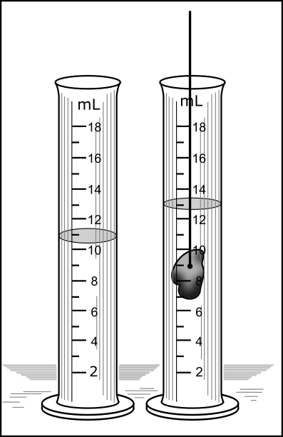
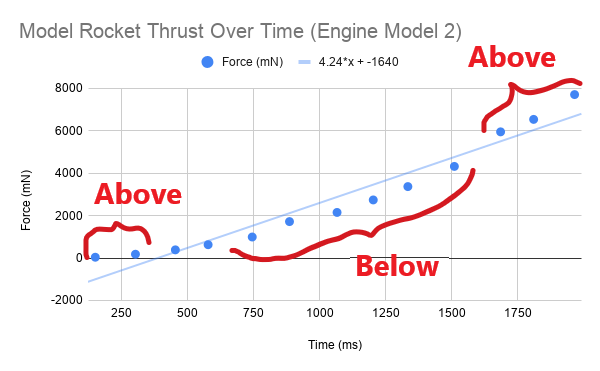
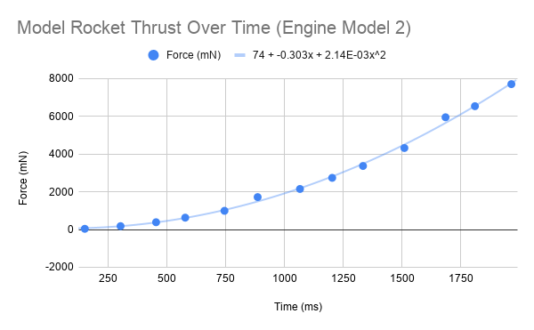
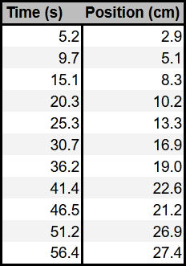

# Experimental Physics Primer

:::Intro (Welcome to PHYS6AL)
The goal of this assignment is to prepare you for the rest of the quarter, and even the next two quarters of the Physics 6 Lab series. This week we will discuss some of the most important concepts in Experimental Physics, including: 

- **Uncertainty** and **Error**, including their quantification 
- Basic **Statistics**, including the meaning of mean and standard devation
- **Signifigant Figures** and their propogation

---

After this discussion, we will review some best practices for scientific writing and presentation, including:
- What makes a good table.
- How to make a plot.
- What makes a good plot. 
- How to perform a fit to some data.
- Some guidance on how to determine if a plot is linear or not. 

:::
---

# Data & Sources of Error
In physics, we the study of the laws of nature through observation and experiment. We compare the results with our theories and look for meaningful discrepancies that can either confirm them, or suggest that there is something beyond.  When our theories fail, we guess why and test our hypothesis with another well-thought-out experiment.

Clearly, experiments are a central component of Physics. We need them to both confirm our assumptions, as well as inspire new insights into the physical world. In an experiment, we perform measurements and collect data, then we interpret the data and derive trends and relationships between our variables.

## Uncertainty in measurement

When we measure a quantity, say the length of a pencil, we will never be able to measure the **true value** of the length. Instead, if we are careful and thoughtful in our measurement, we will get a length close to the true length, our **best estimate**. The most honest way to report our measurement to others is to provide our best estimate and a window of values in which the true length might fall. This window is called our **uncertainty**. We would typically write down the length of the pencil in the following format.

$$
15.33 \pm 0.05 \text{ $\text{cm}$}
$$

The  $15.33\text{ cm}$ is our best estimate, and the  $0.05 \text{ cm}$ is our estimate of the uncertainty.  We are saying that our best guess at the true length of the pencil is  $15.33 \text{ cm}$ but the true length is most likely between $15.28 \text{ cm}$ and  $15.38 \text{ cm}$.

:::Note (uncert|4)
Uncertainty is unavoidable in every measurement!
:::
Error in a measurement is any deviation from the true value that is being measured. Error does not mean that you made a mistake.

There are two main types of errors: **Systematic** and **Random**.

## Systematic Error
:::Definition (Systematic Error)
**Systematic errors** are errors that arise due to the actions and choices of the *experimenter*. There are two especially important kinds of systematic error that we will frequently see in undergraduate courses:

---

 **Systematic error due to poor apparatus or measurement technique.** This would be the error you would expect if your ruler lines were inaccurate or your spectroscope was not properly calibrated.

 ---
 
 **Systematic error due to an incorrect mathematical model.** This common kind of error arises from applying the wrong *model* to your *data*, e.g., applying the equations of free fall to a feather to calculate the gravitational acceleration constant $g$, not considering the effects of air resistance.

:::

**Systematic errors** can arise from improper use of the measurement equipment, improper experimental techniques, or the use of an incorrect model. Systematic uncertainties are consistent between measurements: if you repeat the experiment in the same exact way, you'll get a very similar error. 

Systematic errors can be *very useful* in experimental science: the presence of a systematic error means that the experimenter can improve the experiment directly, *or* that there is a fundamental problem with one or more of the physical laws being used [fn]For example, the appearance of systematic errors is what particle physicists at CERN rely on to search for new physics beyond the Standard Model.[/fn]. 

:::Hider (|Systematic Error Examples)
Imagine that we are characterizing the properties of a pencil. Each of the following scenarios is an example of systematic error:

-  When we measure the length of the pencil, if the ruler is made out of metal and the temperature of the room is very low, the ruler might be contracted (while the wooden pencil is less so). That implies that the ruler is actually shorter than it should be, and our best estimate for the length of the pencil will always be larger than its true value.

-  If we didn't keep the line of sight perpendicular to the ruler when measuring the pencil length, the resulting measured length would be longer or shorter than the actual length of the pencil.

:::

We can reduce the prevalence of systematic errors in a number of ways[fn]While you can never completely get rid of it, ideally, systematic error should have *less* of an effect on your result than random error. We consider systematic error that is this weak to be negligible to the experiment.[/fn]. Most important, we can calibrate and check our equipment against standards *prior* to collecting data[fn]For example, you might double check that your scale is calibrated by measuring the weight of a known mass prior to taking data.[/fn]. We can also thoughtfully consider our measurement techniques, and if any steps in our procedure are introducing unnecessary systematic errors[fn]If you are measuring the extensibility of a spring by a sunny window, you might consider that the heating of the spring throughout the day might affect your data![/fn]. Finally, as we apply models to our data, we can think about whether our models are accurate for the given situation [fn]The equation for projectile motion that you learned in introductory physics might not apply to the motion of a feather as well as it does to that of a cannon ball.[/fn]. 

## Random Error

:::Definition (Random Error)
**Random errors** arise from the intrinsic statistical randomness of the experimental apparatus, the environment, or the phenomenon being investigated. Generally the experimenter has little to no **direct** control over random error.
:::
 
Random Error, unlike systematic error, has little to do with the experimenter. Even if we were able to exactly replicate an experiment multiple times, we would find that the resulting measurements differ from one another slightly. They are different from each other, and they are randomly distributed around a mean value, which we take to be our best estimate of the quantity that we are measuring. The source of random error is much like the operation of a [Galton Box](https://en.wikipedia.org/wiki/Bean_machine): even though you start out with the same setup, the final outcomes differ between trials -- there is inherent randomness, since the dropped bean has a 50/50 chance of going left or right at each peg. The best we can do is to repeat the experiment *many times* and discuss the *average* outcome.

:::Hider (|Random Error Examples)
Imagine that we are characterizing the properties of a pencil. Each of the following scenarios is an example of random error:

- @fa-pencil@ If you measured the weight of the pencil on a sensitive electronic scale, you would notice that the reading in last significant figure fluctuates due to factors such as electronic noise, air pressure fluctuations, and thermal fluctuations of the mechanical parts of the scale. 

- @fa-pencil@ When you measure the pencil, it is highly unlikely that the edges of the pencil are aligned with the ruler markings, regardless of how careful you are. Each time you measure the pencil's length, your resulting value is slightly different, especially when you are estimating the value between tick marks on the ruler.

- @fa-pencil@ If you and nine of your friends all measured the length of the pencil to one decimal place past the visible markings on your ruler, you would likely see that there is a spread of values that are close but do not agree.

:::

We can't eliminate random errors [fn] This is a deep and true fact about the nature of our universe. Even in the absence of [quantum mechanics](https://en.wikipedia.org/wiki/Quantum_mechanics), it would take an infinite number of measurements to pin down the value of a quantity to infinite precision, and hence an infinite amount of time and resources![/fn], but we can minimize *and characterize* them by using precise instruments, and by collecting a large data set for calculating the average of our measurements. Thus, we need to perform multiple trials by repeating the experiment several times to average out the random errors (and characterize the spread, or precision, of our results as a whole). 

**Random error leads to uncertainty in our measurement.**
This random error is what we quote in the above example as 0.05 $\text{cm}$. 

### Error in Action

The main points of the previous section were:

- Systematic error is controllable by the experimenter and should be limited as a source of error in our experiments.

- Random error is unavoidable and leads to uncertainty in our measurement.

We are now ready to see the effects of error in a real experiment. Please expand  and complete the instructions

::::::Activity (randomerr|Recording Your Reaction Time)
An example of a random error is the variation in your reaction time. Even if you have a good idea of how delayed your reaction to a signal is, it will always vary slightly, sometimes a little later and other times a bit earlier.

1. Measure your reaction time by going to the following website:
[https://humanbenchmark.com/dashboard/reactiontime](https://humanbenchmark.com/dashboard/reactiontime)

2. Record your reaction time 10 times in a table.  Your table should look like :

:::Table (rxn|Reaction Time|4 C)
| Trial | Reaction Time (ms) |
| ----- | ------------------ |
| 1     | ..                 |
| 2     | ..                 |
| ...   | ..                 |
| 10    | ..                 |
:::

3. Watch the video below. It demonstrates how to make a nice table with Google Sheets.

:::Video
<iframe width="100%" height="100%"  src="https://www.youtube.com/embed/pnvFYFyK7zs" title="YouTube video player" frameborder="0" allow="accelerometer; clipboard-write; encrypted-media; gyroscope; picture-in-picture" allowfullscreen></iframe>
:::

:::Exercise (|2 Points)
1. Provide a copy of the table you made, ensuring that all rows and columns are properly labelled and all data has appropriate units and sigfigs. You can do this by copying your table from Google Sheets to your Google Doc Lab Notebook.
2. What is your average reaction time?
:::
::::::
 
 
 ## Accuracy vs. Precision
:::Figure (avp|s|R)
![A visual guide to Accuracy vs. Precision. There are four dart boards shown, each with some darts placed. The first dart board has four darts clustered south-west of the target, with the text "High Precision. Low Accuracy". The second dart board has four darts clustered over the target, with the text "High Precision. High Accuracy". The third dart board has five darts spread loosely over the south-west of the dart board, with the text "Low Precision. Low Accuracy". The final dart board has five darts spread roughly over the center of the target, with the text "Low Precision. High Accuracy". ](imgs/Primer/targets.png "A visual guide to Accuracy vs. Precision. Notice that accuracy gauges how close darts are landing to the bullseye while precision considers only how close they are to each other")
:::
Systematic errors introduce bias in one direction, causing your measurements to be consistently higher or lower than the accepted value. Hence, these errors directly influence the **accuracy** of your measurement.

Random errors are unbiased, so some of your measurements will be higher and some will be lower than the accepted value. Random errors will determine the **precision** of your measurement.

:::Definition (Accuracy and Precision|6 C)
**Accuracy** is a measure of how *close* your measured values are to the *accepted*  or *true* value.

---

**Precision** is a measure of how *close* your measured values, after you have repeated an experiment multiple times, are to each other.
:::

######

:::Quiz (accpre1| They are precise, but not accurate. --- Not Quite Right. Notice that the results are somewhat evenly above and below the accepted value, meaning that the value is accurate |They are accurate, but not precise. --- Arguable. Note, that the largest discrepancy is no more than 10% off from the actual value, so we can argue that the set of meaasurements are reasonably precise|They are both accurate and precise. --- Likely the best answer. Since the results are about evenly distributed above and below the accepted value and the deviations are not too large, we can easily argue that the result is both accurate and precise|They are neither accurate nor precise. --- Incorrect. Be sure you are evaluating the dataset scientifically and not subjectly! )

Zak conducts an astrophysical experiment five times and gets a distance of $1900 \text{ ly}$, $2100 \text{ ly}$, $1800 \text{ ly}$, $1900 \text{ ly}$, and $2200 \text{ ly}$. The known distance of the observed star is is $2000 \text{ ly}$. Which of the following are true about Zak's results?

:::

## Measures of Precision and Accuracy

To determine if a value is accurate, we compare it to the accepted one. A quantitative measure of accuracy is the **percent discrepancy**

::::::Definition (Percent Discrepancy)
The **Percent Discrepancy** measures the absolute percent difference between two measurements. We say that the *percent discrepancy of value 2 with respect to value 1 is:* 
:::Equation
$$\text{percent discrepancy} = |\frac{\text{value 1 - value 2}} { \text{value 1}}| \times 100\%$$
:::
The result of this calculation *is always a positive number*. It is a relative measure of accuracy with respect to the first value
::::::

When comparing your **experimental value to the accepted value** the accepted value will always appear in the denominator. 

:::Equation
$$\text{percent discrepancy} = |\frac{\text{accepted - experimental}} { \text{accepted}}| \times 100\%$$
:::

:::Exercise (|1 Point)
In an experiment we measure the acceleration due to gravity to be $9.825\ \rm{m/s}^2$. The accepted value is $9.807\ \rm{m/s}^2$. What is the percent discrepancy in our measurement?
:::

Sometimes there is no accepted value to our measurement. In this case, to measure the precision of two measurements that are determined experimentally, we look at how different the two values are as a percentage of their average. This is known as the **percent difference**.

::::::Definition (Percent Difference)
The **Percent Difference** measures the relative percent difference between two measurements. We say that the *percent difference of value 2 with respect to value 1 is:* 
:::Equation pdiff
$$
\text{percent difference} = \frac{\text{value 1 - value 2}} {\text{average}} \times 100\%
$$
$$
\text{average} = \frac{\text{value 1 + value 2}}{2}
$$
:::
The result of this calculation can be a positive or negative number, depending on the relative magnitudes and signs of the two values. 
::::::

:::Note
Careful! The definition of percent difference in this course is **different** from what you may see in other courses. Please use  for calculations in this course.
:::

:::Exercise (|1 Point)
In an experiment we make two measurements of the diameter of a tennis ball. They are $2.58 \text{ in}$. and $2.61 \text{ in}$.
What is the percent difference of the second measurement with respect to the first in our measurements?
:::

::: Note (comparing|9 C)
**When comparing two values, you have two options:**
1. When comparing your measured value to a value that is well accepted by the scientific community, you want to use percent discrepancy. When your percent discrepancy is low, your accuracy is high. This can be an indicator that you have eliminated systematic errors.
2. When comparing two values that are not generally accepted by the scientific community (two things you have measured), you want to use percent difference. When your percent difference is low, your precision is high. 
:::

## Estimating Uncertainty

We always want to do our best to estimate the uncertainty of our measurements. This can help us in our analysis of the data. A good estimate is one that is as small as reasonable without overstating your knowledge. There are two good methods for estimating uncertainty. 
1. Estimating from scales
2. Estimating from repeatability

### Estimating uncertainty from a scale
The first comes from using a graduated scale, like that of a ruler. For a scale, we say that the uncertainty is half of the smallest division on the scale. So if we were to use a standard meter stick that has $1\text{ mm}$ divisions, we would say that our uncertainty is $\pm 0.5\text{ mm}$. For a digital display, we say that the error is half of the last digit displayed. That is, if we were using an electronic balance to measure the mass of a stone and read $52\text{ g}$, then we would say our uncertainty is $\pm 0.5 \text{ g}$. Thus we would report the stone's mass as $52.0 \pm 0.5 g$.

### Estimating uncertainty from repeatability
The second way we estimate uncertainty is by repeated measurement. Often times this allows us to quantify a more complex measurement. For instance, if we were to be use a stopwatch to time how long someone was in the air when they jumped, we shouldn't report the uncertainty by half of the last digit displayed. This is because our reaction time, how quickly we can press the start and stop button, is much larger than the precision of the stopwatch. Our reaction time makes it much harder to estimate the uncertainty of our measurement. 

In order to quantify the uncertainty of the stopwatch we will need to repeat our measurement multiple times and perform some statistical analysis. 

# Mean and Standard Deviation
To quantify the uncertainty in our measurements, we can conduct repeated measurements of the same quantity. 

## Mean
If you take N measurements of a quantity $x$, you can get a better best estimate than any one of the measurements individually. This is done by finding the arithmetic average of your N measurements, known as **the mean.** The formula for the mean is:

:::Equation (mean|The Arithmetic Mean)
$$x_{avg}=(x_1+x_2+..x_N)/N$$
:::

## Standard Deviation
The standard deviation is a measure of the spread in the values $x_1, x_2,..., x_N$.

:::Equation (std| The Standard Deviation)
$$\text{STDEV}=\sqrt{\frac{\sum{(x_i-x_{avg})^2}}{N-1}}=\delta x$$
:::

The standard deviation gives an excellent estimate of our uncertainty due to random errors. Thus we can report our measurement as:

:::Equation (fmt)
$$
x_{avg} \pm \delta x
$$
:::

Where $\delta x$ is the standard deviation. We report the standard deviation to 1 significant figure. You can see more about this below.

:::Note (|7 C)
We report standard deviations to 1 significant figure! Please see the example in [Part V](#toc_Significant-Figures-and-Uncertainty)
:::

## Calculating Statistical Quantities with a Spreadsheet
In our intro courses, we will usually calculate the standard deviation by using the STDEV() function in Google Sheets. In  you will practice this with real data.

::::::Activity (speakingspeed| Speaking Speed)
**Instructions:**
1. Use a stopwatch (either on your phone or online) to measure how long it takes you to say the sentence "I enjoy physics and learning about the laws of nature."  Make 10 measurements. Record these data in a new table.

2. Watch the video below. It will show you how to use Google Sheets to calculate the average and the standard deviation.

:::Video
<iframe width="100%" height="100%"   src="https://www.youtube.com/embed/n4WhMAHr47I" title="YouTube video player" frameborder="0" allow="accelerometer; clipboard-write; encrypted-media; gyroscope; picture-in-picture" allowfullscreen></iframe>
:::

:::Exercise (|2 Points)
1. Provide a copy of the table created for the speaking speed exercise
2. Find the average and standard deviation of the time it takes you to say the sentence above. Report your results using the format of  .
:::

::::::

:::Exercise (|1 Point)
 Find the standard deviation for your reaction time from . Report your full results (average and uncertainty) using the format of .
:::

# Significant Figures

When we quote our measurements, the number of digits we write has to correlate with the precision of our measurement tool. When we read a scale, we can interpolate between two of the finest divisions on the scale to find the first uncertain digit.
For instance, if we use a scale whose finest divisions are 1 $\text{cm}$ apart, we can quote a measurement as 1.6 $\text{cm}$.  We could not quote it as 1.6723 $\text{cm}$, since our ruler does not have that much precision.

For a scale whose finest divisions are 1 mm apart, we could quote a measurement as 1.67 $\text{cm}$, since the last digit mentioned (7, obtained by interpolation between neighboring mm marks) is the uncertain one.

To know the best way to write our answer, we must determine which **digits carry meaningful information**, and which ones do not. That is, we keep only those digits that are *significant*. We call these *significant figures*, which many people shorten to *sig figs*. These are all the digits whose values are certain, plus the first uncertain one.

To determine the number of significant figures, count from left to right the number of digits.

:::Card (|Example||bg-UCSB-navy text-white)
$1.6$ $\text{cm}$ has two sig figs, whereas $1.67$ $\text{cm}$ has three sig figs.
:::

Note that leading zeros after the decimal point are not significant. They merely determine the location of the decimal point.

:::Card (|Example||bg-UCSB-navy text-white)
$0.0167 \text{ m}$  has only three significant figures. (This is the $1.67$ $\text{cm}$ quoted before.)

:::

Zeros at the end of a number (trailing zeros) can be significant or not depending on context. If the trailing zero is to the right of a decimal point then we will count it as significant. 

:::Card (|Example||bg-UCSB-navy text-white)
$12.450$ has five sig figs, while $12.45000$ has seven sig figs.
:::

If the trailing zero is to the left of the decimal point it can be ambiguous. To avoid ambiguity we use the following convention. If the number ends in a decimal point, all of the zeros are significant. If the number does not end in a decimal point, the trailing zeros are not significant.

:::Card (|Example||bg-UCSB-navy text-white)
 $4,510,000$ has three sig figs, while $4,510,000.$ has 7 sig figs. 
:::

Finally, if the final significant figure in a number is a 0 to the left of the decimal and it is not in the ones's place, you must write that number in [scientific notation](https://en.wikipedia.org/wiki/Scientific_notation). Scientific notation is the preferred notation in much of STEM because significant figures are unambiguous.
:::Card (|Example||bg-UCSB-navy text-white)
 $4,510,000$ has three sig figs, while $4.5100 \times 10^{6}$ has 5 sig figs. 
:::

:::Exercise (|2 Points)
Determine the number of significant figures in the following values:

1. 15.02

2. 42.120

3. 0.0004

4. 12300

5. 12300$.$ 

:::

## Significant Figures in Calculations
You will often have to do calculations with numbers that have significant figures. This section discusses the basic rules. 
When we add a series of numbers, the one having the greatest uncertainty determines the number of significant figures in the final result.

:::Card (|Example||bg-UCSB-navy text-white)
For example, the sum $53.7 + 2.63 + 0.068$ equals $56.4$. Since we know the value $53.7$ only to the tenths place, we cannot know the sum to anything less than that digit.
:::

When we multiply or divide, we take the number of significant figures in the answer to be the same as that of the quantity that has the lowest number of significant figures.

:::Card (|Example||bg-UCSB-navy text-white)
The result of the calculation $(35 \times 0.637)/256.3$ is $0.087$ (two sig figs).
:::

Certain multipliers, such as the $180$, in $180/\pi$, the conversion factor to go from radians to degrees, or the $2$ in $2\pi r$, the formula for the circumference of a circle, are exact.  They do not affect the number of significant figures in the result of a calculation in which they appear.

:::Note (|10 C)
When working with sigfigs, a rule for best practices is to do any rounding at the **end** of your calculation when possible. Read more in "Rage Against the Machine"
:::

:::Hider (|Rage Against the Machine: when the calculator is wrong)

Imagine that you've been given the mass of a block of material as $75\text{ g}$, and its dimensions as $2.5 \text{ cm} \times3.1 \text{ cm} \times 6.3 \text{ cm}$ (it is a rectangular parallelepiped). You are told to calculate its density. Since density is mass per unit volume, you multiply the three dimensions together, and then divide the result into $75$.  You do this on a calculator. 

For the volume, you get  $48.825\text{ cm}^3$, and for the density, the calculator spits out $1.53609831$ (depending on how many digits the display gives; the units are $\text{g/cm}^3$). 

It may be tempting just to write down all of those digits for the final result of the calculation. The question is whether this is necessary, or whether such a number is actually meaningful. After all, given that we know the mass to the nearest gram, and each dimension to the nearest tenth-of-a-centimeter, do we *really* know the density to ten nanograms per cc (the last digit in the result above), or to a microgram per cc (the $8$), or even to a milligram per cc (the $6$)?

Ultimately, **the result of the density calculation above cannot contain more than two significant figures**, and is properly written as $1.5 \text{ g/cm}^3$. To obtain this result, we round the three in the next place down. We always round to the nearest value of the last significant figure. To avoid biasing calculations that have multiple steps, we always round fives to the even number. For example, to two significant figures, $1.45$ is $1.4$, and $1.55$ is $1.6$.
:::

::::::::::::Exercise (|2 Points)
Practice the rules above by calculating some geometric properties of the following shapes. **Make sure your answers are written with the correct number of sig figs and with units.** 

:::::::::Figure (measure|m|Row)
::::::row
:::col
 A rectangle with length $2.4$ $\text{cm}$ and width $3.2$ $\text{cm}$.')
:::
:::col
 A circle with a radius of $2.4$ $\text{cm}$.')
:::
::::::
:::::::::

1. What is the perimeter of the rectangle?

2. What is the area of the rectangle?

3. What is the area of the circle? 
::::::::::::

::::::Exercise (|2 Points)
We submerge a piece of unknown material in water in order to measure its volume. We also use a scale to measure its mass. The results of this process are shown in  Ultimately we want to calculate the density of this object.

:::Figure (cyl|s|R)

:::
1. What are the initial and final volumes (in mL) before and after the object is submerged? What is the volume (in mL) of the object?  Make sure you use the appropriate number of significant figures when stating all your answers.
2. If the mass of the object is $57.868$ g, what is its density (in g/mL) ? Make sure you use the appropriate number of significant figures when stating all your answers.
3. Knowing that the density of platinum is $21.45$ g/mL, what is the percent discrepancy in your measurement?
::::::

## Significant Figures in Unit Conversions
When you are converting between units, the conversions are treated as exact and don't affect the number of sig figs in your result.

:::Exercise (|1 Point)
A dog is $2.0$ feet tall.  What is the height of the dog in mm to correct sig figs?
:::

## Significant Figures and Uncertainty
When we take data with an estimated uncertainty, the uncertainty will always be in the first uncertain figure. This is natural, of course, since digits beyond the location of the uncertainty of the number are washed out by the possible error.

:::Card (|Example||bg-UCSB-navy text-white)
If you measured a dog's height to be $101.537$ $\text{cm}$, but your ruler and technique suggested an uncertainty of $\pm 0.4$ $\text{cm}$, then naturally, the last significant figure in your measurement is '$5$', i.e., $ \text{Height of dog} = (101.5 \pm 0.4)$ $\text{cm}$ 
:::

But how many significant figures should be reported in the uncertainty *itself*? The answer to this is easy! **The uncertainty is always reported with one significant figure,** for the same reason as above: the additional digits in the uncertainty are far less important than the first digit.
# Making a Good Table
In the previous assignment you learned some basics about how to make a table for your lab report. Here we will write down the requirements for any table that you submit. Expand the box below to see the requirements.

:::Hider (|Recipe for a Good Table)
**In order for the table to convey the data scientifically, it must contain:**

1. Data organized in columns with descriptive headers that specify variable names and **units**.  If a table must span multiple pages, a header needs to be added for every page.
2. Correct number of significant figures for the data. 
3. All data in a column aligned at the decimal point.
4. If you have any calculations in your table, then you should show your work for **one row** of the table. 
:::

In  we show an example of an excellent table and a not-so-great table. Just by glancing at them, you can probably guess which table is which -- the bad table is visually confusing and difficult to read, independent of its poor technical qualities.

:::::::::Figure (table_ex|s|Row)
::::::row
::: col
 Table 1")
:::

::: col
 Table 2")
 
:::
::::::
:::::::::

In (a), the two variables that were measured are clearly described, the headers have units, the values have the proper number of sig figs, and their decimal points are aligned. In (b) the variables are not clearly described. Even if you could determine what the two columns represent, there is no way for you to know the units. Is it seconds and millimeters? Hours and nanometers? Years and feet?

Your goal with a table, is to communicate what you did as simply as possible to those reading your report. For this class, that means your TA, who will be grading your report. If you are clear in your thoughts and your tables, it is more likely that your TA will be able to understand any mistakes you make. This will allow them to provide better feedback, and maybe even take off fewer points. If your TA can't follow what you did, they are more likely to take off points.

# How to make a proper graph
Graphs help us visualize the **relationship between two variables**: the independent variable (on the x-axis) and the dependent variable (on the y-axis). If you are unfamiliar with these terms, take note of their definitions below:

:::Definition (Independent & Dependent Variables)
An **independent variable** is one that *doesn't* depend on anything else. In experiments, this might be the variable the experimenter is directly changing. Often times, but not exclusively, it is a variable that you are measuring directly (e.g. repeating an experiment with a number of different masses, who's mass you obtain directly from a scale). 

---

A **dependent** variable is one that *does* depend on the other variables. In experiments, this might be the variable the experimenter has no direct control over, and who's behavior they are probing. Often times, but not exclusively, this is a variable that you get from doing calculations.
:::

Often times in the lab manual we will ask you to plot "this vs. that." When we ask you to plot something with this format, that means plot "dependent variable vs. independent variable."

## Creating a Good Graph

:::Hider (|Recipe for a Good Graph)

1. Identify the independent and dependent variables, and make sure you put them on the correct axes. 
2. Determine the range of each variable. Your data should take up most of the area of your plot. There *should not* be any large blank areas.
3. Clearly label each axis with the variable name and unit of measurement.
4. Plot the data as a scatter plot. DO NOT "connect the dots."
5. Draw the line of best fit (usually linear) and include its equation.
6. Provide a descriptive title that communicates the scenario that you are plotting.
:::

When it comes to a title, **don't** provide a title like "Distance vs. Time." This is a bad title. This information can be determined from just looking at the axes. Your title should describe what is happening, *e.g.*, "Distance Traveled by Car on Vacation Trip."

, below, is an example of a good plot, which shows the relationship between the color (wavelength) of the light emitted by several different LEDs and the measured voltage at which they turn on.  The Inverse Wavelength is the independent variable and the Turn-on Voltage is the dependent variable.

:::Figure (goodgraph|xl)
$ vs. Inverse Wavelength $(\mu^{-1})$")

:::

Notice that the data take up the entire plot; there are no large blank areas. Both of the axes are labeled and have units. The data points are not connected, and there is a line of best fit. There is also a title for the plot that lets us know what the experimenter was doing.

:::Exercise (|3 Point)

In this exercise you will use the six rules above to identify mistakes in graphs that other students have made.

1. Identify mistakes in the following graph.

2. Identify mistakes in the following graph.

3. Identify mistakes in the following graph.

4. Identify mistakes in the following graph.

5. Identify mistakes in the following graph.

:::

:::Note (|8 C)
Every time your graph contains these mistakes in this or subsequent labs you will be deducted points.
:::

## Curve Fitting

Curve fitting gives you the relationship between the two variables, highlighting the strongest trend in the data. It is determined by the entire data set, which makes it more accurate than using only a single data point. Thus, it reduces experimental errors.

Choosing which curve to use (line, parabola, exponential, etc.) for your data can take some practice. Your choice may depend on a few factors.

- What does theory suggest it should be?
- What message are you trying to convey to the reader?
- Do the data suggest that you've selected the correct curve?

For most of Physics 6\*L you will be doing linear fits to data, but there will be occasions where we need something non-linear. For that reason, we will provide examples mainly of linear fits, but keep in mind that these guidelines apply to any curve fit. 

## How to analyze a fit

For this example we will consider a student, Jillian, who is investigating different types of engines in her model rocket. She wants to evaluate the thrust of the different engines as a function of time. 

1.  **Outliers**. These may be due to experimental error or to mistakes in typing the data into the plotting program. When you see an outlier you should stop and assess it. In this class, more often than not, it is because a scale was read wrong, some data were transcribed incorrectly, or there was an error in the data collecting tool.

:::Note (|6 C)
Never remove an outlier without a good reason!
:::

On her first run, Jillian sees an outlier in her data set, shown in . She takes a closer look at her measurement system and realizes that there is a loose cable, which causes intermittent failures. She decides that this run was not valid, and she does the experiment again.

:::Figure (jill1|xl)

 Jill's Line of Best Fit and apparent outlier
:::

2. The curve fit is **balanced**, *i.e.*, roughly the same number of points lies above the line as below it. This time Jillian plots her data in  and sees what looks like a balanced fit with no outliers. There is roughly the same number of points above and below the line of best fit. 

:::Figure (jill2|xl)

Line of Best Fit after removing the outlier
:::

3. As shown in , the data should be randomly above and below your fit. For instance, if you fit a line to your data and notice that data start off below the line, then go above, and then below again, your data likely aren't represented by a line, but by something else. 

When Jillian takes data for her second engine, plots and does a linear fit, she obtains the plot in .

:::Figure (jill3|xl)

:::

Notice that the data start above the fit, then go below the fit, then back above the fit. Jillian recognizes that this means her data are not linear, because the data should be randomly above and below the fit as in Figure 4.

She reads the manufacturer data sheet for the second engine, and learns that the thrust should increase quadratically in time, so she decides to fit a parabola to the data, as in .

:::Figure (jill4|xl)

:::

Notice that the curve follows the data more closely and that the data are randomly distributed around the curve. This is sign of using the correct function to fit the data.

::::::Activity

Below are two plots of the [population of California from 1900 to 1950](https://www.macrotrends.net/states/california/population). The data are the same in both of the plots, but each plot has a different fit. The first one is a linear fit, and the second is an exponential fit.

:::Figure

Linear
:::

:::Figure

Exponential
:::

:::Exercise (|1 Point)
Which function fits the data better -- linear or exponential? Explain your reasoning.
:::
::::::

## Significant Figures in the Line of Best Fit
Just as with all physical quantities, a trend or slope estimated from data is subject to the limits of significant figures for reporting purposes. In the case of the line of best fit, which may be calculated from tens -- if not hundreds -- of data points, the number of significant figures isn't directly inherited from the number of sig figs present in your data. This is something that must be estimated from the entire set of data you are working with.

We have to be clear about what a sig fig is, so we know how many digits to keep! When we talk about a sig fig, we are actually talking about a measure of *uncertainty*. For example, if I measure and record a velocity of $1.2 \text{ m/s}$, I am saying that the actual value of this velocity is greater than $1.15 \text{ m/s}$ and less than $1.25 \text{ m/s}$ -- in other words, that the true velocity lies in this interval of numbers that *round* to $1.2 \text{ m/s}$; hence, the "2"  is the smallest significant digit.

The same principle applies for lines of best fit: we need to determine the smallest digit that is not sensitive to the random nature of a real set of data, which will never fall exactly on a trend line. While the math and concepts that we need to fully understand this procedure are often employed in upper-division labs with error analysis components, we can use spreadsheets to help us determine the error. By using the function "LINEST," we can make a spreadsheet provide us with the values for the slope and intercept, as well as the error in those values. The error will tell us the correct number of sig figs needed. We will demonstrate how to use this below.

To determine the least significant digit in your slope, you round the value of $m$ to the digit that coincides with the first non-zero decimal place of the uncertainty. For example, if you obtained $m = 12.9274...$ and an uncertainty of $0.038273$, you would report in your notebook $m= 12.93$. This is very similar to using the "STDEV" function that we used in .

:::Note
When determining the number of sig figs to report in our slope or intercept we will rely on the standard error reported by the LINEST function.
:::

## Significant Figures in More Complex Curve Fits

:::Table (pot| Potential Energy of a Spring |3 R )
| Length (m) | Potential Energy (J) |
| ---------- | -------------------- |
| 0.021      | 0.012                |
| 0.043      | 0.212                |
| 0.065      | 0.372                |
| 0.085      | 0.740                |
| 0.107      | 1.061                |
| 0.129      | 1.850                |
| 0.150      | 2.310                |
| 0.169      | 2.756                |
| 0.191      | 3.764                |
| 0.209      | 4.121                |
| 0.228      | 4.752                |
| 0.249      | 6.250                |
| 0.267      | 7.563                |
:::

If we are doing more complicated curve fits than just lines, we require more knowledge about programming or higher level math. That is above what is needed in this class. For all of the physics 6\*L classes, we will just use the following convention:

:::Note (|8 C)
The number of sig figs in a non-linear curve fit will be limited by the number of sig figs in your data.
:::

As an example, if we collected data on the amount of potential energy a spring has as a function of its displacement from equilibrium, we might get data like those in 

:::Figure (SpringPlot|l|L)

:::

Since we expect the result to be quadratic, *i.e.*, that it takes the form $ax^2+bx+c$, that is the fitting function we have used. The results are displayed above the graph as $82.8x^2-3.69x-0.16$ with $a=82.8$, $b=3.69$, and $c=-0.16$. If we were to report $a$, $b$ or $c$, or do any calculations with them, we would need to use the correct number of sig figs.  

To determine the correct sig figs we look to our data table. Since the lowest number of sig figs in either the length or the force is two, we will treat $a$, $b$ or $c$ as having only two sig figs. Thus, $a=83$, $b=3.7$, and $c=-0.16$. 
Again, this is not a standard way of treating the data, but a convention that we are taking on for this class. 

# Working with a Spreadsheet
Now that we have talked about what makes a good table, plot, and curve fit, we will show you how to do this for yourself. Spreadsheets will make your life **MUCH** easier. We highly recommend that you take the time to learn how to use them. It will be a useful skill for all of your Physics 6\*L lab courses, and you probably will even find it useful in the real world. 

We will walk through plotting and fitting the data in . We will assume that you can make a table from having done the first lab. These data are recorded by a car traveling from San Diego to San Francisco. The driver marked the distance traveled in kilometers roughly every 60 minutes. Once the car got on the freeway, the driver put on cruise control and  never stopped (what amazing mileage!). 

**We want to answer the question: at what speed, in mph, did the driver set their cruise control?**

We know that for an object traveling at a constant velocity, $v$, starting at position $x_0$, that its position, $x$, as a function of time, $t$, is given by the following linear equation:

:::Equation

$$
x = vt+x_0
$$
:::

Our plan here is to convert the data table into units of miles and hours so that we can answer the question in the correct units, then to fit a line to our data, where the slope should be the velocity. 

## Using Equations in a Spreadsheet

The driver took data in units that we would like to convert. We do that in a spreadsheet program by using equations and functions. Watch the video below for instructions on how to use sheets to help with conversions.

:::Video

<iframe width="100%" height="100%" src="https://www.youtube.com/embed/Nv4Ty11e00k" title="YouTube video player" frameborder="0" allow="accelerometer;  clipboard-write; encrypted-media; gyroscope; picture-in-picture" allowfullscreen></iframe>
:::

## Using Spreadsheets to make a plot

Now that we have made our table, let's plot our data and do a fit. We will have to use the LINEST function in sheets to give us the error and number of sig figs in our measurement. Watch the video below, which demonstrates all of this.

:::Video
<iframe width="100%" height="100%"  src="https://www.youtube.com/embed/wkqlSuAoFLQ" title="YouTube video player" frameborder="0" allow="accelerometer; clipboard-write; encrypted-media; gyroscope; picture-in-picture" allowfullscreen></iframe>
:::

 

# Using Google Sheets to Analyze Data

Use all of the tools we have discussed in this lab to analyze the motion of an inchworm. 

:::::::::Activity
:::Figure (inchworm-data|xl)

:::

Here is a table of data that a student collected by monitoring an inchworm as it traveled around a table. The student measured the position of the inchworm at various times as it went around the table. Here are the data:

:::Exercise (|2 Point)
1. Using a similar analysis as for the car above, what is the speed of the inch worm in inches per minute? Make sure you answer with the correct number of sig figs and show the uncertainty in your measurement.
2. Include a copy of your final table that you used to calculate this quantity
:::

:::Note (|8 C)
Make sure to include your final table with all the columns you made, a sample calculation for one row of your table, and the graph in your report.
:::

::::::::::::

# Conclusion

:::Summary 

---

Be sure you did all of the **Activities** and answered all **Exercises** in this Lab

**NOTE:** Make sure that *everything* has the correct number of sig figs, and that units are included when necessary.
:::

