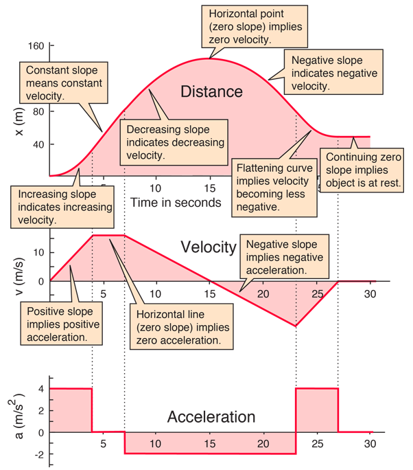
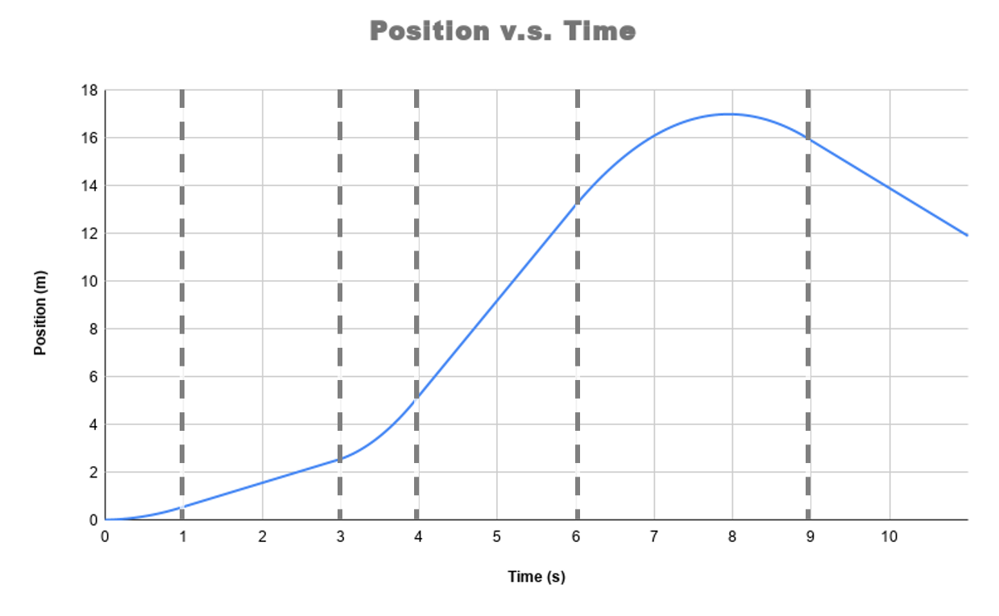

# Position, Velocity, Acceleration, and Falling Objects

:::Intro (This Week's Topic: Motion!|Objects for Dropping --- Feather, Basket Ball, Dog Ball|Stopwatch| Large Measuring Tape | Graph Paper)
This week we will review how to describe, mathematically, the trajectory of a body moving under the influence of a force. For your Pre-Lab, you will sharpen your calculational abilities on some test problems, and make some educated guesses about the influence of **air resistance**.

Following this discussion we will turn our attention to a real experiment. You will analyze the data from this "real-world" experiment, compare the results to the predictions of the "ideal" theory, and then draw inferences about the underlying physics. 

:::

::::::Prelab
**Prior to Lab**, please complete the following:
:::center
  , , , , 
:::

Your TA will check your notebook at the beginning of class.
::::::
---

# Keeping Track of Motion in 1D

For a body in motion, we are typically concerned with three variables which characterize the trajectory of some object. The first and most familiar is the **position**, which tells you where an object is at some instant, with reference to some coordinate system. The position of an object, however, is not always useful — think about a fast moving car on the highway: while you may know which exit you saw it at in one instant, you won't know where the car is a few minutes later unless you know its **velocity**. The velocity of a car, as you instinctively know, tells you something about how its position *changes in time*. 

Now, if that car happens to be on Route 405 in Los Angeles, even knowing its velocity won't help you figure out where it is minutes later — the heavy LA traffic means that the car's velocity could change at a moment's notice! This change in velocity over time is called **acceleration**. 

:::Definition (Variables of Motion in 1D)

The **position**, $x(t)$, quantifies where a body is located in space at a given time. In this lab, this is simply the *height* of an object above the ground.

--- 

The  **velocity**, $v(t)$, quantifies how the *position* of an object changes over time. It is a measure of the speed *and* direction the object is traveling at a given time.

--- 

The **acceleration**, $a(t)$, quantifies how the *velocity* of an object changes over time. Physically, it originates from the forces acting on the body through $F=ma$.

:::

These three variables are interrelated, as each of the latter two quantities tells you about the *change over time* of the previous one [fn]You may wonder what a change in acceleration is. This is called [*jerk*](https://en.wikipedia.org/wiki/Jerk_(physics)).We could go on to define the change in jerk and so on, but as it turns out, the three variables in our current discussion are often more than adequate to describe most kinds of motion[/fn]. In this lab, we will learn about what these relationships mean in both a qualitative and quantitative way. Since we are going to experiment with these concepts by dropping a ball off the side of Broida, the remaining discussions in the manual will focus on this scenerio.

:::Note (vectors|7 C )
Unlike the simple case of 1D motion, when we are considering motion in 2D (a plane) or 3D (a volume), all three quantities must be expressed as *vectors*, with independent components for each possible direction of motion. 
:::

## Motion with No Forces

To make our discussion concrete, we should review some basic physics for the case in which there are no forces acting on the body of interest. In this and the following sections, we will do thought experiments on what happens to a ball as it is released in various scenarios, similar to the experiment you will perform. 

### An Object at Rest

The first case of force-free motion to consider is a body starting at **rest**.
:::Definition (Rest|6 C)
An object at **rest** has a velocity of $v=0 \text{ m/s}$ in the frame of interest. 
:::

From , , and your intuition alone, you can probably guess what happens to an object at rest when no force is acting upon it. Take a minute to consider the situation and try answering the *Check Your Understanding* box below ;;;Don't worry — This isn't graded!;;;.

:::Quiz (rest| $0\text{m}$ --- No! Would mean that the speed was $-2.5\text{m/s}$|$25 \text{m}$ --- Correct! Since the ball is stationary  $$v_0= 0\, \text{ m/s}$$ so it is still at $y=25\text{ m}$!| $250\text{ m}$ --- No way! Go back and check your work.)
 Let's imagine that that at $t=0$, we have a ball at **rest** at a height $y_0= 25 \text{m}$. There are no forces acting on the ball. What is its position at $t=10\text{s}$?
:::
:::Figure (noforce|m|R)

:::
Indeed, when there are no forces acting on a body, there is no acceleration; hence, the body's velocity does not change. Since the ball started at rest, e.g. $v(0\text{s})= 0\text{ m/s}$, it *stayed* at rest[fn] You might recognize this as Newton's 1st Law — the law of inertia![/fn]. Since the ball remains at rest, it's position doesn't change.

### An Object with Non-Zero Velocity
Now we imagine that this ball is given an initial velocity $v_0 = + 10$ m/s by being tossed upwards, with no forces acting upon it after its release (for example, in space).  Since no forces are acting on the ball, the *change* in the velocity must be zero, so $v(t) = v_0=10 \text{ m/s}$ for all time.  Note that the time, $t$, does not appear in this equation!

Since the velocity tells you how an object's *position* is changing with time, and we know that the velocity in the absence of force is constant, we can say that the position of the ball will increase by $10$ meters per second that passes. 

:::Quiz (const_vel| $125 \text{ m}$ --- Correct! The ball traveled for $10\text{ s}$ at $10\text{ m/s}$, meaning it travelled $10\text{ s} \times 10 \frac{\text m}{\text s} = 100$m from its initial position of $25$m|$25 \text{ m}$ --- Careful! This is where the ball would be if it was at rest.| $250 \text{ m}$  --- Don't multiply random numbers together — make sure your math makes physical sense.)

From the discussion above, we deduce that a ball that started at $x_0 = 25 \text{ m}$ with an initial velocity of $v_0 = 10\text{ m/s}$ at $t= 10\text{ s}$ will be located at $y(10 \text{s})$ =

:::

:::::::::Figure (constvel|l|Row)
::::::row
:::col
 When there is no force, the velocity remains constant")
:::
:::col
 Constant velocity, like constant position, appears as a perfectly horizontal line")
:::
::::::
:::::::::

Generally, in the absence of external forces, we can capture this relationship mathematically as:

:::Equation (noforcep|Position at Constant Velocity)
$$
y(t) = v_0 t + y_0
$$

:::
In plain English, the above mathematical sentence translates to: "The position of the ball at a given time is equal to the distance it travels per unit of time (*e.g.*, seconds), multiplied by the time that has passed, plus its original position." Really make sure you understand this statement before moving on.

:::Exercise (noforce)
In space (no gravity), a ball is shot towards a wall at a velocity of $7.5 \text{ m/s}$. The ball hits the wall and perfectly reflects after collision, maintaining the same *speed*. At $t= 4 \text{ s}$, the ball is measured to be $20 \text{ m}$ from the wall.

1. Did any forces act on the ball? Defend your answer, explicitly referencing the ball's initial and final velocities as needed.
2. How far was the ball from the wall initially? ;;;Hint: Try breaking the problem into two parts  — before the collision and after — and writing down the constant velocity equations;;;
3. Sketch a graph of the ball's distance from the wall over time.
:::

## Motion Under Constant Acceleration
Once we include external forces acting on a body, we now must think about how the velocity changes over time. Consider that we repeat this experiment on the moon, so that our ball is accelerating toward the ground at approximately $a = -1.6$ m/s$^2$. 

Before we can think about how the *position* of the ball changes over time, we first have to analyze the *velocity*. Similar to  for change in position, our equation for velocity is now:

:::Equation (constant-force| Velocity under Constant Acceleration)
$$
v(t) = a t + v_0 
$$
:::

:::Quiz (const-force| $ 6\text{ m/s}$ --- Careful about your signs! A positive velocity means that the ball is traveling *away* from the ground.| $ 16\text{ m/s}$ --- Careful about your signs! Is the acceleration in the same direction as the initial velocity?|$ -6\text{ m/s}$ --- Correct! By multiplying the change of velocity per unit time by the elapsed time, we can get the change in velocity)
Using , we find that at $t = 10 \text{ s}$ our ball that had an initial velocity of $v_0 = 10 \text{ m/s}$ has a final velocity of: 
:::

While the  easily lets us calculate the velocity at any time during constant acceleration, the changing velocity becomes an issue when we try to calculate the new position of our ball. Since now the velocity is continually changing,  is no longer correct. We can see from Graph (a) in  that the expression for position as a function of time is no longer a simple linear relationship!

:::::::::Figure (withforce|xl|Row)
::::::row
:::col 
 Position vs. time in the presence of an external force")
:::
:::col 
 Velocity vs. time in the presence of an external force")
:::
::::::

 
:::::::::

### Position during constant acceleration

You might guess the equation for position is some kind of quadratic function after seeing . This is correct — given the relationship between velocity and acceleration above, it is an exercise in calculus to show that the following relationship is true:

:::Equation (positionwithforce| Position under Constant Acceleration)
$$
y(t) = \frac{1}{2} at^2 + v_0 t 
+y_0
$$
:::

:::Quiz (const-force2| $ 45\text{ m}$ --- Great Job.)
Putting it all together, for the ball on the moon, we have that $x(10\text{ s}) = $ 
:::

:::Exercise (quadratic)
Zak launches a ball straight up into the air, from the ground, at $5 \text{ m/s}$. 
1. How long does it take for the ball to reach the ground again? ;;;Hint: When the ball reaches the ground again, y=0 ;;;
2. How long does it take for the ball to reach the highest point of its arc?
3. What is the ball's maximum height?
:::

## Analyzing the Motion of Falling Objects

In the last example, we considered the motion of an object under constant acceleration due to gravity.  In our experiment this week, we will explicitly test the validity of this model under earth's gravity, using a number of different objects. As is generally true in experimental physics, we face the possibility that our theoretical models may only be partially right. Our job will be to figure out in what situations the theoretical model applies and in which it doesn't. For the cases that the model *fails*, we will inspect our data and develop a hypothesis as tto **why** it has failed. 

:::Exercise (confounded)
In the previous section we discussed the ideal behavior of a ball under constant acceleration. Brainstorm three possible reasons why the time it takes for a ball to reach the ground after being dropped in our real-life experiment may not match the theoretical prediction.
:::

### Where can our theory go wrong?

When dropped from the same height, which one of these objects &mdash; stone or feather &mdash; will hit the ground first? Most people will say, "That depends." If this is done in a normal room, the stone wins, as your intuition may tell you. If, however, it is done in a *vacuum*, which contains no air, both hit the bottom at the same time! The question we would like to answer is: "How does the presence of the air change the equations of motion for falling objects?"

Using a stopwatch, you will measure the time it takes for various objects to hit the ground after being dropped from one of Broida's balconies of varying height. In this experiment, we ultimately have two questions to answer:
 1. Which, if any, of the objects will match our expectations of motion under constant acceleration?
 2. Which, if any, of the objects will defy these expectations and *how*?

Quantitatively, both of these questions are essentially asking you to compare the theoretical & measured time to hit the ground, $t_f$, and draw a conclusion from any agreement or disagreement. 

:::Exercise (tffromy)
If $t_f$ is the time that the ball has hit the ground again, then $y(t_f)=0$.
Using , write out an equation that solves for $t_f$ for an object at rest at an initial height of $y_0$. You can assume that the experiment takes place on earth so that $a=g$. ;;;Hint: Watch your signs before and after applying the squareroot!;;;

:::
# Preparing for the Experiment 
Generally, it is good practice to set up your lab notebook *prior* to an experiment to make sure that you record all of the necessary data in a legible manner. In this portion of the Prelab, we will go ahead and do this in a Google Sheet [fn] Spreadsheet programs are not typically used in real scientific experiments, but in the spirit of equity and freely available software for students, we believe this is the best choice[/fn]. If you have completed the previous lab, you should have enough experience with Google Sheets to follow along with the following activity. If you haven't, please return to [Lab 0](?linkfile=Lab0) to complete it now.

::::::Activity (sheets|Setting Up our Notebook)
So that we can quickly and efficiently gather our data in person, and make an analysis, please follow along with this activity to set up a datatable.

1. Open a new Google Sheet and Create a Table with 3 rows for data similar to  
   :::Table (droptable| Processed Data)
   | Drop Height| Theoretical $t_f$ | Object 1 Avg. Measured $t_f$| Object 1 Percent Difference|
   |-------|-------|-------|-------|
   | ... | ... |... | ... |
   | ... | ... |... | ... |
   | ... | ... |... | ... |
   ::: 

2. Inside each column header you just made, specify the correct units that the measurement will be made in.
3. From your answer to , set up a function in Google Sheets that will automatically display theoretical $t_f$ using the drop height.
4. Using the definition of [Percent Difference](?linkfile=lab0#Definition-PercentDifference), create a google sheet function that will automatically calculate the values in this column once the data is entered.
5. Next, below this table, make a table to record individual measurements for an object, similar to . Each lab partner making a measurement should get their own column. Each column should be labeled with the appropriate units in your version.
 :::Table (avgtable| Raw Data Object 1)
   | Drop Height| Firstname_1 Measured $t_f$ | Firstname_2 Measured $t_f$| Avg Measured $t_f$|
   |-------|-------|-------|-------|
   | ... | ... |... |... |
   | ... | ... |... |... |
   | ... | ... |... |... |
 ::: 

 6. Use a Google Sheet function so that once the data is entered for each lab partner, the average is automatically calculated.

:::Exercise (completedtable)

1. Make copies of your version of  for each object that will be dropped.
2. For Objects 2 and 3, create additional columns in  to record their drop heights and percent difference. Your final table should have eight columns.
3. Make a copy of   and  in your lab notebook. Make sure the table is easily readable and properly formatted prior to class so that your TA can verify that you have done the prelab.
:::
::::::

# The Experiment

We are now ready to move ahead and conduct the experiment. You have done most of the hard work in the lab already! On the day of your laboratory experiment, please be sure your completed work is available to be checked by your TA.

## Collecting Drop Times
:::Materials (Objects for Dropping --- Feather, Basket Ball, Dog Ball|Stopwatch| Large Measuring Tape | Graph Paper)
:::

In  we will look at different balls being dropped from the walkways of Broida Hall.

How do the properties of these sport balls affect how they fall?

::::::Activity (ball-drop|Making the measurement)
**Instructions:**
1. Round up the objects for the test drop and head out to the designated dropping area with your TA. 
2. Using the measuring tape, determine the height from the drop zone to each of the floors. The railing makes for a good 
reference point from where you or one of your group members will drop things.

:::Exercise (collect-heights)

1. What is the distance from the drop zone to the rail on the second floor?
2. What is the distance from the drop zone to the rail on the third floor?
3. What is the distance from the drop zone to the rail on the fourth floor?
:::

3. Before you drop anything, be sure the drop zone is clear of people! From the second, third, and fourth floors of Broida, have one team member release an object from the recorded height and let it fall to the ground while the other team members time the fall. Be sure you release the object cleanly without imparting an initial upward or downward 
speed, *i.e.* that the object is released from **rest**.
4. Record the times measured by each group member ;;;Each member of your group should have an identical copy of *all* data;;;
5. Repeat this procedure, including recording data for several objects.
::: Warning
Do not throw the objects to the upper floors. Use the stairs. 
:::

:::Exercise
1. Fill in the drop height data and your team's raw measurements of $t_f$ into your raw data tables. Include a copy of these tables here. Make sure that this data and all calculated columns have the correct number of significant figures and have labeled units as necessary.
2. Use the calculated average $t_f$'s to fill in the theoretical table, and include a copy of the final table in this exercise. 
:::
::::::

## Analyzing Drop Times

Now that you have collected and organized your data, we can now analyze the results and answer the original questions:
 1. Which, if any, of the objects will match our expectations of motion under constant acceleration?
 2. Which, if any, of the objects will defy these expectations and *how*?

 walks you though a shot analysis, by plotting the theoretical behavior against your real data sets.
::::::Activity (analy)

1. Using the data in your Processed Data table, for each object, graph the height $y$, vs. measured fall time $t_f$. Label your graph with the proper units. Your graph should have 
four points for each object;;;Hint: what is tf for a height of 0? ;;;. 

2. On the same graph, also plot the theoretical fall time calculated.; and compare this to your original data.

:::Exercise
1. Which of the objects **most closely** follow the theoretically predicted drop time?
2. Which of the objects have the greatest percent difference with the theoretically predicted drop time?
3. For the object in part (b), is the percent difference greater for higher or lower drop heights?
:::

3. For the object in with the greatest percent difference with the theoretically predicted drop time, use Google sheets to create a line of best fit with the measured data (excluding the origin)

:::Exercise
1. What is the slope of the line of best fit, including units?
2. What is the physical meaning of the line of best fit?
:::

::::::

## Discussing Our Results

If all things in the lab have gone well, you likely found that at least one of your objects has a suspiciously linear-looking $y_0$ v.s. $t_f$ graph. This is seemingly in direct conflict with our expectations for objects experiencing constant acceleration. What use are the these theoretical models if they get such a simple experiment wrong?

It turns out, however, that our lengthy discussion in [Part I](#part1), upon a closer inspection actually *resolves* our problems. Recall that the the velocity of an object, in the absence of acceleration, remains constant. In a world without gravity, if we had performed the experiment by dropping an object with an initial velocity $v_0$ from a height of $y_0$, it would reach the ground at a time $t_f = y_0/v_0$. This relationship is *linear* in height, just like some of our data. 

:::center
**Wait, what? But we live in a world** ***with*** **gravity!**
:::

Indeed, some of our objects behave in a way that looks like they are ignoring gravity after a few moments of time. The reason for this is that their motion through the air generates an **additional force**  proportional to and in the direction opposite of their velocity. As an object falls under the influence of gravity, eventually the decelleration from air resistance will cancel the acceleration from gravity, leading to an **object experiencing motion under no net force**.  below lets you explore this interactively. 

:::Simulation (balldrop)
<iframe src="https://kapawlak.github.io/PhDemoJS/Apps/BallDrop/Page.html"  height="1000" style="border:none;width:100%"> </iframe>

:::

:::Exercise (FinalevalAR)
Reflect on the trajectories of the dropped objects and their properties.
1. Which objects, according to your data, were most influenced by air resistance as discussed?
2. Does it make sense to you that these mentioned objects were affected most by air resistance? What physical properties to they have that might lead to high air resistance?
:::

:::Exercise (Finalevalall)
We now want to discuss the impact of factors other than air resistance. 
1. Do you think that the uncertainty introduced by you and your lab partner's reaction times is significant in this experiment? Please answer this quantitatively, referencing your measured reaction time from this [Exercise](linkfile?=Lab0#Activity-randomerr) in Lab 0 and comparing it to the *variance* in measured times
2. Do you think that there any environmental factors that could have significantly altered the results of the experiment? ;;;Hint: consider things such as wind, weather, accidentally imparting a v0;;;
:::

# Conclusion

:::Exercise
Write a brief conclusion summarizing the important points of this lab.
:::

:::Summary 
Make sure to include all tables, plots, pictures, drawings, screenshots or anything else asked of you in the exercises, in your report, as well as answers to all the questions.

**All responses and answers should contain the correct number of sig figs and should include units when needed.**
:::

# Old Stuff

::::::::::::Hider (|Stuff from old manual that doesn't really fit.)

### General Properties of Motion Curves
:::Figure (graphs|m|R) 

 Constant Position vs. Time")

 Linear Position vs. Time")

 Quadratic Position vs. Time")

:::

Before you start the lab, we have one last theoretical discussion: given a plot of position versus time, how can we make quantitative and qualitative statements about the physics of a falling object? 

To answer this, we have two important statements to make from the discussion above:

1. The velocity of an object at a certain time is the slope of the distance-time graph at that point.
2. Similarly, the acceleration of an object at a certain point is the slope of the velocity-time graph at that point.

Before we discuss this, there are three plot shapes that are important to understand for this analysis: constant, linear, and curved. 

Constant refers to a value that is not changing with time; the plot is a horizontal line as shown in  <u>a</u>. Linear refers to a value that is changing with time, whose plot has a constant slope as shown in <u>b</u>. Curved refers to a value that is changing with time, and for which the slope of the plot is changing with time, as shown in <u>c</u>.

, obtained from from Hyperphysics, shows the trajectory of a body whose acceleration is constant for each segment of time. Acceleration being constant for each segment is important for simplifying our plots.
:::row
:::
<u>a</u> shows the three plots unobstructed. For each section of the plots, notice how the velocity plot and the position plot correspond to each other. Also notice how each of these plots and the acceleration plot correspond to each other.

######

:::::::::Figure (motiongraphs|m|Row)
::::::row
::: col l6

:::

:::col l6

:::
::::::
:::::::::

 In particular notice that:
 - Whenever the position plot is linear, the velocity is constant. 
 - Whenever the position plot is curved, the change in velocity is linear (the acceleration is constant). 
 - If the position is curving upwards, the velocity is positive.
 - If the position is curving downwards, the velocity is negative. 
 - The acceleration plot corresponds to the velocity plot in exactly the same way that the velocity plot corresponds to the position plot.

 <u>b</u> shows the same graphs as in panel a, with descriptions for selected points on the top two graphs, of the information that one can infer from the graphs as those points. Please study the plots, and the notes in panel b, to understand how the plots are related to each other.

:::::: Exercise (analysis)
Now that you have gained familiarity with position, velocity and acceleration plots, you can do analysis. In this exercise you will take a new position plot and create sketches of the velocity and acceleration plots. Please see Figure 6 below.

:::Figure (pvtsketch|l)

:::

The dashed lines indicate where the plot changes from one of the plot shapes mentioned above, to another. 

1. Make a sketch plot for velocity with dotted lines in the same positions. ;;;A sketch is just a quick drawing to display the important features of a plot, e.g., linear, parabolic or constant. You should label the axes, but you don't need a title.;;;

2. Sketch the velocity curve for each segment in your skeleton plot.

3. Do the same to make an acceleration plot. Please note that you will now have to refer to the velocity plot instead of the position one.

4. Describe the motion in words. What is happening to the object in each segment of time? 

:::Note
Make sure to take a picture of your sketch plots and include them in your report along with the description.
:::

::::::

::::::Activity drop

In this exercise you will be collecting data for the height of a ball in free fall versus time. All four balls will be dropped, but you will **be taking data only for the basketball.** The data for the other balls have been taken for you.

We have annotated  for you with the height measurements and an embedded stopwatch. These will be useful tools for your data collection.

**Instructions:**

1. Watch  and see how each ball falls to the ground. 

2. Take 10 data points by making the video pause, and recording the distance from the top, and the timestamp on the embedded stopwatch. 

3. Place your recorded data points in a table with the headers "Time (s)" and "Y_Basket (m)."

:::Video balldrop
<iframe width="auto"  src="https://www.youtube.com/embed/OZn--kkp2vA" title="YouTube video player" frameborder="0" allow="accelerometer; clipboard-write; encrypted-media; gyroscope; picture-in-picture" allowfullscreen></iframe>

:::

::::::

### Simulation
To get a feel for the concepts in this lab, feel free to play with . You can adjust the sliders to see how different conditions affect the trajectory of the ball. Observe how increasing or decreasing air resistance affects the shape of the graph! In this lab you will explore this phenomenon by using your analytical and mathematical skills.
	

### Understanding & Organizing Data
You have now collected some data for a basketball falling from the sixth floor of Broida! As mentioned above, three other balls were dropped from the same point at Broida. Rather than have you repeat the same data collection, we have collected data for you by using a piece of software called Tracker.

Tracker allows us to monitor the location of the ball at every frame of the video, which happens once every 1/30 second. This method has two advantages:

1. We are able to identify the location of the ball more precisely than we could, say, by eye.
2. We are able to collect many more data points than we could if we did so by hand.

Below is a short video demonstrating how we used the Tracker software to collect data for the four drops.

:::Video

<iframe width="100%" height="100%" src="https://www.youtube.com/embed/hvwjn3tAtqc" title="YouTube video player" frameborder="0" allow="accelerometer; clipboard-write; encrypted-media; gyroscope; picture-in-picture" allowfullscreen></iframe>

:::

The data you will need are in the box below, including a link to the google sheet holding them.

:::Hider Table of Data
<iframe width="100%" height ="400px" src="https://docs.google.com/spreadsheets/d/e/2PACX-1vRjap_R4TFvQqlPgrOHBNpjmNz1h0AOOVBmnvw95l6yJlgL8EKgRB0ahCc4HR-Pt9Qvho_yBRfRecRE/pubhtml?gid=0&amp;single=true&amp;widget=true&amp;headers=false"></iframe>

[Link to Google Sheet](https://docs.google.com/spreadsheets/d/1XI2mEKyuVftiG0uhUlS6Iah3zZuiGx1tUE5g1-e0ZIw/edit?usp=sharing)  

:::

Please open the link to the Google Sheet data when you are ready to start [Ex](#Ex-table).

:::::: Exercise table
**Instructions:**
1. Start by copying the data linked in Table 1 into a separate spreadsheet. 
2. Now you will insert the data that you took for the basketball into the table and plot all four ball drops on one plot. For instructions on how to do this, watch the following video. 

:::Video

<iframe width="auto"  src="https://www.youtube.com/embed/PT6GM85ut4I" title="YouTube video player" frameborder="0" allow="accelerometer; clipboard-write; encrypted-media; gyroscope; picture-in-picture" allowfullscreen></iframe>

:::
::::::

### Analyzing the Data

### Qualitatively Understanding your Data
In  you will begin analyzing the drop data. You will apply what you learned in the Introduction to real data, and try to **infer** something about the underlying physics.

:::Activity anal
**Instructions:**

1. Start by just looking at your data. 
    - **Analyze them qualitatively by using the tools you learned in Part 1 of the lab.** 
    - Try to determine for which parts of each drop the balls are falling under constant acceleration or constant velocity.
2. Notice that the data sets for the dog ball, basketball and volleyball all look very similar. The beach ball data are quite different from the other three data sets. Pick one of the three similar data sets and the one for the beach ball, and **sketch**[fn] A sketch is just a quick drawing to display the important features of a plot, *e.g.*, linear, parabolic, or constant. You should label the axes and the two lines, but you don't need a title. You shouldn't spend more than five minutes drawing this.[/fn] a velocity vs. time plot for both data sets on the same graph.
3. Examine the velocity lines, and interpret them to translate the plot into a brief description (one or two sentences) of the drop for both balls.
4. Take a picture of your sketch and include it in your lab report, being sure to include your description.

:::

### Quantitatively Understanding your Data
In , for each of the datasets, you will perform a polynomial fit of degree 2. This will draw a line of best fit by using a quadratic function. That is, it will attempt to fit the equation:

:::Equation fit
$$
y = ax^2+bx+c
$$
:::

The computer will adjust $a$, $b$, and $c$ to best fit the data provided. Let's start by understanding what $a$, $b$, and $c$ are.

 looks a lot like our equation for motion (kinematic equation). Let's relate  to the kinematic equation. We do this in the table below. Each row starts by defining the variable. The next column has the symbol we use to represent the variable in the fit. The final column has the equivalent symbol used in the kinematic equation.
:::Table (eq)
| Variable Name | Fit Symbol | Kinematic Symbol |
| -------- | -------- | -------- |
| Time     | $x$     | $t$     |
| Position | $y$    | $y$    |
| Acceleration| $a$ | $\frac{1}{2}g$ |
| Initial Velocity | b |  $v_0$ |
| Initial Position | c | $y_0$
:::

::::::Activity (fit)
**Check your understanding:** 

It is critical that you understand a few concepts before moving forward. Below are three questions. Read them and spend a few minutes trying to answer them for yourself. When you think you have the answers, click the link at the bottom to reveal the answers. 

1. For an ideal fall (one that the kinematic equation describes exactly), what should the value of $a$ in your fit be?
2.  For a drop like the ones in the video, where the ball is released from rest, what should the value of $b$ in your fit be?
3. When the origin is defined as the release point of the ball, as it is in the video, what should the value of $c$ in your fit be?

:::Hider Answers
1. The value of $a$ in your fit should be $\frac{g}{2}$, which is approximately $4.9$ m&middot;s$^{-2}$
2. The value of $b$ in your fit should be $0$ m&middot;s$^{-1}$, because the ball is being released from rest. It has no initial velocity.
3. The value of $c$ in your fit should also be $0$ m. This is because $c$ is the initial position of the ball, and we defined the origin to be the point where the ball is released.

Keep in mind, these answers are for an ideal (not real world) drop. When we drop a ball in the real world, there will be factors and errors that shift the value of $a$, $b$, and $c$ from the ideal values. 
:::

After answering these questions, return to your spreadsheet and play with the curve fitting tools in Google Sheets. If you need a reminder for how to do curve fitting, please refer to the video from the last lab:

:::Video
<iframe width="auto"  src="https://www.youtube.com/embed/wkqlSuAoFLQ" title="YouTube video player" frameborder="0" allow="accelerometer; clipboard-write; encrypted-media; gyroscope; picture-in-picture" allowfullscreen></iframe>
:::

:::Note
This exercise is designed to help you understand curve fitting. Nothing needs to be submitted for this exercise.
:::

::::::

### Quantitatively Understanding your Data 2
In [Ex](#Ex-quant) we will be more quantitative about our analysis. We will perform specific fits to our data and use the results to analyze the underlying physics in our experiment. 

::::::Activity quant
**Instructions:**

1. For each of the drops, perform a polynomial fit of degree 2. 
2. Create a table to summarize the information from your fits. **Hint:** $a=\frac{g}{2}$, so make sure to solve this for $g$ before putting it in your table. Your table should look like the following:

:::Table

| Parameters| Ideal Drop | Dog Ball | Basketball | Volleyball | Beach Ball|
| -------- | -------- | -------- | -- | -- | -- |
| Gravitational Accel. [*g*] (m/s$^2$)     |      |      |   |   | |
| Initial Velocity  (m/s)   |      |      |   |   | |
| Initial Position    (m) |      |      |   |   | |

:::

3. Calculate the percent discrepancy of the acceleration from ideal for each of the four drops. You can do this in a spreadsheet if you'd like, but please show your work for **one** of the calculations. 

:::Exercise 
1. What is the cause of this systematic error in the measurement of $g$?

2. Based on the picture of the balls, and what you know about the balls generally, why do you think the systematic error is different for the different balls? 
:::

4. Now let's look more closely at the initial velocity and intital position for the different drops. Do you notice that as the drops get farther from ideal, the initial velocity and the inital position get farther from ideal as well?

:::Exercise
1. What is the percent difference in initial velocity of the beach ball and the basketball?

2. What is the percent difference in initial position of the beach ball and the basketball?
:::

The smaller error (percent discrepancy) in the value of $g$ for the basketball indicates that it has less systematic error, or that it is a better representation of our model (objects falling under constant acceleration). The large percent difference the beach ball has in the initial velocity and initial position relative to those for the basketball, combined with the larger percent discrepancy in the value of $g$ for the beach ball, hints that the beach ball strongly doesn't follow the constant acceleration model.

::: Question
If the beach ball isn't falling under constant acceleration, what model might it be falling under?
:::

5. Create one more plot of only the beach ball falling, but use only one second of data near the end, where the plot looks most linear.
6. Perform a linear fit on these data.

::: Question
From your linear fit: 
1. What is the slope of the line?

2. What does the slope represent?
:::

::::::

::::::::::::