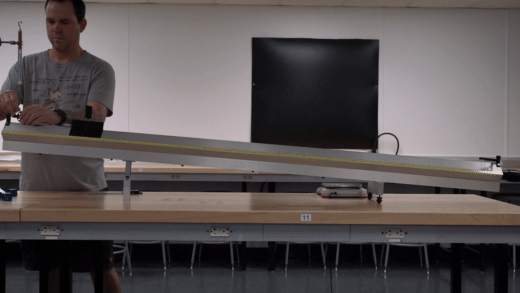
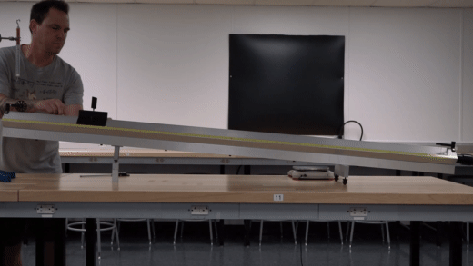
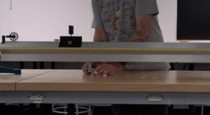

# Forces and Motion

:::Intro (This Week|Air Track|Glider|Riser Block|Force Meter|Scale|Stopwatch)
This week we will look at the quantity that we call energy, and its transformations. In classical physics, there are two categories of energy:
 1. Kinetic Energy &mdash; what you may know as *energy of motion*, or the energy stored in the inertial motion of an object. An object has *kinetic energy* if you have to perform **work** on it to bring it to rest.
 2. Potential Energy &mdash; which is stored energy an object has due to certain kinds of **work** having been exerted on it, *e.g.*, the energy a barbell has after you have lifted it from the floor to above your head.

In addition to understanding energy, this week we will investigate **work** and its relationship with **force** in converting energy from one form to another.
:::

::::::Prelab
Please complete the following Exercises prior to lab:
:::center
,  , ,
::: 

You should also complete the following activities
:::center
, 
:::

**This lab will require plotting as part of the analysis.** We recommend revisiting Lab 0 to practice plotting. You may also set up the plots before-hand on fake data, that way the plots auto generate when you input your measurements.

As always, we encourage thouroughly reading the entire manual prior to coming to lab.
::::::

--- 

# Acceleration, Mass and Force
:::Figure (skater|l|R)

:::
If you stand on a skateboard, you don't expect any motion to occur until you do something. Instinctively, you know that you must place a foot on the ground and push off to gain speed &mdash; and hence, accelerate. When you stop pushing, you stop accelerating and move at a somewhat constant speed until friction forces &mdash; air and mechanical &mdash; bring you to rest.

Your acceleration is directly controlled by how hard you push off the ground, which determines the magnitude of the **force** you apply [fn] You may notice that when you are going very fast, it is hard to gain speed because you can't push off the ground! Bicycle users overcome this with *gears*. Why do you think changing gears on a bike allows you to gain speed again?[/fn]. Your acceleration is also determined by your weight and the 55-lb backpack on your back &mdash; your total **mass**.

In this week's laboratory experiment, you will design and run an experiment meant to test the relationship between force, mass and acceleration.

## Experimental Design

Determining the relationship between force, mass, and acceleration should be easy, *right*? In an ideal situation, we simply need to tabulate the acceleration experienced by sets of masses after applying forces and look for a relationship. *Right?*

It turns out, that in the real world, we rarely ever actually see "clear" examples of Newton's Laws in action. As we learned in the previous lab, there are unintentional forces acting on objects all the time — especially drag and friction. If you try to slide your book across the table, it will quickly come to rest after you stop applying a force to it. Prior to Newton's discovery of the first law of motion, [many natural philosophers](https://en.wikipedia.org/wiki/Inertia#Early_understanding_of_motion) thought that all objects naturally came to rest because they didn't have an understanding of friction — just the observation that objects seem to come to rest when you stopped pushing them. So now our problem is this:

:::center
*How can we test the relationship between force, mass and motion without our results being confounded by friction and other forces?*
:::

As with most experiments, we can't. There will always be some influence of external factors, regardless of how meticulous we are in our experimental design. Luckily for this experiment, we can get rid of *most* of the friction by using the same force that ruined our previous experiment: *air resistance*! 

We know that air resistance stops objects from accelerating past a certain terminal velocity from our previous lab. It turns out that we can flip that logic on its head and *blow air at an object* to exert a force on it. If we choose to blow air *just hard enough*, we can cause an object to float, or levitate above the ground. Since the force is only (ideally) applied along the direction if the air's velocity, there should be no air-resistance force opposing the direction of motion (ideally).

# Preparing for the Experiment

In this experiment, we will observe the motion of a glider sliding on an inclined air track under the influence of gravity. We will measure the *mass* of the glider, and the *force* acting on the glider along the track. Finally, by timing the motion of the glider, we will measure its *acceleration* indirectly. This will allow us to look for *correlations* among the quantities $F$, $m$, and $a$ 

After collecting and organizing our data, we will investigate the relationship of these quantities. From analyzing our plots, perhaps we will find that the governing equation is $F = m + a$, or $F = m/a$, or even $F = m^{a}$.

 shows a schematic of the air track as it will be set up for this experiment. So that our measurements of the force on the glider and of its motion are minimally affected by friction, the air track has lines of holes drilled along the top faces. Air flowing out of these holes provides a cushion of air on which the glider rides, and virtually eliminates friction between it and the track. The track is tilted to an angle $\theta$ by the insertion of a block of height $b$ under one leg of the track. 

:::::::::Figure (setup|xl)

 The overall schematic of the air track experiment")

 A cartoon demonstrating how air blows through the track")

:::::::::

:::Exercise (airtrack|1 Point)
Consider a $50.0 \text{g}$ glider hovering in place on a horizontal airtrack, like that shown in b. 
1. What is the total net force on the glider?
2. What is the force generated by the air? ;;;Remember to include the correct sign;;;

:::

## Working Out the Calculations

The experiment seems to make sense, but we have a calculation to set up before we're ready to take data. As a reminder, we need three quantities: Force, Mass, and Acceleration. Some of these are easy, like the mass of our gliders, which we can measure with a scale directly. The force due to gravity can also be measured in the lab using a force meter.

Unfortunately, there is *no direct way* of measuring the acceleration. This means that we will need to be clever with how we determine this value. Luckily, we have access to a ruler and a stopwatch, and this should be enough. You should look over  to get an idea of how the experiment will play out: We will be sending a glider down a tilted track, and recording how long it takes to reach the end from its starting point. Given the length of the track $L$ and the time it takes for the glider to reach the bottom, $t$, we should be able to work out the constant acceleration it experienced.

:::Exercise (acc-equation|2 Points)
Find the equation for the measured acceleration *along the airtrack*, $a$, of the glider as a function of travel distance $L$ and $t$. You may need to consult the Math Sheets in the Appendix or the previous lab manual. 
:::

Having a measurement of acceleration is good, but we should have a theoretical calculation to check it against after the experiment that doesn't rely on our independent measurements of $L$ and $t$. We can actually work out the expected acceleration by using some clever geometry. 

:::::Exercise (acc-cal|2 Points)

Using some or all of the variables defined in a, plus some trigonometry and vector analysis, write an equation for the theoretical acceleration on the glider from gravity.
:::Note (|12)
To get to the acceleration, $\theta$ must first be determined. The angle $\theta$ can be obtained by using $b$ and $D$, where $b$ is the height of
the block and $D$ is the distance between the airtrack's legs. Once $\theta$ has been determined, use what you know about vectors to calculate the acceleration.
:::
::::::

## Preparing Data Tables

As usual, we will prepare our data tables ahead of time. 

Please look over  at this point to make sure that you have a good idea about how the experiment will go. We will need prepare data tables to take in multiple data values and compute the acceleration.

::::::Activity (tables-mass| Preparing M vs. A Data Tables)

**Instructions:**
1. For , create a table with three data rows, similar to  . Also add two cells somewhere to record the height of the table ($b$) and the distance between the table legs.
2. Give this table the correct units in the header and make sure it follows all the rules of a Good Table
:::Table (mass| Acceleration v.s. Mass)
 Height (b) = _________________
 Distance between legs (D) = _________________
| Mass (unit) | Force (unit) | Distance (unit) | Time (unit) | Acceleration (unit) |
|-------------|--------------|-----------------|-------------|---------------------|
| ...         | ...          | ...             | ...         | ...                 |
| ...         | ...          | ...             | ...         | ...                 |
| ...         | ...          | ...             | ...         | ...                 |
:::
3. Using the equation you derived in , set up the spreadsheet so that the **Acceleration** is automatically calculated when you enter the "Distance" and "Time"  values into column and the "Height" and "Distance between legs (D)" values into the cell. ;;;Hint: Check your formula against example values if you'd like.;;;
4. Link this table into your report under .

::::::

 is similar to , however instead of varying the mass, you will be varying the height of the track for two selected masses. The [Activity](#Activity-tables-height) below will walk you through setting up these tables.

::::::Activity (tables-height| Preparing F vs. A Data Tables)

**Instructions:**
1. For , create two tables (one for each mass) with three data rows, similar to  . Also add a cell somewhere to record the distance between the table legs.
2. Give this table the correct units in the header and make sure it follows all the rules of a Good Table

:::Table (heights| Acceleration v.s. Force)
Mass 1 = __________
Distance between legs (D) = _________________
| Height b (unit) | Force (unit) | Distance (unit) | Time (unit) | Acceleration (unit) |
|---------------|--------------|-----------------|-------------|---------------------|
| ...         | ...          | ...             | ...         | ...                 |
| ...         | ...          | ...             | ...         | ...                 |
| ...         | ...          | ...             | ...         | ...                 |

Mass 2 = __________
Distance between legs (D) = _________________
| Height (unit) | Force (unit) | Distance (unit) | Time (unit) | Acceleration (unit) |
|---------------|--------------|-----------------|-------------|---------------------|
| ...         | ...          | ...             | ...         | ...                 |
| ...         | ...          | ...             | ...         | ...                 |
| ...         | ...          | ...             | ...         | ...                 |
:::
3. Using the equation you derived in , set up the spreadsheet so that the **Acceleration** is automatically calculated when you enter the "Distance" and "Time" values.
4. Link this table into your report under .

::::::
# The Experiments
Be sure that you have completed the Prelab by experiment day, and have all of your tables ready to go. Remember that data should be entered into the spreadsheet you created the table on to make s sure that changes are saved. If you get stuck on a question on experiment day, it is always ok to skip it and come back.

## Mass v.s. Acceleration 
:::Materials (Air Track|Glider|Riser Block|Force Meter|Scale|Stopwatch)
:::

Below, in , you will investigate how acceleration correlates with glider mass by doing the glider experiment with a few different masses.

:::::::::Activity (airtrack-mass| Mass v.s. Acceleration)
**Instructions:**
:::Figure (force-measure|l|R)

:::
1. Measure the height of a block ($b$) and the distance between the airtrack legs ($D$) to record in your tables. Turn on the air track. Set the pump to Level 3.
2. You should now level the airtrack so as to not impart additional momentum into the glider. The best way to level the
track is to use the glider. Adjust the two leveling screws symmetrically to get the glider to stay in the center of the track.
3. Record the mass of the glider, including the glider-hook, <strike>using the balance</strike>. **Edit: your TA will do this at the begining of class**

4. Place one of the riser blocks under the single centered leg of the air track.
5. Use the spring-driven force meter to measure the force on your glider  when it is on the inclined air track, as demonstrated in .
    1. First attach the glider-hook to the glider. 
    2. Thread a length of sewing string around the pulley and attach one end to the glider and the other end to the force meter. 
    3. When finished recording the force, remove the string from the hook attachment.
6. Measure the distance, $L$, your glider will travel from the point of release to the bumper at the end of the air
track. 
7. Prepare your stopwatch and  release the glider from rest.
:::Figure (release|xl)

:::
8. Using the stopwatch, measure $t$, the time it takes to travel the distance.
9. Record your values of values of $L$ and $t$ in your table.
10. Repeat steps 5 and 6 for at least 2 more masses. Use the chrome plated attachment masses in pairs. Increase the airflow to 4 if the glider begins to drag on the track.

:::::::::

::::::Exercise (mass|2 Points)
Include your completely filled in data table here, being sure to follow the best practices.
::::::

## Force v.s. Acceleration 
:::Materials (Air Track|glider|Riser Block|Force Meter|Scale|Stopwatch)
:::
Below, in , you will investigate how acceleration correlates with force by doing the glider experiment at a few different heights.

::::::Activity (airtrack-height| Force v.s. Acceleration)
The procedure here is almost identical to steps 4 through 6 of , but we will quote it here for convenience.

:::Figure (release|m|R)

:::
1. Place one of the riser blocks under the single centered leg of the air track.
2. Use the spring-driven force meter to measure the force on your glider  when it is on the inclined air track.
3. Measure the distance, $L$, your glider will travel from the point of release to the bumper at the end of the air
track. 
4. Prepare your stopwatch and release the glider from rest.
5. Using the stopwatch, measure $t$, the time it takes to travel the distance.
6. Record your values of values of $L$ and $t$ in your table.
7. Repeat 1-6 for four different heights. 
8. Repeat everything for a second mass value using the same four heights.

::::::

::::::Exercise (height|2 Points)
 Include your completely filled in data tables here, being sure to follow the best practices.
::::::

# Analyzing the Air Track Results

It's time to analyze your data collected during the experiment. Keep your data handy as you work to finish up the lab exercises. In the following sections you will be asked to complete a few calculations, make a plot using your spreadsheet program, and draw conclusions. 

## Checking Against the Theoretical Value.

Prior to the experiment, we devised an equation that predicted what the acceleration of the block should be using trigonometry and vector analysis (). Before moving on to analyze our data graphically, let's return to this.

::::::Exercise (mass-analyze|2 Points)
For this exercise, look at the data you collected in  and answer the questions.
1. Does changing the mass seem to change the acceleration? Should it? ;;;Defend your answer.;;;
2. Use your equation in  to find the theoretical values of the acceleration in each trial this experiment. If they are all the same, you may say that.
3. Do you think your experimental values agrees with the theoretical value?
  - If "yes," explain what about your values leads you to believe this.
  - If "no," explain what you think may have caused the disagreement.
::::::

::::::Exercise (force-analyze|2 Points)
For this exercise, look at the data you collected in  and answer the questions.
1. Does changing the force seem to change the acceleration? Should it? ;;;Defend your answer.;;;
2. Use your equation in  to find the theoretical values of the acceleration in each trial this experiment. If they are all the same, you may say that.
3. Do you think your experimental values agrees with the theoretical value(s)?
  - If "yes," explain what about your values leads you to believe this.
  - If "no," explain what you think may have caused the disagreement.
::::::

## Graphical Analysis
We should now have an idea about if our experiments' data are seemingly consistent with expectations. We can now go ahead and plot our data so that we can make observations. 

:::Exercise (plot1|1 Point)
1. Using the data from , plot **Force vs. Mass.** Include the plot in this exercise, and make sure it has all of the qualities of a Good Plot.
2. Does the plot appear to be linear? 
3. How does the force depend on mass? It might be helpful to calculate the slope and compare it to your theoretical acceleration.
:::

:::Exercise (plot2|1 Point)
1. Using the data from , make two plots  of **Force vs Acceleration.** Include the plots in this exercise, and make sure they has all of the qualities of a Good Plot
2. Does the plot look linear? How does force depend on acceleration? 
3. Determine the slope for each graph and compare it to the mass used for each plot.
:::

## Final Conclusions

With all of our quantitative and graphical analyses in hand, we are ready to make our final determination.
:::Exercise (|1 Point)
Using your answers from  and   write an equation which relates force to both
mass and acceleration.
:::

# Summary

:::Exercise (|2 Points)
Write a brief statement (1-2 paragraphs) summarizing the main points of this lab. Address how you determined how force depends on mass and acceleration, and why you think your experiment resulted in useful data (as opposed to messy data with confounding factors).
:::

:::Summary
Make sure to include all tables, plots, pictures, drawings, screenshots or anything else asked of you in the Activities in your report, as well as answers to all the Exercises.
All responses and answers should contain the correct number of sig figs and should include units when needed.
:::

# Appendix 
## Force, Motion, Linear Acceleration Math Sheet

::::::Hider (|Calculating height from distance)
The angle of the track with respect to the horizontal, $\theta$, satisfies

$$
\rm \sin(\theta) = \frac{b}{D}
$$

where $b$ is the height of the block used to place the track on an incline, and $D$ is the distance between the track's legs in . 

Similarly, for any position on the track, we have that

$$
\rm \sin(\theta) = \frac{h}{x} 
$$

where $h$ is the height above the bottom of the track, and $x$ is the distance along the track from the bottom end. Since both expressions are equivalent to $\sin(\theta)$, we can equate them to obtain the formula:
:::Equation
$$
\rm h = \frac{bx}{D}
$$
:::

The distance between the legs, $D$, is $100$ cm. You will get the distance from the glider to the end of the track, $x$, from the range finder data.
::::::

