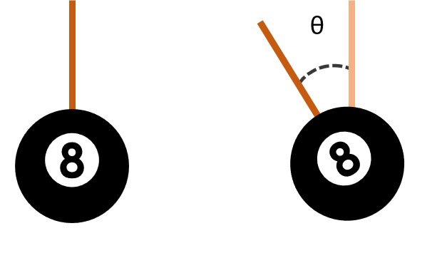
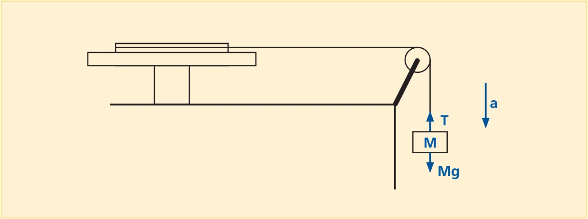

# Lab 4: Rotation

:::Intro (In this Lab..)
In the last lab of this quarter, you will refresh your knowledge of **Rotational Mechanics**. While the relationships between variables are very similar to Linear Mechanics, some quantities are ostensibly new, and will be explored in this lab. Among them is the concept of the **Moment of Inertia** of an object, and in this lab we will investigate multiple ways to measure it in a pulley system. 
:::

::::::Prelab
Please complete the following Exercises
:::center
, , , 
:::
In addition, please go through the following Activities:
:::center
, 
:::

Moreover, please note that  requires a plot. Feel free to set up the plot prior to lab if you need more time.
::::::
---
# From Linear to Rotational Mechanics
In your study of linear mechanics, you have become familiar with terms like position and displacement (along a coordinate x, y or z), velocity ($v$), acceleration ($a$), mass ($m$), and so on. In rotational mechanics, we measure similar quantities such as angular displacement, angular velocity and angular acceleration.

The similarities between these two kinds of mechanics are so deep, that it is worth exploring how to translate the ideas, concepts and tools we have already learned for linear mechanics into something useful in the study of rotation. The behavior of a rotating object can be surprising, however, and this lab will illustrate one way in which this is so.

## Position, Velocity, Acceleration 
:::Figure (ad|m|R)

:::
### Angular displacement

The first quantity of importance in linear mechanics is an object&rsquo;s position or *displacement*, usually measured in meters relative to some point in space. In rotational mechanics, we are concerned with an object&rsquo;s **angular displacement** relative to some orientation about an axis of rotation, with respect to some reference, usually an axis in a set of coordinate axes.

:::Definition (Angular Displacement|5 C )
The **angular displacement** of an object, usually represented by the Greek symbol $\vec\theta$, is the angle through which a body has been rotated about one of its axes relative to some initial orientation.
:::

:::row
:::

So, then, what is the equivalent unit to meters? While you may be inclined to guess &ldquo;degrees&rdquo; (&deg;), in physics and mathematics the angular displacement of an object is typically measured in the basic unit of *radians*.

:::Definition (Radian)
**Technical Definition**

A radian is defined as the angle that is subtended by an arc equal to the radius of the circle on which it lies.

**Practical Definition** 

A radian is a unit of measurement for angles. In value, $1$ rad is equivalent to $\frac{360&deg;}{2\pi} \approx 57.3 &deg; $
:::

When working with radians, the most important thing to remember is that all circles have $2\pi$ radians, just as they have $360&deg;$. While not so important, the way this definition and equivalence is derived is given below, and can be enlightening.

::::::Hider (|How the Radian Gets its Value)
You ask, &ldquo;How is the value of a radian determined?&rdquo; Perhaps this will help. You buy a 15&Prime; pizza. You cut a piece of string so that it is 15 inches long, fold it exactly in half and make a mark at the midpoint. Now you use it to find the center of the pizza, and you make a straight cut from there to the edge of the pizza. Now you cut the string exactly in half, take one of the two 7.5-inch pieces, place one end of it exactly at the outer end of the cut you have just made, and carefully lay it along the edge of the pizza. From the other end of the string, you now make a second straight cut to the center of the pizza. You now have a slice whose length along the crust (arc length) equals the length of each side (the radius of the pizza, $r$). The angle subtended by this arc is thus $1$ radian, but now you would like to know how many radians there are in a circle, and also, what a radian corresponds to in degree measure.
:::Figure (rad|m|R)

:::
You don&rsquo;t have a protractor with you, but you do have a clean napkin and a pen, and you&rsquo;ve managed to measure the circumference of the pizza in terms of the length of your string (= $r$). You note that the circumference of the pizza, $C$, equals $2\pi r$, and that a full circle subtends an angle of $360$&deg;. This means that there are $2\pi$ radians in 360&deg;. Doing the arithmetic, you find that $360^{\circ}/(2\pi) (= 180/\pi) = 57.3$&deg;. Hence, 1 radian = $57.3$&deg;. (You measured the diameter and radius rather precisely.) Note that because the radian is a ratio of two lengths, it is dimensionless.
::::::

### Angular Velocity

Just as *velocity* is the *time rate of change in position,*  **angular velocity** is the time rate of change in *angular displacement*. This is denoted ($\rm\frac{\Delta\theta}{\Delta t}$), and it has the units of $\rm rad/s$ (radians/s). 

:::Definition (Angular Velocity)
**Angular Velocity** is a measure of an object&rsquo;s rotation rate, which refers to how fast an object rotates about an axis relative to some reference position, *i.e.*, how fast the angular position or orientation of an object changes with time. It is typically represented with the Greek symbol $\vec \omega$.
:::

### Angular Acceleration

You probably recall that the time rate of change in (linear) velocity is *acceleration*. Similarly, the time rate of change in *angular velocity* is, of course, **angular acceleration**. This is denoted ($\rm\frac{\Delta\omega}{\Delta t}$). It has the units $\rm rad/ s^2$.

:::Definition (Angular Acceleration)
**Angular Acceleration** is the time rate of change of angular velocity. It is typically represented with the Greek symbol $\vec \alpha$.
:::

Note that in the text above, the arrows over the symbols indicate that the quantities they represent are *vectors* &ndash; that is, $\vec\theta$, $\vec\omega$ and $\vec\alpha$ have both magnitude and direction. (It is also common to denote that these quantities are vectors by setting their symbols in **boldface**, as ***&theta;***, ***&omega;*** and ***&alpha;***.) The direction is along the axis of rotation, and the orientation is in the direction in which your right thumb points when you curl the fingers of your right hand in the direction of the rotation. Since it is only the orientation that changes, and since we are not so much concerned with direction, for convenience we will use the scalar forms of the equations in which all these symbols appear.

## Mass, Force, Momentum

Some of the equivalences in the previous section may have been obvious to you &ndash; the change from *distance* to *angle* might not be so mind bending. Not all the changes, however, are as straightforward. You may have noticed that we didn&rsquo;t move on to define &ldquo;angular force,&rdquo; or **torque**, for example. Your first instinct is likely to borrow from $\vec F = m \vec a$ and define $torque = m \vec \alpha$. This would be a good guess, but very wrong!  

That this is wrong may be surprising &ndash; you can&rsquo;t simply plug mass into this formula. Instead, we need to talk about the strange rotational equivalent of mass, the **moment of inertia**.

### The Moment of Inertia

:::Definition (Moment of Inertia)
The **Moment of Inertia** is a quantity that expresses a body&rsquo;s tendency to resist angular acceleration, typically represented by the symbol $I$.

One can calculate it by taking the the sum of the product of the mass of each particle in the body with the square of its distance from the axis of rotation.
:::

In linear mechanics, an object possesses *inertia* in proportion to its mass; it resists change to its velocity. Similarly, according to its mass and how that mass is distributed about a particular axis of rotation, an object resists change in its **angular velocity** about that axis. The farther a portion of the mass is from the rotation axis, the greater its moment, or resistance to rotation. We will return to this later.

### Torque

After defining the *moment of inertia*, we are able to write down the correct angular form of Newton&rsquo;s second law as follows:

:::Equation
$$
\vec \tau = I \vec \alpha 
$$
:::
Where $\tau$, as you may have guessed, is the *angular force* known as **torque**. 

:::Definition (Torque)
**Torque** is the rotational equivalent of linear force, typically represented by the Greek symbol $\vec\tau$. Just as a linear force is a push or a pull, a torque can be thought of as a counterclockwise or clockwise twist to an object around a specific axis.
::: 
Where force has units of newtons ($\rm kg \cdot m \cdot s^{-2}$), torque has units of $\rm N\cdot m$. You can apply torque to an object by applying a force to it. This torque, however, depends not only on the magnitude of the force you apply, but where you apply it, and at what angle with respect to the line between that point and the axis of rotation. The torque exerted on an object by a force $F$, around a pivot point, is equal to the distance r from the pivot point to where the force acts, multiplied by the component of the force that is perpendicular to the position vector ${\vec r}$. If the force is perpendicular to the position vector, we may call the distance $r$ the lever arm.

:::Figure torque xl

Torque is equal to the perpendicular force multiplied by the distance from the axis of rotation.
:::

### Angular Momentum
Since we have the angular version of mass, we can also discuss the angular equivalent to *momentum*.

::::::Definition (Angular Momentum)
**Angular Momentum** is the angular version of Linear momentum ($p = mv$), typically denoted by $\vec L$. It is defined by the analogous relation
 
:::Equation (angular-momentum|Angular Momentum)
$$
\vec L = I \vec{\omega}
$$
:::
::::::

Note that whereas linear momentum is in $\rm kg\cdot m/s$, angular momentum is in $\rm kg\cdot m^2/s$. We shall see later why this is so.
### Kinetic Energy

We will wrap up this review of rotational mechanics by giving the expression for Kinetic Energy that applies to rotating bodies:
:::Equation
$$
K = \frac{1}{2} I \omega^2
$$
:::
Since this is just an energy, it has the same units ($\rm J$, which are $\rm N \cdot m$ or $\rm kg \cdot m^2 \cdot s^{-2}$) as those for linear kinetic energy.

## The Final Dictionary
The table below lists the quantities described in the above discussion, with their variables and expressions:

:::Table
| Linear Motion                       | Rotational Motion                                                |
|-------------------------------------|------------------------------------------------------------------|
| Displacement, $x$                   | Angular Displacement, $\theta$                                   |
| Velocity, $v$                       | Angular Velocity, $\omega$                                       |
| Acceleration, $a$                   | Angular Acceleration, $\alpha$                                   |
| Mass, $m$                           | Moment of Inertia, $I$                                           |
| Momentum, $p = mv$                  | Angular Momentum, $L$ = $I\omega$                                |
| Force, $F = ma$                     | Torque, $\tau = I\alpha$                                         |
| Kinetic Energy, $K = (\frac12)mv^2$ | Rotational Kinetic Energy, $K\rm_r = (\frac12)\it I\omega\rm ^2$ |
:::

We see that for each quantity involved in the description of an object&rsquo;s linear motion there is an analogous quantity for the description of its rotational motion. Whereas in linear dynamics you would find the net force on an object to determine its acceleration (or vice versa), in rotational dynamics you find the net torque on an object to determine its rotational acceleration (or vice versa). Just as linear momentum is conserved, so is angular momentum.

# Measuring the Moment of Inertia

## Constructing a &ldquo;Scale&rdquo; for &ldquo;Angular Mass&rdquo;

:::Figure (rolling|l|R)

:::

Even though mass is analogous to moment of inertia, we may not be able to measure them the same way. To measure mass, we can merely place the object on a balance. As noted above, however, an object&rsquo;s moment of inertia depends on how its mass is distributed about the axis about which it is rotating. 

If the object has uniform density and is symmetrical, it may be possible to measure its mass, and then based on its shape, calculate the moment of inertia. If this is not possible (perhaps the object has an odd shape or is of varying density), we must measure the moment of inertia by applying a torque to rotate it, and then by measuring its acceleration, find its moment of inertia. In this lab, we will do both of these things and compare the results.

:::Hider (|More on the "Moment")

As noted above, the farther a portion of a rotating object is from the rotation axis, the greater its moment.  But what is this moment? 

If the object is rigid, all points on it have the same angular speed, $\omega$, but each has an instantaneous linear speed,  $v=\omega r$, where $r$ is its distance from the rotation axis. 

The angular momentum, $L$,  for the special case of a particle going in a circle around a central point at a distance $r$ (as do all the mass points in our rotating object) equals $mvr$. Since $v=\omega r$, this equals $mr^2\omega$. 

This angular momentum is often called the *moment of momentum*. If we add the momenta for all the mass points in our rotating object, we have $L = \sum m r^2\omega$. Since $\omega$ is the same for all points on the object, $L =(\sum mr^2)\omega$. The sum in parentheses is the moment of inertia, $I$, and $L = I \omega$.

We can also see this by taking the kinetic energy of each mass point, which is $K_{point}=(\frac{1}{2})mv^2$. From the equations above, we see that this also equals $K_{point}=(\frac{1}{2})mr^2\omega^2$. 

The total kinetic energy for the rotating object is the sum for all points on it: $K\rm_r= \sum (\frac{1}{2})\it{mr}\rm^2\omega^2$. We can pull out the ($\frac{1}{2}$), and since $\omega^2$ is the same for all points, this is $K\rm_r= (\frac{1}{2})[\sum \it{mr}\rm^2] \omega^2$. The sum in brackets is $I$, the moment of inertia. Its units are $\rm kg \cdot m^2$ (or in cgs units, $\rm g \cdot cm^2$).
:::

## Setup
:::Figure (device|l|R)

:::
For our dynamic measurement of the moment of inertia, we will use a mounted turntable that has a hub attached at its center, which has three grooves of different radii, around which one can wind a string. The string loops around a pulley and attaches to a mass hanging from the free end of the string. This mass, under the direct influence of gravity, provides tension, which exerts a torque on the turntable, thus causing it to rotate.  shows a schematic of the apparatus: 

By measuring the time it takes the mass to fall from its initial height to the table top (or some reference line just above it), we can find $a$, its (linear) acceleration. From this we can calculate $\alpha$, the angular acceleration of the turntable. From the weight of the mass, and its linear acceleration, we can find $T$, the tension in the string. Once we know all these things, we can calculate the torque, $\tau$, and from $\tau = I \alpha$ find $I$, the moment of inertia of our turntable platter.

:::Note (|10 C)
When we attach a mass to the string on the turntable and release it, the force exerting the torque on the turntable is the tension in the string. 

The tension in the string provides, in turn[fn]pun intended[/fn], an opposing force to gravity on the hanging mass.  
:::
<!--In this experiment, we must make sure that the pulley on the front edge of the apparatus is in line with the string (along the tangent that runs perpendicular to the front edge), and that its top is at the same height as the groove in which we are winding the string. Since the string is tangent to the pulley (it cannot be otherwise), sin $\theta$ equals one; F and F$_\perp$ are identical.-->

:::Exercise (|2 Points)
1. What is the formula for the torque on the turntable in terms of tension $T$ in the string and the lever arm distance $r$? 

2. What is the tension in the string if the turntable is held fixed, with the mass hanging from the pulley (*i.e.*, the mass is stationary)?

3. When the mass is falling, what is the tension in the string? Use Newton&rsquo;s second law to determine the tension $T$ in the string as a function of $m$, the falling mass, $g$, the acceleration due to gravity, and $a$, the linear acceleration of the falling mass. Refer to .
:::

When you release the mass, it accelerates toward the earth with acceleration, $a$. To find this acceleration, we measure the time it takes for the mass to fall to the floor from a known height, $h$. We then use the following equation to calculate $a$[fn]Because the mass starts from rest, we can ignore the $v_{0} t$ term, which equals zero.[/fn]:

:::Equation
$$
h = v_{0}t +\left (\frac{1}{2}\right)a_{}t^2=\left (\frac{1}{2}\right)a_{}t^2
$$
:::

The tangential acceleration of a point at the lever arm distance is:

:::Equation
$$
a = r\alpha
$$
:::

where $a$ is the acceleration of the falling mass, $r$ is the lever arm distance, and $\alpha$ is the angular acceleration of the turntable.

:::Exercise (|1 Point)
Show that the equation $a=r\alpha$ is consistent in terms of units. 
Note: Radians can be ignored as units. (They are dimensionless, as mentioned above.)
:::

:::Note
Be sure you understand the difference between the **angular acceleration**, $\alpha$, of the turntable and the **linear acceleration**, $a$, of the falling mass.
:::

# Getting Ready for the Rotation Experiment

## Determining the Moment of Inertia from Geometry
As we noted earlier, the moment of inertia of an object depends not only on the mass of the object, but also on how the mass is distributed around the axis of rotation. If an object is symmetrical, we can derive an expression for the sum of the moments described above. For a disc, like the platter of your turntable, the moment of inertia is:

$$
I = \left(\frac12\right)MR^2
$$

where $M$ is the mass of the disc and $R$ is the radius of the disc. Do not confuse the radius of the disc $R$ with the lever arm $r$ where the tension is applied. Do not confuse the mass of the disc $M$ with the hanging mass $m$. We will lift the platter off the apparatus and weigh it. We will also measure its diameter.

::::::Activity (moi-calc| Calculating the Moment of Inertia from Geometry)

1.  below shows the measurement of the mass and the diameter of the turntable platter. Record these values.
:::Video (moi| Measuring the Turntable Platter)
<iframe width="100%" height="100%"  src="https://www.youtube.com/embed/gFbj7EOupxc?start=2" title="YouTube video player" frameborder="0" allow="accelerometer; clipboard-write; encrypted-media; gyroscope; picture-in-picture" allowfullscreen></iframe>
:::
2. Given the mass and radius of the turntable platter, use the correct equation to calculate its moment of inertia. (Remember to use the radius, and not the diameter.)

<!-- $M=976.5 \rm\ g$ $R=12.7 \rm\ cm$ -->

::::::
:::Exercise (|1 Point)
 What did you calculate the Moment of Inertia to be?
:::
## Preparing our Data Tables
In the moment of inertia lab, we will be observing how six different masses — and hence, six different torques — will generate rotation in a heavy disk. From our knowledge of the force on the masses, we will be able to figure out the torque applied to the disk. We will further use the total angular displacement (which can be found from the distance to the ground) to work out the Moment of Inertia. You should read 
 
::::::Activity (table|Preparing Our Data Tables)
1. Create a [Good Table](?linkfile=FAQ#QHowdoIreceivefullcreditonatableinmylabreport) with six data rows similar to . Be sure to include the correct units.
:::Table (torque|Moment of Inertia Data)
Lever Arm r = ________
| Mass | Height | Time | Acc | Angular Acc. | Torque | 
|------|--------|------|-----|--------------|--------|
| ...  | ...    | ...  | ... | ...          | ...    |
| ...  | ...    | ...  | ... | ...          | ...    | 
| ...  | ...    | ...  | ... | ...          | ...    |
| ...  | ...    | ...  | ... | ...          | ...    | 
| ...  | ...    | ...  | ... | ...          | ...    |
| ...  | ...    | ...  | ... | ...          | ...    | 
:::
2. Set up a spreadsheet function that takes data from the **Time** column and calculates the value in the **Acceleration** column. 
3. Set up a spreadsheet function that uses the **Acceleration** column data to calculate the **Angular Acceleration**
4. Set up a spreadsheet function that calculates the **Torque** column from other data in the table.

::::::

# Experiment

## Measuring the Moment of Inertia
::::::Activity (main|Moment of Inertia from a Rotational Scale)

:::Figure (TTsetup|xl)

:::

1. Record the lever arm distance, $r$, of your turntable.
:::Note (|10 C)
 This is not the radius of the turntable top; this is the distance from the rotation axis to where the string makes contact with the turntable. This value should be $1$, $2$, or $3 \text{ cm}$.
:::
:::Exercise (|1 Point)
What effect does the diameter of the string have?
:::
2. Select and record a test mass. Be sure to include the mass of the hangar. Before releasing it, also record its height above the ground.
:::Exercise (|1 Point)
What level of confidence do you have in this measurement (+/- mm)?
:::
3. Release the mass and record the time it takes to strike the floor. Record this data..
4. Repeat this procedure (steps 1-3) for six different masses.
::::::

:::Exercise (table|2 Points)
Include your completed [Good Table](?linkfile=FAQ#QHowdoIreceivefullcreditonatableinmylabreport) here.
:::

# Analyzing The Experiments
We are now ready to extract some information from our data on the Moment of Inertia of the disk.
:::Exercise (plot|4 Points)
1. Plot the **Torque** and **Angular Acceleration**. ( Be sure is is a [Good Plot](?linkfile=FAQ#QHowdoIreceivefullcreditonaplotinmylabreport) )
2. Does the line look linear? Should it?
3. Plot the line of best fit for this data and include the equation here.
4. What is the Moment of Inertia?
:::

Finally, we want to compare the values achieved in two different ways.

:::Exercise (|4 Points)
1. Compare the two values you obtained for the moment of Inertia. Which do you think is more accurate? Which more precise?

2. What assumptions did we make when we used the mass and dimensions of the platter to calculate its moment of inertia?

3. In what way could these assumptions cause a discrepancy between the two values you obtained for the moment of inertia? ;;; Inspect how the mass of the turntable is distributed around the axis of rotation.;;;

4. What else might cause a discrepancy between these two values? 
::::::
# Conclusion
:::Exercise (|2 Points)
Write a brief statement summarizing the main points of this lab.
:::

:::Summary
:::