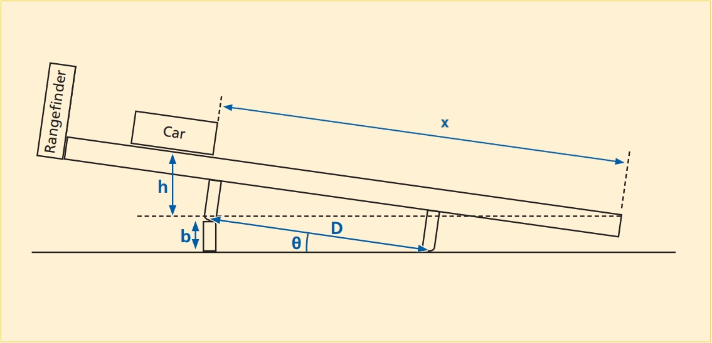

# Energy Transformation

:::Intro (This Week...|Air Track)
This week we will look at the quantity that we call energy, and its transformations. In classical physics, there are two categories of energy:
 1. **Kinetic Energy** &mdash; what you may know as *energy of motion*, or the energy stored in the inertial motion of an object. An object has *kinetic energy* if you have to perform **work** on it to bring it to rest.
 2. **Potential Energy** &mdash; which is stored energy an object has due to certain kinds of **work** having been exerted on it, *e.g.*, the energy a barbell has after you have lifted it from the floor to above your head.

In addition to understanding energy, this week we will investigate **work** and its relationship with **force** in converting energy from one form to another.
:::
---

# Energy Transformation
## Gaining Intuition 2

:::Simulation (transform)

<iframe src="https://kapawlak.github.io/PhDemoJS/Apps/EnergyTransformation/Page.html" width="100%" height="1000" style="border:none;"> </iframe>
:::

In this part of the lab you will be investigating the transformation of energy from one form to another, namely a transformation between potential energy (PE) and kinetic energy (KE). Potential energy is stored energy, for example the energy in a compressed spring, or the gravitational potential energy that an object has by virtue of its height above the ground. 

:::Definition (Potential Energy)
**Potential Energy** is the energy possessed by a body by virtue of its position relative to others, stresses within itself, electric charge, and other factors.
:::

Kinetic energy is energy of motion. A mass, having been flung upward, has kinetic energy. When an object is dropped from some height above the ground, gravity accelerates it downward, converting its initial potential energy into kinetic energy as it falls, a scenerio you can investigate yourself in . 

:::Definition (Kinetic Energy)
**Kinetic Energy** is the energy a body possesses by virtue of being in motion. In order to bring a moving body to rest, you would need to perform an amount of work equivalent to its kinetic energy. 
:::

In the example of the object being dropped from rest, the mass starts out with zero kinetic energy. The force of gravity does work on the mass, thus giving it kinetic energy. This would suggest that work and energy are equivalent. Indeed, the Work-Energy Theorem states that the work done on an object is always equal to the change in kinetic energy of the object. Work and energy have the same units (kg ⋅ m$^2$ ⋅ s$^{-2}$), which constitute the standard unit of energy called the Joule (J). We will not discuss work in detail, but should note that it is defined as the product of the force acting on an object and the distance over which it acts, hence the aforementioned units.

For another example, loading a stone into a slingshot requires you to do work in stretching the elastic band by pulling the stone back against it. When you have pulled the stone all the way back, the work you have done is now stored as potential energy in the band. When you release the stone (a mass), the band relaxes, accelerating the stone from rest to whatever speed it has attained just as it flies free of the elastic band. Whatever potential energy was stored in the band, which you provided by stretching it, is now kinetic energy of the stone flying through the air.

Our main focus will be a fundamental law of nature called the Law of Conservation of Energy. This law states that, in the absence of dissipative forces such as friction,

:::Equation
$$
PE+KE=Total energy
$$
:::

Simply stated, this means that the total energy in a closed system remains *constant* even when the individual KE and PE are changing &mdash; they must always add up to the same total energy unless the system is open.

## Experiment Overview

As in the previous experiment, we will observe the motion of a glider sliding on an inclined air track under the influence of gravity. This time, however, we will be concerned with the glider&rsquo;s *energy*. We will collect data that will allow us to calculate indirectly the glider&rsquo;s kinetic and potential energy by using readily measurable quantities.  

## Setup
 below shows the setup we will use for this part of the lab.  We will measure the position and velocity of the glider by means of a range finder (an ultrasonic motion sensor).  We will denote the position of the glider along the track $x$, and the velocity $v$. 

:::Figure (hov3|xl)

:::

Note that the position and velocity change with time as the glider moves along the track. We will set the x-axis to be along the track (with the positive direction up the track), and our origin $x=0$ at the bottom of the track.

## Obtaining the Kinetic and Potential Energies

In  will operate the air track in a similar fashion to the way we operated it in . To set the angle of the track, we will place a block of height $b$ under a leg of the air track. 

- The height $b$ will be $2.0$ cm.

- The mass of the glider with reflector plate is $188.9$ g.

We will release the glider on the air track, and the range finder will follow its motion as it rides back and forth on the track. (There is a rubber band at the bottom of the track that causes the glider to bounce back up.) 

::: Note
The data in the table for the next exercise are the position and velocity of the glider **starting at the first bounce (with the rubber band at the bottom of the air track) and ending at the second bounce**.  Remember that $x=0$ corresponds to the bottom of the air track.
:::

::::::Activity (air-track|Air Track in Person)

1. Fire up the air-track. Set the knob to 3. Check the level of the track as you did in the previous lab.
2. Attach the Ranger to the calculator. See Appendix A for operating instructions for the sonic ranger.
3. Place a small riser block under the single stand-alone leg of the air track. Measure the height, b, of the block and 
record this in your lab book. Also, measure and record the mass of your glider cart.
4. Start the glider (with attached metal reflector) at the bottom of the track and give it a quick push up the ramp (airtrack). Do not push the glider-cart all the way up the ramp because the rangefinder has trouble measuring objects 
within 50cm of its sensor. Use the rangefinder to measure the position and speed of the cart as a function of time
5. Using the data acquired from the rangefinder and the provided mathematical formulae, fill in the table, which 
represents the potential energy and kinetic energy of your cart for different times during one cycle (each cycle 
begins and ends when the car returns to its starting position (at the band) after launch. Make a table that includes 
the following information: (Note: your data table might look like the one at the end of the lab.)
   1. Record numerical data from the calculator for at least 10 data points of a single run.
   2.  Use (roughly) evenly spaced data points.
   3.  Include the point where the glider reached its maximum height.
   4. Include the point when the speed was maximum, you will need to look at your v vs. t graph to get this

:::Exercise
1. Does your data support the Law of Conservation of Energy? 
2. Identify some sources of error and suggest how you could eliminate them.
3. When the glider hits the rubber band, what are the kinetic and potential energies right when the 
glider changes direction? Where did the energy go
:::
::::::
::::::Activity (kepe|)
The following video shows this procedure:

:::Video
<iframe width="auto"  src="https://www.youtube.com/embed/-o_08QyCD6g" title="YouTube video player" frameborder="0" allow="accelerometer; clipboard-write; encrypted-media; gyroscope; picture-in-picture" allowfullscreen></iframe>
:::

 

1. Below is a link to the table containing the position and velocity data of the glider. **Copy the data in this table into a separate spreadsheet**. 
:::Hider Template
<iframe width="100%" height ="400px" src="https://docs.google.com/spreadsheets/d/e/2PACX-1vS81zYp0Msw755X1bTchxyKU-ozGzSR2wL4CSJA04cpLAMc2xG6eSNFXsj3YDx3_k1nhp-k9f5G6k82/pubhtml?gid=112862978&amp;single=true&amp;widget=true&amp;headers=false"></iframe>

[Link to Copyable Google Sheet](https://docs.google.com/spreadsheets/d/1a-sF2TCUFwAACT4HZA4xuvlW5xBqKbF-gQUyl16__Uc)  

:::

2. Calculate the kinetic energy (KE) of the glider from the velocity data. Remember, $KE=\frac{1}{2}mv^2$.
3. Calculate the (gravitational) potential energy (PE) of the glider. Remember that $PE=mgh$, where $h$ is the height of the glider. In our case, the height $h$ changes with time, so you will have to find it in terms of $x$ and $\sin{\theta}$. See the appendix for more details.
4. Calculate the total energy (PE + KE) of the glider for all given times. 
5. Plot the potential energy, kinetic energy, and total energy as a function of time (ideally on the same graph).  

:::Exercise 
1. Where is the glider when its (gravitational) potential energy is maximum? 

2. Where is it when its kinetic energy is a maximum? 

3. Where is it when its kinetic energy is a minimum?
:::

:::Exercise

Do your data support the Law of Conservation of Energy? (Hint: What happens to the sum of potential and kinetic energy over the course of the experiment?)

:::

:::Exercise
 At the bottom of the air track, the glider hits and stretches a rubber band, which causes the glider to change direction. When the rubber band is maximally stretched, the glider&rsquo;s kinetic energy is zero, because it is momentarily at rest.  Since the glider is at the bottom of the air track, its (gravitational) potential energy is also zero.  So the sum of the kinetic energy and gravitational potential energies is zero, yet energy is conserved. Where did the energy go?
:::

::::::

# Summary

::::::Exercise 

Write a brief statement summarizing the main points of this lab (both parts).
::::::

:::Summary

Make sure to include all tables, plots, pictures, drawings, screenshots or anything else asked of you in the exercises in your report, as well as answers to all the questions.

All responses and answers should contain the correct number of sig figs and should include units when needed.

:::
# Appendix 
## Force, Motion, Linear Acceleration Math Sheet

:::::Hider Gravitational Potential Energy
Gravitational Potential Energy is given by:

:::Equation
$$
\rm PE = mgh
$$
:::

where $m$ is the mass, $g$ (= $9.8$ m/s$^2$) is the acceleration due to gravity, and $h$ is the height the object falls. 
::::::

::::::Hider Kinetic Energy

Kinetic Energy is given by:
:::Equation
$$
\rm KE = \frac{1}{2}mv^2
$$
:::

where $m$ is the mass of the object, and $v$ is its velocity.
::::::

::::::Hider Calculating height from distance
The angle of the track with respect to the horizonal, $\theta$, satisfies

$$
\rm \sin(θ) = \frac{b}{D}
$$

where $b$ is the height of the block used to place the track on an incline, and $D$ is the distance between the track&rsquo;s legs in . 

Similarly, for any position on the track, we have that

$$
\rm \sin(\theta) = \frac{h}{x} 
$$

where $h$ is the height above the bottom of the track, and $x$ is the distance along the track from the bottom end. Since both expressions are equivalent to $\sin(\theta)$, we can equate them to obtain the formula:
:::Equation
$$
\rm h = \frac{bx}{D}
$$
:::

The distance between the legs, $D$, is $100$ cm. You will get the distance from the glider to the end of the track, $x$, from the range finder data.
::::::

