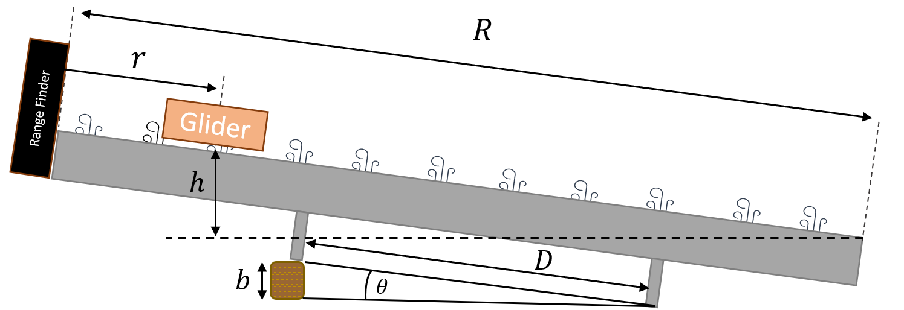
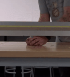

# Energy Transformation

:::Intro (This Week...|Air Track)
This week we will look at the quantity that we call energy, and its transformations. In classical physics, there are two categories of energy:
 1. **Kinetic Energy** &mdash; what you may know as *energy of motion*, or the energy stored in the inertial motion of an object. An object has *kinetic energy* if you have to perform **work** on it to bring it to rest.
 2. **Potential Energy** &mdash; which is stored energy an object has due to certain kinds of **work** having been exerted on it, *e.g.*, the energy a barbell has after you have lifted it from the floor to above your head.

In addition to understanding energy, this week we will investigate **work** and its relationship with **force** in converting energy from one form to another.
:::

::::::Prelab
Prior to Lab, please complete the following Exercises
:::center
, 
:::
Please also be sure to do all steps of the following Activities
:::center

:::

::::::
---

# Energy Transformation

In this lab you will be investigating the transformation of energy from one form to another, namely a transformation between potential energy (PE) and kinetic energy (KE). Potential energy is stored energy, for example the energy in a compressed spring, or the gravitational potential energy that an object has by virtue of its height above the ground. 

:::Definition (Potential Energy)
**Potential Energy** is the energy possessed by a body by virtue of its position relative to others, stresses within itself, electric charge, and other factors.
:::

Kinetic energy is the energy stored in motion. A mass, having been flung upward, has kinetic energy. When an object is dropped from some height above the ground, gravity accelerates it downward, converting its initial potential energy into kinetic energy as it falls, a scenario you can investigate yourself in . 

:::Definition (Kinetic Energy)
**Kinetic Energy** is the energy a body possesses by virtue of being in motion. In order to bring a moving body to rest, you would need to perform an amount of work equivalent to its kinetic energy. 
:::

In the example of the object being dropped from rest, the mass starts out with zero kinetic energy. The force of gravity does work on the mass, thus giving it kinetic energy. This would suggest that work and energy are equivalent. Indeed, the Work-Energy Theorem states that the work done on an object is always equal to the change in kinetic energy of the object. Work and energy have the same units (kg ⋅ m$^2$ ⋅ s$^{-2}$), which constitute the standard unit of energy called the Joule (J). We will not discuss work in detail, but should note that it is defined as the product of the force acting on an object and the distance over which it acts, hence the aforementioned units.

For another example, loading a stone into a slingshot requires you to do work in stretching the elastic band by pulling the stone back against it. When you have pulled the stone all the way back, the work you have done is now stored as potential energy in the band. When you release the stone (a mass), the band relaxes, accelerating the stone from rest to whatever speed it has attained just as it flies free of the elastic band. Whatever potential energy was stored in the band, which you provided by stretching it, is now kinetic energy of the stone flying through the air.

:::Exercise (slingshot)
Where did the kinetic energy come from?
:::
Our main focus will be a fundamental law of nature called the Law of Conservation of Energy. This law states that, in the absence of dissipative forces such as friction,

:::Equation
$$
\text{ PE}+\text{ KE}=\text{ Total energy}
$$
:::

Simply put, this means that the total energy in a closed system remains *constant* even when the individual KE and PE are changing &mdash; they must always add up to the same total energy unless the system is open.

## Return of the Glider

As with last week's experiment, we are interested in looking at a delicate relationship between two variables, which can be confounded by external forces, such as friction. In order to avoid these as much as possible, we will make sure of the glider experiment once again. 

Just like the previous experiment, we will observe the motion of a glider sliding on an inclined air track under the influence of gravity. This time, however, we will be concerned with the glider's *energy*. We will collect data that will allow us to calculate, indirectly, the glider's kinetic and potential energy by using readily measurable quantities.  

 below shows the setup we will use for this part of the lab.  We will measure the position and velocity of the glider by means of a range finder (an ultrasonic motion sensor).  We will denote the position of the glider along the track $x$, and the velocity $v$. 

:::Figure (hov3|xl)

:::

Note that the position and velocity change with time as the glider moves along the track. We will set the x-axis to be along the track (with the positive direction up the track), and our origin $x=0$ at the bottom of the track.

From the position and velocity measurements, we can perform a calculation to indirectly determine the kinetic and potential energies. The formulae needed for this calculation are provided in the Appendix.

:::Exercise (math)
The glider is at rest on a track of length $R=2 \text{ m}$, elevated at an angle of $30 \deg$.
1. The glider sits at a height of $h= 0.34\text{ m}$ above the bottom of the track. What is its potential energy?
2. What is the distance, $r$, the glider sits from the Range Finder?
3. If the glider were let go, what would be its speed at the end of the track?
:::

## Preparing Our Data Table

This weeks data tables will need quite a few formulae added in, so be sure to give yourself ebnough time before your lab to complete them.

::::::Activity (table|Making the Table)
1. Create a table with 10+ data rows, similar to . Be sure that all heading rows contain the correct units.
2. Using trigonometry and the formulae in the Appendix, fill in functions that will automatically calculate the **Height,** **Kinetic** and **Potential** energies as the **Time, Distance and Velocity** data are filled in.
:::Table (datapoints| Glider Energy Data)
| Data Points | Time | Distance | Velocity | Height | Kinetic Energy | Potential Energy |
|-------------|------|----------|----------|--------|----------------|------------------|
| ...         | ...  | ...      | ...      | ...    | ...            | ...              |
| ...         | ...  | ...      | ...      | ...    | ...            | ...              |
| ...         | ...  | ...      | ...      | ...    | ...            | ...              |
:::
3. Link this table into your report under 
::::::

# Measuring Energy Transformation

In  will operate the air track in a similar fashion to the way we operated it previously. To set the angle of the track, we will place a block of height $b$ under a leg of the air track. 

We will release the glider on the air track, and the range finder will follow its motion as it rides back and forth on the track. (There is a rubber band at the bottom of the track that causes the glider to bounce back up.) 

::::::Activity (air-track|Conservation of Energy on the Air Track)
**Instructions**:

:::Figure (riser|m|R)

:::
1. Fire up the air-track. Set the knob to 3. Check the level of the track as you did in the previous lab.
2. Attach the range finder to the calculator. See Appendix A for operating instructions for the sonic ranger.
3. Place a small riser block under the single stand-alone leg of the air track. Measure the height, $b$, of the block and 
record this in your lab book. Also, measure and record the mass of your glider cart.

4. Start the glider (with attached metal reflector) at the bottom of the track and give it a quick push up the ramp (air track). Do not push the glider-cart all the way up the ramp because the rangefinder has trouble measuring objects 
within $50 \text{ cm}$ of its sensor. Use the rangefinder to measure the position and speed of the cart as a function of time
5. Using the data acquired from the rangefinder, fill in the table, which 
represents the potential energy and kinetic energy of your cart for different times during one cycle (each cycle 
begins and ends when the car returns to its starting position (at the band) after launch. You will have to choose points to include in your analysis from the measured data. The data selected should: 
      1. Be at least 10 data points of a single run.
      2. Use (roughly) evenly spaced data points.
      3. Include the point where the glider reached its maximum height.
      4. Include the point when the speed was maximum, you will need to look at your v vs. t graph to get this

::::::

:::Exercise (table)
Provide the complete table of data here, following all the rules of a Good Table
:::

# Analyzing The Air Track energy Experiment

It is now time to look at the data you've collected and inspect your results. First let's plot your results and draw some inferences from a data visualization.

:::Exercise (plot)
1. Make a Good Plot with the kinetic and potential energy data from the experiment.
2. Is there anything interesting about this plot? Where to the lines cross?
:::

In the next exercise, use both the numerical values of your data and your plots to answer the questions.

:::Exercise
1. Does your data support the Law of Conservation of Energy? 
2. What about your data leads you to conclude this? Explain in as much detail as possible.
3. Identify some sources of error and suggest how you could eliminate them.
4. When the glider hits the rubber band, what are the kinetic and potential energies right when the 
glider changes direction? 
5. Where did the energy go?

:::

# Summary

::::::Exercise 

Write a brief statement summarizing the main points of this lab (both parts).
::::::

:::Summary

Make sure to include all tables, plots, pictures, drawings, screenshots or anything else asked of you in the exercises in your report, as well as answers to all the questions.

All responses and answers should contain the correct number of sig figs and should include units when needed.

:::
# Appendix 
## Force, Motion, Linear Acceleration Math Sheet

:::::Hider (|Gravitational Potential Energy)
Gravitational Potential Energy is given by:

:::Equation
$$
\rm PE = mgh
$$
:::

where $m$ is the mass, $g$ (= $9.8$ m/s$^2$) is the acceleration due to gravity, and $h$ is the height the object falls. 
::::::

::::::Hider (|Kinetic Energy)

Kinetic Energy is given by:
:::Equation
$$
\rm KE = \frac{1}{2}mv^2
$$
:::

where $m$ is the mass of the object, and $v$ is its velocity.
::::::

