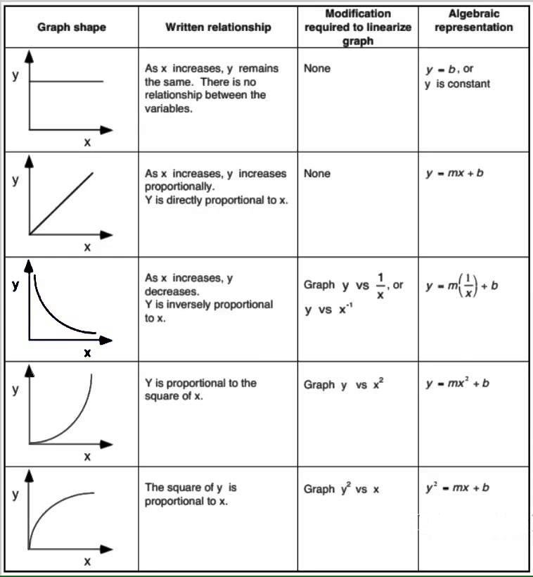

# Lab Math 6BL
:::Intro (Welcome to PHYS6BL)
The goal of this assignment is to prepare you for the rest of the quarter and refresh your mathematics skills. This week we will discuss some concepts related to the representation of data and plotting: 

- Function v.s. Shape in plotting
- **Log-Log** Plots
- Using lines of best fit to determine parameters.

:::
# Plot Shapes and Linearization

When you wish to study the behavior of a physical system, a common technique to use is to choose a pair of quantities whose relationship you wish to examine, and, keeping everything else fixed, to vary one and to measure the second as you do so. A plot of the quantity you measure (dependent variable) vs. the one you varied (the independent variable), allows you to see the shape of the mathematical relationship between those two variables. If you can then fit the data to a mathematical function, you will have a good sense of what that relationship is. 

You might also be able to confirm that the data fit an equation that you had proposed before you did the experiment. If the data form a straight line, then such a fit is fairly simple. In 6AL, you performed such a fit for the force data you generated in the experiment with the air track. As you might guess, though, the relationships between physical quantities are often nonlinear, and, in fact, they could take any of a number of forms. While it might be possible to identify a nonlinear function by looking at the shape of a plot, and while it is possible to perform fits to nonlinear functions, it is generally easier to fit to a straight line. If we can get our data into linear form, such a fit can provide information that tells us the form of the original function.

## Changing the Independent Variable

:::Figure (plotExamples|xl)

From AP Physics 1 Online, by John Horwat, at [https://sites.google.com/site/apphysics1online/appendices/2-data-analysis/graph-linearization](https://sites.google.com/site/apphysics1online/appendices/2-data-analysis/graph-linearization)
:::

If we know the form of the original equation, then performing the appropriate operation on the $x$ or $y$ values and then plotting, yields a straight line.  For example, if the function is $y=(\frac1x)$, then plotting $y$ vs. $(\frac1x)$ yields a straight line, if $y=x^2$, then plotting $y$ vs. $x^2$ gives a straight line, and so on. The figure below shows some examples, and the simulation that follows it lets you see how the shape of some such curves becomes linear.

:::Simulation
<iframe src="https://kapawlak.github.io/PhDemoJS/Apps/MathLab/MathLab.html" width= "100%" height="1000" style="border:none;"></iframe>
:::

## No clue? Try a Log-Log plot.
	
If we don't know the form of the equation, there is something else that we can do.

We note here the rules of logarithms:

::::::Equation (logProduct)
:::center
**The Product Rule**
$$
\log ( AB) = log( A ) + \log( B ) 
$$
**The Fraction Rule**
$$
\log \left(\frac{A}{B}\right) = \log( A ) - \log(B)
$$
**The Power Rule**
$$
\log(C^{D}) = D \log(C)
$$
**The Inverse Rule**
$$
10^{\log(F)} = F
$$
:::
::::::

Thus, if we have an equation
$$
y=ax^b
$$

we can take the logarithm of both sides:

$$
\log (y)= \log (a) + b\log(x)
$$

We thus obtain a linear equation with slope $b$ and intercept $\log(a)$. The slope is the exponent in the original equation, and the intercept is the logarithm of the proportionality constant (which we can recover by taking its antilogarithm, $a = 10^{\log (a)}$, if we are using common logarithms, or base 10 logarithms). Manipulating data in either of these ways to cause them to fall on a straight line is often called *linearizing* the data. 

The simulation below allows you to plot some data from a pair of experiments. The first involves a phenomenon called black body radiation.  You are most likely familiar with the glow of electric heating elements when they are on, as on an electric stove top or in a toaster, or the glow of the hot filament in an incandescent lamp. Among those who studied this type of radiation during the late nineteenth and early twentieth centuries, was Josef Stefan, who formulated a law that stated that the radiated power of an emitting object went as a certain power of its temperature. This law is called *Stefan's Law* or the [Stefan-Boltzmann law](https://en.wikipedia.org/wiki/Stefan%E2%80%93Boltzmann_law). The second experiment involves the relationship between animal mass and basal metabolic rate. In the early 1930s, Max Kleiber proposed that the energy consumed by an animal was a function of its mass. The equation he used to describe this relationship is known as [Kleiber's law](https://en.wikipedia.org/wiki/Kleiber%27s_law#:~:text=Symbolically%3A%20if%20q0%20is,the%20energy%20the%20mouse%20uses). For each of these experiments, see if you can guess the correct equation based on the slope of the line, and check your answers in the linked articles!

:::Simulation
<iframe src="https://kapawlak.github.io/PhDemoJS/Apps/MathLab_Data/MathLab_Data.html" width= "100%" height="1000" style="border:none;"></iframe>
:::

# An Astronomical Experiment

In [Part I](#Part-I), we have shown two ways to determine an unknown relationship between experimental variables given a set of data. In this Part, you will use the logarithm technique to linearize data from a set of astronomical observations, with the goal of discovering the equation that relates two observable variables.

## A Brief History of Astronomical Models
:::Figure (ptol|xs|R)

:::

As early as the time of the ancient Greeks, people sought to understand the motion of the planets. Ptolemy (ca. 85 - ca. 165, Greek astronomer, geographer) proposed a *geocentric* system, that is, one in which the earth is stationary and all other bodies revolve around it. For this model to work, though, the planets must take very complicated paths; they must travel in epicycles &ndash; small circular paths superimposed on their larger circular orbits. In the sixteenth century, Nicolaus Copernicus (1473-1543, Polish astronomer) proposed a *heliocentric* theory, in which all the planets, including earth, revolved around the sun, and the earth rotates on its axis. (Oddly enough, the inspiration for this may have come from a model proposed by Aristarchus of Samos (ca. 310 B.C.E.- ca. 230 B.C.E.), but which never gained broad acceptance). 

:::Figure (Kep|xs|L)

::: 

Copernicus's model was much simpler than Ptolemy's, but it still had problems. Because Copernicus held that planets traveled in exact circles, he still needed to use epicycles to explain their observed motion. There was also need for better information regarding the motion of the planets. This would soon be provided by Tycho Brahe (1546-1601, Danish astronomer), who made very careful and precise observations of the motions of the planets in the solar system (without a telescope!). 

Some time later, Johannes Kepler (1571-1630, German astronomer), who had been Brahe's assistant, analyzed these data and arrived at his Three Laws of Planetary Motion. His Third Law relates the orbital periods of the planets to their mean distance from the sun. This distance is equal to the semimajor axis of the orbit, which according to his First Law, is an ellipse with the sun at one focus. Later, when Newton was working on his Law of Universal Gravitation, he found that from this law, he could derive Kepler's Third Law. Kepler's Third Law takes the form:

:::Equation (keplerGeneral| General Form of Kepler's Law)
$$T^i=Ka^j$$
:::

## Charting out the Correct Parameters
While we have stated [Kelper's Law](#Equation-keplerGeneral) in a general form, note that we have not provided the values of $i$ and $j$ in the equation. You have a general form that the equation follows, but you must now apply it to data to determine the correct **parameter values**. 

To make this simpler, let us first revisit  which, by taking the $i$th root of the entire equation, can also be written as

:::Equation (keplersroot)
$$
T=\sqrt[i]{K}a^{(j/i)}
$$
:::

Note that $\sqrt[i]{K}$ is the same as $K^{(1/i)}$. For convenience, in the exercises that follow, we will let $k=\sqrt[i]{K}$ and $j/i=z$, and we will write the equation

:::Equation (keplerGeneralSimplified)
$$T=ka^z$$
:::

We are expressing the equations this way, because your goal is to find out what these exponents are. Note that $z$ is not an integer, but a value that can be expressed as a ratio of small whole numbers.

In the equations above, $T$ is orbital period, $a$ is the semimajor axis of the orbit, and $K=(\frac{ 4\pi^2}{GM})$, where $G$ is the gravitational constant ($=6.67 \times 10^{-11} \rm\frac{N\cdot m^2}{kg^2}$), and $M$ is the mass of the sun ($1.988 \times 10^{30}\rm\ kg$). Strictly speaking, the denominator should be $G(M_{planet} + M)$, but the sun is so much more massive than the planets, that for describing the orbital motion of the planets, the equation is accurate without the planetary mass. We will give the period in years, and the semimajor axis in $\rm\ a.u.$ (astronomical units; $\rm 1\ a.u. = 149.6 \times 10^6\ km$).

This choice of units (years and $\rm a.u.$) has an interesting consequence for the value of $K$, and thus also $k$, which makes the data easier to work with, and which you will notice when you make your log-log plot of the data.
	
## The Data

You must now access and manipulate astonomical data in order to determine the parameters in Kepler's law. Making use of modern technology and data acquisition techniques, we will not use Tycho Brahe's data.  We will instead use data from the [NASA Planetary Fact Sheets](https://nssdc.gsfc.nasa.gov/planetary/planetfact.html).

::: Table
|Planet|Orbit Semimajor Axis (a.u.)|Period (years)|
|:--------|--------:|--------:|
|Mercury|0.3871|0.24084|
|Venus|0.7233|0.61519|
|Earth|1.000|1.0000|
|Mars|1.524|1.8808|
|Jupiter|5.204|11.862|
|Saturn|9.582|29.457|
|Uranus|19.20|84.011|
|Neptune|30.05|164.78|
|Pluto*|39.48|247.94|

$*$ Yes, we know that Pluto is no longer considered a planet. It does, however, orbit the sun, and it obeys the same laws as the planets.
:::

::::::Activity (|Obtaining the Data)
**Instructions:**
1. Open the provided [Google Sheet ](https://docs.google.com/spreadsheets/d/1MUMMf5RxccOF99fp0DZ0Zg-1wgxVVgf1typklwK0UvI/edit?usp=sharing)containing the data for this lab.
2. Make a copy of this sheet to your own drive. 

:::Exercise (|1 Point)
In the Google Doc file that will be your lab report, link your completed **Table 1: Raw Data** from the google sheet here (under your label designating your answer to **Exercise 1**). Be sure that all values have the correct sigfigs.
:::

:::Note (|11 C)
When linked sheets are updated, any edits to the data in the original file will appear in the Google Docs file. If you make edits to the linked chart, table, or slide in your Google Docs, the **changes won't be copied to the original file** and will be lost. [See More Here](https://support.google.com/docs/answer/7009814).
:::

:::Table ()
:::
::::::

# Data Analysis
## Creating a Plot

Data is a wonderful thing but &mdash; as humans who, unfortunately, cannot draw inferences from numbers alone &mdash; we need to *do* something with it. We will now create a visual representation of this data by generating a scatter plot. You will also include a line of best fit to help the eye determine the linearity of the data set, and its slope if it does, in fact, seem linear. 

::::::Activity (|Create a basic Scatter Plot)
1. Make a plot of the data in your table. In Google Sheets, you can accomplish this by highlighting the two columns of interest and clicking "Insert chart" (  ). Plot orbital period (on the $y$- axis) vs. orbit semimajor axis (on the $x$- axis). 

2. However the plot looks, include a best-fit (straight) line. In Google Sheets, this option is found under "Series" in the "Customize" tab

:::Figure (trendlineHowTo|xxl)

:::

::::::
:::Exercise (|2 Points)
Make sure that your graph has all of the components of a [Good Plot](?linkfile=FAQ#QHowdoIreceivefullcreditonaplotinmylabreport) in order to receive full credit.
1. Include your completed [Good Plot](?linkfile=FAQ#QHowdoIreceivefullcreditonaplotinmylabreport)](?linkfile=FAQ#QHowdoIreceivefullcreditonaplotinmylabreport) here.
2. Does this graph look linear, quadratic, exponential, or something else?
3. How can you tell?
4. Does it make sense to perform a linear fit with this data set? Why or why not? (Don't use $R^{2}$ in your answer.)
:::
## Linearizing the Data
In the previous activity, it is likely that you found that the data did **not** have a linear (straight-line) relationship. Because of this, we need to work on the data a bit further to understand how the dependent and independent values are related. 

Luckily, we have a general equation that should describe the data, given by . We will assume that this equation accurately captures the data in the model and use it to guide our analysis.

:::Exercise (log|2 Points)
According to the rules of logarithms given above, take the log of both sides of . Show your result and your work.
:::

We will use your result in  in the activity below. 
:::::::::Activity (eqLinearize| Linearizing the Theoretical Relationship)

Your result from  should have the "functional form":

$$
y = m x+b
$$

By "Functional form", we mean the equation should look like this (something equals something times something plus something), but with different variables. 

Identify the equivalent variables in your expression by filling in the table below:

:::Table (vars|Linearized Variables)
| Name | Variable | Variable|
| -------- | -------- | -------- |
| Dependent Variable | y |
| Independent Variable | x |
| Slope | m |
| Y-Intercept | b |  |
:::

:::Exercise (|1 Point)
Make a similar table to  in your report, and fill in the missing column with the equivalent parts from your result from .
:::

:::::::::

With a new, linearized, representation of  in hand, we know how values in the linearized data will relate to the original paramters. We can now work on our data and attempt to extract the values of our parameters.

::::::Activity (data Linearize| Linearizing the Data)

1. Below **Table 1: Raw Data** in the spreadsheet, identify **Table 2: Log-Log Data Table**.
2. Fill in functions for the two empty columns of **Table 2**, that will produce the logarithm of the orbital period and of the orbit semimajor axis. Use the LOG10 function to take the log of data points in both columns, filling in the table with the appropriate values. 

:::Hider (logs|A Note About Computer LOG|10 C)
If you use a computer to calculate the logarithms, in many cases, the "LOG" function is either the natural logarithm (ln) or log base 2 by default. If you are using Excel or Google sheets, you will want to use the LOG10 function, not the LOG function.

As long as you use the same base when you take the antilog to find the proportionality constant, this makes no difference. If, however, you need to compare the actual logarithms of the data, or of the constant, to those calculated by someone else, you will need to use the same base that that person did.

Therefore, for consistency, please make sure to use log base 10.
:::

::::::
:::Exercise (|2 Points)
Link your completed **Table 2: Log-Log Data Table** here. Be sure that all values have the correct sigfigs, and if follows the rules of a [Good Table](?linkfile=FAQ#QHowdoIreceivefullcreditonatableinmylabreport)!
:::
We are finally ready to plot our linearized data and draw inferences using line of best fot tools. The first thing that we need to do is ensure that the Log-Log plot has, infact, linearized our data. After we are confident that our data is linear, we can inspect the line of best fit and intercepts to extract the key paramters

::::::Activity (exPlot1| Handling the linearized data)
1. Make a plot of the data from your new **Table 2: Log-Log Data Table**. (Be sure to take the log of  **both** columns. That is, plot $\log(T)$ vs. $\log(a)$.) Again, make sure that your graph has all of the components of a [Good Plot](?linkfile=FAQ#QHowdoIreceivefullcreditonaplotinmylabreport) in order to receive full credit.

2. Create a best-fit line for the new log-log plot. In Google Sheets, you can do this as described previously, or you can find it under "Label" in the "Series" menu trendline options.

:::Figure (showEquation|xxl)

:::

:::::::::
:::Exercise (|3 Point)
1. Include a copy of your [Good Plot](?linkfile=FAQ#QHowdoIreceivefullcreditonaplotinmylabreport) here. What is the equation for your line of best fit?
2. Does this graph look linear, quadratic, exponential, or something else? How can you tell?
3. Does it make sense to perform a linear fit with this data set? Why or why not? (Don't use $R^{2}$ in your answer.)
4. Compare and contrast this plot with the previous one.
:::

## Drawing Inferences

Finally we will connect the parameters extracted from the Linearized data to the Theoretical model. Please complete the following Exercises using the Data nd Line of Best Fit obtained.

:::Exercise (|2 Point)

1. According to the line of best fit that you found, and the relationship between the Log-Log and Raw Data equations, what is the value of the exponent $z$? 

2. What is the numerical value of $k$? ;;;You might find this result interesting. If the value you get seems too simple, don't panic; it's probably right!;;;
:::

::::::Exercise (|2 Point)
As we noted earlier, Kepler's law is frequently written in the form

$$
T^{i}=K a^{j}
$$

1. Use the fact that this may be rewritten as
$$
T=(K)^{(1/i)} a^{(j/i)}
$$

to determine the simplest (*i.e.*, smallest) possible integers $i$ and $j$ consistent with your fit, and write down the above equation with these integers.

2. Given these values of $i$ and $j$, determine $K$  Remember: $k=(K)^{(1/i)}$. ;;;Again, if your answer looks too simple, don't panic.  It's probably right!;;;
::::::

## Units

For the equation for Kepler's Third Law, although the power relationships do not depend on what units we choose for our variables, the proportionality constant, and hence its logarithm, does. Thus, a note about units and their conversion is in order:

As noted above, for the period, $T$, we used years, and for the semimajor axis of the orbit, $a$, we used $\rm a.u.$ ($\rm 1\ a.u. = 149.6 \times 10^6\ km$). $K=(\frac{ 4\pi^2}{GM})$, where $G$ is the gravitational constant ($=6.67 \times 10^{-11} \rm\frac{N\cdot m^2}{kg^2}$), and $M$ is the mass of the sun ($1.988 \times 10^{30}\rm\ kg$). You may have noticed that years and $\rm a.u.$ are not SI units. The SI units for these values are seconds and meters. As it turns out, if you make the conversion from seconds to years, and from meters to $\rm a.u.$, $K = 1$; when you multiply and divide $K$ by the appropriate conversion factors, raised to the appropriate powers, the result is unity. You should have found this in your answer to the previous Exercises.

The data given are in **years** (time) and **astronomical units** (distance). Say that we wanted to conform to the scientific literatures and present our results in the standard International System of Units used in most scientific work &mdash; otherwise known as *SI units*. Then, we would need to convert our time measurement in seconds and our distance measurements in meters.

Rather than change all of the data, we make this conversion directly in  by substituting the following relationships:

For time, we can convert from a.u. to seconds using
:::Equation (covt| Time Conversion)
$$ T = \alpha T' $$ 
:::
where $T$ has units of years, $T'$ has units of seconds, and $\alpha$ is the number of years per second. 
Similarly we can write 
:::Equation (covd | Distance Conversion)
$$ a = \beta a' $$ 
:::

where $a$ has units of a.u., $a'$ has units of meters, and $\beta$ is the number of a.u. per meter.

::::::Exercise (|2 Point)
1. Plug the two substitutions into  ($T=k a^{(j/i)}$). Rearrange the equation so that $\alpha, \beta, t$ are on the left side of the equation and $d$ remains on the right side, e.g.
$$
\alpha ^\? \beta^\? T' = k a'^{j/i}
$$
you will figure out what the "?'s" are.
2. What are the numerical values of the conversion factors $\alpha$ and $\beta$ ? ;;;Hint: How many seconds are in a year? How many years are in a second, then? What is the value of alpha? ;;;
3. Plug in these numerical values to find the number that multiplies $T'$ on the left-hand side. What is this value?

:::Note (|12 C)
Note that when you arrive at your conversion factor, you can check it by comparing it to the value that you  get if you evaluate $K^{(1/i)}$, by calculating $(\frac{ 4\pi^2}{GM})^{(1/i)}$, with the values given above for $G$ and $M$.
:::

4. If you used this version of the equation (including your new conversion factor, how would this have changed the intercept of your log-log graph? ;;;Hint: Again, take the log of both sides of this relation like you did previously ;;; What would its value have been?

::::::

:::Hider (hs|Historical Note)
Until the work of Brahe and Kepler, there was great confusion regarding the motion of the planets. Also, our understanding of gravity was limited, and until Newton, no one had imagined the possibility that gravity could act not only close to earth, but over astronomical distances as well. Newton's Law of Universal Gravitation provided a deeper understanding of Kepler's laws, and together these formed part of the bedrock of classical physics. We hoped that fitting the data associated with the motion of the planets would provide a pleasant exercise.
:::
# Conclusion

:::Exercise (|3 Point)
Write a brief conclusion summarizing the important points of this lab. (1 - 2 Paragraphs)
:::

:::Summary

You must show work for all problems!
:::