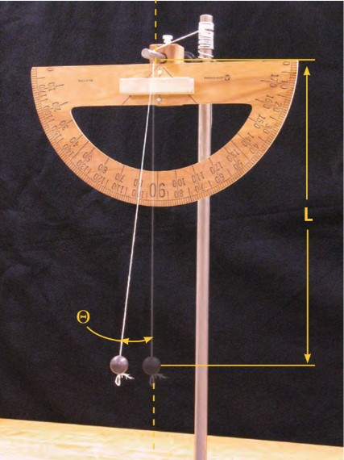
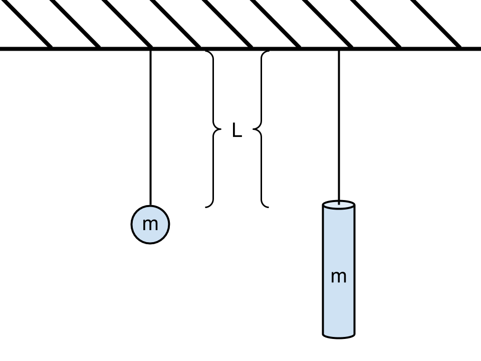

# The Pendulum

::::::Intro (This week...)
:::Figure (pendulum|xs|R)

Shot of Pendulum Setup
:::

Our first major topic in Physics 6BL will be simple harmonic motion (SHM), or the oscillating behavior of a body when subjected to a restoring force directly proportional to it's displacement from equilibrium. SHM is a universal behavior, witnessed in everything from springs to pendulums, and even forms the basis of Quantum Field theories. 

In this lab we will learn about SHM by studying the behavior of a pendulum, and characterizing how carrying certain physical variables of a pendulum change its behavior.

::::::
---

# Introduction

<!--!(https://drive.google.com/file/d/1LFQdf2nu1YZzSB_addwEp8zbTW7yBu3l)-->

:::Figure (sho|xs|R)

:::

Simple harmonic motion &mdash; the simple oscillatory behavior of a mass bouncing on a spring &mdash; is found everywhere in nature, both in the classical and quantum world! Because of this, the theory of simple harmonic motion will be a recurring theme throughout your physics career: many different systems can be modeled or approximated as harmonic oscillators. 

One of the most accessible systems that can be approximated by simple harmonic motion is the pendulum. A **pendulum** is a weight hung from a fixed point so that it can swing freely backward and forward under gravity. As you know intuitively, when you hang a mass from a pivot point, and let it go from a position higher than its minimum, it will continue to swing back and forth until friction or external forces bring it to rest at its equilibrium point. When a pendulum weight is let go from a small height above its minimum ;;; otherwise a **small angle**;;;, its motion is very well approximated by a harmonic oscillator 

The objective of this lab is to determine the physical quantities that influence the period of a pendulum. The period is how long it takes for the pendulum to make one complete cycle of motion. The relevant features are the mass of the bob, the length of the pendulum, and the initial angular displacement. We will test how each of these parameters influences the period of the pendulum by varying one of them while keeping the other two constant.

## Preparing for the Pendulum Experiments

In the following [Activity](#Activity-tables), we will be preparing our data tables and calculations so that we can quickly take down data and see the final results of calculations. We will need three tables in this exercise, one for each parameter (mass $m$, initial angle $\theta_0$, length $L$) we will vary during the experiment. We are interested in how varying each of these parameters affects the period of oscillation, $T$. 

If you haven't done so, please preview the lab procedure in [Part II](#part2) to familiarize yourself the the general procedure. After reviewing this, continue on to  to prepare the data tables and basic calculations.

::::::Activity (tables|Preparing the Tables (10 min))
In this lab, we will need three data tables. 
1. A very basic template of these three tables is provided [here](https://docs.google.com/spreadsheets/d/1DDIQSRuBLbqCgpXy2pXZxzmEegwtEWjupJs3e6fj_GU/edit?usp=sharing). Please **copy** these into a personal spreadsheet.
2. These tables are not [Good Tables](?linkfile=FAQ#QHowdoIreceivefullcreditonatableinmylabreport). Add missing elements and formatting to ensure that they are good, descriptive tables. You will need to come up with a descriptive title for each table.
3. For each column titled **1 Period**, insert a spreadsheet function that will calculate the average period of the pendulum using the **10 Period** value ;;;You may wish to enter "dummy" data to ensure that your spreadsheet function is working;;;

Link a copy of each of these tables to the exercises you will use them in (,,  respectively). They will automatically update if you are linking between a Google sheet and a Google doc.

:::Note (|10 C)
When linked sheets are updated, any edits to the data in the original file will appear in the Google Docs file. If you make edits to the linked chart, table, or slide in your Google Docs, the **changes won't be copied to the original file** and will be lost. [See More Here](https://support.google.com/docs/answer/7009814?hl=en&co=GENIE.Platform%3DAndroid)
:::

::::::

# The Pendulum Experiments
## Mass

We will investigate if the period $T$ of the pendulum depends on the mass $m$ of the bob attached to its end. To do so, we will vary the mass, $m$, while keeping the length, $L$, and initial angle, $\theta_0$, constant.

::::::Activity (mass| Period as a function of Mass (15 min))

We have **five** (5) bobs of different masses that we can place at the end of our pendulum. Below is a video showing the mass of each bob being measured. Watch this video to determine the mass of each of the five bobs. Throughout this lab, we will use the same numbering scheme for each bob that we use in this video, so when we say, for example, "Mass 4" in a later video, we are talking about the same mass presented here.

::: Video
<iframe width="100%" height="100%" src="https://www.youtube.com/embed/jlHmdzWArcY" title="YouTube video player" frameborder="0" allow="accelerometer; autoplay; clipboard-write; encrypted-media; gyroscope; picture-in-picture" allowfullscreen></iframe>
:::

1. Fill your Table 1 with the measured mass values. Make the video pause, and use the triple beam balance to make your best measurement of the mass.

In the next video you will be shown five different pendulums. The only thing that is different among the five pendulums is the mass that is used. The initial angle for each setup is $20^{\circ}$, and the length is $80\rm\ cm$.

::: Video
<iframe width="100%" height="100%" src="https://www.youtube.com/embed/-teybyRBRxE" title="YouTube video player" frameborder="0" allow="accelerometer; autoplay; clipboard-write; encrypted-media; gyroscope; picture-in-picture" allowfullscreen></iframe>
:::

2. For each mass, use the stopwatch in the video, a stopwatch app, or the video time stamp, to record the time it takes for the pendulum to undergo **ten** (10) complete periods. A complete period is the time it takes for the pendulum to swing back and forth once. 
:::Note (|10 C)
Start the stopwatch when the pendulum is at the beginning of a period, then, when it has reached the end of the tenth period from the start, stop the stopwatch.
:::
3. Input this time into your table. Your spreadsheet function should divide it by ten to obtain an average time for one period in the designated column.

::::::

:::Exercise (table1|2 Points)
1. Include your completed [Good Table](?linkfile=FAQ#QHowdoIreceivefullcreditonatableinmylabreport) here.
2. Does the period appear to depend on mass? Justify your answer in 2-3 sentences.
:::

## Initial Angle

Conventional analysis of the pendulum is done for small angles, where the restoring force experienced by the mass is approximately linear with the displacement angle. A linear restoring force is one of the criteria for simple harmonic motion. When the displacement angles become large, the restoring force is no longer linear. The motion is still periodic, but it is not sinusoidal, and the mathematical analysis becomes far more involved. In this lab we will focus only on small displacement angles, and thus simple harmonic motion.

We will investigate if the period $T$ of the pendulum depends on the initial angle $\theta_0$ of the bob attached to its end. To do so, we will vary the initial angle, $\theta_0$, while keeping the length, $L$, and mass, $m$, constant.

::::::Activity (angle| Period as a function of Initial Angle (10 min))

You will be working with only a single mass for this part of the experiment, and only one pendulum length. Below is a video of a pendulum with mass #2. The video shows the pendulum starting at the different initial angles of $5^{\circ}$, $10^{\circ}$, and $15^{\circ}$.  You will collect your data from this video.

1. Record the average period for each initial angle. Use the same method as in  to measure the period.

::: Video
<iframe width="100%" height="100%" src="https://www.youtube.com/embed/8urw-J3UvWY" title="YouTube video player" frameborder="0" allow="accelerometer; autoplay; clipboard-write; encrypted-media; gyroscope; picture-in-picture" allowfullscreen></iframe>
:::

::::::

:::Exercise (table2|2 Points)
1. Include your completed [Good Table](?linkfile=FAQ#QHowdoIreceivefullcreditonatableinmylabreport) here.
2. Does the period depend on the initial angle? Justify your answer in 2-3 sentences.
:::

:::Exercise (|1 Point)
Why can you use only one mass instead of all five different masses in order to determine if period depends on initial angle? Respond in 1-2 sentences.
:::

## Length

We will investigate if the period $T$ of the pendulum depends on the length of the pendulum $L$. To do so, we will vary the length $L$, while keeping the initial angle, $\theta_0$, and mass, $m$, constant.

::::::Activity (mass| Period as a function of Length (15 min))

In the following video you will see three pendulums all having the same mass (mass #2) and initial angle of $10^{\circ}$. The only thing that varies among runs is the length. After the first run, there will be a brief close-up of the mass with a meterstick in the background. You can use this to make your own length measurement. For the second run, the length will be  $40 \rm cm$, and for the third it will be  $24 \rm cm$.

1. Use the same method as in  and  to measure the average period for each pendulum length.

::: Video
<iframe width="100%" height="100%" src="https://www.youtube.com/embed/Ac8y90LqqfI" title="YouTube video player" frameborder="0" allow="accelerometer; autoplay; clipboard-write; encrypted-media; gyroscope; picture-in-picture" allowfullscreen></iframe>
:::

::::::

:::Exercise (table3|2 Points)
1. Include your completed [Good Table](?linkfile=FAQ#QHowdoIreceivefullcreditonatableinmylabreport) here.
2. Does the period depend on length? Justify your answer in 2-3 sentences.
:::

# Determining Mathematical Dependence

From your previous investigations on which parameters affect the period of the pendulum you should have concluded that the length $L$ affects the period of the pendulum. In this part, we will attempt to find the mathematical relationship between the period $T$ and the length $L$.

::::::Activity (additional|Additional $L$ v.s. $T$ Data (15 min))

Below is a (very-much-sped-up) video of several pendulums with mass #2. The initial angles are all $10^{\circ}$. We vary the length from 96 $\rm cm$ to $\rm 24$ cm. To keep the lab from being too long, we will provide you with the data that we collected.

1. Watch the video. 

::: Video
<iframe width="100%" height="100%" src="https://www.youtube.com/embed/tb9A7V8-zQU" title="YouTube video player" frameborder="0" allow="accelerometer; autoplay; clipboard-write; encrypted-media; gyroscope; picture-in-picture" allowfullscreen></iframe>
:::

2. Go to [this link](https://docs.google.com/spreadsheets/d/1DMPQkvcP9G1PL5zQ8zYbrnKqF0OLL5HsuGyi77gREJE/edit?usp=sharing) to get your data. Make a copy of this [Good Table](?linkfile=FAQ#QHowdoIreceivefullcreditonatableinmylabreport) to work with.

3. Note that the times given are for 10 periods; you will need to divide them by 10 using a spreadsheet function in order to find the actual period of the pendulums. You will also want to convert the length values from $\rm cm$ to meters.

4. Make a plot of period vs. length (include all elements of a good plot).

::::::

:::Exercise (|2 Points)
1. Include your [Good Plot](?linkfile=FAQ#QHowdoIreceivefullcreditonaplotinmylabreport) here.
2. Describe the relationship between length and period. Is it linear or nonlinear? How do you know? (1-2 Sentences)

:::
<!-- There is now a whole lab that takes the place of this graphing tutorial.  It is left here for reference.

## PART 3: LOG-LOG GRAPHING TUTORIAL

:::Activity

1. Consider the simple linear relationship $y = 3x$. Make a table of *x* and *y* values for values of $x = 1,2,3,4,5$. Leave room in the table for more calculations.

2. Next to this, make another table, this time recording the $\rm log_{10}\it (x)$, and the $\rm log_{10}\it(y)$. Plot the value of $\rm log_{10}\it(x)$ on the independent axis. Plot the value of $\rm log_{10}\it(y)$ on the dependent axis.

:::Exercise (|1 Point)
a. What is the slope of this line, and why is it significant?

b. What is the *y*-intercept? What is the inverse $log(10^{x})$ of this value, and why is it significant?
:::

:::

:::Activity

1. Consider the non-linear relationship $y = 4x^{3}$. Again make a table of *x* and *y* values for values of $x = 1,2,3,4,5$. Add two columns to the table, this time recording $\rm log_{10}\it(x)$, and $\rm log_{10}\it(y)$. Plot the value of $\rm log_{10}\it(x)$ on the independent axis. Plot the value of $\rm log_{10}\it(y)$ on the dependent axis.

:::Exercise (|1 Point)
a. What is the slope of this line and what does it represent?

b. What is the *y*-intercept? What is the antilog of this value and why is it important?
:::

2. Taking the logarithm of both sides changes $$y = \rm 4\it x^{\rm 3}$$ into $$\rm log_{10}\it(y) = \rm log_{10}(4\it x^{\rm 3})$$

:::Exercise (|1 Point)
a. Use the logarithm property
$\rm log_{10}\it(ab) = \rm log_{10}\it(a) + \rm log_{10}\it(b)$ to reduce the right hand side of this relationship. Explain how this relates to the y-intercept on your graph.
:::

3. Now use the logarithm property $\rm log_{10}(\it a^{b}) = b\rm log_{10}\it(a)$ to further reduce the right hand side.

:::Exercise (|1 Point)
a. Show this math. Explain how this relates to the slope of your graph. Hint: Your graph has an independent variable of $\rm log_{10}\it(x)$, not $x$.

b. Consider the relationship $y = x^{1/3}$. If you made a log-log plot of this, what would the slope be?
:::

:::
-->

## Analyzing the Data

<!-- One method you used was changing the independent variable of your data, which works great when you have an idea about what the equation *should* look like. The other method you used was to take the logarithm of both *x* and *y* values, to plot them, and from that plot find the power of *x* (and/or *y*) and the proportionality constant in the original equation. -->
Let's assume that the period $T$ depends on the length $L$ in a non-linear way, namely a power law:

::: Equation generalizedPeriod
$$T=a L^b$$
:::

where $a$ and $b$ are unknown values.

<!-- :::Exercise (|1 Point)
In the equation above, which is the dependent variable and which is the independent variable?
:::
-->
From your data analysis lab, you recall learning about "linearizing" data, that is, making nonlinear data fit a straight line. The method you used was to take the logarithm of both the independent variable ($x$) and  the dependent variable ($y$) values, to plot them, and from that plot find the power of $x$ (and/or $y$) and the proportionality constant in the original equation.

<!-- In the following exercise, you are asked to use one of these techniques to accept or reject the hypotheses of Alpa and Beetuh. 

:::Activity
** Option 1: Independent Variable **
1. Use the data from Part 2 to make a table of $L^{2}$, $L^{1/2}$ and $T$. Make two plots &ndash; one of $T$ vs. $L^{2}$, and one of  $T$ vs. $L^{1/2}$. Plot $L$ (raised to whichever power) on the independent axis, and $T$ on the dependent axis. **Hint: Convert length measurements to meters.**

:::Exercise (|1 Point)
a) What are the values of the slopes of these lines? What is their significance?

b) What are the *y*-intercepts of these lines? What is their significance?

c) Based on the appearance of these graphs, which do you think more accurately captures the data? Give a detailed explanation of your reasoning.
:::
-->

<!--The relationship between the period and length can be expressed:

$$
\rm Period = 2\pi \left (\frac{Length}{\it a} \right )^{\it b}
$$

where $a$ and $b$ are unknown values.

1.  Use the slope and *y*-intercept of the better graph to determine the quantities $a$ and $b$.

:::Exercise (|1 Point)
a. What is your measured value of $b$? What do you think $b$ should be, and what does it tell you about the relationship between period and length?

b. What is the value of $a$, and what does it suggest? **Hint: Think of quantities that are physically relevant to the experiment.**

c. Use dimensional analysis to show that this interpretation of $a$ makes sense.

d. With the derived values for $a$ and $b$, write the explicit mathematical relationship between Period and Length.

e. Based on this analysis, give an explanation to Alpa and Beetuh summarizing which hypothesis is correct and how they can come to this conclusion by inspecting the data on their own.
:::

:::
-->
:::::::::Activity (loglog|Making a Log-Log Plot (20 min))
<!--** Option 2: Log-Log **

The relationship between the period and length can be expressed:

$$
\rm Period = 2\pi \left (\frac{Length}{\it a} \right )^{\it b}
$$

where $a$ and $b$ are unknown values.
-->
1. Start with the  given above. Take the logarithm of both sides, and reduce this equation by using the rules for logarithms that you learned in the last lab. 

:::::: Hider (logs|A reminder about properties of logarithms:)

:::Equation (logRules)
$$\log(XY) = \log(X) + \log(Y)$$

$$\log(\frac{X}{Y}) = \log(X) - \log(Y)$$

$$\log(X^Y) = Y \log(X)$$ 

$$10^{log (f)} = f$ 

:::

::::::

::::::Exercise (|1 Point)
1. Provide your work and the equation you arrived at. 

:::Note (|10 C)
In your final reduction, you should recognize that some values are constant, while one term is dependent upon the length $L$ (specifically on $\rm log_{10}(L)$).
:::

2. What is the mathematical relationship between the slope of the log-log line and the unknowns $a$ and $b$?

3. What is the mathematical relationship between the intercept of the log-log line with the vertical axis and the unknowns $a$ and $b$?
::::::

2. In the spreadsheet of data from , fill in the spreadsheet function to calculate $\rm log_{10}(L)$ and $\rm log_{10}(T)$. Plot $\rm log_{10}(L)$ on the independent axis, and $\rm log_{10}(T)$ on the dependent axis.  Find the line of best fit and display it on your plot.

:::Note (|6 C)
Hint: Convert length measurements to meters.
:::

:::Exercise (|2 Points)
1. Include your [Good Plot](?linkfile=FAQ#QHowdoIreceivefullcreditonaplotinmylabreport) here
2. From the line of best fit, what is the numerical value of the slope of this  log-log line? 

3. From the line of best fit, what is the numerical value of the intercept of this log-log line with the vertical axis?;;; Hint: Make sure you use the correct number of significant figures;;;
:::

3.  Use the slope and intercept of your log-log graph to determine the quantities $a$ and $b$.

:::Exercise (|2 Points)
1. From your answers to the two previous questions, what is the numerical value of $a$ you calculated? 

2. From your answers to the two previous questions, what is the numerical value of $b$ you calculated? 

3. Using the numerical values for $a$ and $b$, rewrite the  involving them explicitly.;;; Hint: Make sure you use the correct number of significant figures;;;

:::

:::::::::

## Comparing Experiment to Theory
The relationship between the period and length can be derived theoretically to be:

:::Equation (period|Theoretical Period of a Small-Angle Pendulum)
$$
T = 2\pi \sqrt{\frac{L}{g}}
$$
:::

where $g$ is the acceleration due to gravity ($g=9.8\rm\ m/s^2$). We want to compare our nonlinear equation, , (which we guessed) to the theoretical model.

:::Exercise (|1 Point)

1. Compare the nonlinear equation we assumed $T=aL^b$ with the above equation and identify the parameters $a$ and $b$ (write the theoretical equations for $a$ and $b$). **Hint:** Recall that $\sqrt{x} = x^{1/2}$

2. What numerical values would you expect for $a$ and $b$ from the theoretical model?

3. Calculate the percent discrepancy between the measured and theoretical values for $a$ and $b$.
:::

:::Exercise (|2 Points)
1. Express the acceleration due to gravity $g$ in terms of $a$ and $b$.

2. What numerical value do you obtain for $g$?

3. What is the percent discrepancy between the accepted value of $g$ and your calculated value?
:::

:::Note (|10 C)
Measuring the period of a pendulum is a simple method to determine the acceleration due to gravity on Earth or any planet!
:::

::::::Exercise (|1 Point)
Consider two different pendulums of equal mass and tied to strings of equal length, but which differ in the following way: The first is a sphere, similar to those used in this experiment. The second is a lengthy rod, tied at one end. (See .) Which pendulum has a longer period? **Hint: Think about the center of mass and what that means for the effective length.**

:::Figure (twoPendulums| m|)
<!--{max-width=200px max-height=200px}-->
:::

::::::

# Conclusion

:::Exercise (|2 Points)
Write a brief conclusion summarizing the important points of this lab.
:::

::::::Summary

- Make sure to include all tables, plots, pictures, drawings, screenshots or anything else asked of you in the exercises in your report, as well as answers to all the questions.
- All responses and answers should contain the correct number of sig figs and should include units when needed.
- Please show your work where applicable

::::::