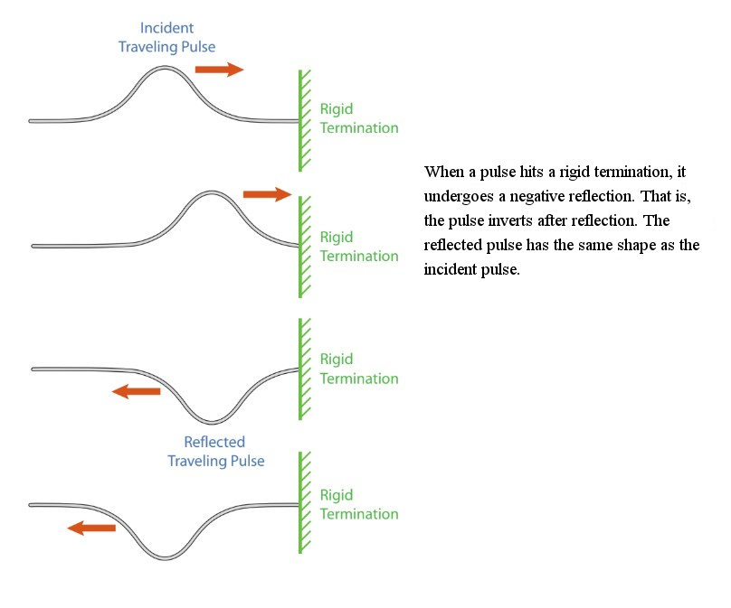
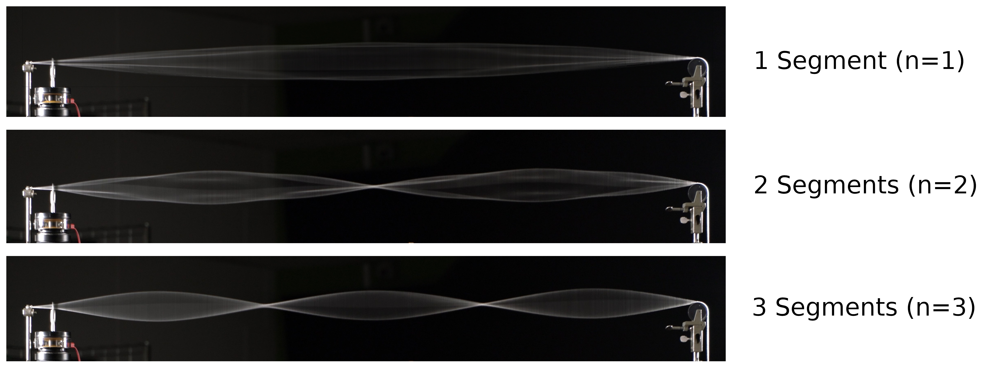
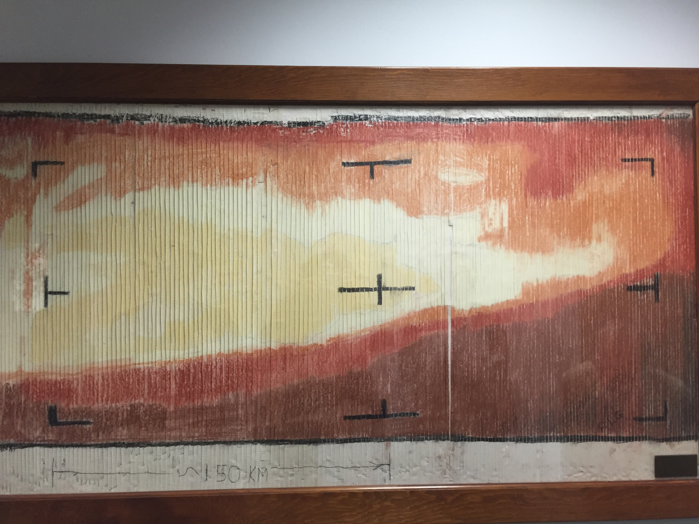
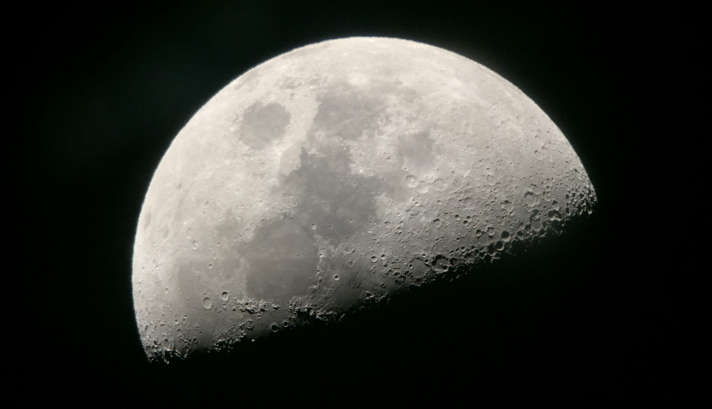
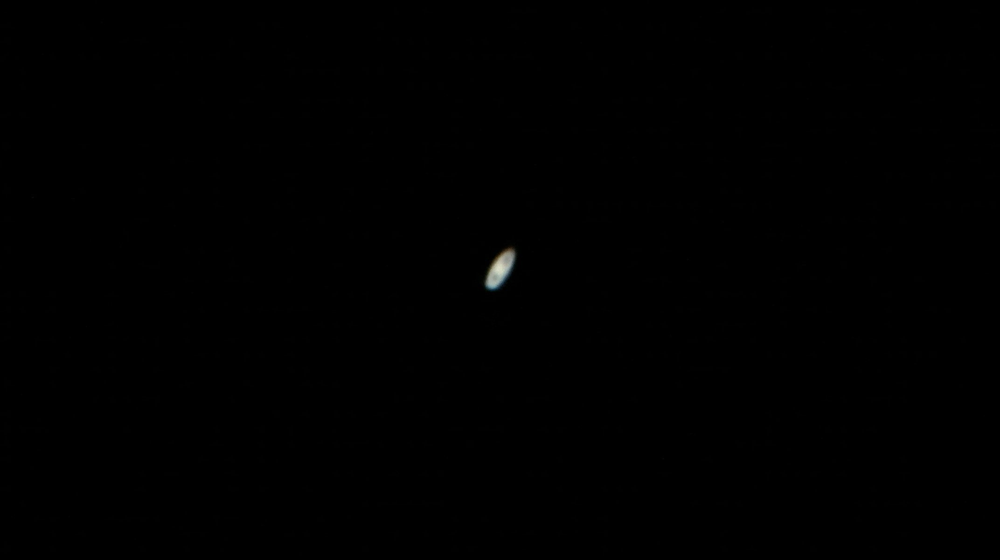

# Waves on a String

:::Card Intro This week..
In this lab we will study **standing waves** on a string. A standing wave, also known as a stationary wave, is a wave which oscillates in time but whose peak amplitude profile does not move in space. Such waves occur when one or more ends of a string are fixed, or a string is periodically peturbed. Standing waves and their related mathematics are ubiquitous throughout science -- they are even responsible for the formation of sound in musical instruments.
:::

# Theory
In this part we will look at the factors that determine the speed of waves traveling on a string  (propagation velocity), we will see how waves reflect from boundaries and we will understand how multiple waves can overlap. We will study these concepts using pulses, which are localized disturbances, but all the conclusions will hold for sinusoidal waves.

## Propagation of Pulses

:::Figure pulses xxl

*Traveling Pulse Waves*
:::

The propagation velocity of all waves on a particular string is determined by the properties of the string itself &ndash; the tension in the string, $T$, and the linear mass density of the string, $\mu$.  The linear mass density is the mass per unit length of string, which determines how heavy the string is per unit length.
<!--For a given frequency the wavelength is determined entirely by the velocity of the wave on the string. The velocity of a wave on a string is given by:-->

:::Equation velocityTension
$$
\begin{aligned}
v =& \sqrt{\frac{\rm (Tension)}{\rm (String)\ (Density)}} \\\\
=&\sqrt{\frac{T}{\mu}}
\end{aligned}
$$
:::
 where $v$ is the velocity.
<!-- AVOCADO What is the equation for wavelength in terms of force? -->

::: Question
For a given tension, will a pulse on a denser string have greater or lesser propagation velocity than one on a less dense string? Justify your reasoning.
:::

## Reflection of Pulses from Boundaries

:::Figure pulseReflections xxl

*Incident and Reflected Traveling Pulse*
:::

[Fi](#Fi-pulseReflections) above illustrates what happens to a pulse when it is reflected from a rigid termination.

## Superposition of Pulses

Two waves can travel on a string &ndash; in opposite directions &ndash; and pass through each other, and retain their individual properties. This is called the principle of superposition. 

:::Figure superposition xxl

*Superposition of Two Counterpropagating Pulses*
:::

Consider two pulses of identical shape and amplitude traveling toward each other. If they are both positive ([Fi](#Fi-superposition), left side) they will cross each other and, when they are exactly over each other, build in amplitude. The maximum height is the sum of both individual amplitudes. If one is positive and the other negative ([Fi](#Fi-superposition), right side), they will sum to zero amplitude when they are exactly over each other. In either case, the two pulses retain their original shape and amplitude after they have passed each other.

<!--
::: Exercise

In this exercise you will explore how two disturbances on a string combine when they overlap on the same part of the string. You will use the same simulation as Simulation 1, but this time you will set it up so that the end of the string is loose.

This is mainly just an exercise to gain intuition. You won't be taking data, making a table, or plotting. 

<!-- There is one question for you to answer, but you don't need to spend much time on it. -->

<!--[Simulation 2: Pulse Interference]-->
<!--
!(https://phet.colorado.edu/sims/html/wave-on-a-string/latest/wave-on-a-string_en.html)
-->
<!--
1) First set up the settings on Simulation 2 as follows.

2) Send two pulses with a gap in between them, and observe how they constructively and destructively interfere. Note that this will be easier to view with the speed set to Slow Motion or with reduced tension, to make the waves travel more slowly. You may also play with this in Manual mode.

::: Question
Could you observe constructive interference if you instead set the end to fixed?
:::
:::
-->
<!-- End of Exercise -->

# Oscillatory Motion

If the string is instead driven by a source that moves up and down in a sinusoidal fashion, then a sine wave will propagate down the line instead of a pulse. The length of this waveform is determined by the frequency of oscillation and the propagation velocity of the wave. Note that every point on the string vibrates with the same frequency.

:::Figure oscillator l

*Sinusoidal Mechanical Oscillator*
:::

A wave propagating on a string is described by the equation:

:::Equation velocityWaves
$$
v =  \lambda f
$$
:::
which reads: 
$$
\textrm{velocity} =\textrm{wavelength} \cdot \textrm{frequency} 
$$
As before, the propagation velocity, $v$, is the speed at which any disturbance (pulse or sinusoidal wave) propagates down the string. The wavelength, $\lambda$, is the distance that one sinusoidal oscillation covers on the string. The frequency, $f$, is the rate of periodic oscillation. To measure frequency we will use units of cycles per second, or hertz, abbreviated Hz.

::: Question
1. Consider a very long string driven by a sinusoidal oscillator. The string is so long that there are no reflections. A wave travels at 5 m/s on this string, and the oscillator is set to 10 Hz. You can view the wavelength as how far a wave travels in one period of oscillation. What is the wavelength in this case?

2. If the velocity were instead 20 m/s, what would the wavelength be? Keep in mind that the frequency of the oscillation is the same as before, namely 10 Hz.

3. Is the sinusoidal pattern on the string longer or shorter with a greater propagation velocity?
<!--
c) If the frequency of the oscillator were changed to 16 Hz, how far would one cycle travel? The velocity is still 12 m/s. -->
:::

## Standing Waves

<!--PhET Formatting {width=100% height=600px} -->

Let&rsquo;s fix the right end of the string and thus create a rigid termination. If we drive the left side of the string with a sinusoidal mechanical oscillator (which we will also consider a rigid termination), we generate a wave that will travel down the string. As a wave travels on the string, it is continually reflected back and forth between the two boundaries. At each boundary, the wave experiences a negative reflection. The left-moving and right-moving traveling waves superimpose at all points. 

For most wave frequencies created by the sinusoidal mechanical oscillator, the resulting shape of the string will exhibit a lot of random motion with no discernible pattern, as illustrated in [Fi](#Fi-randomMotion) below.

:::Figure randomMotion xl

*Random motion*
:::

For certain special frequencies, however, the left-moving and right-moving waves line up so that there are areas of large motion called *antinodes*, and areas that don’t move at all, called *nodes*. These patterns of vibration are fixed on the string, and are referred to as sinusoidal standing waves or normal modes of the string.
<!-- This is the phenomenon that occurs on guitar, piano and violin strings. Any vibration on a doubly fixed string can be modeled as a linear combination of the sinusoidal natural modes. This is called Fourier Analysis; you will learn more about this in your advanced coursework. -->

:::Note
The distance between two consecutive nodes is $\lambda/2$. We will call the pattern between two consecutive nodes a &ldquo;segment.&rdquo;
:::

:::Figure nodes xl

*Standing Wave Patterns*
:::

The mathematical condition for standing waves to occur is that the wavelength $\lambda$ of the wave obeys the following equation:

:::Equation wavelengthCondition
$$\lambda = 2\it L/n,$$
:::

where $n$ is a positive integer and $L$ is the length of the string. 

Alternatively, we can write the previous equation as:

:::Equation cavityCondition
$$L = n \cdot (\lambda/2)$$
:::

[Eq](#Eq-cavityCondition) is easier to interpret: any integer number of half wavelengths can fit on the string. Why does this happen? The ends of the string are fixed and cannot move up or down, so they must be nodes. Only if the length of the string is equal to an integer number of segments (which are half-wavelength long), will there be nodes at each end of the string. 
<!-- The phenomenon that occurs when this equation is satisfied is also known as *resonance*. -->

:::Figure wavesOnAString xl

*Waves on a String*
:::

The first three standing wave patterns that occur, for $n$ = 1, 2 and 3, in [Eq](#Eq-cavityCondition), are shown above in [Fi](#Fi-wavesOnAString).

::: Question
a. What wavelength is required to get 5 standing wave segments on a doubly fixed string of length 0.75 m?

b. If the velocity $v$ is 50 m/s, what will be the frequency of this wave?
:::

Using [Eq](#Eq-velocityTension), [Eq](#Eq-velocityWaves) and [Eq](#Eq-wavelengthCondition), we can find the wave frequencies that correspond to standing waves in terms of $n$, the tension $T$, the linear mass density $\mu$,  and the length of string $L$.

:::Equation frequencyEquation
$$
f _n=n \left (\frac{1}{2L}\sqrt{\frac{T}{\mu}} \right ),
$$
:::

where we indexed our frequencies by the number of segments, $n$.

From [Eq](#Eq-frequencyEquation), we conclude that there are specific frequencies at which the mechanical oscillator can drive the string and create standing waves. We call these frequencies **harmonics**. A standing wave with one segment is called the **fundamental** or the the first harmonic. The frequency of the fundamental is  $f_1= \frac{1}{2L}\sqrt{\frac{T}{\mu}}$. 
The higher harmonics have frequencies that are multiples of the fundamental frequency (*e.g.*, the second harmonic has frequency $f_2=2\cdot f_1$)

<!-- The **fundamental** is the natural frequency at which the system wants to oscillate. If instead of driving the system with an oscillator you were to pluck the string as you would on a guitar, it would oscillate at the **fundamental** frequency. -->

<!--
b) If we drive one end of the string with a sinusoidal oscillator of frequency 100 Hz, what velocity is required to set up a standing wave with 5 segments? -->

<!-- Exercise with PhET removed for brevity
::: Exercise

By means of a simulation, you will learn how to produce standing waves. The simulation below shows a string of beads, along which you can send a pulse, or which you can drive periodically. Each bead has mass and interacts with its neighboring beads through the string. So when one bead is displaced, it pulls on its neighboring bead. The green beads behave exactly as the red beads do; they are just there as position references.

A control panel in the upper left corner gives three choices for driving the string. &ldquo;Manual&rdquo; allows you to move the wrench up and down by clicking and dragging it. &ldquo;Oscillate&rdquo; drives the end of the string up and down periodically. You can change the frequency and amplitude of the oscillation in the lower control panel. Last, &ldquo;Pulse&rdquo; allows you send a triangle-shaped pulse down the string. You can change the pulse&rsquo;s amplitude and width in the bottom control panel.

A control panel in the upper right corner allows you to choose whether the right end of the string is free or fixed, or an infinite distance from the left end. The lower control panel will change slightly, depending on your selection of how to drive the string. The things that stay constant are the tension and the damping. The tension slider allows you to change how taut the string is, while the damping slider adds a bit of reality to the simulation. *For the most part, when you use the simulation you will want to set damping either to &ldquo;None&rdquo; or to something small.* At the right side of the bottom control panel is a set of measuring tools that you can turn on. You will need these from time to time to make measurements. For this exercise, though you will set the tension, you will not be concerned with the actual magnitude of the tension or the density of the string of beads. You will do the following:

First, you will measure the length of the string of beads, send a pulse down the chain of beads, and measure the velocity of the pulse.

Knowing the velocity of the pulse, by means of the equations you used to answer the questions above, you will then calculate the frequency at which you must drive the end of the chain to produce a standing wave with two segments.

Then, you will adjust the frequency to something random and see what happens.

Instructions for how to do this follow the simulation.

:::Simulation
!(https://phet.colorado.edu/sims/html/wave-on-a-string/latest/wave-on-a-string_en.html)
:::

1. First set the settings as follows:

|Mode|End|Amplitude|Pulse Width|Damping|Tension|Rulers|Timer|
|:-----:|:-----:|:-----:|:-----:|:----:|:-----:|:-----:|:-----:|
|Pulse|Fixed|0.50 cm|0.30 s|None|High|On|On|

<!--

-->
<!--
2. Measure the length of the string of beads, and record it.

3. Press the green button on the driver. When the pulse reaches either end, start the timer. Time how long it takes for the pulse to make five round trips, and divide to get the time per round trip. Take the round-trip length, and divide by the round-trip time to get the velocity.

4. Use Equation 3 to determine the wavelength you need to create a standing wave with two segments. Show your work.

5. Use the wavelength you just calculated, Equation 1, and the velocity you just measured, to determine the frequency at which you must drive the system to create a standing wave with two segments. Show your work.

6. Now change the settings to those in the table below. (You will not need the ruler or timer.)

|Mode|End|Amplitude|Damping|Tension|
|:-----:|:-----:|:-----:|:-----:|:-----:|
|Oscillator|Fixed|0.5 cm|1*|High|

$^*$For damping, set the slider to 1 division away from &ldquo;None.&rdquo; (You can set it to &ldquo;None,&rdquo; but then you may need to reduce the amplitude, and the system will oscillate wildly when the resonance condition is met. Whatever damping you use, you may find it helpful to press &ldquo;Restart&rdquo; after you change anything.)

Now set the frequency to what you just calculated, and hit play.

<!-- 2) Use equation 3 and your measurement of the length of the string from Exercise 1 to determine the wavelength needed to generate a standing wave with $n$ segments.

3) Use equation 1 and your calculated velocity from Exercise 1 for tension set to high to calculate the frequency as a function of $n$ needed to produce a standing wave with $n$ segments.  -->

<!-- 4. Set your frequency to fit the wavelength to get $n = 2$ with tension set to high. 

5. Repeat part d. with the tension set to Medium and Low for n = 3 and n = 4. Make a table similar to [sample table doc](https://docs.google.com/spreadsheets/d/1xZ7Nz3IUxpD715pPghY0djhcSn_bZ_FZs1SoGMgkw8k/edit?usp=sharing){target=_blank} and fill the table accordingly. Note that the length does not change.  -->
<!--
::: Question
Describe what you are seeing on the screen. What is moving? What is stationary?
:::

6. Now reduce or increase the frequency by 0.2 Hz and hit restart.

:::Question
a. Describe what you see now. Compare and contrast it to what you saw before.

b. Explain the difference between the two setups. Why do they behave so differently?
:::

:::
-->

# Measurement

<!-- Sample PhET for Waves on a String -->
<!-- {width=100% height=600px} -->

<!-- The objective of this lab is to analyze the characteristics of waves on a string. You will do this by examining 3 systems with varying characteristics. -->

In this part of the lab you will watch videos of different versions of the same setup. You can see a schematic of the basic setup in [Fi](#Fi-setup) below. (This is the same apparatus that appears in [Fi](#Fi-wavesOnAString), above.) We have a string, anchored at one end, with an oscillator (driver) attached near that end. The string is then run over a pulley with a mass $m$ hanging off the end to create tension in the string. We can vary the frequency at which the oscillator vibrates, the length of the string (the spacing between the anchor and the pulley), and the amount of mass hanging off the end.

:::Figure setup l

:::

We will start by setting up a system, System 1, and measure the physical characteristics of that system &ndash; length, tension (determined by the hanging mass), and linear mass density of the string. Then we will perform the experiment to make some initial **baseline** measurements. We will then repeat the same measurements with two additional systems. System 2 will have the same length as System 1, but the half the tension (hanging mass) as System 1. System 3 will have half the length as System 1 but the same tension (hanging mass) as System 1. We have measured the linear mass density of the string to be 3.0 g/m.

The goal of the experiment for each system is to observe the wave frequencies for which standing waves occur. Then we will compare and contrast our three runs to see how changing the tension and length of the string affect these frequencies.

For each system we will keep the mass and length constant throughout the experiment, but we will slowly sweep through a range of frequencies. The current frequency will be displayed on a large display in the video. You will notice that at particular frequencies, standing waves will form on the string, according to the patterns illustrated in [Fi](#Fi-nodes) and [Fi](#Fi-wavesOnAString), and described by [Eq](#Eq-wavelengthCondition) and [Eq](#Eq-cavityCondition). Between those frequencies, you may observe very little motion, random motion, or perhaps some motion that appears to have a pattern to it. As compared to the actual harmonics that you will be trying to find, these motions will be very small and short-lived.

<!--
**Important:** You may also notice two sets of standing waves that form at frequencies close together. This happens because the metal tongue that is oscillating can become part of the vibrating system. You don't want this. The standing waves you will want to take note of are the ones that form when it looks as if the tongue is almost still. The string should have something like a node near the end of the metal tongue. See the video below.

:::Video
!(https://drive.google.com/file/d/1vOgx2JbLxskVyYBM4yBIKA0Zpxlp_cx6)
:::
-->
<!--
**Important:** If your internet quality is giving you trouble, you should be able to download any of the these videos and play it on your own computer. If you click the &ldquo;Pop-out&rdquo; button in the upper right, it will open the video in a google drive link. You can download it from there. Additionally, all of these videos are sped up to play at 2X speed. Since this is the YouTube video player you can slow the video down to 0.5X of real life speed and up to 4X real life speed. Just click the cog in the lower right corner and adjust &ldquo;Playback speed.&rdquo;
-->
You will be expected to turn in all plots and tables you are asked to make in the exercises, as well as all answers to questions.

## Setup
In this exercise you will be guided through filling out the data template provided in the table below. This template will be used as a model for all of of the data tables you need to make for this lab.

::::::::: Exercise
In this exercise we will fill out the row labeled &ldquo;System 1&rdquo; in the &ldquo;Constants Table.&rdquo;  To do this, you will use the system shown in [Fi](#Fi-setup) and used in [Vi](#Vi-baseline). This setup can be called System 1.

**Instructions**:

1. The linear density, $\mu$ (mass/length) is given in grams/meter. For the string we are using, the linear mass density is 3.0 g/m. **This is the same for all three systems**
2. The length of the string is about 1.70 m.
3. The mass for the baseline measurement will be 400.0 g.
4. Record these data in a table labeled, &ldquo;Constant Values.&rdquo; This table should have column headers: System #, Linear Densisty (kg/m), Length (m), Mass (kg), Tension (N), Velocity (m/s), Fundamental Frequency (Hz); and row headers: System 1, System 2, and System 3. Record your systems&rsquo; values here as you proceed with part two of this lab. 

:::Note
Be sure to use the units provided in the template tables when recording your data; *e.g.*, linear density should be in kg/m.
:::

::: Table
| Template Link | 
| -------- |
| [Link](https://docs.google.com/spreadsheets/d/14VH-8zIag5QF24o1JIXlLb2614FS3I7WiWoRSvL5tMM/edit?usp=sharing)     | 
:::

:::::: Question
1. What is the tension in the string? Use the formula $\text{Tension} = T = mg$. Record the value in the &ldquo;Tension (N)&rdquo; column. Show your work.

2. What is the speed of the wave you calculate from your observed values of tension ($T$) and linear mass density ($\mu$)? Record this value in the &ldquo;Velocity (m/s)&rdquo; column. Show your work.

3. What is the fundamental frequency of the system, based on the velocity and length? Record this value in the &ldquo;Fundamental Frequency (Hz)&rdquo; column. Show your work.

:::Note
This calculated fundamental frequency, and the ones you will calculate for System 2 and 3,  provide an idea of where to expect to see the first standing wave patterns in the videos.
:::
::::::

<!-- 
<!--Image 1 {width=100% height=600px}

*Image 1 placeholder* -->
:::::::::

## Experiments
In this exercise we will establish our baseline system, System 1. Above, in your Constant Values table, you characterized the system, but now we will perform our experiment. We will drive the oscillator with a sine wave and slowly sweep through a range of frequencies. You can make the video pause, and step through it as slowly as you&rsquo;d like.
:::::: Exercise

Do your best to identify a standing wave. You might notice something looking like a standing wave over a range of frequencies. You want the frequency where the amplitude of the string vibration looks the largest, <!--**the tongue of the oscillator is relatively stable,**--> and the whole wave looks fairly stable.

:::Note
It is fine if you don&rsquo;t measure the *exact* frequency of the wave. We won&rsquo;t grade you on how good you are at watching a video to make a challenging measurement. Just do your best to identify the standing wave and measure the frequency. What is interesting isn&rsquo;t the exact frequency at which a standing wave occurs. It is the *relationship* between frequency and the different standing waves that form. As long as you are close you should see the *relationship*.
:::

Now we will begin taking data points with System 1. 

<!--Video 1 Baseline {width=100% height=600px} -->

:::Video baseline
<iframe width="100%" height="100%" src="https://www.youtube.com/embed/v-TwpVgjShs" title="YouTube video player" frameborder="0" allow="accelerometer; autoplay; clipboard-write; encrypted-media; gyroscope; picture-in-picture" allowfullscreen></iframe>
:::

**Instructions**: 

1. Use the table labeled &ldquo;System 1&rdquo; in the template to record your data.

2. [Vi](#Vi-baseline) shows a sweep through frequencies with System 1. Watch the video and determine the frequency at which you see one standing wave segment. Record the frequency for the standing wave with one segment in your table.

3. Continue watching [Vi](#Vi-baseline) and repeat Step 2 for standing waves of two, three, four and five segments.

<!--- ::: Question
a. Now calculate the speed from the wavelength ($\lambda$) and frequency ($f$). Denote this $v_{\lambda f}$. Use the equation $v_{\lambda f} = f \lambda$. Use Equation 3 to calculate the wavelength. Record this in the System 1 table you just made. Show your work. -->

<!-- b. Compare the two values of speed. Use the $v_{T\mu}$ from your Constants Table and the $v_{\lambda f}$ that you just calculated. What is the percent difference between these two values? Record this in the System 1 table you just made. Show your work. -->
<!--- :::-- >
:::
<!-- End Exercise -->
::::::

This exercise uses a new setup called System 2. This will have the **same length as System 1**, but will have **half the hanging mass**.

:::::: Exercise

**Instructions**
1. The mass for System 2 is 200.0 g. 
<!-- 1) Measure the mass for System 2 using Image 2 below.

<!-- Image 2 {width=100% height=600px}

*Image 2 placeholder* --> 

2. Add the values of $\mu$, $L$, and $m$  to your Constant Values table in the System 2 row. Calculate the tension, velocity, and the fundamental frequency. Include those in your table as well.

<!--Video 2 Lighter Mass {width=100% height=600px} -->
:::Video halfMass
<iframe width="100%" height="100%" src="https://www.youtube.com/embed/PHV0RSShpgI" title="YouTube video player" frameborder="0" allow="accelerometer; autoplay; clipboard-write; encrypted-media; gyroscope; picture-in-picture" allowfullscreen></iframe>
:::

3. Just as you did for System 1, go through [Vi](#Vi-halfMass) and find the frequencies for each number of standing wave segments. Fill out your System 2 table accordingly. You should be able to go up to at least five segments.
::::::
<!-- End of Exercise -->

This exercise uses a new setup called System 3. This will have the **same mass as System 1**, but will have **half the length**.
:::::: Exercise

**Instructions :** 

1. The length of the string in System 3 is 0.85 m. 

<!-- 1) Measure the length for System 3 using Image 3 below.Q

<!--Image 3 {width=100% height=600px}

*Image 3 placeholder* -->

2. Add the values of $\mu$ , $L$, and $m$ to your Constant Values table in the System 3 row. Calculate the tension, velocity, and the fundamental frequency. Include those in your table as well.

<!--Video 3 Baseline {width=100% height=600px} -->
:::Video halfLength
<iframe width="100%" height="100%" src="https://www.youtube.com/embed/wiNSBAKnoLc" title="YouTube video player" frameborder="0" allow="accelerometer; autoplay; clipboard-write; encrypted-media; gyroscope; picture-in-picture" allowfullscreen></iframe>
:::

3. Just as you did for Systems 1 and 2, go through [Vi](#Vi-halfLength) and find the frequencies for each number of standing wave segments. Fill out your System 3 table accordingly. You should just barely be able to get five segments. 
::::::

## Analysis
In this exercise we will now analyze the three systems and compare and contrast them to each other.

::::::::: Exercise
**Instructions**

1) Our goal is now to study the relationship between the frequency and the number of segments of the wave. Make sure your tables for Systems 1, 2 and 3 are completely filled out.

:::Question
1.  How does halving the mass change the fundamental? Find the ratio of the fundamental frequency of System 2 to that of System 1.

2. What would you expect the ratio in the previous part to be from the theory? 
Remember that the frequency of the fundamental is  $f_1= \frac{1}{2L}\sqrt{\frac{T}{\mu}}$. 
:::

:::::: Question
1. How does halving the length change the fundamental? Find the ratio of the fundamental frequency of System 3 to that of System 1. 

2. What would you expect the ratio in the previous part to be, given the theory? Remember that the frequency of the fundamental is  $f_1= \frac{1}{2L}\sqrt{\frac{T}{\mu}}$. 

:::Note
The mass we are referring to in this question is the hanging mass, which determines the tension in the string.
:::
::::::

2) For all three systems, we expect the harmonics to be multiples of the fundamental frequency. 

:::Question
1. Find the ratios of the upper harmonic frequencies to the frequency of the fundamental for all three systems. This should give you a list of at least 12 numbers, depending on how many harmonic frequencies you found.

2. Does halving the length or halving the tension (mass) change the relationship (ratio) between the upper harmonics and the fundamental? Explain.
:::

3) Plot  your measured harmonic frequencies, $f_n$, versus the number of segments, $n$, for each system. It is more informative if you add all the three plots on one graph, in different colors, but you can also make three different graphs.

4) Plot the line of best fit for each system.

::: Question
What are the slopes of the best fit lines for each system?
:::
1) Combine [Eq](#Eq-velocityTension), [Eq](#Eq-velocityWaves) and [Eq](#Eq-wavelengthCondition) (from the Theory section), and derive [Eq](#Eq-frequencyEquation) (show all your work):

::: Equation
$$
f _n= \left (\frac{1}{2L}\sqrt{\frac{T}{\mu}} \right )n
$$
:::

::: Question
1. From [Eq](#Eq-frequencyEquation), what is slope of your $f_n$ vs. $n$ graph in terms of $T$, $\mu$, and $L$?

2. What are the units of the slope, and what physical meaning does it have? Hint: To find the physical meaning, read the theory behind [Eq](#Eq-frequencyEquation) again.

3. For each system, compare the value of the slope of your plot (for that system) to the fundamental frequency  observed  in the videos (of the corresponding system) by calculating the percent difference between the two values.
:::

:::::::::

<!-- We have previously given you the value of the linear mass density ($\mu$), but you can check our value by using the slope from Equation 5. 

<!-- :::Question
Use the slopes from your graph, and the tension and length for each system, to calculate the density, $\mu$, of the string.  Compare these measured values of density to the given value (3.0 g/m) by calculating the percent discrepancy.
::: 
-->

## Conclusion

:::Exercise
Write a brief conclusion summarizing the important points of this lab.
:::

<!-- Example Functions -->

<!--PhET Formatting {width=100% height=600px} -->

<!-- Sample Table Sheet https://docs.google.com/spreadsheets/d/1xZ7Nz3IUxpD715pPghY0djhcSn_bZ_FZs1SoGMgkw8k/edit?usp=sharing -->

:::Summary
Make sure to include all tables, plots, pictures, drawings, screenshots or anything else asked of you in the exercises in your report, as well as answers to all the questions.

All responses and answers should contain the correct number of sig figs and should include units when needed.
:::