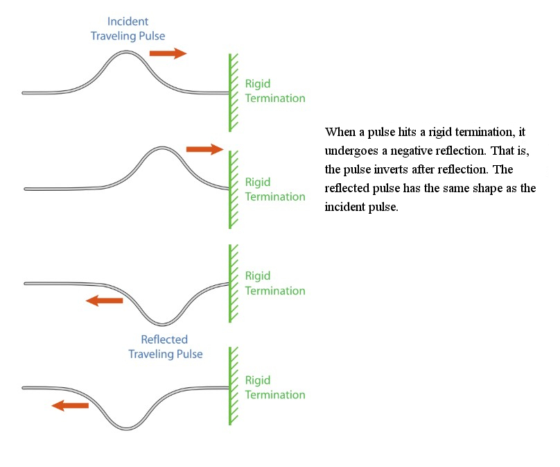
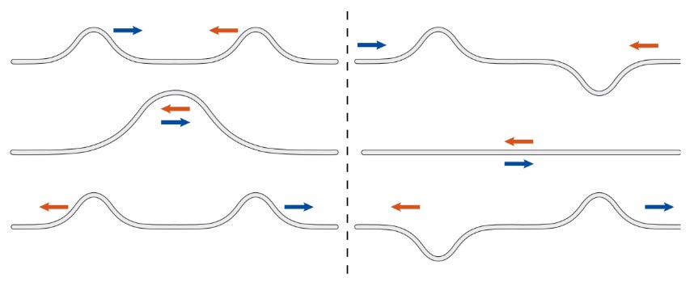
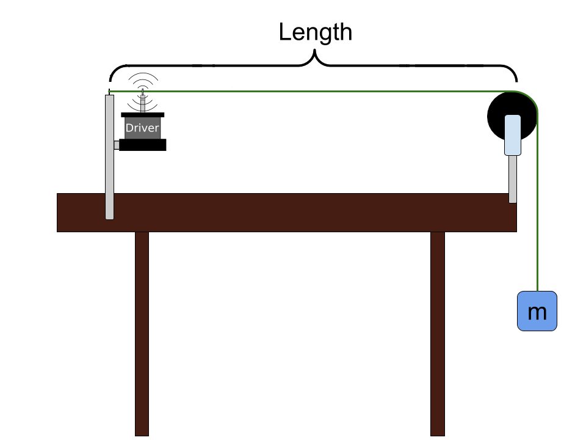

# Waves on a String

::::::Intro (This week..)
In this lab we will study **standing waves** on a string. A standing wave, also known as a stationary wave, is a wave which oscillates in time but whose peak amplitude profile does not move in space. Such waves occur when one or more ends of a string are fixed, or a string is periodically perturbed. Standing waves and their related mathematics are ubiquitous throughout science &mdash; they are even responsible for the formation of sound in musical instruments.
::::::

# Theory of Pulses
Before getting to steady state waves and the experiment description, we will look at the factors that determine the speed of waves traveling on a string (propagation velocity), we will see how waves reflect from boundaries and we will understand how multiple waves can overlap. We will study these concepts using pulses, which are localized disturbances, but all the conclusions will hold for sinusoidal waves.

## Propagation of Pulses

A pulse is a generic term describing a single disturbance that moves through a transmission medium &mdash; in our case, a string. You can generate a pulse in a string by snapping it's end up and back down once. This will create a pulse with an amplitude related to the height that you snapped the string. The pulse will propagate across the length of the string. We are interested in how this pulse propagates mathematically.

:::Figure (pulses|xxl)

:::

The propagation velocity of all waves on a particular string is determined by the properties of the string itself &mdash; the tension in the string, $T$, and the linear mass density of the string, $\mu$.  The linear mass density is the mass per unit length of string, which determines how heavy the string is per unit length.
<!--For a given frequency the wavelength is determined entirely by the velocity of the wave on the string. The velocity of a wave on a string is given by:-->
By unit analysis, one can write
$$
v =\sqrt{\frac{\rm (Tension)}{\rm (String)\ (Density)}}
$$
which results in the final equation:

:::Equation (velocityTension)
$$
v =\sqrt{\frac{T}{\mu}}
$$
:::
 where $v$ is the velocity.
<!-- AVOCADO What is the equation for wavelength in terms of force? -->

:::Exercise (|1 Point + Prelab|prelab)
For a given tension, will a pulse on a denser string have greater or lesser propagation velocity than one on a less dense string? Justify your reasoning. (2-3 Sentences)
:::

## Reflection of Pulses from Boundaries

:::Figure (pulseReflections|l)

:::

 above illustrates what happens to a pulse when it is reflected from a rigid termination.

## Superposition of Pulses

Two waves can travel on a string &ndash; in opposite directions &ndash; and pass through each other, and retain their individual properties. This is called the principle of superposition. 

:::Figure (superposition|xxl)

:::

Consider two pulses of identical shape and amplitude traveling toward each other. If they are both positive (, left side) they will cross each other and, when they are exactly over each other, build in amplitude. The maximum height is the sum of both individual amplitudes. If one is positive and the other negative (, right side), they will sum to zero amplitude when they are exactly over each other. In either case, the two pulses retain their original shape and amplitude after they have passed each other.

# Theory of Oscillatory Motion

We just investigated how a single pulse, perhaps generated by quickly snapping the end of the string, leads to a single disturbance that travels down the length of the string. What happens if we continually snap the end of the string up and down?

If the string is instead driven by a source that moves up and down in a sinusoidal fashion, then a sine wave will propagate down the line instead of a pulse. The length of this waveform is determined by the frequency of oscillation and the propagation velocity of the wave. Note that every point on the string vibrates with the same frequency.

:::Figure (oscillator|l)

:::

A wave propagating on a string is described by the equation:

:::Equation (velocityWaves)
$$
v =  \lambda f
$$
:::
which reads: 
$$
\textrm{velocity} =\textrm{wavelength} \cdot \textrm{frequency} 
$$
As before, the propagation velocity, $v$, is the speed at which any disturbance (pulse or sinusoidal wave) propagates down the string. The wavelength, $\lambda$, is the distance that one sinusoidal oscillation covers on the string. The frequency, $f$, is the rate of periodic oscillation. To measure frequency we will use units of cycles per second, or hertz, abbreviated Hz.

:::Exercise (|1 Point + Prelab|prelab)
1. Consider a very long string driven by a sinusoidal oscillator. The string is so long that there are no reflections. A wave travels at 5 m/s on this string, and the oscillator is set to 10 Hz. You can view the wavelength as how far a wave travels in one period of oscillation. What is the wavelength in this case?

2. If the velocity were instead 20 m/s, what would the wavelength be? Keep in mind that the frequency of the oscillation is the same as before, namely 10 Hz.

3. Is the sinusoidal pattern on the string longer or shorter with a greater propagation velocity?

:::

## Standing Waves

Let's fix the right end of the string and thus create a rigid termination. If we drive the left side of the string with a sinusoidal mechanical oscillator (which we will also consider a rigid termination), we generate a wave that will travel down the string. As a wave travels on the string, it is continually reflected back and forth between the two boundaries. At each boundary, the wave experiences a negative reflection. The left-moving and right-moving traveling waves superimpose at all points. 

For most wave frequencies created by the sinusoidal mechanical oscillator, the resulting shape of the string will exhibit a lot of random motion with no discernible pattern, as illustrated in  below.

:::Figure (randomMotion|xl)

:::

For certain special frequencies, however, the left-moving and right-moving waves line up so that there are areas of large motion called *antinodes*, and areas that don’t move at all, called *nodes*. These patterns of vibration are fixed on the string, and are referred to as sinusoidal standing waves or normal modes of the string.

:::Note
The distance between two consecutive nodes is $\lambda/2$. We will call the pattern between two consecutive nodes a "segment."
:::

:::Figure (nodes|xl)

:::

The mathematical condition for standing waves to occur is that the wavelength $\lambda$ of the wave obeys the following equation:

:::Equation wavelengthCondition
$$\lambda = 2\it L/n,$$
:::

where $n$ is a positive integer and $L$ is the length of the string. 

Alternatively, we can write the previous equation as:

:::Equation cavityCondition
$$L = n \cdot (\lambda/2)$$
:::

 is easier to interpret: any integer number of half wavelengths can fit on the string. Why does this happen? The ends of the string are fixed and cannot move up or down, so they must be nodes. Only if the length of the string is equal to an integer number of segments (which are half-wavelength long), will there be nodes at each end of the string. 

:::Figure (wavesOnAString|xl)

:::

The first three standing wave patterns that occur, for $n$ = 1, 2 and 3, in , are shown above in .

:::Exercise (|1 Point+ Prelab |prelab)
1. What wavelength is required to get 5 standing wave segments on a doubly fixed string of length 0.75 m?

2. If the velocity $v$ is 50 m/s, what will be the frequency of this wave?
:::

Using ,  and , we can find the wave frequencies that correspond to standing waves in terms of $n$, the tension $T$, the linear mass density $\mu$,  and the length of string $L$.

:::Equation (frequencyEquation)
$$
f _n=n \left (\frac{1}{2L}\sqrt{\frac{T}{\mu}} \right ),
$$
:::

where we indexed our frequencies by the number of segments, $n$.

From , we conclude that there are specific frequencies at which the mechanical oscillator can drive the string and create standing waves. We call these frequencies **harmonics**. A standing wave with one segment is called the **fundamental** or the the first harmonic. The frequency of the fundamental is  $f_1= \frac{1}{2L}\sqrt{\frac{T}{\mu}}$. 
The higher harmonics have frequencies that are multiples of the fundamental frequency (*e.g.*, the second harmonic has frequency $f_2=2\cdot f_1$)

# Preparing for the Experiment

We will now prepare our data tables and equations, as usual. At this point you should read through the rest of the lab to make sure that you fully understand the procedure and what data must be collected and processed.

::::::Activity (tables|Preparing our data tables)

**Instructions**:

1. Make a copy of the [template spreadsheet](https://docs.google.com/spreadsheets/d/1doIHu8ngg5R7n5NdSrDIL-a8X4djHy6YuUwK7rsHEaI/edit?usp=sharing) for this lab.

:::Card (|Spreadsheet Template| PHYS 6BL Lab 2)
<iframe width="100%" height = "350px"src="https://docs.google.com/spreadsheets/d/e/2PACX-1vRvkxqSVe9WX5gVuJIszUhB0yEiRXBkh8OwYucgbc2IdAYIphuW4n5B72XfDPfqE74iSlUi-xSm1xGU/pubhtml?widget=true&amp;headers=false"></iframe>
:::

2. As usual, make these tables [Good Tables](?linkfile=FAQ#QHowdoIreceivefullcreditonatableinmylabreport). **Linear Density** has units of $\text{kg}/\text{m}$ You will need to figure out the rest of the units by reading the manual or thinking about the physics.
3. In Table 2, set up a spreadsheet formula to calculate the **Tension** in the string for each system. Use the equation $\text{Tension} = T = mg$. 
:::Note (|9 C)
As always, you may want to check the functioning of the equation by inserting some dummy data!
:::
4. In Table 2, set up a spreadsheet formula to calculate the **Velocity** of the wave for each system. Use  
5. In Table 3, set up a spreadsheet formula to calculate the **Theoretical Velocity** for each system. Use  and the driving frequency. ;;;Can you calculate the wavelength from the string length and # of segments?;;;. Finally, set up a spreadsheet formula to calculate the **percent difference** between these values.
6. Link a copy of Tables 1, 2 and 3 into your lab report under ,  and  respectively.
::::::

We will also need an equation to evaluate certain relationships later in the lab.

:::Exercise (combined|1 Point + Prelab|prelab)
Using , , , show that 
$$
F= \frac{4\mu f^2L^2}{(1/n^2)}
$$
:::

# The Experiment

It is experiment day! You will employ different versions of the Waves on a String setup. You can see a schematic of the basic setup in  below. (This is the same apparatus that appears in , above.) You will have a string, anchored at one end, with an oscillator (driver) attached near that end. The string is then run over a pulley with a mass $m$ hanging off the end to create tension in the string. We can vary the amount of mass hanging off the end.

:::Figure (setup|l)

:::

We will start by setting up the system, System 1, and measuring the physical characteristics of that system &ndash; length, tension (determined by the hanging mass), and linear mass density of the string. Then we will perform the experiment where we will observe how many nodes result when driving the string at 60Hz with varying masses.

The goal of the experiment for each system is to observe the wave frequencies for which standing waves occur. Then we will compare and contrast our three runs to see how changing the tension and length of the string affect these frequencies.

For each system we will keep the mass and length constant throughout the experiment, but we will slowly sweep through a range of frequencies. The current frequency will be displayed on a large display in the video. You will notice that at particular frequencies, standing waves will form on the string, according to the patterns illustrated in  and , and described by  and . Between those frequencies, you may observe very little motion, random motion, or perhaps some motion that appears to have a pattern to it. As compared to the actual harmonics that you will be trying to find, these motions will be very small and short-lived.

## Collect the Constants
In the **Constant Values** table, you will characterize the system. Then, as you perform the experiment, you will collect and input the data into Table 2 of your spreadsheet. 

:::::::::Activity (|Setup & Constants)

In this exercise we will check the system setup and fill out the "Constants Table." 

Your system should feature a string running from the vibrator box, that is pulled taughtly over the pulley. The distance from the string vibrator and pulley should be about 100 cm. To ensure the string is taught, attach one of the hangers to the end of the string, add additional hangers as needed. Each hanger has a mass of 5g. 

**Instructions**:
1. In Table 1, record the following information about the System.
    1. The linear density, $\mu$ which will be given by your TA. 
    2. The length of the string, $L$, which should be measured from the knot to the top of the pulley.
    3. The driving frequency, $f$, is the frequency of AC power in the US, or $60 \text{Hz}$
2. Connect the AC powers supply to the vibrator.
3. Add mass to the system until you achieve a 1-segment standing wave. Record the mass required in Tables 1 and 2.

:::Note (|11 C)
Be sure that all of your units are compatible, *e.g.* all mass should be recorded in $\text{kg}$ because linear density should be in $\text{kg}/\text{m}$.
:::

:::::::::

::::::Exercise (|1 Point)

1. Provide a copy of **Table 1: Constant Values** here. Make sure it is a [Good Table](?linkfile=FAQ#QHowdoIreceivefullcreditonatableinmylabreport). 

2. What is the fundamental frequency of the system, based on the velocity and length? Show your work.

:::Note (|11 C)
This calculated fundamental frequency provide an idea of where to expect to see the first standing wave patterns.
:::
::::::

## Segments with Varying Mass
We will now vary the mass hanging from the string. This directly changes the string's tension, $T$, and allows us to understand how segment numbers change with tension..

::::::Activity (|Segments with Varying Mass)

**Instructions**
1. Adjust the tension by adding to or subtracting from the hanging mass so that the string vibrates in 2 segments. 
:::Note (|10 C)
The amount of mass required is fairly sensitive. Lightly pushing down on the weights (adding “mass”) or lightly lifting
from the bottom (subtracting “mass”) will help you determine the mass needed.
:::

2. Adjust the tension further to achieve a clean node at the center. Also, check the end of the vibrating blade; the
point where the string attaches should be a node. It is more important to have a good node at the blade than it is to
have the largest amplitude possible. However, it is still desirable to have the largest amplitude possible while keeping
a good node.

3. Record the total hanging mass required to achieve a node in **Table 2** (two segments). 

4. Repeat steps (1-3) for 3, 4, 5, and 6 segments, filling out all the data in **Table 2**.

::::::

:::Exercise ()
Provide your completed [Good Table](?linkfile=FAQ#QHowdoIreceivefullcreditonatableinmylabreport), **Table 2** here. 
:::

# Analysis
We will now analyze the relationship between the Tension and the number of segments of the wave. Make sure your **Table 2** is completely filled out.

:::Exercise (shape|1 Point)
Make a scatter plot of Tension (independent) v.s. Segments (dependent)
1. Include your [Good Plot](?linkfile=FAQ#QHowdoIreceivefullcreditonaplotinmylabreport)   here.
2. What is the shape of this graph?
:::

:::Exercise (plot|1 Point)
Do a log-log analysis of Tension v.s. Segments in a new table. Create a scatter plot and include a line of best fit.
1. Include your [Good Plot](?linkfile=FAQ#QHowdoIreceivefullcreditonaplotinmylabreport) here.
2. Does the equation obtained seem to agree with the shape you described in ? Explain (1-2 sentences)
:::

:::Exercise (n2|1 Point)
Make a new table that has Tension in one column and (1/Segments$^2$)  in the second column. Make scatter plot of this data, and include a line of best fit.
1. Include your [Good Plot](?linkfile=FAQ#QHowdoIreceivefullcreditonaplotinmylabreport)   here.
2. Did this transformation appear to linearize the data? Why or why not? ()
3. What is the slope of the line of best fit?

:::

:::Exercise (massden|1 Point)
Return to the equation you derived in 
1. What is the theoretical slope of a $T$ v.s. $1/n^2$ graph in terms of $\mu, f, L$?
2. Use the slope from  to calculate the string density, $\mu$.
:::

## Error Analysis

:::Exercise
1. Include your Completed [Good Table 3](?linkfile=FAQ#QHowdoIreceivefullcreditonatableinmylabreport) here.
2. What is the average percent difference between velocities obtained?
3. What is the percent difference between the accepted and calculated mass density of the string?
3. Brainstorm some causes for these errors, designating whether they are random or systematic and why. (3-4 Sentences)
:::

## Conclusion

:::Exercise
Write a brief conclusion summarizing the important points of this lab.
:::

<!-- Example Functions -->

<!--PhET Formatting {width=100% height=600px} -->

<!-- Sample Table Sheet https://docs.google.com/spreadsheets/d/1xZ7Nz3IUxpD715pPghY0djhcSn_bZ_FZs1SoGMgkw8k/edit?usp=sharing -->

:::Summary
Make sure to include all tables, plots, pictures, drawings, screenshots or anything else asked of you in the exercises in your report, as well as answers to all the questions.

All responses and answers should contain the correct number of sig figs and should include units when needed.
:::