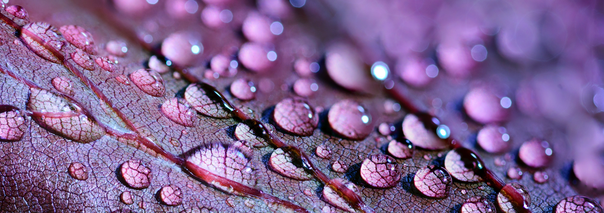
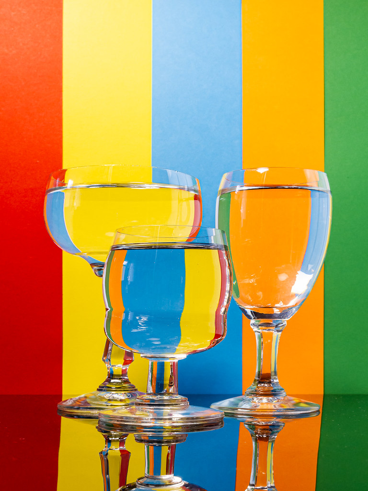

# PHYS 6CL 

 </img>

## Welcome to UCSB Physics 6CL

PHYS 6CL is the laboratory based component of the PHYS 6C course, and the first in of our introductory three-course sequence. This sequence of courses is designed to prepare students in the Life and Biological Sciences for success in their future STEM careers. The laboratory exercises aim to deliver the core experience with physics experimental techniques and concepts needed in the Life Sciences.

In this course we will cover topics that roughly reflect the material you learn in class: The Wave Nature of Light, Reflection and Refraction, Simple Lenses, Wave Optics, and a brief excursion into Nuclear Physics. In addition to verifying the concepts learned in the theory course against real experiments, you will also learn universal introductory experimental techniques used in *all* scientific fields. PHYS 6CL specifically focuses on intermediate error analysis, hypothesis testing and critical comparison to accepted values.   

######
### Contact Information

######

Your Teaching Assistant (TA) is your first point of contact for this course. 
      Please reach out to them if you have questions about labs, completing your assignments, grading, regrade requests, or attendance. 
:::ContactTA
:::

The course Faculty are here to help with more complex issues, working behind the scenes to ensure the labs run smoothly. Please contact a Faculty member if you have specific issues regarding DSP and other accommodations, errors in the lab manual, problems with equipment, or have witnessed/been a victim of any kind of harassment `

:::ContactFA
:::

## Schedule (Fall 2021)

The table below shows the weekly schedule

:::Table (schedule| PHYS 6CL Lab Schedule|10 C)
| Weeks              | Lab | Lab Title                                           |
|--------------------|-----|-----------------------------------------------------|
| 26-Sep thru 1-Oct  | 0   | A Light Refresher                                   |
| 3-Oct thru 15-Oct  | 1   | Reflection and Refraction                           |
| 17-Oct thru 29-Oct | 2   | Lenses, Ray Tracing,  and Simple Optical Devices |
| 31-Oct thru 12-Nov | 3   | Wave Optics                                         |
| 14-Nov thru 26-Nov | 4   | Nuclear Radiation                                   |
:::

---

## Laboratory Guidelines and Policies

### Physics Department Lab Report Policies
1. To receive a passing grade, all labs must be completed.
2. One day is reserved to allow an opportunity to make up missed labs. To be eligible to take a make-up lab, the student 
must provide a written verifiable medical, athletic, or religious excuse that may be used for only ONE experiment per 
quarter. This excuse must be presented by the student to their TA prior to make-up week.
3. Careful and neat documentation is an important part of carrying out and reporting lab work and it will affect the 
scores on lab reports.

### Physical Laboratory Guidelines
All students attending lower division Physics Laboratory courses are reminded to observe the following rules:
1. Smoking, Vaping and the use nicotine is strictly prohibited in the lab.[fn]This excludes medical and prescription nicotine in the form of patches[/fn]
2. Students must be entirely sober while on physics premises.
3. Food and drink are not allowed in the lab.
4. Shoes must be worn when working in the lab. Avoid wearing loose fitting clothing.
5. No animals allowed in lab, except for service animals.
6. When lasers are in use, avoid looking into the light beam. The high intensity may cause permanent damage to your 
eye. Be extremely careful not to reflect the beam into anyone else’s eyes. 
7. Radioactive isotopes should be handled carefully and by the casing only.
8. If equipment is broken or circuit elements burned out, report the fact to the instructor immediately so that the 
apparatus can be properly repaired.
9. Do not remove equipment or furniture from the lab.
10. Do not alter or remove lab equipment

 </img>

