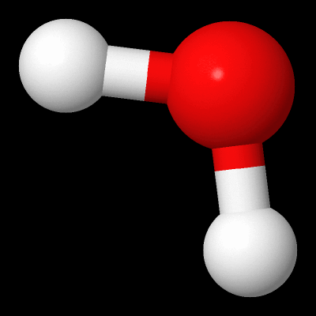
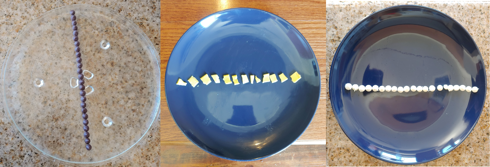
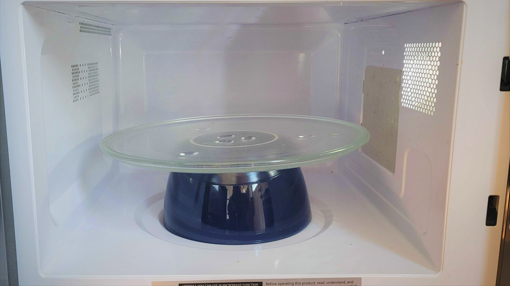
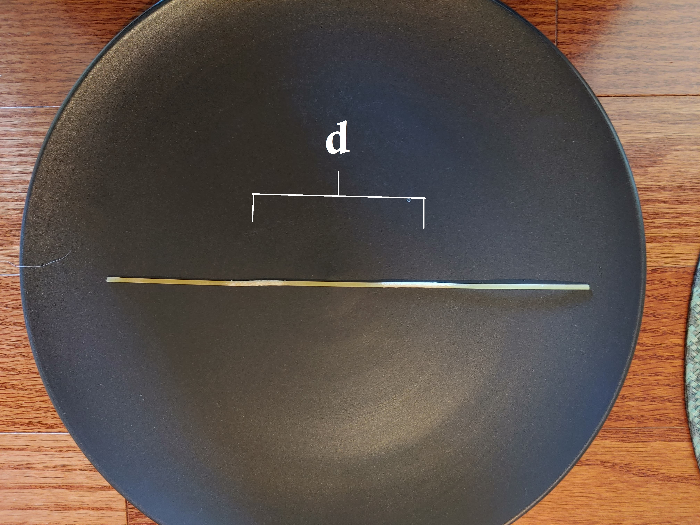
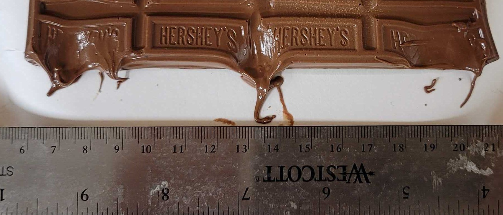
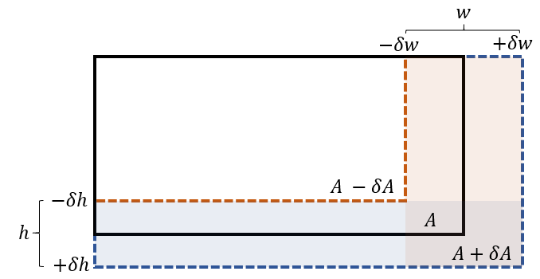

# A Light Refresher Lab 

:::Intro (Welcome to PHYS6CL!| Microwave | Meltable Foodstuffs --- Pasta, Chocolate, or Melting Cheese| Ruler|Microwave-Safe Plate --- Please make sure that your plate explicitly says this)
Welcome back to the 6-series laboratory course. For our refresher lab, we will evaluate a quick home experiment to measure a fundamental property of light — its speed through space — using chocolate. Yes, *chocolate* . If you have access to chocolate ;;;Or pasta or cheese;;; and a microwave, you are encouraged to try the experiment yourself.

While the measurement of the speed of light is interesting, and will hopefully give you a tangible sense of some of the topics discussed in the accompanying lecture course, we will also embark on some new experimental skill sets: intermediate error analysis and quantitative comparison of results. 
:::

# The Wave Nature of Light 
Electric and Magnetic fields permeate the entirety of the universe, accounting for most of our day-to-day experiences. As you are learning in lecture, a simultaneous excitation of both of these fields (in accordance with Maxwell's equations) produces what we call an **Electromagnetic Wave**. 

EM waves are most easily recognized as what we experience as visible light. All light is an electromagnetic wave in a certain frequency range. Not all EM waves are visible light, however. Not dissimilar from more familiar kinds of waves, like the ones in water or on a slinky, EM waves can be characterized by their amplitude and wavelength. Like mechanical waves, they have a set speed that they can travel. In the vacuum, we call this speed, $c$, the *speed of light*[fn]The speed of light is the fastest speed matter and information can travel at, as far as we know. Moving faster than the speed of light would imply the breaking of [causality](https://en.wikipedia.org/wiki/Causality)[/fn]. It has a very useful relationship to wavelength ($\lambda$) and frequency ($\nu$).

:::Equation (c)
$$
   c =  \nu \lambda 
$$
:::

In this lab, we are tasked with determining the speed of light using common objects.  is our first clue to how we might do this. The incredibly simple equation gives us something important: 

######

:::center (my-5)
*If we know $\nu$ and $\lambda$, we can directly calculate $c$.*
:::
######

Ultimately, we will use the wave nature of light to measure the speed of light indirectly. The problem we face now is finding a light source with known or *measurable* $\lambda$ and $\nu$. Most of the light we usually think of has a $\lambda$ in the visible spectrum, ranging from $400 \text{ nm}$ to $700 \text{ nm}$, which is probably a lot smaller than we can see (without the aid of some kind of  [electron microscope](https://en.wikipedia.org/wiki/Electron_microscope) [fn] Not suprisingly, you can't use visible light to investigate things on the scale of visible light![/fn]). Luckily for us, light exists at all sizes and scales, to the best of our knowledge, and some of the most useful forms of light have wavelengths on the orders of centimeters to kilometers.

## A Kitchen Light Source

:::Figure (water|s|R)

:::
Microwave ovens use microwaves, which — you guessed it — are simply ordinary light with a relatively large wavelength (compared to "visible" light, that is). Microwaves work by exciting the rotational modes of water inside of food. When the rotational modes of an $\text{H}_2\text{O}$ molecule are excited, the extra energy stored in the molecular rotation is quickly turned into thermal energy through collisions. This is important to our experiment for two reasons:

1. Because of how cooking happens, **most** microwaves operate in the $2.45 \text{  GHz}$ frequency band, as this band is the most efficient at exciting rotations of water molecules in food without burning the surface.
2. Since we can see when food is "cooked" (or heated), we will need to choose a medium that has enough moisture to see the effect of the microwaves, but not so much that the whole object heats too much. More on this later.

Since we know the frequency, $\nu = 2.45$ GHz, from point 1 above, we can reason that if we are able to determine the *wavelength*, $\lambda$, of the signal, we can find the speed of light by using . [fn] Take a look at Freedman Example 22-1 for a related exercise using FM radio waves[/fn]. But how would we determine the wavelength?

To determine this, we need to talk about how microwaves work in a little more detail. When a microwave is powered, it produces standing waves across the cooking chamber. This is in complete analogy with the standing waves you studied in 6B.  The amplitude of these standing waves determines the *rate at which energy is deposited into the water molecules* in your food. In other words, your food cooks significantly faster (slower) at the anti-nodes (nodes) of the standing wave. This is actually why microwaves have a rotating table: the moving table on the inside helps to average out the heating in the food.

:::::::::Figure (micro|m|Row)
::::::row
:::col
. The microwaves will reflect back and forth from the two sides of the metal oven.')
:::
:::col

:::
:::col

:::
::::::
######
**Because of the standing waves, modern microwave ovens contain turntables. Otherwise parts of your food would be overcooked and others would still be raw.**
:::::::::

######

The question we can now address is: 
:::center
*How can we infer the wavelength of the microwaves by using household objects?*
:::
Given this information, the answer is quite simple, actually! Since the microwaves deposit *energy* into water molecules, and that energy depends on the amplitude of the wave at that point, we can look for the first signs of "cooking" in the medium -- places where the wave amplitude is highest will heat faster than the surrounding region. Hence, the cooked regions represent the *antinodes* of the microwaves, and raw regions are near *nodes*. 

# Measuring the Speed of Light

As hinted at in the previous section, our experiment will be to use the microwave to (safely) cook a piece of food, which will allow us to visibly measure the *wavelength* of microwave light with a ruler.

## Before the Experiment
Before performing an experiment, it is always a good idea to work out your procedure and expectations. Below is a rough outline of how one might prepare for this home experiment. You can look through the procedure followed to generate the final result in 

### Readying our Calculations
Since we are finding distance between the locations of the antinodes, $d$, our measured distances will represent *half* of our wavelength, $\lambda$. We should find the correct equation to relate $c$ to $d$ after we make our measurement.

:::Exercise (lambdatod|2 Points)
 Write  to calculate $c$ in terms of $d$ rather than $\lambda$. You will need this later.
:::

### Readying our Intuition

We now have to figure out what we are *expecting* to see. Our primary goal in this experiment is to measure the speed of light, $c$, so we should first find a reliable value for this quantity.

:::Exercise (research|3 Points)
Using your favorite search engine, find a reference for the speed of light.
1. What is the speed of light?
2. Is the speed of light *measured* or *defined*?
3. How many significant figures does the speed of light have?
4. Provide a url to a reliable source of this information.
:::

From , you should now have a value for $c$ in hand. We now need to document some information about our *equipment*. 

:::Exercise (equipment|1 Point)
 Find the frequency microwaves typically run at online. Provide a link to your source.
:::

Finally, let's figure out what the wavelength of our microwave should be, and what we expect to measure

:::Exercise (wavelength|2 Points)
Using the accepted value of $c$ and the frequency $\nu$ of a standard microwave:
1. What wavelength, $\lambda$ do you expect a microwave to produce?
2. What $d$ do you expect to measure? 
:::

## Measuring the Speed of Light in a Microwave
::: Materials (Microwave | Meltable Foodstuffs --- Pasta, Chocolate, or Melting Cheese| Ruler|Microwave-Safe Plate --- Please make sure that your plate explicitly says this)
:::

If you want to do this optional activity, be sure that you have all the materials readily available for this experiment, and proceed to . It is highly recommended that you complete all previous exercises prior to this activity. 

If you do not want to do this activity, and would like to use my image, please continue.

::::::Activity (microwave|Measuring the Speed of Light in a Microwave)

:::Figure (tested|xl)
 
::: 
:::Figure (turninggear|m|R)
 
:::
1. Remove the rotating table and ring from your microwave. You may need to place a microwave-safe cup or bowl upside down over the turning gear as shown in .
  
2. Place your medium on the microwave-safe plate. If you are using dry pasta (recommended), please briefly hold it under running water and then wipe dry. Since the  microwave excites water molecules primarily, the dry pasta needs to be moistened to maximize cooking.
3. Set the plate in the microwave and turn it on for 10- to 30-second intervals, until you see at least two spots that are melting/cooked. 
######
:::Note (|12 C)
**DO NOT GO FOR LONGER THAN THIS INTERVAL AND DO NOT LEAVE MICROWAVE ON UNATTENDED**. 
Microwaving a mostly empty chamber for a long period of time can and will destroy the magnetron.
:::

4. Carefully remove the microwave plate and measure the distance between the centers of these two spots.

:::Figure (pasta|xl)

:::

::::::

If you did not do the experiment yourself, please use the image in  to make your measurement. It is advised that you make the best measurement you can between the 1st and 2nd spots, and then the 2nd and 3rd spots and then average them for your final measurement. Note that you can click on the image to make it larger.

:::Figure (choc|xl)

:::

:::Exercise (result|2 Points)
1. What is your measured $d$? ;;;Reminder: SigFigs matter;;;
2. Take a picture of your chocolate (or food) next to a ruler and post it here if you did the experiment yourself.
:::
# Analyzing Your Results

Now that we have a measurement, we can proceed with analyzing our results. You may need to return to [Math Lab in PHYS 6AL](../AL/index.html?linkfile=lab0) to recall some definitions, techniques or concepts in the following sections.

## Judging and Propagating Error

Recall [Math Lab in PHYS 6AL](../AL/index.html?linkfile=lab0), where we learned that that all measurements have an associated uncertainty. These uncertainties, or errors, can be random or systematic, due to equipment limitations or the physical nature of the experiment. We typically have a good idea about what our errors are at the level of an experiment, i.e. how precise our rulers are, or how well we can estimate the true value of a quantity. What is less clear is how that error will effect our final result —  how does our ruler only measuring to centimeters translate to our ability to precisely determine a value for $c$? This part of experimental physics is called **error propagation**

::::::Definition (Error Propagation)
**Error Propagation** is the mathematics of how measurement errors in a *direct measurement* of one or more  quantities become errors in an *indirect measurement* that is calculated from these quantities. 

---- 

For example, if you have an uncertainty in the length of the sides of a rectangle, error propagation would allow you to calculate the uncertainty in the area.
:::Figure (error|xl)

:::
::::::

:::Quiz (area|$96 \text{ m}^2$ ---  Not so fast — this amount of gravel would be risky. If either measurement were even slightly low compared to the actual value, Zak would not have enough gravel to cover his yard| $165 \text{ m}^2$ --- Correct! This area represents the maximum end of error in both linear measurements and will be plenty as long as he is not very unlucky)
Zak wants to replace the dry grass in his backyard with gravel. Using a GPS measurement tool he found on the app store, he measured the dimensions of his backyard to be $12 \text{ m}$ by $8 \text{ m}$. The app reports that the error for linear measurements is $\pm 3 \text{ m}$. If he wants to be fairly certain he has enough gravel, he should buy enough gravel to cover how much area?
:::

Error propagation is, at times, a complex task more suited for upper division courses. In this class, we will discuss error propagation abstractly and give you formulas for any necessary calculations, such as in . You are only required to understand that error propagation converts measurement error into uncertainty in your final result. For students interested in STEM who would like a gentle introduction into the fascinating topic of error propagation and analysis, an excellent, well written, and fun to read book is [An Introduction to Error Analysis (Taylor)](https://www.amazon.com/Introduction-Error-Analysis-Uncertainties-Measurements/dp/093570275X)

:::Exercise (error|3 Points)
1. What kind of error(s) could effect your measurement of $d$? Explain. ;;; By 'kind', we mean random or systematic ;;;
2. Estimate the uncertainty in your measurement of $d$; e.g. what are the largest and smallest values you'd expect to get if you were to measure this distance multiple times? Uncertainty here can be due to  the resolution of your ruler, the imperfect appearance of the cooked regions that make it hard to judge the center, etc. as examples. Provide your final result in the form $(d \pm \delta d) \text{ units}$
3. Calculate the measured speed of light to the correct number of sigfigs.
4. The uncertainty in the measured speed of light, $\delta c$ assuming that your microwave's operating frequency is exact, can be calculated using the following formula:
   $$
   \delta c = 2\nu \cdot \delta d
   $$
   Calculate this and report your final result for the measured speed of light in the form $(c \pm \delta c) \text{ units}$
:::

## Assessing Results

We now have a final result for our measurement of $c$. Unfortunately, this is a relatively useless number until we compare it to the accepted value. Depending on how our final value matches up with the accepted, we can say our value *agrees* or *disagrees* with the accepted value.

### Your measurement is more than a single value.

Having to consider if a result agrees or disagrees with an accepted value might sound strange at first: *Shouldn't it be obvious if my results agree with the accepted, since they will be close in value?* The problem is, what does the word 'close' mean? By close, most people colloquially are referring to the **discrepancy** between two values.

:::Definition
**Discrepancy** is the absolute, numerical difference between two values. These two values are usually the accepted value and the measured value
$$
\text{ discrepancy} = | x_{\text{ accepted}} - x_\text{ measured}| 
$$
:::

The problem with using the discrepancy as a measure of agreement is that it lacks context. Consider that $0.3125 \text{ in.}$ and $0.34375 \text{ in.}$ look pretty "close", but you are going to be very unhappy builder if you bring home a $5/16$" socket instead of an  $11/32$" one from the hardware store. In this case, relative to the precision of good hardware, the difference in these values is *huge*.
 

In an experimental setting, the only sensible way to define "close" is relative to the uncertainty itself. Your uncertainty in some measurement says that — considering the random error in your measurement that you cannot directly control — you are confident that your result is within some interval around your stated value. If the accepted value lies in that interval, then you can easily say that your result agrees! [fn] Not being within error doesn't necessarily mean that there is something **wrong** with your result or experiment. You  must repeat an experiment many times to confidently rule out agreement. Moreoever, failure to agree with an accepted value gives interesting clues about the inner workings of your experiment that you may not have previously considered. [/fn]

::::::Definition (Agreement)
:::center
In PHYS 6CL we define the following rule of thumb:
:::

We can definitely say that a result **agrees** with the accepted value if the discrepancy is *smaller* than the uncertainty in our measurement

---

We can say that a result **disagrees** with the accepted value if the discrepancy is twice as large as the uncertainty in our measurement

---

If our result is neither, we can argue in whatever direction we believe is correct based on the evidence we have collected.

::::::

:::Exercise (|3 Points)
1. What is the **discrepancy** between your result and the accepted value of $c$? This is the *difference* between your measured value and the accepted value
2. Is the **discrepancy** larger or smaller than the error you calculated, $\delta c$? By how much?
3. Based on your answer to the above, do you think your measurement agrees with the accepted value of $c$? Why or why not? 
5. Are there any sources of systematic error (e.g. irregularities in food moisture, dirty microwave walls, other things that may effect the standing waves) that may have affected your results? Give details about these possible sources and how they might affect your result.
:::

:::Exercise (|1 Point)
**Challenge Question**
#####
Why is the distance between the food medium and the magnetron not important to the determination of $c$ in this experiment?
:::

:::Exercise (|1 Point)
**Challenge Question**
If you did the experiment yourself, measure the length of the inside of your microwave. If not, the microwave I used measures to be $(36 \pm 2)\text{ cm}$
1. Is it close to a multiple of $d$? 
2. Give an argument as to why microwaves typically come in only a few standard sizes. 
3. What do you think the function of the mesh on the viewing screen of your microwave is?
:::
# Conclusion

:::Exercise (|2 Points)
Please write a short summary (1-2 paragraphs) of this lab that explains what you did, how you analyzed your data and what you concluded from your data. 

:::

:::Summary

Make sure to include all tables, plots, pictures, drawings, screenshots or anything else asked of you in the exercises in your report, as well as answers to all the questions.

:::
