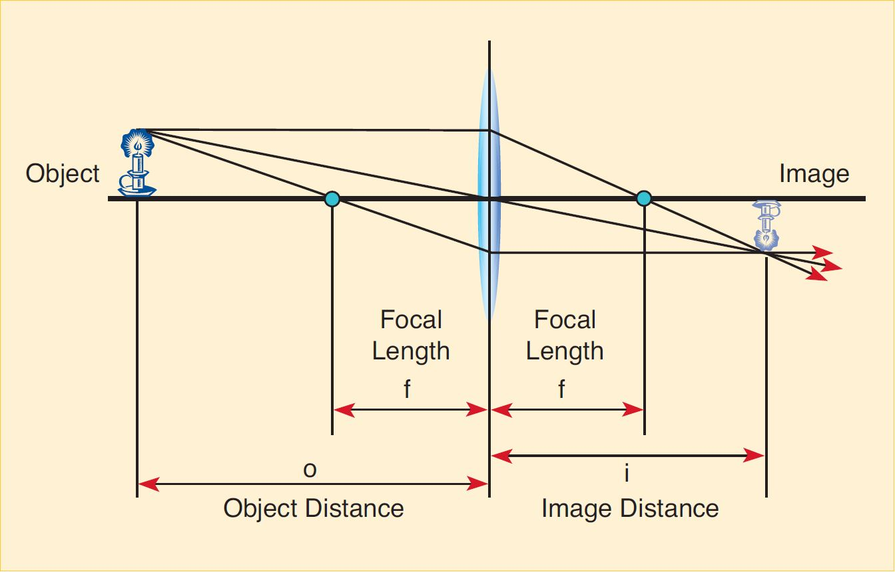

# Lenses, Ray Tracing, and Simple Optical Devices

::::::Intro (This week)
In this lab we will study the refraction of multiple rays of light emitted from a single point source as they reach the boundary at the front surface of a lens, then exit through the boundary at the rear surface. 
 We will also do this for sets of parallel rays entering the lens.

::: Video (intro| Introduction to Lenses)
<iframe  width='100%' height='100%'  src="https://www.youtube.com/embed/3nhaqN1jPvc" title="YouTube video player" frameborder="0" allow="accelerometer; autoplay; clipboard-write; encrypted-media; gyroscope; picture-in-picture" allowfullscreen></iframe>
:::
::::::

::::::Prelab
**Reminder:** Completing the Prelab before your Lab day is worth 2 Points.
 
Please complete the following Exercises:
:::center
, , , , , 
:::

So that you have an understanding of how rays behave in lenses on experiment day, be sure to do the following Activities:
:::center
 
:::
::::::

---

# Lenses and Their Properties

Last week we looked at how light behaves at the interfaces of different materials. We learned that the angle at which light leaves an interface depends on the incident angle and the indexes of refraction of the two materials. This relationship is succinctly captured by **Snell's Law**. In all of our experiments last week, we investigated refection at a *planar*, or straight, interface. This week, we will look at what happens when this interface has **curvature**, and hence the angle of incidence depends on where the light ray hits.

The most useful example of a curved interface is that of a lens. A lens is an object that consists of a material of index of refraction, $n$, different form the medium around it (recall that $n_{\text{ air}} \approx 1$) which has two opposite faces that form two spherical boundaries. The shapes of these boundaries are designed so that when multiple rays of light emitted by a single point source pass through the lens, they converge to a unique point, known as the *image point*. The lens thus creates an image of the point source. (The lens boundaries can also be designed so that the rays diverge, and the image point is in front of the lens. We will see how during this lab.)

We will consider two common types of lenses, **convex** and **concave** lenses. Convex lenses are those that bulge outward in the center, with the edge being the narrowest part. Because light passing through such lenses converges to a point on the other side as described above, these are known as *converging* lenses. 

:::Definition (Convex and Concave Lens)
A **convex lens** is a lens that possesses at least one surface that curves outward. Such a lens causes rays of light that travel through it parallel to its principal axis, to converge.

---
A **concave lens** is a lens that possesses at least one surface that curves inward. Such a lens causes rays of light that travel through it parallel to its principal axis, to diverge, or spread out.

:::

Concave lenses are those that are thicker on the outside and thinner toward the center. (Their faces curve inward.) Later in this lab, we will examine the behavior of concave lenses, which is different from that of convex lenses.

## Lens intuition from Plane Refraction

To understand how curved interfaces are different from plane interfaces, using only what we know about plane interfaces, we can use an approximation. Instead of working with a circular lens, for example, we can use a hexagonal one. A hexagonal lens would have three of its faces exposed to the incident light, with each face obeying the laws of refraction we already know. 

:::Figure (hex-side|xl)

:::
 shows how you might set this up using the same raybox apparatus as last week, using 3-ray mode that there is a ray for each face. When the ray of light hits the exterior of the hexagon, the angle the light is to the normal depend on *which face it hits.*

:::Figure (hex|xl)

:::

::::::Exercise (curve|1 Point)

 gives the ideal ray-diagram of a hexagonal lens. Parallel rays hit the left side of the lens and refract through it. Answer the following questions using what you know about plane refraction. You will likely need a protractor fot his exercise — if you don't have one, you can print or trace out an [image of one](https://www.google.com/search?q=protractor+image&tbm=isch&chips=q:protractor+image,g_1:printable:Go2CJwAhfTI%3D&hl=en&sa=X&ved=2ahUKEwiT_eyl0MfzAhV8wJcIHcukB0sQ4lYoAHoECAEQEQ&biw=1905&bih=931).

1. What is the incident angle, $\theta_1$, of the rays hitting the angled faces? ;;;You will need to use geometry to find this. Recall that the interior angles of a hexagon are 120°;;; ;;;If you are struggling, try measuring the angle using a protractor (it should be a *nice* angle) and working backwards;;;
2. Using what you solved for $\theta_1$, the index of refraction of air, $n_{\text{ air}}=1.0$, and the index of refraction of this glass,  $n_{\text{ glass}}=1.4$, solve for the refracted angle $\theta_2$.
3. Sketch the behavior of the three light rays shown in  after they enter the glass. You can do this on a digital drawing program (e.g. Paint or OneNote), or you can do it on paper and take a picture to attach to your report. ;;;If completing by paper and pencil, you might want to gently trace this diagram by holding the sheet of paper over a screen;;;
4. Do the rays converge (get closer) or diverge (spread out) inside the hexagon?
::::::

::::::Exercise (curve-2|1 Point)
:::Figure (cyl|s|R)

:::
Instead of a hexagon, imagine a cylindrical lens as in the side view given in . Reminder: you can click on any image in the manual to make it larger.
1. Do you think the rays would converge or diverge inside the lens?
2. Is there any situation that a convex lens, like the one in , would result in rays that **do not** converge on the interior?
3. What can you conclude about convex lenses? ;;;Hint: How do they affect incident light rays? You can assume lenses are made from glass and have a boundary with air;;; 

::::::

## Focal Points
:::Figure (focal|m|R)

:::

In the previous section, we introduced the concept of a lens. We learned that lenses are objects that cause light to converge or diverge through simple refraction. What we haven't discussed yet are the consequences of convergence and divergence. Let's take a look at a thin hexagonal lens, similar to , and see what happens to the light rays after entering and exiting the lens.

Imagine we send a ray of light through each of the faces, as illustrated in . Using Snell's law, we find that the angle of refraction causes the rays to converge inside the lens. Eventually, the rays will reach the other side of the lens and refract again through the glass-air boundary. Since the index of refraction of the glass is higher than that of the air, we will find that the resulting rays will experience further convergence upon exiting. The result of converged rays is that they will meet at some point in space. We call where they meet the **focal point.**

:::Definition (Focal Point|6 C)
The **focal point** of an ideal lens is the point at which rays travelling *parallel to the optical axis* meet after reflection or refraction, or the point from which diverging rays or waves appear to proceed.
:::

Ideal convex lenses, which are smoothly curved, are constructed to have a special property: any light parallel to the optical axis that enters the lens eventually goes though the lenses focal point. This is illustrated in . This property is exceptionally useful for working out how lenses divert light rays, since it gives us two important pieces of information:

1. All light that enters parallel to the optical axis must pass through the focal point
2. All light that passes through the focal point  and enters the lens, must emerge parallel to the optical axis: lenses are a two-way street. 

Focal points are so important to the function of lenses, that we even characterize lenses using them. All lenses are identified by their **focal length**, or the distance from the lens's center to their focal point. Focal lengths can be positive for converging lenses and negative for diverging lenses.

::::::Exercise (focal|1 Point)
1. Would you expect a convex lens with a higher **curvature** (more round vs flat) to have a longer or shorter focal length? Explain your reasoning, citing  or a sketch if needed.
2. Would you expect a convex lens with a higher **index of refraction** to have a longer or shorter focal length? Explain your reasoning, citing  or a sketch if needed. 

::::::

# Ray Tracing with a Lens of Known Focal Length

:::Video (rt-known|Basic Ray Tracing)
<iframe width='100%' height='100%' src="https://www.youtube.com/embed/PMUqmcHdlUU" title="YouTube video player" frameborder="0" allow="accelerometer; autoplay; clipboard-write; encrypted-media; gyroscope; picture-in-picture" allowfullscreen></iframe>
:::
 
An object is some physical entity that either produces light rays of its own (like a light bulb) or reflects them from some other light source (like a page of text, or your pencil). The image is a version of the object as it appears after light coming from it has gone through some optical device, in this case a lens. In the remainder of this lab we will explore how lenses form images, and how the placement of a lens relative to an object determines the location and relative size of the image, and whether it is upright (erect) or inverted.

:::Definition (Real and Virtual Images)
For a **Real Image:**
- Light rays actually pass through the image point.
- The image is on the opposite side from the incident light.
- The image can be projected onto a screen.
- The image is inverted with respect to the object.

---

For a **Virtual Image:**
- Light only appears to pass through the image point.
- The image is on the same side as the incident light.
- The image cannot be projected onto a screen.
- The image is in the same orientation as the object; we say that it is erect.
:::

## Three Principles of Ray Diagrams

We use ray tracing methods to predict the behavior of a lens. We begin with convex lenses, though the same methods apply equally well to concave lenses. There are only three essential premises needed to analyze lenses:

1. A light ray entering a lens parallel to the optical axis passes through the focal point on the other side.

:::Figure (ray1|xl)

:::

2. A light ray passing through the center of a lens passes through unchanged. *Note that this is true only for thin lenses.*

:::Figure (ray2|xl)

:::

3. A light ray passing through the focal point and then through the lens emerges parallel to the optical axis.

:::Figure (ray3|xl)

:::

## Ray Tracing Method

Now that we have some basic information about the principles used to build Ray Tracing diagram, we can explain the step-by-step procedure for creating a diagram for a lens of known focal length:

1. Pick a point as the object.

2. Draw one line from the point, parallel to the optical axis. From where it hits the lens, draw a line down through the focal point. Be sure to extend it beyond the focal point.

3. Draw one line from the point to the center of the lens, and extend it until it intersects the first line

4. Draw one last line from the point through the near-side focal point and then to the lens. From there, draw a line parallel to the optical axis. This line will intersect the other two at the point where they intersect each other.

:::Figure (raytrace1|xl)

:::

There are two other important cases to consider. When an object is placed within the focal length of a convex lens, the image point becomes negative. A virtual image is formed at the point that the image *appears* to come from. The ray tracing method is consistent, but note that you draw the line in reverse:

:::Figure (raytrace2|xl)

:::

:::Note (|11 C)
As a convention, we always draw from the top-most point on the object. Any other point would work equally well. The top is generally most useful.
:::

 
Image formation through a convex lens is exemplified in the dynamic . You can change the location of the object as well as the focal length of the lens. You can do the latter by dragging the point labeled "Focus." 

::::::Simulation (Lenses| Thin Lens Simulation)
:::center
<a href="https://www.geogebra.org/material/iframe/id/vd77gpfr" target="_blank" rel="noopener noreferrer"> Open in New Tab</a> 
:::
<iframe scrolling="no" title="Copy of Concave and Convex Lenses" src="https://www.geogebra.org/material/iframe/id/vd77gpfr" width="1033px" height="482px" style="border:0px;width:100%; height:500px;"> </iframe>
::::::

:::Figure (raytrace4|xl)

:::

### Concave Lenses
A concave lens has a negative focal length, and the line from the object to the focal length actually crosses the lens:

:::Figure (raytrace3|xl)

:::

Concave lenses do not cause light to converge upon a single point, but instead cause it to spread out. Because of this they are referred to as *diverging* lenses. The focal length of a concave lens is negative. Hence they are also sometimes called *negative* lenses. If we incorporate this detail into our ray tracing, we can analyze them by using the same method that we use for convex lenses. Feel free to explore concave lenses in : You can switch from convex to concave by dragging the "Focus" point to the right of the lens. 

## Ray Tracing Practice

In  you will practice ray tracing on a piece of paper. You are expected to photograph and attach your work or use a digital drawing program.

::::::Activity (rayt|Ray Tracing Practice)
In this activity you will practice the ray tracing method described in [Part II](#PartII). We will work with a hypothetical ideal thin lens, and assume the focal length to be $2 \text{cm}$

**Instructions:**
1. Get a sheet of paper and draw the optical axis, measure out and draw the focal point and trace the outline of the convex lens. Pick an object point outside of the focal length on the top left-hand side of the paper. 
2. Draw the three simple case rays – parallel, through the lens center and through the focal point – and locate the image formed on the other side of the lens. Label this Sketch as **"Convex Ray Trace 1"**
:::Note (|9 C) 
Notice that it is a) inverted, b) at a different distance than the object, and c) it is a different size than the object. Also note that the light rays converge at a given point, convex lenses are frequently referred to as converging lenses. 
:::
3. Get another sheet of paper and repeat steps **1** & **2**, however, instead draw the object point inside the focal length. Again draw the three simple case rays. Note that this is one of the special cases mentioned above, see . Label this Sketch as **"Convex Ray Trace 2"**

4. On a third sheet of paper, make a copy (redraw it by hand if using paper and pencil) of **"Convex Ray Trace 2"** and call it **"Convex Ray Trace 2"**. and trace the rays backwards as show in .
:::Exercise (convex|2 Points)
1. Include an image (or images) with your three Convex Ray Trace drawings here.
2. Inspect **"Convex Ray Trace 2"**. Do the rays ever meet on the other side of the lens? Describe what happens to the rays
3. Inspect **"Convex Ray Trace 3"**. What do you think is the significance of where the rays meet? ;;;Hint: If you were looking into the lens, what would you see?;;;
:::

:::Note (|9 C) 
When an object is inside of the focal length of a convex lens, the light rays from it no longer converge to a single point. The image 
is bigger, such a set up is called a magnifier. Since light does not actually pass through the point where the image is formed 
we call it a virtual image. 
:::

5. Get a fourth sheet of paper and repeat the ray tracing procedure for a concave lens with a focal length of $-2\text{ cm}$. Place the object outside of the 
focal length. Note that this discussed above, see . Label this Sketch as **"Concave Ray Trace"**
6. On this same sketch, trace the rays backwards, similar to what we did in step 4 and what is show in .
:::Exercise (concave|1 Point)
1. Include an image with your Concave  Ray Trace drawing here.
2. Do the rays converge at a given point?
3. What is the significance of that point?

:::

::::::

:::Exercise (convexcave|2 Points)

1. Do convex lenses make objects outside of the focal length appear larger or smaller?
2. Do convex lenses make objects inside of the focal length appear larger or smaller?
3. Do concave lenses make objects outside of the focal length appear larger or smaller?
:::
<!-- End of Exercise: Ray Tracing -->

# Experiments
 
The activities in today's lab will be short and mostly qualitative by design. The material covered in the Prelab this week can be challenging, so you are encouraged to use your extra time to play with lenses and verify the answers to your prelab with your partner before submitting your final assignment. 

## Curvature and Focal Length
In  you will explore the relationship between the curvature of a lens and its focal length. 

::::::Activity (playwith| Curvature and Focal Length)
Convex lenses are those which bulge outward in the center with the edge being the most narrow part. 
1. Select one of the unlabeled thin lenses. Move it up and down beneath the laboratory’s fluorescent lights. View image 
of ceiling lights using a piece of paper as a screen. 
:::Exercise (|1 Point)
What do you observe about the light passing through the lens?
:::
2. At one height you should see that the lens will focus the light from the fluorescent lights. The lights are long, parallel tubes 
and as a result you see two sharply focused lines. 

:::Note
Different lenses focus the light at different heights above the table. This is due to the fact that the lenses have different focal lengths, a property dependent upon the index of refraction and 
geometry of the lens. 
:::

3. Select a lens and measure the height at which this occurs, then do the same for two other unlabeled 
convex lenses. 
:::Exercise (|1 Point)
Is there a relationship between the curvature of the lens and the height at which it focuses? 
:::

4. Now take the concave lens – this one is thickest on the outside and thinnest in the middle. Using the same method find the 
focus height of this lens. 
:::Exercise (|1 Point)
Does the concave lens sharply focus the light?
:::
:::::: 

## Measuring Focal Lengths
:::Materials (Ray Box|Ray Tracing Table|Thin Lens|Thick Lens)
:::

In this procedure you will use the optical bench. It has a multi-purpose light source and a small circular ray traced platform where you set the lens. You are provided with one thin convex block lens and one thick block half lens. You will use both to demonstrate focal lengths. 

::::::Activity (Focal| Measuring Focal Lengths)
**Instructions:**

1. Adjust the grating on the ray box to provide 5 parallel rays.
2. Place the thin convex lens perpendicular to the rays, so that the rays are running parallel to the optical axis. Note that it is necessary to place the lens on the front half of the table to observe the intended phenomenon.
3. Let your TA know that you are ready for them to dim the class lights and observe the refracted rays.

:::Exercise (|1 Point)
What is the focal length of the lens?
:::
4. Use the thick block half lens. Place the curved surface towards the parallel light source. Observe the refracted beams.

:::Exercise (|1 Point)
Measured from the flat surface, at what distance do the beams converge? 
:::

5. Reverse the orientation of the block such that the flat surface is towards the light source

:::Exercise (|1 Point)
Does the block lens have symmetrical behavior? That is, do the beams converge at the same
distance from the flat surface? Why might this be the case? ;;;Hint: look at the flat boundary, comment on the refraction which occurs there.;;;
:::

6. Place the concave lens on the platform. Again observe the refracted beams.
:::Exercise (|1 Point)
Can you measure the focal length of the lens? If you were to trace the refracted rays backwards
(on the same side as the incident beams) would they converge? 
:::
::::::
<!-- End of Exercise 2 -->

<!-- ## Telescopes and Microscopes
:::Materials (100 mm lens|200 mm lens|Optical Bench|Ray Table Base)
:::
We will now use everything we've learned about lenses to make some functional equipment. 

::::::::::::Activity (telescope|Telescopes)

:::::::::Figure (basictele|m|Row)
::::::row
:::col
 Hold the $ 200 \text{ mm}$ lens in your left hand. Lock your elbow to give a full extension")
:::
:::col
 With the $ 100 \text{ mm}$ lens in your right hand, place it right at the back of the $ 200 \text{ mm}$ lens")
:::
:::col
 Using your right eye, bring the eyepiece ($ 100 \text{ mm}$) in your right hand, toward your eye")
:::
::::::
:::::::::
Note: In the following procedure, you may have to adjust the starting positions to get good results. You may also wish to walk outside and look at the Library.
1. Hold the $ 200 \text{ mm}$ lens in your left hand. 
2. Lock your elbow to give a full extension a. 
3. Aim your arm with the $ 200 \text{ mm}$ lens at something across the room. 
4. Take the $ 100 \text{ mm}$ lens and hold it with your right hand. 
5. Place the $ 100 \text{ mm}$ lens, the eyepiece, right at the back of the $ 200 \text{ mm}$ lens, the objective lens b. 
6. Using your right eye, slowly bring the eyepiece, in your right hand, toward your eye c. 
7. Keep your eye, the eyepiece and the objective lens along the same axis pointed at your target. You should be able to capture a clear image of your target. You may find this easier if you shut your left eye.

:::Exercise (|1 Point)
1. Does the object appear to be closer or farther from you? 
2. How much closer do you appear to be?
3. How much larger does the image appear to be? Explain in terms of the focal lengths of the 
objective and eyepiece. 
:::

::::::::::::

::::::Activity (microscope|Microscopes)

**Instructions:**

1. Remove all the lenses except for the $200 \text{ mm}$ and $ 100 \text{ mm}$ lenses.
2. Remove the Ray Table (round disc) from the Ray Table Base and place the Ray Table onto the lab table. 
3. Slide the Ray Table Base toward the $20 \text{ cm}$ mark. Do not remove the Ray Table Base from the Optics Bench. 
4. Place the light box on the end of the optical bench, with a position of $100 \text{ cm}$. Orient it such that the target (crossed-arrows) is facing the rest of the bench toward the $ 0 \text{ cm}$ end. 
5. Place the $ 200 \text{ mm}$ lens at $ 60 \text{ cm}$ and the $ 100 \text{ cm}$ lens at $ 10 \text{ cm}$. 
6. Plug in the light box and view from approximately the $ 0 \text{ cm}$ mark. 

:::Figure (micro|xl)

:::

:::Exercise (|1 Point)
What do you observe
:::
:::::: -->

# Conclusion

::::::Exercise (|3 Point)
Write a brief (2-3 paragraph) conclusion summarizing the important points of this lab. Correctly use the following vocabulary in your summary:
:::center
Convex, Concave, Principal Axis, Focal Point, Ray Tracing, Real Image, Virtual Image.
:::
::::::  

:::Summary
Make sure to include all tables, plots, pictures, drawings, screenshots or anything else asked of you in the exercises in your report, as well as answers to all the questions.

All responses and answers should contain the correct number of sig figs and should include units when needed.
:::

