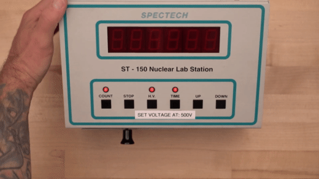
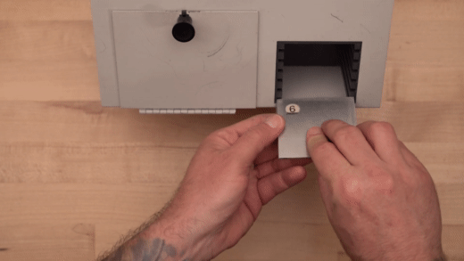

# Lab 4: Nuclear Physics

::::::Intro You've made it to the final lab!
You've learned a lot about optics this quarter, and we are finally ready to move on! In this lab we will be focusing on the final subject of this course: **Nuclear Physics** and the characteristics of its radiation.

:::Video (intro| What is Radiation?)
<iframe width='100%' height='100%' src="https://www.youtube.com/embed/VeXpMijpazE" title="YouTube video player" frameborder="0" allow="accelerometer; autoplay; clipboard-write; encrypted-media; gyroscope; picture-in-picture" allowfullscreen></iframe>
:::
::::::

::::::Prelab
Please complete the following Exercises prior to lab:
:::center
, 
:::
To ensure you are prepared to record and process experiment data, please do the following activity before lab:
:::center

:::

::::::

---

# Radiation: Origins, Measurement, and Equations

The nuclei of some atoms are unstable. In the process of becoming stable, they emit various particles. This phenomenon is known as radioactive decay. The most common types of emission are alpha and beta particles, and gamma rays. 

Alpha particles are fast moving helium nuclei. They contain two protons and two neutrons, and do not have the surrounding valence electrons. They have high energy, typically in the MeV range (mega electron-volts), but because of their large mass (and their double positive charge), they are stopped by just a few inches of air, or a piece of paper.

The beta particle is identical to the electron, except for its origin; beta particles are emitted from the breakdown of nuclei. Beta particles are emitted with a wide range of energies from near zero to on the order of an MeV. Since electrons are much lighter than helium atoms (and only singly charged), they are able to penetrate farther, through several feet of air, or several millimeters of plastic or light metals. 

Gamma radiation, unlike alpha or beta radiation, is an electromagnetic wave. Most electromagnetic waves, such as x-rays, light waves, and radio waves, are generated outside the nucleus by electron transitions (between energy levels in an atom or molecule), oscillation of electrons under the influence of an oscillating voltage (as in the antenna of a radio transmitter), or electron decelerations in the case of x-rays. Gamma rays, on the other hand, are produced by energy transitions within the nucleus. Depending on their energy, they can be stopped by a thin piece of aluminum foil, or they can penetrate several inches of lead.

The energies of all three of these types of radiation greatly exceed the ionization potential of atoms and molecules &ndash; that is, the energy necessary to remove an electron from an atom or molecule. Hence, they ionize atoms and molecules of the matter with which they interact. For this reason they are known as *ionizing radiation*.

:::Note (|10 C)
We have determined the plateau voltage for you in this lab! Do not use any voltage besides what is labeled on your Nuclear Lab Station.

:::

## Measuring Radiation with a Geiger-Müller Tube

:::Video (gmt|Geiger-Müller Tubes)
<iframe width='100%' height='100%' src="https://www.youtube.com/embed/qtvz8lH5zhk" title="YouTube video player" frameborder="0" allow="accelerometer; autoplay; clipboard-write; encrypted-media; gyroscope; picture-in-picture" allowfullscreen></iframe>
:::

A device called a Geiger counter can be used to detect alpha, beta and gamma radiation. The Geiger-Müller tube (or GM tube) is the sensing element of a Geiger counter. It can detect a single particle of ionizing radiation, and is typically connected to electronic circuitry that produces an audible click for each event. It was named for Hans Geiger, who invented the device in 1908, and Walther Müller, who collaborated with Geiger in developing it further in 1928.

The Geiger-Müller tube consists of a tube filled with an inert gas such as helium, neon or argon, and an organic vapor or a halogen. The tube contains electrodes, between which there is a voltage of several hundred volts, but no current flowing. The walls of the tube are metal (or have the inside coated with metal) to form the cathode. The anode is a wire that passes through the center of the tube and is insulated from the cathode. An opening in the tube wall, covered with a thin sheet of mica, provides a window through which alpha and beta particles can enter the tube. (Entry of gamma rays into the tube would not be hindered by the tube wall.) Because alpha particles interact so strongly with matter, this mica window must be very thin in order for them to be able to enter the tube. The minimum energy that an alpha particle must have in order to enter the Geiger-Müller tube depends on the thickness of this window.  (The thicker the window, the greater the minimum energy necessary for an alpha particle to enter.) In some Geiger-Müller tubes, this window is not thin enough to allow alpha particles to pass through it. Such tubes can detect only beta particles and gamma rays.

:::Figure (gmtube|xl|L)

:::
When ionizing radiation passes through the tube, it ionizes some of the gas molecules inside it. This creates positively charged ions and free electrons. The electric field between the tube’s electrodes accelerates these charged particles. The ions are pulled to the cathode, and the electrons are drawn to the anode. On their way to the electrodes, they gain sufficient energy to ionize other molecules. This creates an avalanche of charged particles and results in a short, intense pulse of current from the negative electrode to the positive electrode.

The Geiger-Müller counter has applications in the fields of nuclear physics, geophysics (mining) and medical therapy that involves radioisotopes and x-rays.

The sensitivity of a GM tube depends on how much voltage is placed between the anode and cathode. If the voltage is too small, ionizing events will not cause a discharge, and radioactive events will not be counted. If the voltage is too great, the tube will break down, resulting in discharges when no radioactive events have occurred. This results in an artificially high count. A properly functioning GM tube exhibits a “plateau” effect, where for a given level of radiation, the count rate remains nearly constant over a range of applied voltage. One can determine the correct operating voltage for the Geiger-Müller tube experimentally, by using a small radioactive source and observing the count rate while varying the voltage.  displays a typical plateau curve.

## Absorption of Gamma Rays

In this lab we will measure the mass attenuation coefficient of Cobalt-60 in lead. The mass attenuation coefficient is a measure of how much radiation a given material will absorb or scatter.

There are two types of absorbers in this lab:  aluminum and lead. They come in various thicknesses, and each material has a characteristic density. The likelihood that a radioactive particle is absorbed depends primarily upon the amount of mass it encounters. 

Regardless of the materials’ different densities, we employ a method that allows us to treat them all similarly. If we measure the amount of material traversed in $\rm mg/cm^2$ rather than the linear thickness traveled by the particle, we get a more useful quantity, which we call "density thickness." It is a measure of the amount of material behind each corresponding amount of area, or the amount of mass a particle must travel through before exiting the absorber.

Mathematically we see that:

:::Equation
$$
\text{density thickness} = \rho x = \text{density} \times \text{linear thickness}
$$
:::

Alternatively:

:::Equation
$$ 
\rho x = \frac {\text{mass of the absorber}}{\text{surface area}} 
$$
:::
Density thickness has dimensions of mass/area; we will use $\rm mg/cm^2$.

:::Note (|10 C)
The nice thing about density thickness is that it combines linearly. That means if you had a material with density thickness $300 \rm mg/cm^2$, and another with $100 \rm mg/cm^2$, and you stacked them on top of each other, the total density thickness would be $400 \rm mg/cm^2$. 
:::

Gamma radiation is part of the electromagnetic spectrum, and of all known forms of energy in the universe, it is of the highest energy. Because of this high energy, gamma ray absorption by matter is significantly lower than for beta or alpha particles. **In this lab you will subtract the background count from each run.** This is because there is not enough lead to stop all of the gamma rays from the Co-60 source and thereby reduce the count rate to the background level.

## The Mass Attenuation Coefficient $\mu/\rho$

The mass attenuation coefficient for a specific material, defined as $\mu/\rho$, tells us how well a material absorbs or scatters radiation. The behavior of radiation as it passes through matter is given by the formula:

:::Equation n
$$
N = N\rm_0 \it{e}^{-(\frac{\mu}{\rho})(\rho x)}
$$
:::

where N is the number of counts per unit time (activity) after the radiation has passed through an absorber of thickness $x$, $N\rm_0$ is the number of counts incident on the absorber per unit time, the quantity $(\mu/\rho)$ is the mass attenuation coefficient, $\rho x$ is the linear density in $mg/cm^2$ and $\rho$ is the density of the absorber material in $\text{mg}/\text{cm}^3$. 

:::Exercise (sketch)
Imagine we are looking at the attenuation of a certain kind of radiation through a material with $\mu/\rho = 0.15 \text{cm}^2/\text{g}$. We've determined that the number of radiation counts prior to entering our sample is $N_0 = 100$ for a one-minute interval.
1. We have a thin foil sample of known $\rho x = 1.1 \text{g}/{cm}^2 $. How many counts should we expect to make it through the sample during a one minute interval? Use 
2. We make an independent measurement of our sample material and determine that the mass density of our material is $\rho = 10.5 \text{g}/\text{cm}^3$. Again using , create a sketch from $x= 0 \text{cm}$ to $x = 5 \text{cm} $ that illustrates how many counts you'd expect to record in a minute as a function of sample thickness, $x$ ;;;You can do this by hand and attach a picture, or do so on a digital drawing program ;;;
3. Estimate the thickeness needed to block 50% of counts. Repeat for 75% of counts.
:::

A typical way to deal with exponential equations is *linearizing* them. If we take the natural logarithm of both sides we obtain:

:::Equation log
$$
\ln(N) = \ln(N\rm_0) - (\mu/\rho)(\rho \it{x})
$$
:::
 
 follows the form $y = mx + b$, with $m = -(\mu/\rho)$ and $b = \ln(N_0)$. We see that if we plot the logarithmic of count data, that the *slope* will give us important information about the physics.

:::Exercise (linear)
1. Using the values of parameters ($N_0$, $\mu/\rho$ and $\rho$) provided in , write down the correct equation for $\ln(N)$ in terms of $x$. Your equation should only have $\ln(N)$ and $x$, and everything else with values substituted.
2. Verify that your thicknesses in c are also correct in this linearized form of the equation.
:::

# Preparing for the Experiment
:::Figure (labstation|m|R)

:::

In this lab we will use the ST-150 Nuclear Lab Station to make radiation measurements with a Co-60 gamma source. We will place it in the device at a set distance from the detector, and then we will insert various absorbers between it and the detector.
:::center
**The quantities of radiation in this lab are safe and will not hurt you.**
:::

The basic operation of the ST-150 is straightforward; it does the counting for you over the time interval that you specify. The sample holder provides six positions with 1 cm separation between them. Each position can hold either a radioactive source or an absorber.

:::Note (|10 C)
To improve sensitivity to alpha and beta particle radiation, many GM tubes have an extremely thin entrance window. If broken, it cannot be repaired. ***Never*** allow objects to touch the window.
:::

## Information on Cobalt-60
Cobalt-60 is a radioactive isotope of Cobalt. It has a half-life of 5.27 years. It eventually decays into the stable element Nickel-60. The decay scheme for Co-60 is shown in . You can see in  that Co-60 emits two different-energy beta particles. This transmutes the nucleus into that of Ni-60, but the Ni-60 is in an excited state. To get to the most stable (ground) state, the excited nucleus emits gamma rays, each time lowering its energy, finally becoming stable Ni-60.

:::Figure (co60|xl)

From [HyperPhysics.com](http://hyperphysics.phy-astr.gsu.edu/hbase/Nuclear/betaex.html)
:::

## Preparing our Tables

As always, it is recommended that you skip ahead to the Experiments and read through them at this point so you have a good idea what the purpose of each table and calculation is for. 
::::::Activity (tables|Preparing our tables)

** The following steps should be done on a single spreadsheet so you can cross-link data between tables!!!**

1. First, create a table for the Background Counts Activity, similar to . Be sure the appropriate units are filled in. Also make a cell that calculates the **Average Counts Per Minute**. 
:::Table (bg-table| Background Counts)

| Counts (unit) | Time Interval (unit) | Counts Per Minute | Uncertainty (counts/minute)|
|---------------|---------------------:|-------------------|-------------|
| ...           |                      |                   |             |
| ...           |                      |                   |             |
| ...           |                      |                   |             |

 **Average CPM:** ___________ 

:::
2. Using spreadsheet functions, have the **Counts** and **Time Interval** automatically converted to **Counts Per Minute**. Also add a spread sheet function to automatically calculate **Average CPM** from the **Counts Per Minute** column. ;;;Many students find it useful to insert fake data to see that everything is working ;;;
3. The Uncertainty column for this kind of data is very special [fn]Radiation is what is known as a [Poisson process](https://en.wikipedia.org/wiki/Poisson_point_process), which is a kind of random process that has a constant average rate that something happens. Given a sample of some counts over a certain interval, we have a very specific way of quantifying the uncertainty in the true rate. [/fn]. The uncertainty in **Counts Per Minute** is going to be the squareroot of the value. Include a spreadsheet function to calculate this.

---

4. Next, create a table, like  to record the raw Mass Attenuation Experiment Data. Include the correct units and a spreadsheet function to convert **Counts** and **Time Interval** data into **Counts Per Minute**

:::Table (co60-table| Co-60 Gamma Attenuation Data)

| Total $\rho x$ (unit) | Counts (unit) | Time Interval (unit) | Counts Per Minute |
|-----------------------|---------------|----------------------|-------------------|
|                       | ...           |                      |                   |
|                       | ...           |                      |                   |
|                       | ...           |                      |                   |
|                       | ...           |                      |                   |

:::

5. Finally, create a table to *process* the raw data, like . Here you will include a cell that has the average background radiation CPM you first measured. You will copy your $\rho x$ values into this table also.
:::Table (co60-table2| Linearized Co-60 Gamma Radiation Data)

Average Background CPM: ____________

| Total $\rho x$ (unit) | Background Corrected CPM |  LN(CPM) |
|-----------------------|--------------------------|----------|
| ...                   |                          |          |
|     ...               |                          |          |
|        ...            |                          |          |
|           ...         |                          |          |

:::
6. Create a spreadsheet function that uses the **Average Background CPM** and the **CPM** of the Raw Data table to calculate the **Background Corrected CPM**
7. In the final column, use a spreadsheet function to calculate **LN(CPM)** ;;;Be careful! Do not use LOG, which is base 10!;;;
8. Include a link to all three tables in , ,  respectively

::::::

# Experiments

## Background Counts

::::::Activity (bg-counts|Determining Counts from Background Radiation)

1. Turn the instrument on and set the voltage to $500 \text{ V}$ by pressing the H.V. button and adjusting the voltage using the 
UP/DOWN buttons. Adjustments to the voltage will be made in $20 \text{ V}$  increments. Press the H.V. button again to 
return to the COUNT display.
:::Figure (set|xl)

:::
2. Set the acquisition time to $100 \text{ sec}$ by pressing the TIME button. Adjust the time interval using the UP/DOWN 
buttons. Press TIME again to return to the COUNT display.
3. Start the count by pressing the COUNT button. Once the preset time is reached the counter will stop accumulating 
data and the count indicator light will turn off. At this point it is only necessary to press COUNT again to zero the 
readout and restart a new $100 \text{ sec}$ interval.
4. Take three $100 \text{ sec}$ trials of the background. Record the count for each trial in your background radiation table. 

5. Place a medium thickness absorber in the slot 2 spaces from the GM window. Take a single $100 \text{ sec}$ trial of the 
background radiation and record the value.

::::::

:::Exercise (table1)
1. Provide your complete [Good Table](?linkfile=FAQ#QHowdoIreceivefullcreditonatableinmylabreport) here.
2. What is the average background radiation in the physics lab? Use your first three measurements for this.

:::

:::Exercise

1. What was your measured counts per minute with the absorber in place?
2. How does this result compare to your results with no absorber? Make the comparison keeping in mind the *uncertainty* column. 
3. What does this tell you about the energy of the background particles? Explain.
:::

Background radiation is usually high energy cosmic rays from sources outside the earth. They make it through the physics 
building, so the absorber isn’t much of an obstacle.

## Radiation from Cobalt-60 

::::::Activity (co-6-gamma|Mass Attenuation using a Co-60 Source)
1. The primary emission of Co-60 is actually a beta particle; we are only interested in gamma rays so will use aluminum to 
block the emitted beta particles. Place the Co-60 source in the sample holder, then place the #6 Aluminum absorber
on top. Slide both into the bottom slot of the nuclear lab station. This entire assembly has to only occupy a single slot. 
This aluminum sheet will remain in place throughout the experiment
:::Figure (plate|xl)

:::
2. Place the thinnest lead absorber, #8, in the very top slot. Take a single $600\text{ s}$ measurement and record the number of 
counts in your data table, along with the absorber’s $\rho x$ value.
3. Add the next lead absorber (#9) into the slot 2. Repeat step 2, recording the combined ρx values for both absorbers.
4. Again, add the next lead absorber (#10) into slot 3. Repeat your measurements while again recording the combined 
values for the three absorbers.
5. Add the final lead absorber (#11) into slot 4, repeating your measurements as above.
::::::
:::Exercise (table2)
 Include your [Good Table](?linkfile=FAQ#QHowdoIreceivefullcreditonatableinmylabreport) here.
:::

## Determining the Mass Attenuation Coefficient

::::::Activity (co-analysis|Analyzing the Mass Attenuation Coefficient)

1. Using your collected data, fill in all missing values in the Linearized Data Table
:::Exercise (linear-table)
 Include your Linearized data table here. 
:::

2. Make a [Good Plot](?linkfile=FAQ#QHowdoIreceivefullcreditonaplotinmylabreport) of your linearized counts data against the respective $\rho x$ values: This should have $\ln(\text{Adjusted CPM})$ on the vertical axis and absorber density thickness $\rho x$ on the horizontal axis

:::Exercise (linear-plot)
1. Include your Linearized Plot here. 
2. What kind of curve does your data follow (straight line, exponential, parabolic, etc)?
:::
3. Make a best-fit line on the plot you made in . 
4. From the best-fit line, determine $\mu/\rho$.

::::::

:::Exercise
1. What is your computed value for the mass attenuation coefficient of lead?

2. How does this compare to the accepted value of $5.9 \times 10^{-5} \rm\ cm^2/mg$? Assume that your error may be $\pm20$%.

3. What density thickness would you need to reduce the intensity of radiation by 1⁄2? Use the accepted value of the mass attenuation coefficient in your calculation.

4. How much lead is this? Estimate the number of the thickest lead absorbers  (absorber 11) you would need to add up in order to achieve the requirement calculated in part c.
:::

# Conclusion
:::Exercise
Write a brief conclusion summarizing the important points of this lab.
:::
:::Summary
You will expected to turn in every plot and table you make for this lab, as well as justify the reasoning behind your answers.
:::

