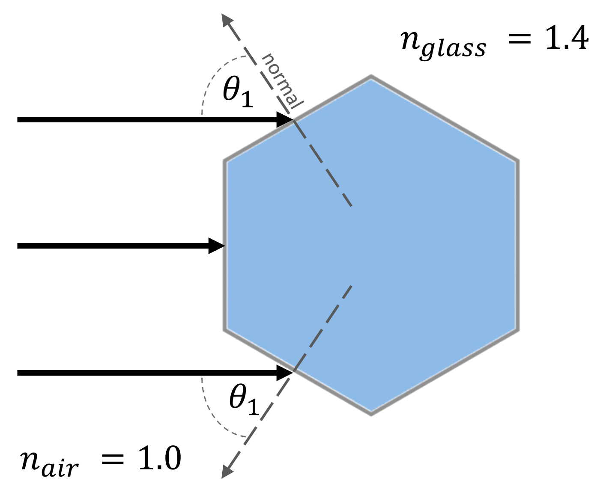

# Solutions for Lenses, Ray Tracing, and Simple Optical Devices
:::Figure (hex-side|xl)

:::

:::Figure (hex|xl)

:::

::::::Exercise (curve|1 Point)

 gives the ideal ray-diagram of a hexagonal lens. Parallel rays hit the left side of the lens and refract through it. Answer the following questions using what you know about plane refraction. You will likely need a protractor fot his exercise — if you don't have one, you can print or trace out an [image of one](https://www.google.com/search?q=protractor+image&tbm=isch&chips=q:protractor+image,g_1:printable:Go2CJwAhfTI%3D&hl=en&sa=X&ved=2ahUKEwiT_eyl0MfzAhV8wJcIHcukB0sQ4lYoAHoECAEQEQ&biw=1905&bih=931).

1. What is the incident angle, $\theta_1$, of the rays hitting the angled faces? ;;;You will need to use geometry to find this. Recall that the interior angles of a hexagon are 120°;;; ;;;If you are struggling, try measuring the angle using a protractor (it should be a *nice* angle) and working backwards;;;
---
They should find that the angle is $\theta_1 = 60 \deg$. This question is hard so be generous
- *(0.25 Points)* for correct answer obtained by any means, or incorrect answer with very good effort
- *(0 Points)* wrong with little to no effort shown

---

2. Using what you solved for $\theta_1$, the index of refraction of air, $n_{\text{ air}}=1.0$, and the index of refraction of this glass,  $n_{\text{ glass}}=1.4$, solve for the refracted angle $\theta_2$.
---
If they found that $\theta_1 = 60 \deg$, then $\theta_2=38.2 \deg \approx 39 \deg$. If they found the wrong angle, plug this into $\theta_2 = \arcsin(\sin(\theta_1)/1.4)$. The calculator below does this for you if you are lazy.

<input 
type="text" 
placeholder="incident angle" 
onchange= "document.getElementById('calculator-out').value= 360*(Math.asin(Math.sin((this.value/360)*2*Math.PI)/1.4))/(2*Math.PI)"></input>
######
<input type="text"  id= 'calculator-out' placeholder="refracted angle"></input>

- *(0.25 Points)* for correct answer obtained with work shown.
- *(0 Points)* wrong answer or no work shown

---
3. Sketch the behavior of the three light rays shown in  after they enter the glass. You can do this on a digital drawing program (e.g. Paint or OneNote), or you can do it on paper and take a picture to attach to your report. ;;;If completing by paper and pencil, you might want to gently trace this diagram by holding the sheet of paper over a screen;;;

---
- *(0.25 Points)* for rays that looks generally correct. Most students should have something that looks correct
- *(0 Points)* for very obviously incorrect solution or no answer.

---

4. Do the rays converge (get closer) or diverge (spread out) inside the hexagon?

---
This question is a test of vocabulary, really. If done correctly, the students should find that the rays converge in the hexagon. The answer to this question, however, depends on what their sketch looks like.
- *(0.25 Points)* for correctly identifying behavior
- *(0 Points)* for incorrectly identifying behavior or no answer.

---
::::::

::::::Exercise (curve-2|1 Point)
:::Figure (cyl|s|R)

:::
Instead of a hexagon, imagine a cylindrical lens as in the side view given in . Reminder: you can click on any image in the manual to make it larger.
1. Do you think the rays would converge or diverge inside the lens?
---
The normals and materials are identical to the hexagonal case. A clever student might even superimpose the images. The rays of light will behave identically in the spherical lense and, hence, converge.
- *(0.5 Points)* for correctly identifying behavior
- *(0.25 Points)* for saying it will be the same, but the answer d was wrong so their answer here is wrong
- *(0 Points)* for incorrectly identifying behavior or no answer.

---
2. Is there any situation that a convex lens, like the one in , would result in rays that **do not** converge on the interior?
---
As long as the convex lens is made of a material with a higher $n$ than the surrounding medium, it will *always* converge rays.
- *(0.25 Points)* correct answer or good attempt
- *(0 Points)* no answer, or wrong answer with very minimal effort

---
3. What can you conclude about convex lenses? ;;;Hint: How do they affect incident light rays? You can assume lenses are made from glass and have a boundary with air;;; 
---
We are looking for them to make the association that convex lens = convergent rays.
- *(0.25 Points)* correct answer or good attempt
- *(0 Points)* no answer, or wrong answer with very minimal effort

::::::

::::::Exercise (focal|1 Point)
1. Would you expect a convex lens with a higher **curvature** (more round vs flat) to have a longer or shorter focal length? Explain your reasoning, citing  or a sketch if needed.
---
We are looking for them to make the association that more convex = more convergent.
- *(0.5 Points)* correct answer, thoroughly defended and you can tell that they tried.
- *(0.25 Points)* incorrect answer but they tried hard and made a mistake OR correct answer with insufficient explanation 
- *(0 Points)* no answer, or answer with  no explanation or defense.

---
2. Would you expect a convex lens with a higher **index of refraction** to have a longer or shorter focal length? Explain your reasoning, citing  or a sketch if needed. 
---
We are looking for them to make the association that higher index = more bending power.
- *(0.5 Points)* correct answer, thoroughly defended and you can tell that they tried.
- *(0.25 Points)* incorrect answer but they tried hard and made a mistake OR correct answer with insufficient explanation 
- *(0 Points)* no answer, or answer with  no explanation or defense.

::::::

:::Exercise (convex|2 Points)
1. Include an image (or images) with your three Convex Ray Trace drawings here.
---

- *(1 Points)* All images present and look correct.
- *(0.75 Points)* minor errors
- *(0.5 Points)* one major error
- *(0.25 Points)* multiple major errors
- *(0 Points)* missing work or totally wrong
---
2. Inspect **"Convex Ray Trace 2"**. Do the rays ever meet on the other side of the lens? Describe what happens to the rays
---
- *(0.5 Points)* Accurate Description
- *(0.25 Points)* Some issues with description
- *(0 Points)* missing work or totally wrong
---
3. Inspect **"Convex Ray Trace 3"**. What do you think is the significance of where the rays meet? ;;;Hint: If you were looking into the lens, what would you see?;;;
---
- *(0.5 Points)* Accurate signifigance
- *(0.25 Points)* Some issues with description
- *(0 Points)* missing work or totally wrong
---
:::

:::Exercise (concave|1 Point)
1. Include an image with your Concave  Ray Trace drawing here.
---
- *(0.5 Points)* Seems correct
- *(0.25 Points)* some errors
- *(0 Points)* missing work or totally wrong
---
2. Do the rays converge at a given point?
---
- *(0.25 Points)* Accurate Description
- *(0 Points)* missing work or totally wrong
---
3. What is the significance of that point?
---
- *(0.25 Points)* Accurate signifigance
- *(0 Points)* missing work or totally wrong
---

:::

:::Exercise (convexcave|2 Points)

1. Do convex lenses make objects outside of the focal length appear larger or smaller?
2. Do convex lenses make objects inside of the focal length appear larger or smaller?
3. Do concave lenses make objects outside of the focal length appear larger or smaller?
---
- *(2 Points)* All correct and complete sentences
- *(1.5 Points)* Minor errors
- *(1 Points)* Multiple errors or not using complete sentences though technically correct
- *(0.5 Points)* Mostly incorrect work.
- *(0 Points)* missing work or totally wrong
:::
<!-- End of Exercise: Ray Tracing -->

::::::Activity (playwith| Curvature and Focal Length)
Convex lenses are those which bulge outward in the center with the edge being the most narrow part. 
1. Select one of the unlabeled thin lenses. Move it up and down beneath the laboratory’s fluorescent lights. View image 
of ceiling lights using a piece of paper as a screen. 
:::Exercise (|1 Point)
What do you observe about the light passing through the lens?

---
- *(1 Points)* Full effort recording observations (sentences, details)
- *(0.5 Points)* Some effort
- *(0 Points)* missing work or totally wrong, no effort
:::
2. At one height you should see that the lens will focus the light from the fluorescent lights. The lights are long, parallel tubes 
and as a result you see two sharply focused lines. 

:::Note
Different lenses focus the light at different heights above the table. This is due to the fact that the lenses have different focal lengths, a property dependent upon the index of refraction and 
geometry of the lens. 
:::

3. Select a lens and measure the height at which this occurs, then do the same for two other unlabeled 
convex lenses. 
:::Exercise (|1 Point)
Is there a relationship between the curvature of the lens and the height at which it focuses? 
---
- *(1 Points)* Full effort recording observations (sentences, details)
- *(0.5 Points)* Some effort, possible issues
- *(0 Points)* missing work or totally wrong, no effort
:::

4. Now take the concave lens – this one is thickest on the outside and thinnest in the middle. Using the same method find the 
focus height of this lens. 
:::Exercise (|1 Point)
Does the concave lens sharply focus the light?

---
- *(1 Points)* Full effort attempt to answer based on observations (sentences, details)
- *(0.5 Points)* Some effort
- *(0 Points)* missing work or totally wrong, no effort
:::
:::::: 

::::::Activity (Focal| Measuring Focal Lengths)
**Instructions:**

1. Adjust the grating on the ray box to provide 5 parallel rays.
2. Place the thin convex lens perpendicular to the rays, so that the rays are running parallel to the optical axis. Note that it is necessary to place the lens on the front half of the table to observe the intended phenomenon.
3. Let your TA know that you are ready for them to dim the class lights and observe the refracted rays.

:::Exercise (|1 Point)
What is the focal length of the lens?

---
- *(1 Points)* Correct value
- *(0.5 Points)* Some effort but incorrect value
- *(0 Points)* missing work or totally wrong, no effort
:::
4. Use the thick block half lens. Place the curved surface towards the parallel light source. Observe the refracted beams.

:::Exercise (|1 Point)
Measured from the flat surface, at what distance do the beams converge? 

---
- *(1 Points)* Correct value
- *(0.5 Points)* Some effort but incorrect value
- *(0 Points)* missing work or totally wrong, no effort
:::

5. Reverse the orientation of the block such that the flat surface is towards the light source

:::Exercise (|1 Point)
Does the block lens have symmetrical behavior? That is, do the beams converge at the same
distance from the flat surface? Why might this be the case? ;;;Hint: look at the flat boundary, comment on the refraction which occurs there.;;;

---
- *(1 Points)* Full effort to explain behavior, possibly including images or sketches
- *(0.5 Points)* Some effort but incorrect statements
- *(0 Points)* missing work or totally wrong, no effort
:::

6. Reverse the orientation of the block such that the flat surface is towards the light source
:::Exercise (|1 Point)
Can you measure the focal length of the lens? If you were to trace the refracted rays backwards
(on the same side as the incident beams) would they converge? 

---
- *(1 Points)* Full effort to explain behavior, possibly including images or sketches
- *(0.5 Points)* Some effort but incorrect statements
- *(0 Points)* missing work or totally wrong, no effort
:::
::::::

::::::Exercise (|3 Point)
Write a brief (2-3 paragraph) conclusion summarizing the important points of this lab. Correctly use the following vocabulary in your summary:
:::center
Convex, Concave, Principal Axis, Focal Point, Ray Tracing, Real Image, Virtual Image.
:::

---
Use your judgement to assign point values
::::::  

:::Summary
Make sure to include all tables, plots, pictures, drawings, screenshots or anything else asked of you in the exercises in your report, as well as answers to all the questions.

All responses and answers should contain the correct number of sig figs and should include units when needed.
:::

