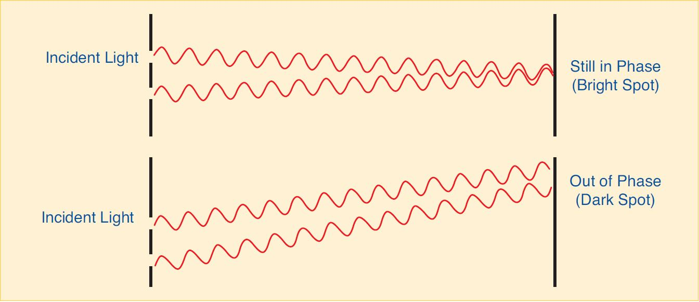
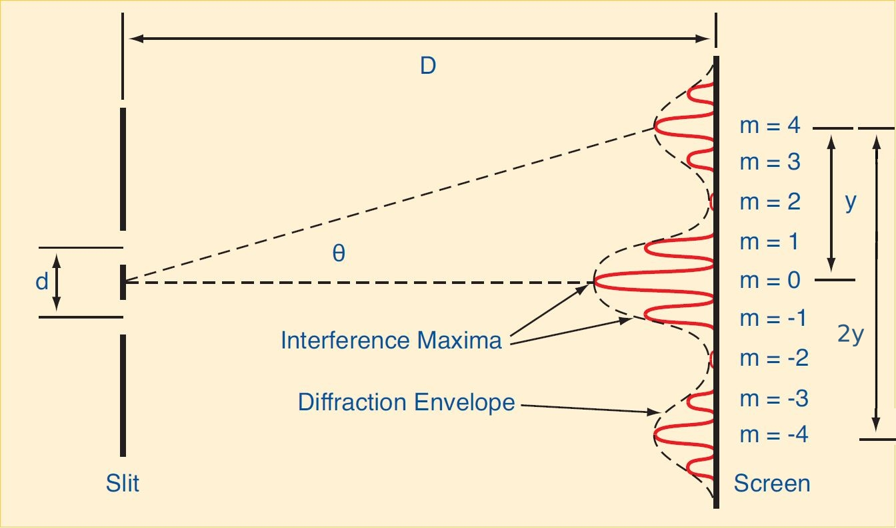

# Lab 3: Wave Optics

::::::Intro (In this Lab)
Now that we are familiar with the principles of *ray optics*, we will move on to talk about **wave optics**. As the name suggests, wave optics considers the wave-like properties of light, and the phenomena that emerge from this description &mdash; in particular, **diffraction** and **interference**. These phenomena occur on very small length scales compared to the domain of ray optics.

:::Video (intro|The Wave Nature of Light)
<iframe width="100%" height= "100%" src="https://www.youtube.com/embed/PgqcerR-3no" title="YouTube video player" frameborder="0" allow="accelerometer; autoplay; clipboard-write; encrypted-media; gyroscope; picture-in-picture" allowfullscreen></iframe>
:::
::::::

::::::Prelab
**Reminder:** Completing the Prelab before your Lab day is worth 2 Points.
 
Please complete the following Exercises:
:::center
, , , , 

, , , 
:::

So that you have a good understanding of interference vs diffraction for experiment day, be sure to do the following Activities:
:::center
 
:::
::::::

---

# Introduction

When you are calculating image locations relative to the objects that produce them, and learning about simple optical devices, it is useful to treat light as groups of rays that travel in straight lines until they are reflected or refracted. This is referred to as *Geometrical Optics*. 

As you might know from our first lab, light doesn’t behave in quite such an ordinary manner when it interacts with things at smaller scales. This is because light is an electromagnetic wave, and as such it exhibits all of the behaviors that other waves exhibit, like **diffraction** and **interference.** A key thing to know about these two phenomena is that they can be easily remembered by how they arise. Diffraction is the result of how light interacts with the *environment* — say the aperture of a camera for example. Interference is the result of how light interacts with *itself*.

## Interference

When light passes through two closely separated slits, the rays travel slightly different distances before reaching an observation screen. To understand why this matters, we can imagine the ideal situation, where two well-defined rays of light pass through two slits separated by some distance. Recalling that light is an EM wave, and hence oscillates through time and space, we see that the point in the oscillation (minimum, maximum, or something in between), depends on the distance travelled, and that the two rays can be *in-phase*, *out of phase* or something in between depending on what point we are looking at, as shown in  .

:::Figure (interference1|xl)

:::

The top of  <u>a</u>  demonstrates constructive interference. The two waves are in phase with one another where they meet the screen, and hence their amplitudes add together forming a bright spot referred to as a maximum.  <u>b</u>  shows destructive interference. The waves are exactly out of phase at the screen, and produce a dark spot, referred to as a minimum. 
::::::Figure (interference2| m|R)

 Constructive Interference")

 Destructive interference ")

:::row
:::
Images from  [HyperPhysics](http://hyperphysics.phy-astr.gsu.edu/hbase/phyopt/slits.html#c1) 

::::::

### Quantifying Interference

You can see that constructive interference happens whenever the distances traveled by the two waves to the observation screen are the same, or if they differ by a whole number of wavelengths. Similarly, destructive interference occurs when the difference in the traveled distances is equal to half-integer wavelengths  (1/2, 3/2, 5/2, etc.).

Let's make this a bit more quantitative.

 <u>a</u>  shows us all the meaningful variables: 
- $y$ is the position on the screen as measured from its center. 
- $D$ is the distance between the slits and the screen.
- $\theta$ is the angle at which the light leaves the slits to get to position $y$ on the screen.
- $d$ is the separation between the two slits.
- $a$ is the slit width.

We label which intensity maxima (bright spots) we are talking about with the variable $m$. We call the one in the center of the screen $0$. Then to one side of $0$ we label the positions of the maxima with positive numbers in increasing order away from $0$ (1, 2, 3, etc.), and on the other side with negative numbers in decreasing order away from $0$ (-1, -2, -3, etc). We can choose which side we pick for the positive numbers and which side we choose for the negative numbers arbitrarily. 

  tells us the condition for maxima to occur, and  <u>a</u> gives the variables to  describe   mathematically. **We also need to know the wavelength of the light, which we will denote with $\lambda$**. Thus we can describe the resulting maxima mathematically by the formula for constructive interference:

::: Equation (cons| Constructive Interference Relation)
$$
d\sin(\theta) = m\lambda
$$
:::

### Small Angle Approximation
It would be nice if we could replace $\sin (\theta)$ with something a bit easier to work with. Let's look back at our diagrams and consider the geometry again.

Note the following: The center point between the slits, the center of the screen, and any other position on the screen, are three points that form a triangle. An example of one such triangle is drawn in purple in  <u>b</u>. The bottom of the triangle has side length $D$ and the far side has length $y$.  We could determine the hypotenuse by using the Pythagorean theorem, but we won't need to do that here.

**For small angles**, we can make the approximation $\sin(\theta)\approx\tan(\theta)$. Then we can use trigonometry and our triangle to get $\tan(\theta) = \frac{y}{D}$. This is summarized in the following equation:

:::Equation (saa)
$$
\sin(\theta) \approx \tan(\theta ) = \frac{y}{D}
$$
:::

Thus we can use  to replace $\sin(\theta)$ in  to get a simplified interference equation. We will use the subscript $m$ to indicate the position on the screen of the $m^{th}$ maximum, $y_m$:

:::Equation (max| Interference Maximums)
$$
y_m = m \lambda \frac{D}{d}
$$
:::

:::Note (|9 C)
, and thus , relies on $\theta$ being small. The angle $\theta$ is determined by $D$ and $y_m$. When $D$ is 1 meter (the length of your arm) and $y_m$ is $8 \text{ cm}$ (the length of your palm) the difference between $\sin(\theta)$ and $\tan(\theta)$ is less than 1%. In this lab, we will be working on scales about that size. 
:::

:::Note (|9 C)
 describes only interference phenomena but ignores diffraction. The assumption is that the two slits have infinitesimal width (so we can ignore it).
:::

## Diffraction

:::Figure (ocean-diffraction|m|R)

:::
Diffraction is the phenomena associated with light interacting with the slit, or opening, itself. Diffraction can be a challenging concept to learn for the first time since it doesn't seem intuitive --- however, you've seen it happen many times with a different kind of wave: water waves.

The principle that governs diffraction in both light and water are the same, namely [Huydgen's Principle](https://en.wikipedia.org/wiki/Huygens%E2%80%93Fresnel_principle). It states that every point on the wavefront of a wave is a source of a spherical wavelet itself. This principle becomes most apparent when a  straight wavefront meets a barrier.

:::Figure (wave-diffraction|l)

:::

As we will explore below, when this effect is combined with interference due to multiple openings, we obtain interesting amplitude patterns. 

:::Figure (doubleslit|m)

:::

## Interference and Diffraction, Together
In our discussion of interference we have ignored the effect of the slit width $a$ on the patterns observed on the screen. *Diffraction* arises when a slit has a width comparable to the wavelength of light. If we consider light passing through a single slit of width $a$, we observe only diffraction effects. If we consider light passing through two slits of width $a$, we observe both interference and diffraction effects. **It is important to note that the interference results from using *two* slits, and diffraction results from the slits having a certain *width*.**  When both diffraction and interference are present, such as in the case of the two slits of width $a$ shown in , the diffraction will modulate the interference pattern. The *diffraction envelope* causes a fading and brightening of the interference maxima.

:::Figure (dai|xl)

:::

## Diffraction Gratings. 

You might be wondering what happens if we have three slits, or four slits, or a hundred slits! How do all of these rays interfere and diffract to form a pattern? Does anything interesting happen?

Indeed, many interesting things happen, and the underlying phenomena are what make devices, like the spectrometers you may use in your future life science career, possible! The device that is created by increasing the number of slits is called a **diffraction grating**, and it has a number of special properties. Like a prism, it is able to separate light by frequency, albeit in a much more powerful (and controllable) way by using interference and diffraction.

# Gaining Intuition

In this part of the lab we will get some intuition about what we observe on a screen when we shine light through one or two slits. The other goal is to help you identify the difference between diffraction and interference effects.

To accomplish these tasks, in  we will use  to observe the light intensity (think brightness) pattern produced on a screen by laser light passing through a pair of slits.

## Diffraction vs. Interference
::::::Simulation (ID)
<iframe width="100%" height= "1100px" src="https://kapawlak.github.io/PhDemoJS/Apps/Intf_Dif/Page.html" width=100% height=1100px style=border:0px;></iframe>

:::center
<a href="https://kapawlak.github.io/PhDemoJS/Apps/Intf_Dif/Page.html" target="_blank" rel="noopener noreferrer"> Open in New Tab</a> 
:::

::::::

At the very top of the simulation is a graph of the intensity vs. position on the screen. It shows you how bright any particular point on the screen is. Below the graph is the screen. This simulates what you would see on a real screen (think piece of paper) if you were to shine a laser at it through a pair of slits. Below that, it shows you the slits. This part of the simulation is not drawn to scale, but you can imagine that this is what the slits would look like under a microscope.

You are able to adjust the slit width ($a$), the slit separation ($d$), and the wavelength of the light ($\lambda)$. At the bottom you can turn diffraction on and off by checking the box. **Turning off diffraction is not something you can do in real life.**

::::::Activity (ind| Practicing Interference and Diffraction)

**Interference**

Let's start by focusing only on interference. 

1. Click the diffraction checkbox to uncheck the box and turn off diffraction effects.  This will ignore any effects the width of the slits has on the intensity, so that slider is not active anymore.

An important thing to notice is that that when there is no diffraction, all maxima are **equally bright and equally spaced**.  

:::Exercise (|1 Point)
1. Use  to predict what will happen to the locations of the maxima on the screen ($y_m$) when you adjust the slit separation $d$  (*i.e.*, what happens when we increase and decrease the slit separation).

2. Use   to predict what will happen to the locations of the maxima on the screen ($y_m$) when you adjust the wavelength ($\lambda$).
:::

2. Adjust the slit separation while leaving everything else the same. Pay attention to what happens on the screen and in the intensity plot.

:::Exercise (|1 Point)
How does adjusting the slit separation affect the pattern on the screen (or the intensity plot)? Things to consider might include the positions of the maxima, the brightness of the maxima, the separation between the maxima, or anything else you find notable.
:::

3.  Make sure the slit separation is somewhere in the near the middle of the range. Adjust the wavelength while keeping the other parameters constant.

:::Exercise (|1 Point)
How does adjusting the wavelength affect the pattern on the screen or the intensity plot (besides color; remember your prediction based on ? Things to consider might include the positions of the maxima, the brightness of the maxima, the separation between the maxima, or anything else you find notable .
:::

**Diffraction**

Now we will consider only diffraction effects. As mentioned in the introduction, diffraction can occur with only one slit, while interference takes at least two. 

1. Start by sliding the slit separation to $0\ \mu\rm{m}$. This will turn the two slits into one.
2. Now turn on diffraction by checking the box. 

Notice that now we have one large peak in the center and many much smaller peaks to the sides. This is the **diffraction envelope** shown in Figure 3. 

:::Exercise (|1 Point)
1. How does adjusting the slit width change the diffraction envelope?

2. How does adjusting the wavelength change the diffraction envelope?
:::

**Interference and Diffraction**

Now we will look at interference and diffraction happening at the same time. This is much more like what you would see in real life.

1. Adjust the separation slider until there are two slits again, somewhere around $200\ \mu\rm{m}$. 
2. Adjust the width to about $25\ \mu\rm{m}$.
3. Make sure the diffraction checkbox is still on.

Notice the outline of the diffraction envelope and the interference pattern inside of it. Also notice that where the diffraction envelope goes to zero, there is not a maximum, even if the interference equation says there should be one.

3. To help see this, try turning diffraction on and off, and pay close attention to where the diffraction envelope goes to zero.

:::Note (|9 C)
This is important, because if we are labeling the interference maxima (-2, -1, 0, 1, 2, 3, etc.), we want to make sure that we still label the interference maxima that are at the zero points of the diffraction envelope.
:::

4. Make sure that diffraction is checked in order to see the diffraction effects.

:::Exercise (|1 Point)
Based on the interference only and diffraction only part of the exercise, predict what will happen if you adjust the following parameters independently:

1. The slit width.

2. The slit separation.

3. The wavelength (besides a change in color).
:::

::::::

:::Exercise (|1 Point)
1. If you decrease the slit width, why do more peaks appear in the central diffraction envelope?

2. If you increase the slit separation, why do more peaks appear in the central diffraction envelope?

3. If you increase or decrease the wavelength, why does the number of peaks within the central diffraction envelope remain the same?
:::

# Preparing for the Experiments
As we have previously done, we will need to write down some equations, make a few tables to record and process data, and look up some values so you can work quickly on experiment day. Please carefully read through the experiments in [Part IV](#PartIV) and then complete , , and  below to make sure you are prepared.

First, since we will be determining the wavelength of the laser from our empirical data, we need to solve for the equation that allows us to do this.
:::Exercise (equation|1 Point)
Rearrange  so that you can calculate the wavelength of the laser, $\lambda$, from the measured maxima and locations, the distance to the screen, and the slit spacing.

:::

With our equation in hand, we are ready to set up tables to quickly batch process our collected data. Please complete the following Activity to set them up. 

::::::Activity (tables|Preparing Our Calculations)

**Instructions:**
For , we will need **two tables** to record the data for measuring the distance to the various maxima, one table for the $0.08\text{ mm}$ slit width and the other for the $0.04\text{ mm}$. It is faster to make one table, fill in the functions, and then copy it. We advise doing it this way.

1. Create a table similar to the one below, but with proper units and all the properties of a [Good Table](?linkfile=FAQ#QHowdoIreceivefullcreditonatableinmylabreport)
2. Include cells above or below the table that will hold your measurements of $D$ and $d$
:::Table (orders| Maxima Data for ... Slit)
| $m$ | Distance from $-m$ to $m$ (units) | $y$ (unit) | Calculated $\lambda$ (unit) |
|---|-----------------------------------|------------|-----------------------------|
| 1 |                                   |            |                             |
| 2 |                                   |            |                             |
| 3 |                                   |            |                             |
|  --- |                        ---           |      Average:      |         <>                    |

---
$D$ (unit) = ______________

$d$ (unit) = ______________
:::
3. Set up a function that will turn the **Distance from $-m$ to $m$** into **$y$** ;;;If you aren't sure what this is, reread the Activity this table is for! Specifically look at the figures;;;
4. Set up a function that will take the values of $D$ and $d$, and then values from the $y$ and $m$ columns to calculate $\lambda$. You should use your result of  here.
5. Set up a spreadsheet function to calculate the **Average** wavelength.
5. Duplicate this table and title both tables to refer to one of the experiments.
6. Link a copy of these tables under  to show you made them for your Prelab.
::::::

Finally, for the diffraction grating experiment, we will be using an ordinary CD (Compact Disk) as a diffraction grating. CDs have very small grooves, like a record, that are etched in with a very precise laser.  In order to compare the result of your experiment to an accepted value, you will need to look up the spacing between the tracks.

:::Exercise (cd|1 Point)
Search for "Compact Disc Track Spacing". 
1. What is the spacing *between* the tracks for a standard CD?
2. Give your source for this information.
:::

# Experiments
## Working with the Laser

In the following qualitative Activity, we will be practicing working with the laser on the optics bench while getting familiar with the kinds of patterns we will see in these experiments. 
::::::Activity (laser| Working with Lasers on Optics Bench)
:::Warning
Do not look directly into the laser! Never shine the laser around the room, always point the laser into the screen.
:::
1. Set up the laser at one end of the optics bench and the screen, covered with paper, on the other. 

2. Center and level the laser using the adjustment screws on the back of the laser. You can use the half meter stick to measure the height of the laser beam at different points of the track to make sure it is level.
3. Place the multiple slit set about $3 \text{ cm}$ in front of the laser (printed side facing laser) and set it to the widest part of the 
variable double slit by rotating the slit disk. This section of the disk consists of two slits of constant size (width of 
each slit is $ .04 \text{ mm}$), but with variable separation between slits (separation  $ d = 0.125 \text{ mm}$ to $ d = 0.75 \text{ mm}$).
4. Use the adjustment screws on the back of the laser to center the laser beam on the slits.
:::Exercise (|1 Point)
1. What do you observe on the screen? Make a **sketch** of it (either on a digital program or draw it by hand and attach a photo of the drawing -- do not attach a photo of the pattern itself) and put it in your notebook.
2. Are these the kind of shadows you would expect to see if you cut two notches in a piece of paper and shined a light through it? 
3. How does the pattern on the screen change when you decrease the slit separation?
:::

::::::

## Determining the Wavelength of the Laser

Building on what we learned in , in the following Activity we will take quantitative measurements that will allow us to actually calculate the wavelength of the laser.
::::::Activity (determine-wavelength|Determining Laser Wavelength)

:::Figure (dai_again|xl)

:::

1. The laser, slit disk, and screen should be set up as in . be sure to cover the screen with a piece of paper before 
continuing.

:::Note (|10 C)
Place the laser, together with the slit disk, on the opposite end of the track from the screen 
so that you maximize the distance between the slit disk and screen. 
:::
2.  Set the slit disk to the double slit with $ 0.25 \text{ mm}$ slit separation and $ 0.08 \text{ mm}$ slit width. Adjust the laser so that it shines directly on the slit. You should see an interference pattern similar to the one observed in .
3.  Tell your TA you are ready to turn off the room lights. 
4. Locate and mark the center maxima ($m = 0$)  of the diffraction pattern on the paper covered screen. ;;;If you cannot easily identify the center maxima, you can remove the slit disk and mark the location of the laser beam; this will be the same location as the center maxima.;;;
5.  With the slit disk reinstalled, record the distance from the slit disk to the screen.
6.  Mark the center of each maxima (m = -3 through m = 3) on the paper covered screen.
7.  Remove the paper. Measure the distance between maxima of similar order (the distance between 
m = -1 and m = 1 and so on). Record these values into your table.  
:::Exercise (|1 Point)
Reflect on the following:
1. In the above note, we ask you to place the laser + slit disk and screen on the opposite sides of the track. Why is this a good idea?
2. Why might you want to measure the distance from $-m$ to $m$ rather than directly measure each maxima from center maxima?
:::
7.  Calculate the wavelength of the laser for each order using the interference equation.
8.  Repeat the above procedure for the double slit with $ 0.25 \text{ mm}$ slit separation and $ 0.04 \text{ mm}$ slit width.

::::::
:::Exercise (tables|2 Point)
1. Provide your Good Tables with all data filled in here.
2. What is your average computed value for the wavelength of the laser for *all* values computed?
3. Locate the wavelength of the laser on the laser itself. Record and record this value. How does your result compare to the value printed on the laser? 
4. Does one measurement better agree with the printed value on the laser? Why do you think this is or isn't the case?

:::

:::Exercise (|1 Point)
1. Does the distance between maxima change when you change the slit width?
2. How does the distance to the first maxima of the diffraction envelope change with slit width?
:::

## Exploring Diffraction Gratings
::::::Activity (cd|CDs as Diffraction Gratings)
1.  With the laser and screen oriented as before, remove the slit disk, and place the holder containing a piece of a compact disc about $ 4 \text{ cm}$ from the screen. This is a normal CD, but the reflective coating has been removed to allow light to pass through.
2.  You should see at least the first order maxima, and possibly the second order maxima if you move the CD close 
enough to the screen. 
3. Measure and record the distance between maxima of similar orders.

:::Exercise (|2 Point)
1. What are the $y_m$'s you measured? A table is not required for this short activity, but make sure you specify the which peak each measurement belongs to.
2. Do you think that the small angle approximation is valid in this experiment?
3. Which equation should you use?
4. Using this equation, what is your average computed value of the track spacing for a CD? 
:::
::::::

:::Exercise (|1 Point)

1. Calculate the percent difference between your measured value and the value specified in the Compact Disc Standard you found in .
2. Does your average value of the CD track spacing fall within the tolerance of  $ \pm 0.1 \mu \text{m}$ of the Compact Disc Specification?
:::

# Conclusion

:::Exercise (|2 Point)
Write a brief conclusion summarizing the important points of this lab.
:::

:::Summary
Make sure to include all tables, plots, pictures, drawings, screenshots or anything else asked of you in the exercises in your report, as well as answers to all the questions.

All responses and answers should contain the correct number of sig figs and should include units when needed
:::

