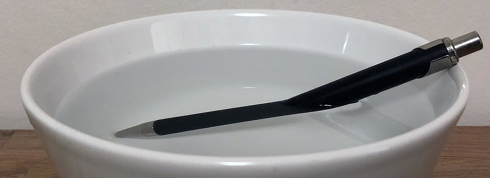
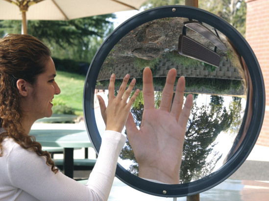

# Reflection and Refraction

::::::Intro (This Week)

This week we will investigate Reflection and Refraction. After a short review of the theory governing the reflection and refraction of light by surfaces and prisms, you will tackle a few experiments that demonstrate each concept:
- Refraction of light through an acrylic block
- The dispersion of light through a prism
- The reflection of light from plane mirrors
- The reflection of light from spherical mirrors

The video below gives a brief review of important concepts in this lab
:::Video (intro| A Quick Lesson on Reflection and Refraction)
<iframe width='100%' height='100%' src="https://www.youtube.com/embed/CWOkuhY8Szo" title="YouTube video player" frameborder="0" allow="accelerometer; autoplay; clipboard-write; encrypted-media; gyroscope; picture-in-picture" allowfullscreen></iframe>
:::

::::::

::::::Prelab
**Reminder:** Completing the PreLab before your Lab day is worth 2 Points.
 
Please complete the following Exercises:
:::center
, , , , 
:::

So so that your tables are ready for experiment day, be sure to do the following Activities:
:::center
 
:::

::::::

---

# Refraction 

:::Figure (pen|l|R)

:::

While we may see the visual effects of refraction on a daily basis — think rainbows, distorted images on ocean-sprayed smart phones, or the paper straw that appears to bend where the air meets your drink —  most of us haven't investigated it in a scientific setting. In the first two experiments of this lab, we will try to understand, *quantitatively*, the physical effects of refraction. By the end of this experiment, we should be able to confidently relate the **indexes of refraction** of two materials sharing a boundary to the physical changes in a ray of light — such as the angle it travels through space, the speed the ray propagates at.

The next few sections prepare you for this experiment by reviewing the theory of refraction. In these sections you will practice some calculations and prepare equations and tables for the experiment.

## The Index of Refraction and the Speed of Light
From last week's [Refresher Lab](?linkfile=lab0), you know that light travels in a vacuum at a speed $c\approx 3.00 \times 10^8  \text{ m s}^{-1}$, but, perhaps surprisingly, it travels *more slowly* within any other medium or material. Because, as we learned, light is an *Electromagnetic Wave*, light itself must interact with the electric and magnetic fields around it. These EM fields, which all matter creates, are far more dense in materials versus air versus a pure vacuum. The result is that light slows down significantly in crowded spaces, much like you would walk your bike or skateboard through a packed sidewalk.

As we will learn, the difference in the speed of light in two materials plays a critical role in optics. In particular, the ratio between these speeds is useful. We define the **index of refraction**  of a material, denoted by $n$, to be the ratio of the speed of light in a vacuum to the speed of light in that medium.

:::Equation (IOR| Index of Refraction)
$$
n = \frac{c}{v}
$$
:::
where $c$ is the speed of light in a vacuum and $v$ is the speed of light in the medium. If you know the medium’s index of refraction, you know the speed of light in that medium.

The index of refraction, however, does more than just tell you the speed of light in a material — it will actually tell you some very important information about the precise *path* that the light takes in that material, too.

## Interfaces and Snell's Law

The most interesting optical effects of materials often happen at their boundaries or **interfaces**. When a light ray encounters a boundary between two materials, it experiences a change in propagation direction, which we call *refraction*. 

:::Definition (Interface)
An **interface** is a surface forming a common boundary of two bodies, spaces, or systems. For example, a full glass of water has a glass-air interface on the outside and bottom, a water-glass interface within the glass, and a water-air interface on the top.  
:::
:::Figure (bend|m|R)

:::
The bending of the light at the interface is due to fact that light travels at different speeds in the two materials. This explanation is naturally unsatisfying, since it doesn't answer *what* about the change in speed leads to a change in propagation direction. Why can't the light just move slower in the same direction?

The easiest way to answer this is to return to the wave picture of light in an illustration. In , we show a wave representation of light approaching an angled interface. The interface is angled so that the bottom of the light wave hits first, and emerges on the other side moving slower. The top of the light wave hits the interface last. This results in an overall change of angle in the direction of propagation [fn]We are glossing over some things like interference and Huygens's principle here[/fn]. 

The final result is that if we track the center of the light wave, what we usually refer to in the **ray optics** limit, the outgoing ray leaves at an angle compared to the incoming ray. The rotation the light ray experiences is not that different that the rotation you would experience if you were running with a foot on different treadmills going at different speeds.

The important thing to know is that, while it appears complicated, the bending of light can be quantified very simply in terms of the difference in the materials’ indexes of refraction. We call this relationship **Snell's Law**

:::Equation (snell|Snell's Law)
$$
n_1\sin(\theta_1) = n_2\sin(\theta_2),
$$
:::
where $\theta_1$ is the angle of incidence and $\theta_2$ is the angle of refraction. Let's now apply this to some labeled images.

:::Figure (refrac|xl)

 
:::
:::Note (|8 C)
All angles are measured from the *perpendicular to the interface* to the ray. Thus, a small angle means the ray is nearly perpendicular to the boundary, and a large angle means the ray is nearly tangent to the interface. Note that all angles are less than 90 ̊. 
:::
 above shows beams of light being emitted from the blue semicircle at the bottom left. There are some important features to observe:
- The rays travel through a medium having an index of refraction of $n_1$, toward the interface of that medium with a second medium having an index of refraction of $n_2$. 
- The beams in the lower region are the *incident* beams. 
- The beams in the upper region are the *refracted* beams. 
- When light reaches the interface, some of it is reflected back into the first medium, but most of it is refracted into the second medium. 
- Note that two of the exiting beams, B and C, are bent (*refracted*) away from the normal [fn]Ray D is also bent away from the normal, but represents a special case, which we will see later in this lab.[/fn]. 
- When a beam is perpendicular to the interface boundary, as is beam A, it is said to be *normal* to the interface. Normal rays are undeflected. 
  
 This figure could represent light coming from water and going into air. 

:::Note (|6 C)
The indexes of refraction are properties of the two mediums.
:::

:::Exercise (|1 Point)
Look at  to answer the following:

1. Light ray A is normal to the interface.  What is the angle of incidence $\theta_1$ for this ray? According to Snell's law, what is the angle of refraction $\theta_2$? 

2. Is the angle of the refracted light beam B larger or smaller than the angle of incidence? What about light beam C? According to Snell's Law, what does the relative magnitude of the angles (*i.e.*, $\theta_2/\theta_1$) tell us about the relative magnitude of the indexes $n_1$ and $n_2$?

:::

:::Exercise (snell-rearranged|2 Points)
In our experiment, we will want to calculate the index of refraction of a prism by measuring the angle of incidence and angle of refraction at the interface between the prism and air. Without loss of generality, assume that we are making these measurements such that the light is *leaving* the prism and *entering the air* at this interface.
1. Based on the interface we are studying, do you think $\theta_1$ or $\theta_2$ should be larger? Defend your answer
2. Starting from , derive an expression that gives the value of $n_1$ in terms of $\theta_1$, $\theta_2$ and $n_2$  
3. Given that one of the interfaces is *air*, can you make a substitution in your answer to part (b) that simplifies your equation? If so, write the simpler equation. If not, explain why.
:::
## The Critical Angle and Total Internal Reflection
When the angle of incidence reaches a certain value (ray D in ), light no longer gets refracted into the second medium; instead it is fully reflected back. The **critical angle** is the incident angle at which no light gets transmitted, but all the light is reflected back into the first medium.

:::Definition (Critical Angle)
 The **critical angle** is the *greatest* angle at which a ray of light, travelling in one transparent medium, can strike the interface between that medium and a second of *lower refractive index* without being totally reflected within the first medium.
:::

The critical angle is the angle of incidence that corresponds to an angle of refraction of 90°. For any angle greater than the critical angle, *total internal reflection* occurs. A necessary condition for the critical angle to exist is that the index $n_1$ of the first medium has to be greater than the index $n_2$ of the second medium.

::::::Simulation (mystery_critical)
:::center

:::
<iframe src="https://phet.colorado.edu/sims/html/bending-light/latest/bending-light_en.html?screens=1" width="100%" height="600px" allowfullscreen="1" frameborder="0"></iframe>
<button onclick='emergency_reload_iframes()'> Click Here to Reload if Stuck</button>
::::::

:::Quiz (refract_critical| About 0°--- Go back and reread Part I |About 25° --- Correct! The refracted beam disappears around 25°| About 45° --- Careful! You found the place where the incident and reflected beams have 90° separation, not where the angle of refraction is 90° | 90°--- Go back and reread Part I )
Open . Set the upper material to Mystery A and the lower material to air. Moving around the laser pointer, and using the protractor provided, what is the critical angle? 
:::

:::Exercise (find|1 Point)
Change the top material to air and the bottom material to Mystery B in .
1. Using any angle of incidence you'd like, calculate index of refraction, $n$ for the material "Mystery B?" Show your work.
2. Now swap the  materials so that the top is "Mystery B" and the bottom is air. What is the critical angle? ;;;The simulation is hard to get just right — give your best guess at the lower bound;;;
3. Calculate $n$ using the critical angle you found.
4. Do you think that these values agree?
5. What is the speed of light in the "Mystery B" material? ;;;Use the measurement of n you think is more accurate. Show your work;;;
:::

## Frequency Dependent Refraction and Prisms
:::Figure (prism|m|L)

:::
::::::Figure (freqdep|m|R)

::::::
The index of refraction for a medium is dependent upon the frequency of the light; blue light has a different index of refraction from that of red light for a given medium.

1. The angle at which a beam of light is refracted when traveling between two mediums is dependent upon their indexes of refraction.

2. The indexes of refraction are typically frequency dependent for a given medium. A medium will refract one color more (or less) than another color.

3. White light is made of many constituent colors.

Piecing these statements together, we have a tidy explanation for the phenomenon of a rainbow. At each boundary, some colors are refracted more than others, which results in white light being spread out into its constituent spectrum. This spreading is called dispersion. The second boundary of the prism – plastic to air – is at such an angle as to increase this dispersion. The difference between the index of refraction for the lowest frequency and the highest frequency determines how wide a rainbow you can see. A material with a larger spread in indexes will give a wider rainbow.

:::Quiz (whitelight|Reveal Answer --- Purple: $11.02 \deg \\\\$ Green: $11.09 \deg \\\\$ Red: $11.15 \deg$. )
A beam of white light traveling in air is incident on a glass block at an angle of $17.00 \deg$. From [Snell’s Law](#Equation-snell), calculate the refracted angle for purple, green and orange light .
:::

## Preparation for the Refraction Experiment
The purpose of our refraction experiment can be summarized in a few points:
1. Through Snell's Law, can we accurately and empirically determine the property of a material — it's index of refraction, $n$ — from simple geometric measurements of light rays?
2. Does the determination of $n$ also agree with the value obtained by finding the critical angle?
3. In the context of this experiment, is one measurement of $n$ more accurate? More precise?

In our refraction experiment, we will use a semi-circular acrylic block as our first medium and air as our second medium; in other words, we will be looking at the angle of refraction in air from a beam of light incident on the acrylic side. Below is a summary of the procedure that you should read.

::::::Hider (|Procedure Summary)
You will have a Ray Box, a Ray Table with degree markings, the acrylic block and an optics bench to connect them to.
:::Figure (setup|m|R)

:::
1. Aligning the center of the block to the origin of the circular ray table and on the light source.
2. Rotate the table until light is entering through the curved end of the block.
3. Record the angle of incidence and the angle of refraction for this configuration.
4. Repeat 2-3 for at least three more angles
5. Rotate the table until you find the critical angle and record this value.
::::::

Finally we will want to compare our results to some known value. 

:::Exercise (look-up|1 Point)
1. Look up a value for the index of refraction of acrylic. Report it here.
2. Where did you get this information from?
3. For an incident angle of $\theta_1=30 \deg$, what $\theta_2$ should you get?
:::

### Preparing our Tables

Be sure you complete the following activity prior to coming to lab. You will likely not have time to build your table on experiment day!
::::::Activity (prelab-semicircular| Prepping for Data Collection)
1. Create a [Good Table](?linkfile=FAQ#part2) with 5 data rows and one AVERAGE row that has correct units and sigfigs, similar to . One of these rows should be for testing your answer to 
:::Table (semicirc|Semi-Circular Acrylic Block Refraction Data)
| Angle of Incidence (u.) | Angle of Refraction (u.) | Measured $n$ |
|-------------------------|--------------------------|--------------|
| 30                      | ...                      | ...          |
| ...                     | ...                      | ...          |
| ...                     | ...                      | ...          |
| ...                     | ...                      | ...          |
| ...                     | ...                      | ...          |
|  | AVERAGE:| ...|
:::
2. Insert spreadsheet functions into your Measured $n$ column so that the index of refraction is automatically calculated. This will be the equation you derived in 

::::::

## Preparation for the Prism Experiment

Unlike the previous experiment, our prism experiment will be slightly more qualitative. We will use a trapezoidal block of acrylic to view how white light disperses and separates in a prism

::::::Hider (|Procedure Summary)
:::Figure (prism-top-summary|)

:::
1. Set up the optical bench so that a ray of light is incident onto the triangular end of the acrylic block
2. Align the ray so that it is perpendicular with the surface of the prism, and observe what happens to the light while slowly sweeping toward the grazing angle.
3. Try to get the light to pass directly through the prism.
4. With the Square end of the block, shrine the ray at an angle and observe what happens.
::::::

We will make some hypothesis based on what we've learned for this section, and then check our guesses in lab.

:::Exercise (prism-hyp|1 Point)
1. Do you think you will be able to get the light to go directly through the triangular end of the prism, i.e. without any change in direction or offset? Defend your reasoning.
2. Do you think you will be able to get the light to go directly through the square end of the prism, i.e. without any change in direction or offset? Defend your reasoning.

:::

# Reflection
:::Figure (0reflection_angle|m|R)

 Source: [Wikipedia](https://bit.ly/3nAGegY)
:::
In contrast with *refraction*, reflection occurs when light reverses course at an interface rather than entering the second medium. The angle (measured from the normal) that a ray of light is reflected from a surface is always *identical* to the angle that it is incident. This is called the **Law of Reflection**.

In the case of flat mirrors, like the ones that you check your appearance in, the Law of Reflection results in an **image** of an object that is the same size as the original object. For curved mirrors, like your car's side mirrors or the security mirrors in some stores, the size of objects and relative distances between these objects, becomes distorted. We will explore this is a few experiments.

To better understand what exactly is happening with the objects and their images during reflection, we must study the subject of **Ray Tracing**, which, in this case, means following individual rays of light from an object, to a mirror, and finally to the eye, in order to analyze what we are seeing. 

:::Definition (Ray Tracing)
**Ray Tracing** is a method for calculating the path of waves or particles through a system with regions of varying properties and/or reflecting surfaces. Most elementary ray tracing takes advantage of the fact that light will travel is straight lines between interfaces, and that the change in the direction of propagation of light at an interface can be calculated.
:::

## Ray Tracing Flat Mirrors 
We regularly encounter flat mirrors, as well as glass surfaces that act like mirrors. Intuitively you know that your image is standing directly across from you. When we speak in terms of ray tracing, we are the *object* and our reflection is the *image*. It is easy to convince yourself that this image is formed straight back – that is, on a line normal to the plane of the mirror – and that it is also an equal distance behind the mirror.

The image of any point object in a plane mirror is simply the point straight across at an equal distance. This is the case for any viewing angle; you will see the image “behind” the mirror at an equal distance. The line between the object and image is always normal to the plane of the mirror.

:::Figure (raytrace|xl)

:::

Now let's consider why ray tracing works. The law of reflection tells us that the angle of incidence is always equal to the angle of reflection. We also know that the image is formed by the light ray that emanates from the object, reflects off the mirror, and finally reaches our eye. The ray that reaches our eye must obey the law of reflection; its path is shown in . It is important to note that this would work equally well for any set of angles. We see an image behind the mirror because of the law of reflection; if you extended the reflected light ray behind the mirror, it would arrive precisely at the image point as in . The phenomenon of reflection fools us into thinking that the light rays originate from the image point.

## Ray Tracing Curved Mirrors 
:::Figure (curved|m|R)

:::
In the case of curved mirrors, things become more complicated. Since the direction of the surface's *normal* is changing across the interface, the direction light reflects in *depends on where the light hits the interface*. The result of this is that curved mirrors can make objects appear larger, smaller, inverted, or even combinations of these, depending on where the object is located and where you are observing! 

# The Experiments

Today is your lab day! Hopefully you have completed the Prelab assignment and are ready to tackle the four experiments planned this week. Work diligently to complete each activity and be sure to answer all Exercises. If you are stuck on a question, you can move on and come back to it later. It is more important that you complete all the Activities and answer what you can. 

## Refraction Experiment 1: Semi-Circular Acrylic block
:::Materials (Ray Box|Ray Tracing Table|Semi-Circular Acrylic block)
:::

In this experiment we will use an optical bench and a semi-circular acrylic block with an unknown index of refraction. Our objective is to find its index of refraction. In , $n_1$ corresponds to the plastic block, $n_2$ corresponds to the air. Measuring
both the incident and refracted angles and assuming the index of refraction for air to be $n_2$ = 1.00 we are left with only one
unknown, the index of refraction for the plastic, $n_1$. We neglect the first boundary between air and the acrylic block because
the incident beam is perpendicular to the cylinder’s surface.

::::::::Activity (semi-circular| Refraction in a Semi-circular Acrylic|Optics Bench)
Once you have gathered your materials, proceed with the instructions below.

**Instructions:**

1. Adjust the ray box to provide one beam of light. 
2. Place the semi-circular plastic block in the middle of the ray tracing table. Align it with the table’s axis so that it is easy to measure the incident and refracted angles. You will rotate the table rather than the block. 
3. Measure and record five different angles of incidence (including your $30 \deg$ prediction) and their respective angles of refraction. Be sure your choices of the incident angles produce a reasonable span of values ;;;Hint: A selection of values, ranging from 5° to 8°, would not be a reasonable span;;;
:::Figure (semicir|xl)

:::

1. The critical angle is the breaking point between refraction and total internal reflection (where no light is refracted, it
is all reflected. Find this angle and record it.

5.  Observe the reflected angle when the incident light is past the critical angle.
:::Note (|10 C)
At angles beyond the critical angle no light is transmitted into the air or along the surface of the block. This phenomenon
is called total internal reflection.
:::

:::Exercise (|1 Point)s
1. Present a copy of your final table here.
2. What is the average measured index of refraction (call this $\bar n$), for the acrylic block?
3. What is the critical angle you found?
4. What is the index of refraction calculated from this value (call this $n_c$)
:::

:::::::::

### Analysis of the Refraction Experiment
:::Exercise (|3 Points)
1. What is the percent difference between your two results, $n_c$ and $\bar n$?

2. Estimate your error in measuring the angles of incidence and refraction. Write these as $\delta \theta_1$ and $\delta \theta_2$
3. The percent uncertainty in determining the index of refraction can be calculated as 
    $$
    \text{percent uncert. in }n = \frac{\delta n}{n} = \sqrt{ \left(\frac{\delta \theta_1}{\tan\theta_1} \right)^2 + \left(\frac{\delta \theta_2}{\tan\theta_2} \right)^2}
    $$
    Using your data for $\theta_1 = 30 \deg$, calculate the percent uncertainty you expect in $n$.
4. Assume all your measurements of $n$ have the uncertainty that you calculated in part (c). Do you measurements of $n_c$ and $\bar n$ agree with each other? Do either of these measurements agree with  the accepted value found in ? Explain.
5. Which result do you think is more accurate? Which result do you think is more precise? Explain.
6. Calculate the speed of light in the block for both $\bar n$ and $n_c$. By what percent does light slow down in the block?
:::

::::::Note (|10 C)
Recall that the equation for percent difference is the following:

$$
\text{percent difference} = \frac{| \text{value 1} - \text{value 2}|}{average} 
$$

::::::

## Refraction Experiment 2: Acrylic Prism
:::Materials (Ray Box|Ray Tracing Table|Triangular Acrylic block)
:::
In , you will investigate what happens when the path of white light passing through the D-block is close to the critical angle. You will use your knowledge of Frequency-Dependent Refraction to describe what is happening.

::::::Activity (white|White light through a Prism)

:::Figure (prism-top|)

:::
1. Adjust the light source’s grating to emit just one light beam and attach the ray tracing table to the optical bench. You are
provided with an oddly shaped block, use the triangular end of the block as a prism.

2. Shine the beam of white light through one side of the prism (yellow arrow) and observe the light output on the opposite
side. 

3. Begin with the angle of incidence close to normal and then sweep to a grazing angle.

4. Try to get the light to pass directly through the prism with no change in direction or offset. Note any important observations.

5. Now use the square end of the block. Shine the beam of white light at an angle other than normal and such that the beam is
able to leave through the opposite side (see green arrow in ). Note any important observations.

At steep angles you will observe total internal reflection just as you did with the acrylic block. Mess around with the block
and prism to see the many possible geometric paths. 
::::::

:::Exercise (|2 Points)
**For the triangular end of the prism, complete the following:**

1. Sketch the orientation of the block when the rainbow is most observable, and attach the image to your report. Why do you think this is?;;;Hint: Is the refraction greater at grazing or normal angles? White light goes in, what comes out?;;;
2. Is it possible to get light directly through a prism? Why do you think this is? Was your hypothesis from  correct?

**For the square end of the prism, complete the following:**

4. What do you observe about the beam on the opposite side of the block? Was your hypothesis from  correct, *i.e.* is the beam able to
pass straight through or is there an offset? Is it parallel to the original beam? Why?
5. When the incident beam is normal to the surface are you able to observe the same phenomenon?
:::

## Reflection Experiment 1: Plane Mirrors

:::Materials (Corkboard|Pins---At least two yellow pins and one non-yellow pin|Plane Mirror|Paper|Ruler)
:::
::::::::::::Activity (flat-mirror|Flat Mirrors)

:::::::::Figure (mirror-setup|xl)

:::::::::

1. Set a clean piece of paper on the cork side of the of the corkboard and place the mirror assembly onto the corkboard as
shown in .
:::Note (|10 C)
The mirror is a second surface mirror, the light actually reflects from the surface behind the clear protective plastic.
:::
2. Place a mark on the paper to locate the reflective surface. Do this at both corners of the mirror. Remove the mirror and draw a solid line connecting the two marks.
3. Replace the mirror to its previous position making sure that the line is still located at the reflective surface.
4. Place a non-yellow pin $6-10 \text{ cm}$ from the surface of the mirror, slightly off to one side. This will be the object pin.
**Place the pin as vertically as possible.** Mark this location with an “O.”   shows an example.

:::::::::Figure (mirror-setup-2|m|R)

:::::::::

5. Select two yellow pins. Place one of those pins anywhere, approximately $1–2 \text{ cm}$ in front of the mirror on either side of the object (non-yellow) pin. 
6. Closing one eye, find the position where the head of the one physical yellow pin and the head of the one “virtual” object pin (non-yellow) overlap (coincide). Place the remaining yellow pin in a location such that its head coincides with the other heads as in  (b). The two yellow pins you just inserted now define the reflected light ray. 
7. Precisely mark the location of the ray pins (yellows), each with an “A.” Then remove the yellow pins.
8. Repeat steps 5-7 one more time from a different viewing angle. Mark the location of these pins each with a “B.”
9. Once you have marked the locations of reflected rays, remove the mirror. For each pair of marks draw a solid line
through the two pin holes to the surface of the mirror. Draw another line from the location of the object pin to the
intersection of the mirror surface and the line you just drew. Mark the direction of light—from the object pin, to the
mirror, and finally to your eye—with arrows on these lines.

10.  Extend the line created with the original two pins behind the mirror, making it a dashed line. Repeat this process for the other sets of pins.
11.  Now construct a line from the object to the image. Measure the distance from the mirror surface to the object and
then from the mirror surface to the image location.
12.  Construct a perpendicular line at the point where each of the rays intersects the mirror surface (the line at the back
edge of the mirror). Measure the angle of incidence and angle of reflection. Neatly tabulate your results for each ray.

::::::::::::

:::Exercise (|1 Point)
1. Where do the dashed lines meet?
2. How does the perpendicular distance from the object pin to the reflection line compare with the distance from the image to that line?
3. What can you say about the angle of incidence and angle of reflection for each of the rays?
:::

## Reflection Experiment 2: Spherical Mirrors
:::Materials (Spherical Mirrors---Concave and Convex|Pins---At least two yellow pins and one non-yellow pin|Plane Mirror|Paper|Ruler)
:::
::::::Activity (spherical| Spherical Mirrors)
1. Hold the concave spherical mirror mounted in black plastic holder approximately 1cm from your eye.
:::Exercise (|1 Point)
1. What do you observe? 
2. What orientation is the image? 
3. By approximately what factor has the image been magnified? ;;;Remember that magnification, as the term is used in optics, can mean bigger or smaller. For bigger, the magnification is greater than 1.0. For smaller, the magnification is less than 1.0;;;
:::

2. Slowly move the mirror away from you. You will notice that there is a point where it becomes difficult to discern any type of
image. You are approximately at the focal point of the mirror when this happens. Continue moving the mirror away from you.

:::Exercise (|1 Point)
1. What do you observe? 
2. What orientation is the image at this distance? 
3. How large is the image?
4. What happens as you continue to move the mirror away from you?
:::
::::::

# Conclusion

:::Exercise (|1 Point)
Write a brief conclusion summarizing the important points of this lab.
:::

:::Summary

You are expected to turn in all plots and tables you are asked to make in the exercises, as well as all answers to questions

:::

