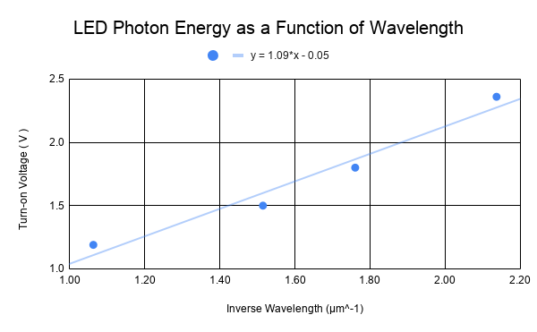

# FAQ

#  Who do I contact for help...
## ...completing the lab?
If you are struggling to complete the Prelab, please reach out to your TA or visit their office hours for additional guidance. You can also visit the PSR and ask questions to any TA teaching this course. As a reminder, the Prelab section of experiments are meant to give you practice solving problems and setting up data collection without time pressure. You must complete the Prelab prior to coming to lab

If you are struggling to complete the experimental portion of lab, and are having issues with equipment and setup, please seek out help from the TA in your section.

If you are struggling to complete some analysis questions after the experimental portion of the lab, skip the question and come back to it if possible. After giving it a fresh look, ask your TA for guidence.

Generally, we recommend doing independent research on topics that you may find confusing in this manual. Not every person will like or understand the way things are written in this manual. This is true for all books, manuals and courses. It is always a good idea to venture out and find something that *does* make sense to you, personally. 

## ...turning in my assignment?
Assignments are due by the end of lab section, so if you having trouble submitting your report, please flag down your TA for assistance. If, for some reason, you are submitting a lab report remotely, please email your TA about the submission. If you are near the turn-in deadline, please email a copy of your report to the TA to ensure that it is not marked late.

## ...reporting issues in the manual?
The manual is written and maintained by the Instructional Lab Group at UCSB. If you find any issues in the manual, please email Dr. Pawlak from the "Get Help" menu. It will likely be fixed by the end of the day, if not within minutes. 

We wanted to move the manual to an online format to eliminate the costly and wasteful paper manuals that are traditional. Online manuals have the benefit of having interactive simulations, videos and .gifs too. Because of this, the manual for the 6-Series has been completely rewritten for the Fall 2021 quarter — it likely contains some typos. We want to know about these typos.


## ...reguarding extenuating circimstances?

If you are facing extenuating circumstances that are preventing you from completing your PreLab or attending your lab section, you must let your TA know **prior to the start of lab**, and ideally ASAP. The further in advance they know about the issue, the more likely they are to grant an extension. This rule does not hold if you have a doctor's note or other documentation for emergencies.

If your circumstance is something you don't feel comfortable sharing with the TA, please send an email to the Instructor or Coordinator of this course directly.

## ...requesting accommodations?
If you are a member of [DSP](https://dsp.ext-prod.sa.ucsb.edu/), please contact the Instructor of the course about your situation during the **first week of class**, or have [DSP](https://dsp.ext-prod.sa.ucsb.edu/) forward your accommodations letter. If you require accommodations but are not a member of [DSP](https://dsp.ext-prod.sa.ucsb.edu/), please contact them for your intake meeting. We cannot provide accommodations (including extensions, rescheduling, additional time) without explicit instruction and permission from DSP.

## ...reporting inappropriate behavior ?
If you are a victim of or witness to any inappropriate behavior, please report it to Either the Instructor or Coordinator of the course **immediately**. This includes:
- sexual harassment, assault, rape
- dangerous behavior & misuse of equipment
- derogatory comments and hate speech  
- entering the lab under the influence of alcohol or drugs
- bullying and hazing

# Assignments

## Where do I write my assignments?

You should create a [Google Doc](https://docs.google.com/) on your UCSB email account to write your assignment in. You will need to be able to access this assignment during lab from your lab station's Chromebook. 

An example of how you might set up your assignment in google docs can be found [here](https://docs.google.com/document/d/1wHyNIoMf2gt6u1qYGjA57fjTVA8K-dKe-ZeCWxZPljE/copy). Please note that the answers to these questions are completely wrong :)

## Are there any formatting guidelines for assignments?

Please make sure that the following are on the first page of your assignment:
- Your name
- Your partner's name (except for Lab 0 and Prelabs, which are done independently)
- Your TA's name 
- The Lab number/name

Furthermore, make sure that each Exercise is clearly labeled (and in order) to receive credit for your answers.

## How to I link a table or plot into my Google Doc so that it automatically updates when I enter data?

Instructions for how to do this can be found [here](https://support.google.com/docs/answer/7009814) under "Embed tables, charts, & slides"

## Where do I turn in my assignments?

Your assignments will be turned in by submitting to the appropriate Gauchospace tile at the end of your lab section. You and your partner will submit one report between the two of you. 

## Where do I turn in my Prelab?

Prelabs are also turned in by submitting to the appropriate Gauchospace tile. Prelabs are just a check that you have made a complete attempt at the material, so just submit your assignment file as-is before lab.

# Tables and Graphs
## Q: How do I receive full credit on a table in my lab report?

While the contents of the table are important for your grade and are  decided by the context of the lab activity, you can do things to ensure that you *don't loose points to frivouslous display issues*. 

**In order for the table to convey the data scientifically, it must contain:**

1. Data organized in columns with descriptive headers that specify variable names and **units**.  If a table must span multiple pages, a header needs to be added for every page.
2. Correct number of significant figures for the data. 
3. All data in a column aligned at the decimal point.
4. If you have any calculations in your table, then you should show your work for **one row** of the table. 


In [](#Figure-table_ex) we show an example of an excellent table and a not-so-great table. Just by glancing at them, you can probably guess which table is which -- the bad table is visually confusing and difficult to read, independent of its poor technical qualities.
:::::::::Figure (table_ex|s|Row)
::::::row
::: col
 Table 1")
:::
::: col
 Table 2")
:::
::::::
:::::::::

In (a), the two variables that were measured are clearly described, the headers have units, the values have the proper number of sig figs, and their decimal points are aligned. In (b) the variables are not clearly described. Even if you could determine what the two columns represent, there is no way for you to know the units. Is it seconds and millimeters? Hours and nanometers? Years and feet?

Your goal with a table, is to communicate what you did as simply as possible to those reading your report. For this class, that means your TA, who will be grading your report. If you are clear in your thoughts and your tables, it is more likely that your TA will be able to understand any mistakes you make. This will allow them to provide better feedback, and maybe even take off fewer points. If your TA can't follow what you did, they are more likely to take off points.


## Q: How do I receive full credit on a plot in my lab report?

While the contents of the plot are important for your grade and are decided by the context of the lab activity, you can do things to ensure that you *don't loose points to frivouslous display issues*. 

**In order for the plot to convey the data scientifically, it must:**

1. Identify the independent and dependent variables, and make sure you put them on the correct axes. 
2. Determine the range of each variable. Your data should take up most of the area of your plot. There *should not* be any large blank areas.
3. Clearly label each axis with the variable name and unit of measurement.
4. Plot the data as a scatter plot. DO NOT "connect the dots."
5. Draw the line of best fit (usually linear) and include its equation.
6. Provide a descriptive title that communicates the scenario that you are plotting.
:::

When it comes to a title, **don't** provide a title like "Distance vs. Time." This is a bad title. This information can be determined from just looking at the axes. Your title should describe what is happening, *e.g.*, "Distance Traveled by Car on Vacation Trip."

[](#Figure-goodgraph), below, is an example of a good plot, which shows the relationship between the color (wavelength) of the light emitted by several different LEDs and the measured voltage at which they turn on.  The Inverse Wavelength is the independent variable and the Turn-on Voltage is the dependent variable.


:::Figure (goodgraph|xl)

Example of a Good Graph
:::

Notice that the data take up the entire plot; there are no large blank areas. Both of the axes are labeled and have units. The data points are not connected, and there is a line of best fit. There is also a title for the plot that lets us know what the experimenter was doing.


# Answering Questions
## How to I get full credit for my answers to questions that require a calculation?

This is a very popular question! In order to get full credit, keep in mind that all calculations must *show the work* done to get to the final answer. This means showing at least one intermediate step (though likely more) on the way to the final result. You are also encouraged to describe what you are doing in the calculation and why, to prove that you are following what is going on.

This still isn't enough, however. The final result of calculations must be presented with the correct number of **significant figures** (yes, we care about this -- this is an experimental course after all). The final result should also be clearly marked with the **correct units**. Be sure to follow any additional information given in the exercise prompt or by your TA.

## How to I get full credit for my answers to questions that require a discussion?

When we ask you to *explain your reasoning*, *discuss your thoughts*, and similar, we want you to think about what is going on in a given problem and write about it. We want to see your analytical thought process and how you are  e.g. connecting your results to theory, or how you are interpreting unexpected measurements in the context of what could go wrong in your experiment.

There are no hard and fast rules to getting a perfect mark on these kinds of questions, but as long as you are demonstrating effort and critical thought, you can expect to do well. Your response should **not** be vague, incomplete or describe how you subjectively feel, such as any of these answers:

**Do you think your results agree with the accepted value of $g=9.81 \text{ ms}^{-2}$? Explain**
``` 
No I don't, because my value is different than that value.
``` 

``` 
No.
``` 

``` 
Yes because I think the values are pretty close.
``` 


An example of many possible *awesome* responses to the question would be:

```
My final result of g= 9.79 m/s² seems to agree with the known value of g= 9.81 m/s². The percent difference between these two values is less than 1%, and I believe that the differnce in these values can be attributed to the uncertainty in my reaction time. 
```


# How to use the Manual

In all of the lab manuals you will notice some common environments. Each environment will have different tasks that you need to do in order to get full credit.

## Activities
Activities are tasks with specific instructions — generally steps to complete an experiment. Expand the activity below by clicking on it to read more.
:::::: Activity (intro| Getting Familiar)
This is an Activity.  Inside of an Activity, you might be asked to do different subtasks. Each of these subtasks should be included in your report. **If they are not, you will lose points**is
Typical subtasks might include:
- Making a table.
- Making a plot.
- Taking a screenshot of something you did on your computer.
- Making a hand drawing, and including a picture of it. 

This is not an exhaustive list, but includes the most common subtasks you will need to do. 

---
As practice, for this Activity, create a list of the following three things:
1. Your name.
2. What major you want to graduate with.
3. The person who has won the largest share of the 2020 Nobel Prize in physics.
4. The time right now.

::::::

## Exercises

Exercises are something that you should respond directly to as part of your lab report. There may be many different parts to a Exercise and you should answer each part. Sometimes Exercises are inside of Activities and other times they simply exist in the maintext to check that you are following the discussion. 

You should answer Exercises with a **full sentence** to get full credit. Some examples of bad answers are:
- Yes.
- It's bigger.
- It looks like it.
- Linear.

These sorts of answers will receive little to no credit.


:::::: Exercise

Please complete the following for this Exercise:
1. Copy the list you made in [](#Activity-intro) into the document you will turn in.
2. Add the name of your TA as an entry to this list.
3. Add the time of your weekly lab section as an entry to this list.
4. How many entries are in your list now, total?
::::::


## Notes and Warnings
::: Note 
This is a note. Notes don't require you to put anything in your report. 

The main point of a note is just to highlight some critical information for you. Please make sure to read every note.
:::

Like Notes, Warnings don't require you to put anything in your report. 
Warnings differ from Notes because they highlight potentially dangerous details of the procedure.
::: Warning 
This is a Warning. Please make sure to read every Warning to prevent harm to yourself and others. Please click to dismiss once you have read the Warning.
:::

## Information Boxes

In this course, information boxes come in many shapes and sizes. Click the arrow below to expand the information box on expanding boxes.

:::Hider (|Expanding Boxes)
The first kind of information box is an expanding box, like this one. This box usually contains supplementary information, and you may want to minimize it while working on the lab. It can also contain a check-your-understanding type of Exercise.

:::

:::Definition (Definition Box)
**Definition Boxes**: these are boxes that are used to frame the important definitions of technical words or concepts in the course. 
:::

:::Intro (Introduction Boxes)
These will appear at the top of a lab to give you an idea of what the week will focus on.
:::

Click this number in brackets: [fn]This is an in-line footnote. Hovering over one of these reveals hidden text that provides interesting and useful information to supplement the main text, usually including a link to an information source[/fn]

Click this question mark ;;;And this is a pop-over that offers a Hint;;;

## Check Your Understanding

We periodically will place small "Check your Understanding" quizlets in the text. These are optional tests to let you practice the concepts and are **not graded**. They usually contain some kind of feedback to aid you on your learning journey

:::Quiz (intro|Yes --- Uh-oh, read the text above this box again!|No --- Great! Thanks for paying attention!)
Are these quiz boxes graded?

:::

## Conclusion
Each lab report will ask you to write a conclusion statement about the main point of the lab. This should be a 1-3-sentence statement highlighting the most important point(s) of the lab. It should not describe how you feel about the lab, or reexplain what you did. A good example would be:
``` 
In this lab we showed that falling objects in air do not fall with constant acceleration. The major factors affecting air resistance are mass and cross sectional area.
``` 

A bad example would be:

```
In this lab I dropped a ball and timed how long it took to hit the ground. This was really cool and showed that things have air resistance. I really liked how some balls fell faster than others. This demonstrated to me that air can really affect things.
```


